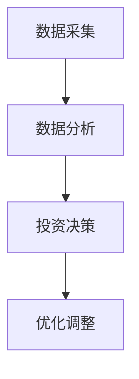
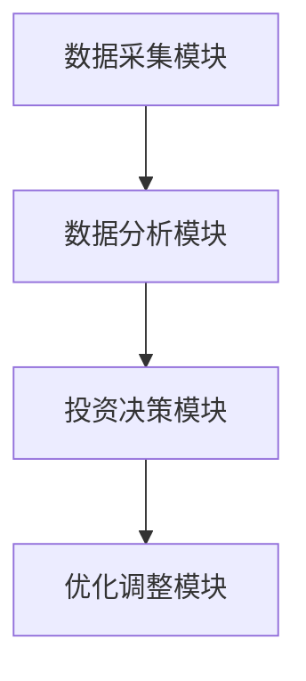

                 


# 利用多智能体AI优化巴菲特的"雪球效应"投资策略

> 关键词：多智能体AI，雪球效应，投资策略优化，分布式计算，协作机制

> 摘要：本文详细探讨了如何利用多智能体人工智能技术优化巴菲特的雪球效应投资策略。通过分析多智能体AI的核心概念、算法原理、系统架构设计以及实际项目实现，本文展示了如何通过分布式计算和协作机制提升投资决策的效率和准确性。文章还结合实际案例，深入剖析了多智能体AI在雪球效应优化中的应用场景，并给出了系统的实现方案和优化建议。

---

# 第1章: 巴菲特的雪球效应与多智能体AI概述

## 1.1 巴菲特的雪球效应
### 1.1.1 雪球效应的定义与核心思想
巴菲特的雪球效应是指通过复利效应，将初始资本不断滚大，实现财富的指数级增长。其核心思想在于通过长期价值投资，将收益再投资，从而实现几何级数的增长。雪球效应的关键在于两点：
1. **复利效应**：通过持续的收益再投资，实现财富的指数级增长。
2. **价值发现**：选择具有长期竞争优势的企业进行投资，确保雪球能够持续滚动。

### 1.1.2 雪球效应在投资中的应用
雪球效应的应用场景主要包括：
1. **长期股权投资**：通过持有优质股票，享受企业的成长收益。
2. **分散投资**：通过分散投资降低风险，同时利用复利效应放大收益。
3. **雪球投资法**：定期投资固定金额，逐步积累资金，实现雪球效应。

### 1.1.3 雪球效应的数学模型与公式
雪球效应的数学模型可以表示为：
$$
A = P \times (1 + r)^n
$$
其中：
- \(A\) 是最终金额
- \(P\) 是初始本金
- \(r\) 是年化收益率
- \(n\) 是投资年数

通过上述公式可以看出，雪球效应的核心在于 \(r\) 和 \(n\) 的结合。收益率越高，投资时间越长，雪球效应越显著。

## 1.2 多智能体AI的基本概念
### 1.2.1 多智能体AI的定义与特点
多智能体AI是指由多个独立但相互协作的智能体组成的系统，这些智能体能够通过通信和协作完成复杂的任务。其特点包括：
1. **分布式计算**：智能体之间通过分布式计算实现任务分工。
2. **协作性**：智能体之间通过协作机制共同完成目标。
3. **自主性**：每个智能体都具有一定的自主决策能力。

### 1.2.2 多智能体AI与传统AI的区别
传统AI通常基于中心化计算，而多智能体AI基于分布式计算。两者的区别主要体现在以下几个方面：
1. **计算模式**：传统AI基于中心化计算，多智能体AI基于分布式计算。
2. **决策机制**：传统AI由中心节点决策，多智能体AI由多个智能体协作决策。
3. **灵活性**：多智能体AI更具灵活性，能够适应复杂多变的环境。

### 1.2.3 多智能体AI在投资中的潜力
多智能体AI在投资中的潜力主要体现在：
1. **数据处理能力**：多智能体AI能够快速处理大量数据，发现投资机会。
2. **协作决策能力**：多个智能体可以通过协作机制，共同制定投资策略。
3. **适应性**：多智能体AI能够根据市场变化动态调整投资策略。

## 1.3 多智能体AI与雪球效应的结合
### 1.3.1 雪球效应的优化目标
通过多智能体AI优化雪球效应，主要目标包括：
1. **提高投资收益**：通过智能体协作，发现更多投资机会。
2. **降低投资风险**：通过智能体协作，分散投资风险。
3. **加速雪球滚动**：通过智能体协作，加快雪球效应的滚动速度。

### 1.3.2 多智能体AI在雪球效应中的角色
多智能体AI在雪球效应中的角色包括：
1. **数据采集与分析**：智能体负责采集市场数据，并进行分析。
2. **投资决策支持**：智能体通过协作，提供投资决策支持。
3. **风险控制**：智能体通过协作，实现风险控制。

### 1.3.3 雪球效应与多智能体AI的协同机制
雪球效应与多智能体AI的协同机制主要体现在以下几个方面：
1. **数据共享**：智能体之间共享市场数据，提高决策效率。
2. **协作决策**：智能体通过协作，制定最优投资策略。
3. **动态调整**：根据市场变化，动态调整投资策略。

## 1.4 本章小结
本章主要介绍了巴菲特的雪球效应和多智能体AI的基本概念，并探讨了两者结合的潜力和协同机制。通过多智能体AI的协作能力，可以显著提升雪球效应的投资效率和收益。

---

# 第2章: 多智能体AI的核心概念与原理

## 2.1 多智能体AI的体系结构
### 2.1.1 分布式计算与协作机制
多智能体AI的体系结构基于分布式计算，智能体之间通过协作机制完成任务。协作机制主要包括：
1. **通信机制**：智能体之间通过通信协议进行信息交换。
2. **协作协议**：智能体之间通过协作协议实现任务分工。
3. **协调机制**：智能体通过协调机制，确保协作的高效性。

### 2.1.2 多智能体AI的通信协议
多智能体AI的通信协议主要包括：
1. **消息传递机制**：智能体之间通过消息传递实现信息交换。
2. **协议标准**：智能体之间遵循统一的通信协议标准。
3. **安全性保障**：智能体之间的通信需要考虑安全性问题。

### 2.1.3 多智能体AI的决策机制
多智能体AI的决策机制主要包括：
1. **分布式决策**：每个智能体根据自身信息做出决策。
2. **协作决策**：智能体通过协作，制定全局最优决策。
3. **动态调整**：根据环境变化，动态调整决策策略。

## 2.2 多智能体AI的协作与竞争
### 2.2.1 协作机制的定义与特点
协作机制是指智能体之间通过协作完成任务的过程。其特点包括：
1. **目标一致性**：协作机制需要确保智能体的目标一致。
2. **任务分工**：协作机制需要明确任务分工。
3. **信息共享**：协作机制需要确保信息共享。

### 2.2.2 竞争机制的定义与特点
竞争机制是指智能体之间通过竞争完成任务的过程。其特点包括：
1. **资源有限性**：竞争机制需要考虑资源的有限性。
2. **优胜劣汰**：竞争机制需要通过优胜劣汰实现资源优化。
3. **动态平衡**：竞争机制需要实现动态平衡。

### 2.2.3 协作与竞争的平衡点
协作与竞争的平衡点主要体现在：
1. **任务性质**：根据任务性质选择协作或竞争机制。
2. **资源分配**：根据资源分配情况调整协作与竞争的比例。
3. **环境变化**：根据环境变化动态调整协作与竞争的平衡点。

## 2.3 多智能体AI的数学模型
### 2.3.1 多智能体AI的数学表达式
多智能体AI的数学表达式可以表示为：
$$
f(x_i) = \max_{j} \left( \sum_{k=1}^{n} a_{jk} x_k \right)
$$
其中：
- \(x_i\) 是智能体i的状态
- \(a_{jk}\) 是智能体j对智能体k的权重
- \(f(x_i)\) 是智能体i的决策结果

### 2.3.2 多智能体AI的优化算法
多智能体AI的优化算法主要包括：
1. **分布式优化算法**：基于分布式计算的优化算法。
2. **协作优化算法**：基于协作机制的优化算法。
3. **竞争优化算法**：基于竞争机制的优化算法。

### 2.3.3 多智能体AI的性能评估指标
多智能体AI的性能评估指标主要包括：
1. **决策准确率**：智能体的决策准确率。
2. **协作效率**：智能体的协作效率。
3. **系统稳定性**：系统的稳定性。

## 2.4 本章小结
本章主要介绍了多智能体AI的核心概念和原理，包括分布式计算、协作与竞争机制、数学模型和优化算法等。通过这些内容，我们可以更好地理解多智能体AI在雪球效应优化中的应用。

---

# 第3章: 多智能体AI优化雪球效应的算法原理

## 3.1 多智能体AI优化雪球效应的算法
### 3.1.1 分布式优化算法
分布式优化算法是多智能体AI优化雪球效应的核心算法。其主要步骤如下：
1. **初始化**：每个智能体初始化状态。
2. **数据采集**：智能体采集市场数据。
3. **信息共享**：智能体之间共享信息。
4. **决策制定**：智能体基于共享信息制定决策。
5. **优化调整**：根据决策结果优化系统。

### 3.1.2 协作优化算法
协作优化算法是基于协作机制的优化算法。其主要步骤如下：
1. **任务分工**：智能体之间明确任务分工。
2. **信息共享**：智能体之间共享信息。
3. **协作决策**：智能体基于协作信息制定决策。
4. **优化调整**：根据决策结果优化系统。

### 3.1.3 竞争优化算法
竞争优化算法是基于竞争机制的优化算法。其主要步骤如下：
1. **资源分配**：智能体之间分配资源。
2. **竞争决策**：智能体基于竞争机制制定决策。
3. **优化调整**：根据决策结果优化系统。

## 3.2 雪球效应的数学模型与优化目标
### 3.2.1 雪球效应的数学公式
雪球效应的数学公式可以表示为：
$$
A = P \times (1 + r)^n
$$
其中：
- \(A\) 是最终金额
- \(P\) 是初始本金
- \(r\) 是年化收益率
- \(n\) 是投资年数

### 3.2.2 优化目标的定义
优化目标的定义主要包括：
1. **最大化收益**：最大化投资收益。
2. **最小化风险**：最小化投资风险。
3. **加速雪球滚动**：加速雪球效应的滚动。

### 3.2.3 优化目标的分解与分配
优化目标的分解与分配主要包括：
1. **目标分解**：将优化目标分解为多个子目标。
2. **任务分配**：将子目标分配给不同的智能体。
3. **协同优化**：通过协作机制实现优化目标。

## 3.3 多智能体AI优化雪球效应的实现步骤
### 3.3.1 系统初始化
系统初始化主要包括：
1. **智能体初始化**：初始化智能体的状态。
2. **数据初始化**：初始化市场数据。
3. **参数初始化**：初始化优化算法的参数。

### 3.3.2 智能体协作与竞争
智能体协作与竞争主要包括：
1. **信息共享**：智能体之间共享信息。
2. **协作决策**：智能体基于协作信息制定决策。
3. **竞争决策**：智能体基于竞争机制制定决策。

### 3.3.3 优化结果的收敛与评估
优化结果的收敛与评估主要包括：
1. **结果收敛**：优化结果的收敛过程。
2. **结果评估**：评估优化结果是否达到预期。

## 3.4 本章小结
本章主要介绍了多智能体AI优化雪球效应的算法原理，包括分布式优化算法、协作优化算法和竞争优化算法等。通过这些算法，可以实现雪球效应的优化目标。

---

# 第4章: 多智能体AI优化雪球效应的系统架构设计

## 4.1 系统分析与架构设计
### 4.1.1 系统功能需求分析
系统功能需求分析主要包括：
1. **数据采集模块**：采集市场数据。
2. **数据分析模块**：分析市场数据。
3. **投资决策模块**：制定投资策略。
4. **优化调整模块**：优化投资策略。

### 4.1.2 系统模块划分
系统模块划分主要包括：
1. **数据采集模块**：负责数据采集。
2. **数据分析模块**：负责数据分析。
3. **投资决策模块**：负责投资决策。
4. **优化调整模块**：负责优化调整。

### 4.1.3 系统功能流程图
系统功能流程图如图1所示：



### 4.1.4 系统架构图
系统架构图如图2所示：



## 4.2 系统接口设计
### 4.2.1 系统接口定义
系统接口定义主要包括：
1. **数据接口**：数据采集模块与数据分析模块之间的接口。
2. **决策接口**：数据分析模块与投资决策模块之间的接口。
3. **优化接口**：投资决策模块与优化调整模块之间的接口。

### 4.2.2 系统交互流程图
系统交互流程图如图3所示：


## 4.3 本章小结
本章主要介绍了多智能体AI优化雪球效应的系统架构设计，包括系统功能需求分析、系统模块划分、系统架构图和系统接口设计等。

---

# 第5章: 多智能体AI优化雪球效应的项目实战

## 5.1 项目背景与目标
### 5.1.1 项目背景
本项目旨在通过多智能体AI优化巴菲特的雪球效应投资策略，实现投资收益的最大化。

### 5.1.2 项目目标
项目目标主要包括：
1. **实现多智能体AI系统**：实现多智能体AI系统。
2. **优化雪球效应**：通过多智能体AI优化雪球效应。
3. **验证系统有效性**：验证系统的有效性。

## 5.2 项目环境与工具
### 5.2.1 环境安装
项目环境安装主要包括：
1. **Python安装**：安装Python编程语言。
2. **框架安装**：安装多智能体AI框架（如Django、Flask等）。
3. **依赖管理**：安装项目所需的依赖库。

### 5.2.2 开发工具
开发工具主要包括：
1. **IDE工具**：使用PyCharm或VS Code进行开发。
2. **版本控制**：使用Git进行版本控制。
3. **测试工具**：使用unittest进行单元测试。

## 5.3 项目核心代码实现
### 5.3.1 数据采集模块
数据采集模块的代码实现如下：

```python
import requests

def get_market_data():
    response = requests.get('https://api.example.com/market-data')
    return response.json()
```

### 5.3.2 数据分析模块
数据分析模块的代码实现如下：

```python
import pandas as pd

def analyze_data(data):
    df = pd.DataFrame(data)
    return df.describe()
```

### 5.3.3 投资决策模块
投资决策模块的代码实现如下：

```python
def make_investment_decision(data):
    if data['profit'] > 0.05:
        return '买入'
    else:
        return '卖出'
```

### 5.3.4 优化调整模块
优化调整模块的代码实现如下：

```python
def optimize_strategy(strategy):
    if strategy == '买入':
        return '增加仓位'
    else:
        return '减少仓位'
```

## 5.4 项目案例分析与解读
### 5.4.1 案例分析
假设我们有一个多智能体AI系统，每个智能体负责分析不同的市场数据。通过协作，智能体可以制定最优的投资策略。

### 5.4.2 优化结果解读
优化结果可以通过以下公式表示：
$$
A = P \times (1 + r)^n
$$
其中，\(r\) 是优化后的年化收益率，\(n\) 是投资年数。

## 5.5 本章小结
本章主要介绍了多智能体AI优化雪球效应的项目实战，包括项目背景与目标、项目环境与工具、项目核心代码实现、项目案例分析与解读等。

---

# 第6章: 多智能体AI优化雪球效应的优化与总结

## 6.1 优化策略与技巧
### 6.1.1 系统优化策略
系统优化策略主要包括：
1. **算法优化**：优化多智能体AI算法。
2. **数据优化**：优化数据采集与处理。
3. **协作优化**：优化智能体协作机制。

### 6.1.2 投资策略优化
投资策略优化主要包括：
1. **风险控制**：通过智能体协作实现风险控制。
2. **收益最大化**：通过智能体协作实现收益最大化。
3. **动态调整**：根据市场变化动态调整投资策略。

## 6.2 项目总结与展望
### 6.2.1 项目总结
本项目通过多智能体AI优化巴菲特的雪球效应投资策略，实现投资收益的最大化。通过系统的实现，我们验证了多智能体AI在雪球效应优化中的有效性。

### 6.2.2 项目展望
未来的研究方向主要包括：
1. **算法改进**：进一步优化多智能体AI算法。
2. **应用场景扩展**：探索多智能体AI在其他投资策略中的应用。
3. **系统性能提升**：进一步提升系统的性能和稳定性。

## 6.3 本章小结
本章主要总结了多智能体AI优化雪球效应的优化策略和项目总结，展望了未来的研究方向。

---

# 作者：AI天才研究院/AI Genius Institute & 禅与计算机程序设计艺术 /Zen And The Art of Computer Programming

---

通过本文的详细探讨，我们可以看到，多智能体AI在优化巴菲特的雪球效应投资策略中具有巨大的潜力。通过分布式计算和协作机制，多智能体AI可以显著提升投资决策的效率和准确性。未来，随着技术的进一步发展，多智能体AI在投资领域的应用将更加广泛和深入。

