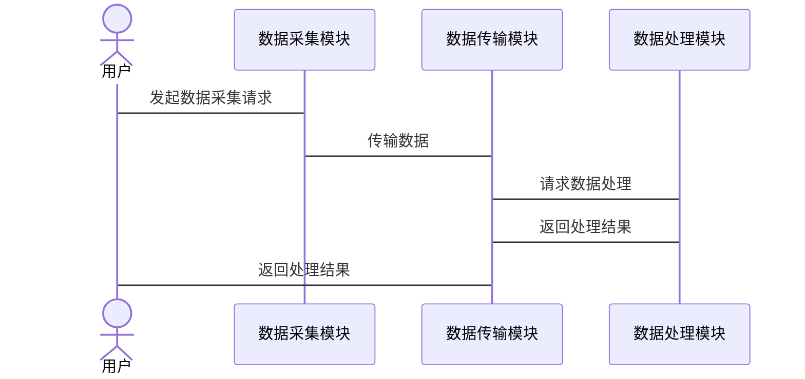

                 


# 巴菲特-芒格的脑机接口隐私保护投资：数字人权的新前沿

## 关键词：脑机接口，隐私保护，巴菲特，芒格，数字人权

## 摘要：本文探讨了脑机接口技术在隐私保护领域的投资机会，结合巴菲特和芒格的投资哲学，分析了数字人权的新前沿。文章详细介绍了脑机接口技术的核心概念、隐私保护的算法原理、系统架构设计以及实际项目实现，为读者提供了从理论到实践的全面解读。

---

## 第一部分：脑机接口与隐私保护概述

### 第1章：脑机接口技术的背景与现状

#### 1.1 脑机接口技术的定义与核心概念

- **1.1.1 脑机接口的基本概念**
  - 脑机接口（Brain-Computer Interface，BCI）是一种将人脑与计算机或其他设备直接连接的技术，通过采集和解析神经信号，实现人与机器的交互。
  - 核心概念包括神经信号采集、数据处理、用户意图识别和输出控制。

- **1.1.2 脑机接口的核心技术特征**
  - 非侵入式与侵入式技术：非侵入式依赖于头皮电极，侵入式需要植入芯片。
  - 数据采集与处理：涉及EEG、EMG等信号的采集和特征提取。
  - 用户意图识别：通过机器学习算法分析神经信号，识别用户的意图。

- **1.1.3 脑机接口的分类与应用场景**
  - 按应用领域分为医疗、娱乐、教育和军事等。
  - 医疗领域用于康复训练，娱乐领域用于游戏控制，教育领域用于辅助学习。


#### 1.2 隐私保护的重要性与挑战

- **1.2.1 数字隐私的基本概念**
  - 隐私保护是指在数字环境中保护个人数据不被未经授权的访问或滥用。
  - 脑机接口中的隐私问题涉及用户数据的采集、存储和传输。

- **1.2.2 脑机接口技术中的隐私风险**
  - 数据泄露：未经授权的第三方可能获取用户的神经数据。
  - 恶意攻击：黑客可能通过漏洞入侵系统，窃取数据。
  - 滥用风险：数据可能被用于心理操控或其他不当用途。

- **1.2.3 隐私保护的法律与伦理框架**
  - 法律层面：GDPR等法规对个人数据保护提出严格要求。
  - 伦理层面：脑机接口数据的使用需尊重用户的知情权和同意权。
  - 技术层面：需要设计安全的数据加密和访问控制机制。

### 第2章：巴菲特与芒格的投资哲学

#### 2.1 巴菲特的价值投资理念

- **2.1.1 巴菲特投资哲学的核心思想**
  - 长期主义：关注企业的长期价值，而非短期波动。
  - 价值投资：寻找被市场低估的优质企业，长期持有。

- **2.1.2 价值投资的长期主义策略**
  - 精选优质资产：选择具有强大竞争优势和良好治理的企业。
  - 长期持有：避免频繁交易，降低交易成本。

- **2.1.3 巴菲特投资决策的案例分析**
  - 沃尔玛案例：巴菲长期持有沃尔玛股票，因其商业模式和竞争优势而获得超额收益。
  - 可口可乐案例：巴菲看好可口可乐的全球品牌影响力和市场地位。

#### 2.2 芒格的多元思维模型

- **2.2.1 多元思维模型的定义与特点**
  - 多元思维模型是指通过多个学科的思维方式，构建一个完整的认知框架。
  - 强调跨学科思考，避免单一视角的局限性。

- **2.2.2 芒格思维模型在投资中的应用**
  - 综合运用物理学、心理学、经济学等学科的原理，分析企业的基本面和市场环境。
  - 通过跨学科的视角，识别潜在风险和投资机会。

- **2.2.3 芒格决策框架的逻辑分析**
  - 逆向思维：从反方向思考问题，寻找市场的非共识观点。
  - 边际分析：评估新增因素对企业价值的影响。

### 第3章：脑机接口隐私保护投资的背景与意义

#### 3.1 数字化时代的技术变革

- **3.1.1 数字化转型的现状与趋势**
  - 数字化转型已经渗透到各个行业，脑机接口技术是其中的重要组成部分。
  - 技术进步推动脑机接口从实验室走向商业化应用。

- **3.1.2 脑机接口技术的快速发展**
  - 科技巨头如特斯拉、Neuralink等在脑机接口领域投入大量资源。
  - 学术界和产业界共同推动技术进步，降低成本和提高可用性。

- **3.1.3 数字人权的新兴概念**
  - 数字人权是指在数字环境中，个体享有的权利和自由，包括隐私权、数据控制权等。
  - 脑机接口技术的发展需要平衡技术创新与人权保护。

#### 3.2 隐私保护与脑机接口的结合

- **3.2.1 隐私保护在脑机接口中的重要性**
  - 脑机接口技术涉及个人神经数据，必须确保数据的隐私和安全。
  - 隐私保护是脑机接口技术广泛应用的前提条件。

- **3.2.2 脑机接口技术对隐私的潜在威胁**
  - 数据泄露风险：未经授权的访问可能导致用户隐私泄露。
  - 恶意攻击风险：黑客可能通过漏洞入侵系统，获取敏感数据。
  - 数据滥用风险：收集的数据可能被用于不当目的，如心理操控。

- **3.2.3 数字人权的新前沿领域**
  - 脑机接口技术的发展需要考虑用户的数据主权和隐私权。
  - 投资者需要关注隐私保护技术的研发和应用，确保技术符合伦理和法律要求。

---

## 第二部分：脑机接口隐私保护的核心概念

### 第4章：脑机接口与隐私保护的核心概念

#### 4.1 脑机接口的核心技术原理

- **4.1.1 神经信号的采集与处理**
  - 采集方式：EEG（脑电图）、EMG（肌电图）等。
  - 数据预处理：去噪、特征提取、信号增强。

- **4.1.2 数据传输与解析机制**
  - 数据传输：通过蓝牙、Wi-Fi等无线方式传输。
  - 数据解析：使用机器学习算法识别用户意图。

- **4.1.3 用户隐私保护的实现方式**
  - 数据加密：对采集的数据进行加密处理，防止未经授权的访问。
  - 访问控制：通过权限管理，限制数据的访问范围。

#### 4.2 隐私保护的属性特征对比

- **4.2.1 隐私保护的属性分析**
  - 数据机密性：确保数据不被泄露。
  - 数据完整性：保证数据在传输过程中不被篡改。
  - 数据可用性：确保授权用户能够访问所需数据。

- **4.2.2 脑机接口数据的敏感性评估**
  - 数据敏感性：脑机接口数据可能反映用户的思维和情绪，具有高度敏感性。
  - 数据分类：根据敏感程度对数据进行分类管理。

- **4.2.3 隐私保护与数据可用性的平衡**
  - 在保护隐私的同时，确保数据的可用性，避免因过度保护影响技术应用。

### 第5章：脑机接口隐私保护的系统架构

#### 5.1 系统功能设计

- **5.1.1 用户身份验证模块**
  - 用户身份验证：通过生物特征识别或密码验证用户身份。
  - 访问控制：基于用户身份和权限，控制数据访问范围。

- **5.1.2 数据加密传输模块**
  - 数据加密：使用加密算法对数据进行加密，确保传输过程中的安全性。
  - 传输协议：采用安全的通信协议，如TLS，防止数据被截获。

- **5.1.3 隐私保护算法实现模块**
  - 同态加密：在加密状态下对数据进行计算，保护数据隐私。
  - 差分隐私：通过添加噪声，保护数据的隐私性。

#### 5.2 系统架构设计

- **5.2.1 分层架构设计**
  - 数据采集层：负责数据的采集和预处理。
  - 数据传输层：负责数据的加密和传输。
  - 数据处理层：负责数据的解析和隐私保护算法的实现。

- **5.2.2 模块化设计原则**
  - 每个模块独立开发和测试，确保系统可扩展性和可维护性。
  - 模块间通过标准接口进行通信，保证系统的灵活性。

- **5.2.3 系统扩展性分析**
  - 支持多种数据采集方式，如EEG、EMG等。
  - 支持多种加密算法，如AES、RSA等。

#### 5.3 系统接口设计

- **5.3.1 数据采集接口**
  - 接口类型：API接口。
  - 接口功能：采集和传输神经数据。

- **5.3.2 数据处理接口**
  - 接口类型：API接口。
  - 接口功能：实现数据加密和隐私保护算法。

#### 5.4 系统交互序列图



### 第6章：脑机接口隐私保护的算法原理

#### 6.1 同态加密算法

- **6.1.1 同态加密的基本原理**
  - 同态加密是一种允许在加密数据上进行计算的加密方法。
  - 加密后的数据在计算后，解密可以得到正确的结果。

- **6.1.2 同态加密的数学模型**
  - 加法同态：$E(a + b) = E(a) + E(b)$
  - 乘法同态：$E(a \times b) = E(a) \times E(b)$

- **6.1.3 同态加密的实现步骤**
  - 数据加密：使用同态加密算法对数据进行加密。
  - 数据计算：在加密状态下进行计算，保持数据的隐私性。
  - 数据解密：将加密结果解密，得到最终结果。

```python
def encrypt(data, public_key):
    # 使用同态加密算法对数据进行加密
    encrypted_data = []
    for d in data:
        encrypted_data.append(d * public_key)
    return encrypted_data

def decrypt(encrypted_data, private_key):
    # 使用私钥对加密数据进行解密
    decrypted_data = []
    for ed in encrypted_data:
        decrypted_data.append(ed / private_key)
    return decrypted_data
```

#### 6.2 差分隐私算法

- **6.2.1 差分隐私的基本原理**
  - 通过在数据中添加噪声，保护数据的隐私性。
  - 确保单个数据的改变不会影响整体数据的统计结果。

- **6.2.2 差分隐私的数学模型**
  - 数据发布：$f(D) + \text{Noise}$
  - 噪声选择：使用拉普拉斯分布或高斯分布生成噪声。

- **6.2.3 差分隐私的实现步骤**
  - 数据收集：收集原始数据。
  - 数据处理：对数据进行差分隐私处理，添加噪声。
  - 数据发布：发布处理后的数据，保护隐私。

```python
import numpy as np

def differential_privacy(data, epsilon):
    # 使用拉普拉斯分布生成噪声
    noise = np.random.laplace(0, 1/epsilon, len(data))
    # 添加噪声到数据中
    perturbed_data = data + noise
    return perturbed_data
```

### 第7章：脑机接口隐私保护的系统实现

#### 7.1 项目实战

- **7.1.1 环境安装**
  - 安装必要的库：numpy、scikit-learn、pycrypto。
  - 安装开发环境：Python 3.8以上版本，Jupyter Notebook。

- **7.1.2 核心功能实现**
  - 数据采集：使用EEG设备采集神经数据。
  - 数据加密：使用同态加密算法对数据进行加密。
  - 数据处理：实现差分隐私算法，保护数据隐私。

- **7.1.3 代码实现**

```python
import numpy as np
from sklearn import svm
from sklearn.metrics import accuracy_score

# 数据采集模块
def collect_data():
    # 模拟神经数据采集
    data = np.random.randn(100, 10)
    return data

# 数据加密模块
def encrypt_data(data, key):
    encrypted = []
    for d in data:
        encrypted.append(d * key)
    return encrypted

# 数据处理模块
def differential_privacy(data, epsilon):
    noise = np.random.laplace(0, 1/epsilon, len(data))
    perturbed = data + noise
    return perturbed

# 数据处理流程
def process_data():
    data = collect_data()
    key = 10  # 示例密钥
    encrypted_data = encrypt_data(data, key)
    epsilon = 0.1
    dp_data = differential_privacy(encrypted_data, epsilon)
    return dp_data

# 主程序
if __name__ == "__main__":
    dp_data = process_data()
    print("Data processed with differential privacy:", dp_data)
```

- **7.1.4 案例分析**
  - 案例背景：假设一个脑机接口系统用于康复训练。
  - 数据处理：对患者的神经数据进行加密和差分隐私处理。
  - 实施效果：确保患者数据的隐私性，同时支持系统的正常运行。

- **7.1.5 项目总结**
  - 通过实现同态加密和差分隐私算法，保护脑机接口系统的数据隐私。
  - 系统设计注重模块化和可扩展性，方便未来的功能扩展和优化。

### 第8章：脑机接口隐私保护的系统优化

#### 8.1 系统优化策略

- **8.1.1 数据处理优化**
  - 使用更高效的加密算法，减少计算开销。
  - 优化数据预处理流程，提高数据采集效率。

- **8.1.2 系统架构优化**
  - 采用分布式架构，提高系统的可扩展性。
  - 引入缓存机制，减少重复计算，提高系统性能。

- **8.1.3 安全性优化**
  - 定期进行安全审计，发现潜在的安全漏洞。
  - 引入多因素认证，提高系统的安全性。

### 第9章：最佳实践与未来展望

#### 9.1 小结

- 本文详细介绍了脑机接口技术的隐私保护问题，结合巴菲特和芒格的投资哲学，分析了数字人权的新前沿。
- 通过同态加密和差分隐私算法，实现数据的隐私保护，确保系统的安全性和可用性。

#### 9.2 注意事项

- 在实际应用中，需注意数据的敏感性，确保数据的隐私性和可用性。
- 投资者应关注隐私保护技术的研发和应用，确保技术符合伦理和法律要求。

#### 9.3 拓展阅读

- 《The Art of Computer Programming》——Donald Knuth
- 《Security Engineering》——Ross Anderson
- 《The Value Investor's Handbook》——Warren Buffett

---

## 作者：AI天才研究院 & 禅与计算机程序设计艺术

---

通过本文的详细分析，读者可以全面理解脑机接口隐私保护投资的各个方面，从理论到实践，为未来的投资决策提供有力支持。

