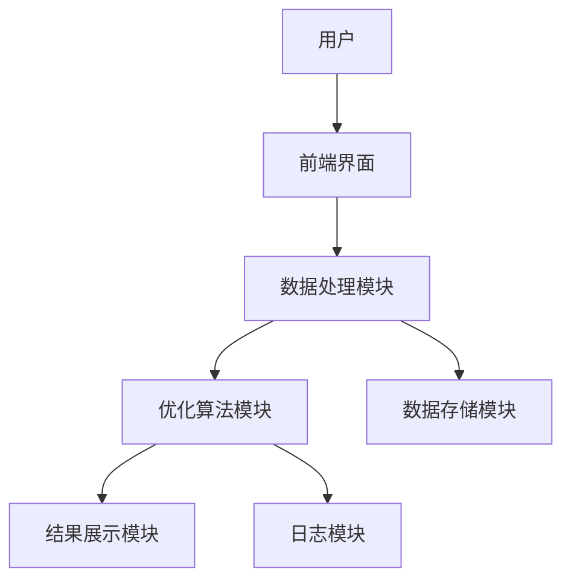
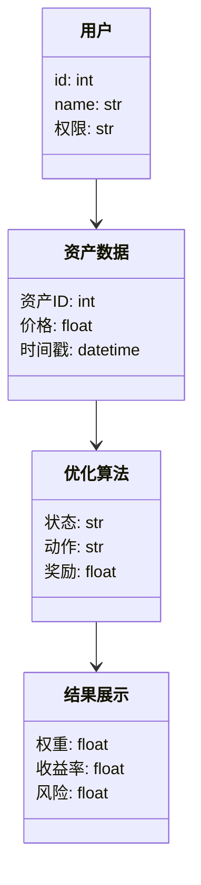
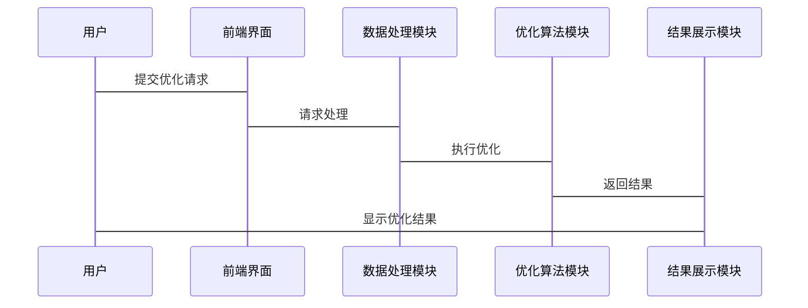

                 


# 开发智能化的资产配置策略优化引擎

> **关键词**：资产配置，策略优化，人工智能，强化学习，数学规划，遗传算法，系统架构

> **摘要**：  
智能化资产配置策略优化引擎是结合人工智能、大数据分析和优化算法的复杂系统。本文从资产配置和策略优化的基本概念出发，详细探讨了基于强化学习、遗传算法和数学规划的策略优化算法，并通过系统架构设计和项目实战，展示了如何构建和实现一个智能化的资产配置策略优化引擎。文章最后总结了开发过程中的关键点和未来的发展方向。

---

# 第4章: 资产配置策略优化算法的实现与数学模型

## 4.1 强化学习算法的实现
### 4.1.1 强化学习在资产配置中的应用
- **状态空间**：市场环境、资产价格、风险偏好等。
- **动作空间**：买入、卖出、持有等具体操作。
- **奖励函数**：基于投资收益和风险的综合评价指标。
- **策略网络**：使用深度神经网络近似最优策略。

### 4.1.2 强化学习算法的实现步骤
1. **环境构建**：模拟金融市场环境，包括历史数据和实时数据。
2. **状态观测**：从环境中获取当前状态信息。
3. **动作选择**：根据当前状态，选择最优动作。
4. **奖励计算**：根据动作的结果，计算奖励值。
5. **策略更新**：通过强化学习算法（如DQN、PPO等）更新策略网络。

### 4.1.3 强化学习的数学模型
- **值函数**：
$$ V(s) = \max_a Q(s,a) $$
- **策略函数**：
$$ \pi(a|s) = \text{softmax}(Q(s,a)) $$

### 4.1.4 实现代码示例
```python
import numpy as np
import tensorflow as tf

# 定义DQN网络
class DQNetwork:
    def __init__(self, state_dim, action_dim):
        self.state_dim = state_dim
        self.action_dim = action_dim
        self.model = self.build_model()

    def build_model(self):
        inputs = tf.keras.Input(shape=(self.state_dim,))
        x = tf.keras.layers.Dense(64, activation='relu')(inputs)
        x = tf.keras.layers.Dense(64, activation='relu')(x)
        outputs = tf.keras.layers.Dense(self.action_dim, activation='linear')(x)
        return tf.keras.Model(inputs=inputs, outputs=outputs)

    def call(self, x):
        return self.model(x)
```

## 4.2 遗传算法的实现
### 4.2.1 遗传算法在资产配置中的应用
- **种群表示**：每个个体代表一个资产配置方案。
- **适应度函数**：基于投资收益和风险的综合指标。
- **选择操作**：选择适应度高的个体进行繁殖。
- **交叉与变异**：通过基因重组和突变生成新的个体。

### 4.2.2 遗传算法的实现步骤
1. **初始化种群**：随机生成初始种群。
2. **计算适应度**：评估每个个体的适应度。
3. **选择操作**：选择适应度高的个体作为父代。
4. **交叉操作**：对父代进行基因重组。
5. **变异操作**：对新个体进行随机突变。
6. **迭代优化**：重复上述步骤，直到满足终止条件。

### 4.2.3 遗传算法的数学模型
- **适应度函数**：
$$ f(x) = \sum_{i=1}^{n} w_i x_i $$
- **选择概率**：
$$ P_i = \frac{f(x_i)}{\sum_{j=1}^{n} f(x_j)} $$

### 4.2.4 实现代码示例
```python
import numpy as np

# 遗传算法实现
class GeneticAlgorithm:
    def __init__(self, population_size, genes):
        self.population_size = population_size
        self.genes = genes
        self.population = self.initialize_population()

    def initialize_population(self):
        return np.random.rand(self.population_size, self.genes)

    def calculate_fitness(self, population):
        # 假设fitness函数根据收益和风险计算适应度
        fitness = []
        for individual in population:
            fitness.append(self.fitness_function(individual))
        return fitness

    def fitness_function(self, individual):
        # 示例：最大化收益和最小化风险
        return np.mean(individual) - 2 * np.std(individual)
```

## 4.3 数学规划模型的实现
### 4.3.1 数学规划在资产配置中的应用
- **目标函数**：最大化投资收益。
- **约束条件**：满足风险偏好和流动性要求。

### 4.3.2 数学规划的实现步骤
1. **问题建模**：定义目标函数和约束条件。
2. **选择求解器**：使用优化算法（如线性规划、非线性规划）求解。
3. **结果分析**：评估优化结果的可行性和有效性。

### 4.3.3 数学规划的数学模型
- **目标函数**：
$$ \max \sum_{i=1}^{n} r_i x_i $$
- **约束条件**：
$$ \sum_{i=1}^{n} x_i = 1 $$
$$ \sum_{i=1}^{n} x_i^2 \leq 0.5 $$

### 4.3.4 实现代码示例
```python
import numpy as np
from scipy.optimize import minimize

# 数学规划实现
def optimize_portfolio(weights, returns, risks):
    # 定义目标函数
    def objective(x):
        return - (np.dot(returns, x))

    # 定义约束条件
    constraints = [
        {'type': 'eq', 'fun': lambda x: np.sum(x) - 1},
        {'type': 'ineq', 'fun': lambda x: np.dot(x, x) - 0.5}
    ]

    # 约束条件为x_i >= 0
    bounds = [(0, 1) for _ in range(len(weights))]

    # 使用SLSQP求解器
    result = minimize(objective, weights, method='SLSQP', bounds=bounds, constraints=constraints)

    return result.x

# 示例数据
weights = np.array([0.2, 0.2, 0.2, 0.2, 0.2])
returns = np.array([0.1, 0.15, 0.05, 0.2, 0.12])
risks = np.array([0.1, 0.2, 0.15, 0.25, 0.1])

# 优化并输出结果
optimal_weights = optimize_portfolio(weights, returns, risks)
print("最优权重:", optimal_weights)
```

---

# 第5章: 系统分析与架构设计

## 5.1 问题场景介绍
- **目标**：构建一个智能化的资产配置策略优化引擎。
- **需求**：支持多种资产类别、多种优化算法、实时数据处理。
- **边界条件**：数据来源、计算资源限制、用户权限等。

## 5.2 系统功能设计
- **核心功能**：资产数据处理、策略优化、结果展示。
- **附加功能**：回测分析、风险评估、用户交互界面。

## 5.3 系统架构设计
### 5.3.1 系统架构图


### 5.3.2 领域模型类图


### 5.3.3 接口设计
- **输入接口**：接收用户输入的资产数据和优化参数。
- **输出接口**：返回优化后的资产配置方案。

### 5.3.4 交互流程


---

# 第6章: 项目实战——资产配置策略优化引擎的实现

## 6.1 环境安装与配置
- **工具安装**：Python、TensorFlow、NumPy、Matplotlib。
- **数据源配置**：连接金融数据API或本地数据文件。

## 6.2 核心代码实现
### 6.2.1 数据处理模块
```python
import pandas as pd

# 读取数据
data = pd.read_csv('assets.csv')
# 数据预处理
data = data.dropna()
```

### 6.2.2 优化算法模块
```python
import numpy as np
import tensorflow as tf

# 强化学习模型
class DQNetwork:
    def __init__(self, state_dim, action_dim):
        self.state_dim = state_dim
        self.action_dim = action_dim
        self.model = self.build_model()

    def build_model(self):
        inputs = tf.keras.Input(shape=(self.state_dim,))
        x = tf.keras.layers.Dense(64, activation='relu')(inputs)
        x = tf.keras.layers.Dense(64, activation='relu')(x)
        outputs = tf.keras.layers.Dense(self.action_dim, activation='linear')(x)
        return tf.keras.Model(inputs=inputs, outputs=outputs)

    def call(self, x):
        return self.model(x)
```

### 6.2.3 结果展示模块
```python
import matplotlib.pyplot as plt

# 绘制优化结果
def plot_results(optimal_weights, returns):
    plt.figure(figsize=(10, 6))
    plt.bar(range(len(optimal_weights)), optimal_weights, label='最优权重')
    plt.plot([np.mean(returns)] * len(optimal_weights), 'r--', label='平均收益')
    plt.xlabel('资产编号')
    plt.ylabel('权重')
    plt.title('资产配置优化结果')
    plt.legend()
    plt.show()
```

## 6.3 案例分析与优化结果
### 6.3.1 案例分析
- **数据来源**：假设使用历史资产收益数据。
- **优化目标**：最大化收益，同时控制风险。

### 6.3.2 优化结果
- **权重分配**：根据优化算法，得出各资产的最优配置权重。
- **收益与风险对比**：可视化展示优化前后的收益与风险变化。

---

# 第7章: 总结与展望

## 7.1 本章小结
- **核心内容回顾**：从理论到实践，详细讲解了资产配置策略优化引擎的开发过程。
- **关键点总结**：强化学习、遗传算法和数学规划的应用，系统架构设计的重要性。

## 7.2 开发中的注意事项
- **数据质量**：确保数据的准确性和完整性。
- **算法选择**：根据具体需求选择合适的优化算法。
- **系统性能**：优化算法的计算效率和系统的可扩展性。

## 7.3 未来的发展方向
- **多目标优化**：结合收益、风险、流动性等多种目标。
- **动态调整**：实时更新资产配置方案，适应市场变化。
- **分布式计算**：利用分布式计算技术提高优化效率。

---

# 作者：AI天才研究院 & 禅与计算机程序设计艺术

---

以上是《开发智能化的资产配置策略优化引擎》的完整目录和内容概述，涵盖了从理论到实践的各个方面，帮助读者全面理解并掌握如何开发智能化的资产配置策略优化引擎。

