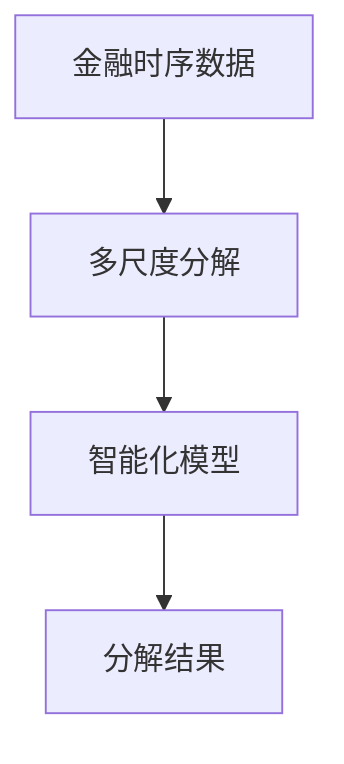
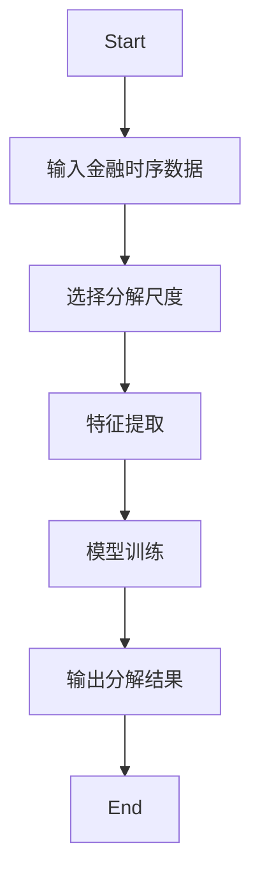
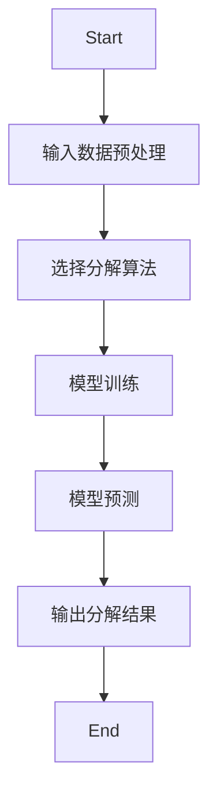
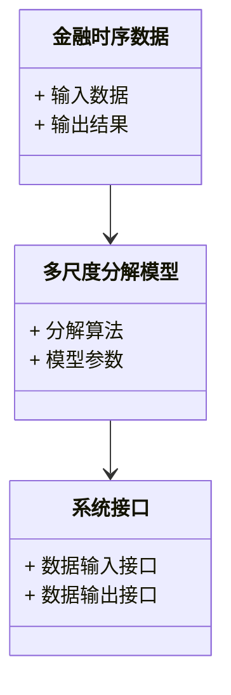
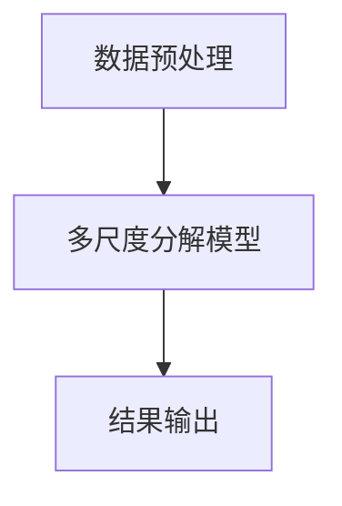
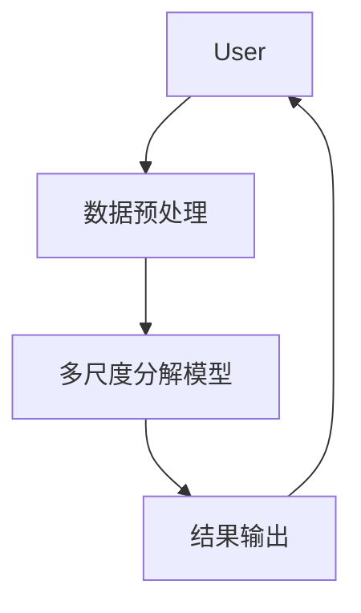

                 


# 开发智能化的金融时序数据多尺度分解模型

## 关键词：金融时序数据，多尺度分解，智能化模型，深度学习，时间序列分析

## 摘要：本文详细探讨了开发智能化的金融时序数据多尺度分解模型的方法。通过分析金融数据的特点，提出了一种基于深度学习的多尺度分解模型，该模型能够有效捕捉数据中的多粒度特征，提高金融分析的准确性和效率。文章从背景、核心概念、算法原理、系统设计到项目实战，全面介绍了模型的开发过程，为金融领域的智能化分析提供了新的思路。

---

# 第1章: 金融时序数据多尺度分解模型概述

## 1.1 问题背景与描述

### 1.1.1 金融时序数据的特点与挑战
金融时序数据（Financial Time Series Data）是指在金融市场上，随着时间推移而产生的各种金融资产的价格、指数、成交量等数据。这类数据具有以下几个显著特点：
- **非线性**：金融市场的价格波动往往表现出非线性特征，难以用简单的线性模型描述。
- **多尺度性**：数据中包含不同时间粒度的特征，例如短期波动和长期趋势。
- **噪声干扰**：金融市场数据中常混杂着各种噪声，例如市场操纵、突发事件等。
- **复杂性**：金融市场的行为受到多种因素影响，包括经济指标、政策变化、市场情绪等。

### 1.1.2 多尺度分解的必要性
在金融分析中，多尺度分解（Multiscale Decomposition）是一种将时间序列数据分解为不同时间尺度成分的技术。通过多尺度分解，可以将数据中的短期波动、中期趋势和长期周期分开，便于分别分析和预测。例如，高频数据可以帮助捕捉短期波动，而低频数据则有助于分析长期趋势。

### 1.1.3 智能化分解的目标与意义
传统的金融数据分析方法往往依赖于人工经验，难以应对复杂多变的金融市场。智能化的多尺度分解模型可以通过深度学习等技术，自动提取数据中的多粒度特征，提高分析的效率和准确性。这种智能化分解的目标是实现自动化、高精度的金融数据分析，为投资决策提供更可靠的依据。

## 1.2 多尺度分解模型的边界与外延

### 1.2.1 数据粒度的多尺度特性
数据粒度（Granularity）指的是数据的时间分辨率，例如分钟、小时、日、周、月等。不同粒度的数据反映了不同的市场行为和信息。例如，分钟级数据可以捕捉短期交易策略，而月度数据则适合分析长期趋势。

### 1.2.2 模型的适用范围与限制
多尺度分解模型适用于需要分析多时间粒度特征的金融数据，例如股票价格、指数走势、外汇汇率等。然而，该模型也有一些限制，例如对某些特殊情况（如市场崩盘）的鲁棒性不足，需要结合其他方法进行补充。

### 1.2.3 相关概念的对比与区分
在金融数据分析中，多尺度分解与传统的时间序列分解方法（如ARIMA、Wavelet变换）有显著区别。表1对比了多尺度分解与其他分解方法的主要区别：

**表1：多尺度分解与其他分解方法的对比**

| 方法         | 特点                                                                 |
|--------------|----------------------------------------------------------------------|
| ARIMA        | 线性模型，适用于平稳时间序列，无法捕捉多尺度特征                 |
| Wavelet变换  | 可分解多尺度信号，但依赖于选择基函数，计算复杂性较高             |
| 多尺度分解  | 基于深度学习，自动提取多粒度特征，适用于复杂非线性时间序列数据     |

## 1.3 核心概念与组成要素

### 1.3.1 智能化分解的核心要素
智能化的多尺度分解模型通常包括以下几个核心要素：
- **输入数据**：金融时序数据，包括价格、成交量等。
- **分解算法**：基于深度学习的多尺度分解方法，如LSTM、Transformer等。
- **输出结果**：不同时间粒度的分解成分，例如短期波动、中期趋势和长期周期。

### 1.3.2 多尺度分解的数学模型
多尺度分解的数学模型可以表示为：
$$
x_t = \sum_{i=1}^{n} f_i(x_{t-i})
$$
其中，$x_t$ 表示当前时间点的值，$f_i$ 表示不同时间粒度的分解函数。

### 1.3.3 模型的输入输出关系
模型的输入是原始的金融时序数据，输出是分解后的多粒度成分。例如，输入是股票价格序列，输出可以是短期波动、中期趋势和长期周期。

## 1.4 本章小结
本章介绍了金融时序数据的特点和多尺度分解的必要性，探讨了智能化分解的目标与意义，并通过对比分析明确了多尺度分解模型的边界与外延。

---

# 第2章: 多尺度分解模型的核心概念与联系

## 2.1 多尺度分解的原理与方法

### 2.1.1 多尺度分解的基本原理
多尺度分解的基本原理是将原始时间序列数据分解为多个不同粒度的子序列，每个子序列对应特定的时间尺度。例如，将股票价格分解为分钟级、小时级、日级等不同粒度的成分。

### 2.1.2 不同尺度的特征提取方法
在不同时间粒度上，可以采用不同的特征提取方法。例如，在分钟级数据中，可以使用LSTM提取短期波动特征；在日级数据中，可以使用Transformer提取长期趋势特征。

### 2.1.3 智能化分解的创新点
智能化分解的创新点在于引入深度学习技术，自动提取多粒度特征，避免了传统方法中人工选择粒度和特征的问题。

## 2.2 核心概念的对比分析

### 2.2.1 多尺度与单尺度分解的对比
表2对比了多尺度分解与单尺度分解的主要区别：

**表2：多尺度分解与单尺度分解的对比**

| 特性         | 单尺度分解        | 多尺度分解        |
|--------------|-------------------|-------------------|
| 分解粒度     | 单一粒度          | 多个粒度          |
| 特征提取     | 无法捕捉多粒度特征| 可捕捉多粒度特征|
| 应用场景     | 简单时间序列分析  | 复杂时间序列分析  |

### 2.2.2 智能化与传统分解方法的对比
表3对比了智能化分解与传统分解方法的主要区别：

**表3：智能化分解与传统分解方法的对比**

| 特性         | 传统分解方法     | 智能化分解方法    |
|--------------|------------------|------------------|
| 分解粒度     | 需要人工选择     | 自动提取         |
| 特征提取     | 需要人工选择     | 自动提取         |
| 计算复杂度   | 较低             | 较高             |
| 应用场景     | 简单时间序列分析  | 复杂时间序列分析  |

### 2.2.3 不同模型的性能对比
表4对比了不同模型在金融时序数据分析中的性能：

**表4：不同模型的性能对比**

| 模型名称      | 分解粒度         | 计算复杂度 | 分解精度 |
|--------------|------------------|------------|----------|
| ARIMA        | 单一粒度         | 低         | 低       |
| Wavelet变换  | 多粒度           | 中         | 中       |
| LSTM          | 单一粒度         | 高         | 高       |
| Transformer    | 多粒度           | 高         | 高       |
| 多尺度分解模型| 多粒度           | 高         | 高       |

## 2.3 实体关系图与流程图

### 2.3.1 ER实体关系图


### 2.3.2 多尺度分解流程图


## 2.4 本章小结
本章详细探讨了多尺度分解的核心概念，分析了不同分解方法的特点和性能，并通过对比分析明确了多尺度分解模型的优势。

---

# 第3章: 多尺度分解模型的算法原理

## 3.1 算法原理概述

### 3.1.1 基于LSTM的多尺度分解
LSTM（长短期记忆网络）是一种常用的深度学习模型，能够有效捕捉时间序列中的长期依赖关系。在多尺度分解中，可以通过多个LSTM网络分别处理不同粒度的数据。

### 3.1.2 基于Transformer的多尺度分解
Transformer模型通过自注意力机制，能够捕捉时间序列中的全局依赖关系。在多尺度分解中，可以通过多层Transformer网络分别处理不同粒度的数据。

### 3.1.3 混合模型的分解方法
混合模型（Hybrid Model）结合了LSTM和Transformer的优势，通过多个网络协同工作，实现对多粒度数据的分解。

## 3.2 算法流程图

### 3.2.1 基于LSTM的多尺度分解流程图


### 3.2.2 基于Transformer的多尺度分解流程图


## 3.3 算法实现代码

### 3.3.1 基于LSTM的分解代码
```python
import tensorflow as tf
from tensorflow.keras.layers import LSTM, Dense

def lstm_decomposition(data, units=64, epochs=10):
    model = tf.keras.Sequential([
        LSTM(units, return_sequences=True),
        LSTM(units, return_sequences=False),
        Dense(1)
    ])
    model.compile(optimizer='adam', loss='mean_squared_error')
    model.fit(data, epochs=epochs, verbose=0)
    return model.predict(data)
```

### 3.3.2 基于Transformer的分解代码
```python
import tensorflow as tf
from tensorflow.keras.layers import MultiHeadAttention, Dense

def transformer_decomposition(data, num_heads=8, units=64, epochs=10):
    inputs = tf.keras.Input(shape=(None, data.shape[2]))
    attention = MultiHeadAttention(num_heads=num_heads, key_dim=units)
    x = attention(inputs, inputs)
    x = Dense(1)(x)
    model = tf.keras.Model(inputs=inputs, outputs=x)
    model.compile(optimizer='adam', loss='mean_squared_error')
    model.fit(data, epochs=epochs, verbose=0)
    return model.predict(data)
```

## 3.4 本章小结
本章详细介绍了多尺度分解模型的算法原理，包括基于LSTM和Transformer的分解方法，并通过代码示例展示了模型的实现过程。

---

# 第4章: 系统分析与架构设计方案

## 4.1 系统功能设计

### 4.1.1 领域模型图


### 4.1.2 系统架构图


### 4.1.3 系统交互图


## 4.2 系统接口设计

### 4.2.1 数据输入接口
```python
def input_data(data):
    return data
```

### 4.2.2 数据输出接口
```python
def output_data(results):
    return results
```

## 4.3 本章小结
本章通过系统功能设计和架构图，展示了多尺度分解模型的整体架构，并通过交互图明确了系统的输入输出流程。

---

# 第5章: 项目实战

## 5.1 环境安装与配置

### 5.1.1 安装依赖
```bash
pip install numpy pandas tensorflow matplotlib
```

### 5.1.2 配置环境
```python
import numpy as np
import pandas as pd
import tensorflow as tf
import matplotlib.pyplot as plt
```

## 5.2 核心代码实现

### 5.2.1 数据预处理
```python
def preprocess_data(data):
    # 数据标准化
    data = (data - data.mean()) / data.std()
    return data
```

### 5.2.2 模型训练
```python
def train_model(data, epochs=10):
    model = tf.keras.Sequential([
        LSTM(64, return_sequences=True),
        LSTM(64, return_sequences=False),
        Dense(1)
    ])
    model.compile(optimizer='adam', loss='mean_squared_error')
    model.fit(data, epochs=epochs, verbose=0)
    return model
```

### 5.2.3 模型预测与结果分析
```python
def predict_and_analyze(model, data):
    predictions = model.predict(data)
    plt.plot(data, label='Original')
    plt.plot(predictions, label='Predicted')
    plt.legend()
    plt.show()
```

## 5.3 项目实战小结
本章通过实际项目展示了如何安装环境、编写核心代码，并进行结果分析，为读者提供了实践指导。

---

# 第6章: 总结与扩展阅读

## 6.1 总结
本文详细探讨了开发智能化的金融时序数据多尺度分解模型的方法，从背景到实战，全面介绍了模型的开发过程。通过对比分析和代码实现，展示了模型的优势和应用场景。

## 6.2 扩展阅读
- 《Deep Learning for Time Series Forecasting》
- 《Multi-Scale Attention Networks for Financial Time Series Analysis》
- 《Transformer in Time Series Analysis》

---

# 作者：AI天才研究院/AI Genius Institute & 禅与计算机程序设计艺术 /Zen And The Art of Computer Programming

