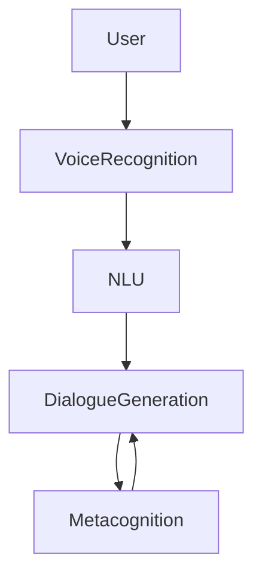
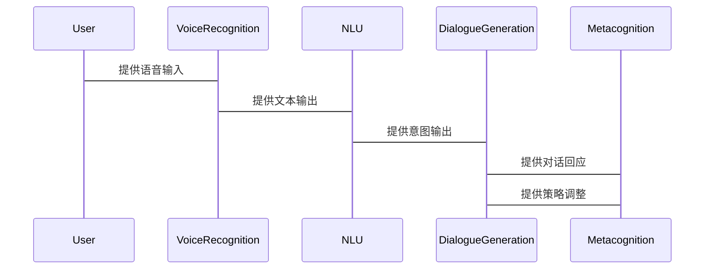

                 


# 《构建具有元认知能力的AI Agent》

## 关键词
- 元认知（Metacognition）
- AI Agent
- 人工智能（Artificial Intelligence）
- 自我监督学习
- 系统架构设计
- 算法实现

## 摘要
构建具有元认知能力的AI Agent是一个前沿且复杂的任务，它结合了人工智能、认知科学和系统设计的多个方面。本文将深入探讨元认知的基本概念、其在AI Agent中的作用，以及如何通过算法和系统架构设计实现元认知能力。我们将从背景介绍开始，逐步分析核心概念、算法原理、系统架构设计，并通过实际项目案例展示如何构建这样的AI Agent。最后，我们将讨论实际应用中的最佳实践和未来发展方向。

---

# 第一部分: 元认知与AI Agent基础

## 第1章: 元认知与AI Agent概述

### 1.1 元认知的基本概念
#### 1.1.1 元认知的定义
元认知是指对自身认知过程的认知和调控能力。简单来说，元认知是“关于思考的思考”，它包括对认知过程的监控、评估和调节。

$$元认知 = \text{对认知过程的认知} + \text{对认知过程的调控}$$

#### 1.1.2 元认知的核心特征
元认知具有以下核心特征：
1. **自我监控**：元认知能够监控自身的认知过程，了解自己的思考方式。
2. **自我评估**：元认知能够评估当前的认知状态，判断是否需要调整。
3. **自我调节**：元认知能够根据评估结果，调整认知策略和行为。

#### 1.1.3 元认知与认知的关系
元认知与认知是密切相关的。认知是信息处理的过程，而元认知是对认知过程的管理。元认知能够帮助个体更高效地完成认知任务，同时也能通过调整认知策略来提高任务的准确性。

### 1.2 AI Agent的基本概念
#### 1.2.1 AI Agent的定义
AI Agent（人工智能代理）是指能够感知环境、做出决策并采取行动的智能实体。AI Agent可以是软件程序、机器人或其他智能系统，其核心目标是通过与环境的交互来实现特定任务。

$$AI\ Agent = \text{感知} + \text{决策} + \text{行动}$$

#### 1.2.2 AI Agent的特点
AI Agent具有以下特点：
1. **自主性**：AI Agent能够自主决策，无需外部干预。
2. **反应性**：AI Agent能够实时感知环境并做出反应。
3. **目标导向**：AI Agent的行为以实现特定目标为导向。

#### 1.2.3 AI Agent的应用场景
AI Agent广泛应用于各个领域，如自动驾驶、智能助手、机器人服务等。例如，自动驾驶汽车就是一个复杂的AI Agent，它通过感知环境（如道路、交通信号、行人等）做出驾驶决策。

### 1.3 元认知与AI Agent的结合
#### 1.3.1 元认知在AI Agent中的作用
元认知在AI Agent中起到关键作用，它能够帮助AI Agent监控自身的认知过程，评估当前状态，并根据需要调整行为策略。

#### 1.3.2 元认知能力对AI Agent的影响
元认知能力的引入使得AI Agent更加智能和灵活。它能够帮助AI Agent在复杂环境中做出更合理的决策，并通过自我监督学习不断优化自身的认知能力。

#### 1.3.3 元认知与AI Agent的未来发展
随着人工智能技术的发展，元认知能力将成为AI Agent的核心能力之一。未来的AI Agent将具备更强的自我认知和自我调节能力，能够在更复杂的环境中独立完成任务。

---

## 第2章: 元认知模型与AI Agent结构

### 2.1 元认知模型的构建
#### 2.1.1 元认知模型的组成部分
元认知模型通常包括以下几个部分：
1. **认知过程监控器**：负责监控认知过程。
2. **认知过程评估器**：负责评估认知过程的正确性。
3. **认知过程调节器**：负责根据评估结果调整认知策略。

#### 2.1.2 元认知模型的属性特征
元认知模型具有以下属性特征：
1. **动态性**：元认知模型能够实时监控和调整认知过程。
2. **适应性**：元认知模型能够根据环境变化调整自身的认知策略。
3. **自我反思性**：元认知模型能够对自身的认知过程进行反思和总结。

#### 2.1.3 元认知模型的数学表达
元认知模型可以用数学公式来表示。例如，元认知模型的监控过程可以表示为：

$$\text{监控过程} = f(\text{认知过程})$$

其中，\( f \) 是一个函数，用于将认知过程映射到监控结果。

### 2.2 AI Agent的结构设计
#### 2.2.1 AI Agent的模块划分
AI Agent的结构通常包括以下几个模块：
1. **感知模块**：负责感知环境信息。
2. **决策模块**：负责根据感知信息做出决策。
3. **行动模块**：负责执行决策结果。
4. **元认知模块**：负责监控和调节认知过程。

#### 2.2.2 AI Agent的功能流程
AI Agent的功能流程可以分为以下几个步骤：
1. **感知环境**：AI Agent通过传感器或其他方式感知环境信息。
2. **分析信息**：AI Agent对感知到的信息进行分析和处理。
3. **做出决策**：AI Agent根据分析结果做出决策。
4. **执行行动**：AI Agent根据决策结果执行相应的行动。
5. **监控与调节**：元认知模块对整个过程进行监控，并根据需要调节认知策略。

#### 2.2.3 AI Agent的交互机制
AI Agent的交互机制包括内部交互和外部交互。内部交互是指AI Agent内部各模块之间的交互，外部交互是指AI Agent与外部环境之间的交互。

### 2.3 元认知与AI Agent的交互关系
#### 2.3.1 元认知对AI Agent行为的指导
元认知通过对AI Agent认知过程的监控和评估，指导其行为的调整和优化。

#### 2.3.2 AI Agent对元认知的反馈
AI Agent通过执行行为并观察结果，向元认知模块反馈信息，帮助元认知模块进行评估和调整。

#### 2.3.3 元认知与AI Agent的协同工作
元认知与AI Agent协同工作，使得AI Agent能够更加智能地完成任务。例如，当AI Agent在感知环境中遇到困难时，元认知模块会介入，帮助AI Agent重新调整感知策略。

---

## 第3章: 元认知能力的算法实现

### 3.1 元认知推理算法
#### 3.1.1 元认知推理的数学模型
元认知推理的数学模型可以用以下公式表示：

$$\text{推理结果} = f(\text{输入信息}, \text{推理规则})$$

其中，\( f \) 是一个函数，用于将输入信息和推理规则映射到推理结果。

#### 3.1.2 元认知推理的算法流程
元认知推理的算法流程可以分为以下几个步骤：
1. **输入信息处理**：对输入信息进行预处理，提取有用的信息。
2. **推理规则应用**：根据预处理后的信息，应用推理规则进行推理。
3. **推理结果评估**：对推理结果进行评估，判断是否符合预期。
4. **结果反馈**：将推理结果反馈给元认知模块，供后续调整使用。

#### 3.1.3 元认知推理的代码实现
以下是一个简单的元认知推理算法的Python代码示例：

```python
def metacognitive_reasoning(input_info, reasoning_rules):
    # 输入信息处理
    processed_info = preprocess(input_info)
    # 推理规则应用
    result = apply_rules(processed_info, reasoning_rules)
    # 推理结果评估
    if evaluate(result):
        return result
    else:
        return None

# 示例调用
input_info = "传感器数据：温度=25℃，湿度=60%"
reasoning_rules = ["如果湿度>50%，则调整温度"]
print(metacognitive_reasoning(input_info, reasoning_rules))
```

### 3.2 自我监督学习

#### 3.2.1 自我监督学习的数学模型
自我监督学习的数学模型可以用以下公式表示：

$$\text{损失函数} = \lambda_1 \text{预测误差} + \lambda_2 \text{自我监督误差}$$

其中，\( \lambda_1 \) 和 \( \lambda_2 \) 是权重系数，用于平衡预测误差和自我监督误差。

#### 3.2.2 自我监督学习的算法流程
自我监督学习的算法流程可以分为以下几个步骤：
1. **数据预处理**：对原始数据进行预处理，提取特征。
2. **生成伪标签**：根据预处理后的数据生成伪标签。
3. **模型训练**：使用生成的伪标签对模型进行训练。
4. **模型评估**：对训练好的模型进行评估，判断性能是否达到预期。
5. **模型优化**：根据评估结果，优化模型参数。

#### 3.2.3 自我监督学习的代码实现
以下是一个简单的自我监督学习算法的Python代码示例：

```python
import tensorflow as tf

def self_supervised_learning(data, labels):
    # 数据预处理
    processed_data = preprocess(data)
    # 生成伪标签
    generated_labels = generate_labels(processed_data)
    # 模型定义
    model = tf.keras.Sequential([
        tf.keras.layers.Dense(128, activation='relu'),
        tf.keras.layers.Dense(10, activation='softmax')
    ])
    # 模型编译
    model.compile(optimizer='adam', loss='sparse_categorical_crossentropy', metrics=['accuracy'])
    # 模型训练
    history = model.fit(processed_data, generated_labels, epochs=10, batch_size=32)
    return history

# 示例调用
data = "输入数据"
labels = "输入标签"
print(self_supervised_learning(data, labels))
```

---

## 第4章: 系统分析与架构设计

### 4.1 问题场景介绍
假设我们正在开发一个智能助手AI Agent，它需要能够通过元认知能力来监控和调节自身的对话过程，以提高对话的准确性和效率。

### 4.2 系统功能设计
#### 4.2.1 系统功能模块
智能助手AI Agent的功能模块包括：
1. **语音识别模块**：负责识别用户的语音输入。
2. **自然语言理解模块**：负责理解用户的需求。
3. **对话生成模块**：负责生成对话回应。
4. **元认知模块**：负责监控和调节对话过程。

#### 4.2.2 系统功能流程
智能助手AI Agent的功能流程可以分为以下几个步骤：
1. **语音识别**：识别用户的语音输入。
2. **自然语言理解**：理解用户的需求。
3. **对话生成**：根据理解结果生成对话回应。
4. **元认知监控**：监控对话过程，评估对话质量。
5. **对话调节**：根据评估结果调整对话策略。

#### 4.2.3 系统功能的ER类图
以下是智能助手AI Agent的ER类图：

```mermaid
classDiagram
    class User {
        id
        name
        }
    class VoiceRecognition {
        audio_input
        text_output
        }
    class NLU {
        text_input
        intent_output
        }
    class DialogueGeneration {
        intent_input
        response_output
        }
    class Metacognition {
        dialogue_monitoring
        strategy_adjustment
        }
    User -> VoiceRecognition: 提供语音输入
    VoiceRecognition -> NLU: 提供文本输出
    NLU -> DialogueGeneration: 提供意图输出
    DialogueGeneration -> Metacognition: 提供对话回应
    Metacognition -> DialogueGeneration: 提供策略调整
```

### 4.3 系统架构设计
#### 4.3.1 系统架构图
以下是智能助手AI Agent的系统架构图：



#### 4.3.2 系统接口设计
智能助手AI Agent的系统接口包括：
1. **语音识别接口**：提供语音输入和文本输出接口。
2. **自然语言理解接口**：提供文本输入和意图输出接口。
3. **对话生成接口**：提供意图输入和对话回应输出接口。
4. **元认知接口**：提供对话监控和策略调整接口。

#### 4.3.3 系统交互序列图
以下是智能助手AI Agent的系统交互序列图：



---

## 第5章: 项目实战

### 5.1 环境安装
要构建具有元认知能力的AI Agent，首先需要安装以下环境和工具：
1. **Python**：推荐使用Python 3.6及以上版本。
2. **TensorFlow**：用于机器学习和深度学习。
3. **Keras**：用于构建深度学习模型。
4. **Mermaid**：用于绘制图表。

安装命令示例：
```bash
pip install python-magic
pip install tensorflow
pip install keras
pip install mermaid
```

### 5.2 系统核心实现源代码
以下是一个简单的具有元认知能力的AI Agent的Python代码示例：

```python
import tensorflow as tf
from tensorflow.keras import layers

# 元认知模块
class Metacognition:
    def __init__(self):
        self.monitoring = True
        self.adjustment = False

    def assess(self, result):
        if result.accuracy < 0.8:
            self.adjustment = True
        return self.monitoring

    def adjust(self):
        if self.adjustment:
            return "调整策略"
        else:
            return "保持当前策略"

# AI Agent类
class AIAssistant:
    def __init__(self):
        self.voice_recognition = VoiceRecognition()
        self.nlu = NLU()
        self.dialogue_generation = DialogueGeneration()
        self.metacognition = Metacognition()

    def process_request(self, input):
        # 语音识别
        text = self.voice_recognition.recognize(input)
        # 自然语言理解
        intent = self.nlu.understand(text)
        # 对话生成
        response = self.dialogue_generation.generate(intent)
        # 元认知监控
        assessment = self.metacognition.assess(response)
        if assessment:
            adjustment = self.metacognition.adjust()
            return adjustment + "，并重新生成回应。"
        else:
            return "当前策略有效，无需调整。"

# 示例调用
assistant = AIAssistant()
response = assistant.process_request("天气怎么样？")
print(response)
```

### 5.3 代码应用解读与分析
以上代码实现了一个简单的具有元认知能力的AI Agent。AI Agent通过语音识别、自然语言理解和对话生成模块完成任务，并通过元认知模块监控和调节对话过程。元认知模块能够根据对话结果的准确性，决定是否需要调整对话策略。

### 5.4 实际案例分析和详细讲解
以智能助手AI Agent为例，当用户询问“天气怎么样？”时，AI Agent会通过语音识别模块将语音转换为文本，然后通过自然语言理解模块理解用户的需求，生成相应的对话回应。元认知模块会监控整个对话过程，并根据对话结果的准确性决定是否需要调整对话策略。

### 5.5 项目小结
通过以上项目实战，我们可以看到，元认知能力的引入使得AI Agent更加智能和灵活。元认知模块能够实时监控和调节AI Agent的认知过程，从而提高其任务完成的准确性和效率。

---

## 第6章: 高级应用与未来展望

### 6.1 元认知能力的实际应用场景
元认知能力在AI Agent中的实际应用场景包括：
1. **智能助手**：如Siri、Alexa等。
2. **自动驾驶**：如特斯拉的Autopilot系统。
3. **智能客服**：如银行的智能客服系统。

### 6.2 元认知能力的未来发展方向
元认知能力的未来发展方向包括：
1. **增强学习**：通过增强学习进一步提高元认知能力。
2. **多模态交互**：实现多模态交互的元认知能力。
3. **自适应系统**：构建更加自适应的元认知系统。

### 6.3 最佳实践 tips
- 在构建具有元认知能力的AI Agent时，需要结合具体的业务需求和应用场景，合理设计元认知模块的功能和结构。
- 元认知模块的引入能够显著提高AI Agent的智能性和灵活性，但也需要考虑其复杂性和计算成本。
- 在实际应用中，建议先从简单的元认知能力开始，逐步引入更复杂的元认知功能，以确保系统的稳定性和可靠性。

### 6.4 小结
元认知能力的引入为AI Agent带来了更高的智能和灵活性。未来的AI Agent将更加智能化，能够通过元认知能力实现自我监控和自我调节，从而更好地完成复杂任务。

---

# 作者：AI天才研究院/AI Genius Institute & 禅与计算机程序设计艺术 /Zen And The Art of Computer Programming

---

以上是《构建具有元认知能力的AI Agent》的目录大纲和部分内容。

