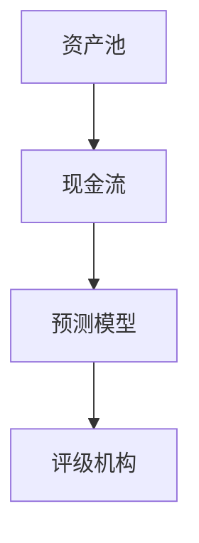
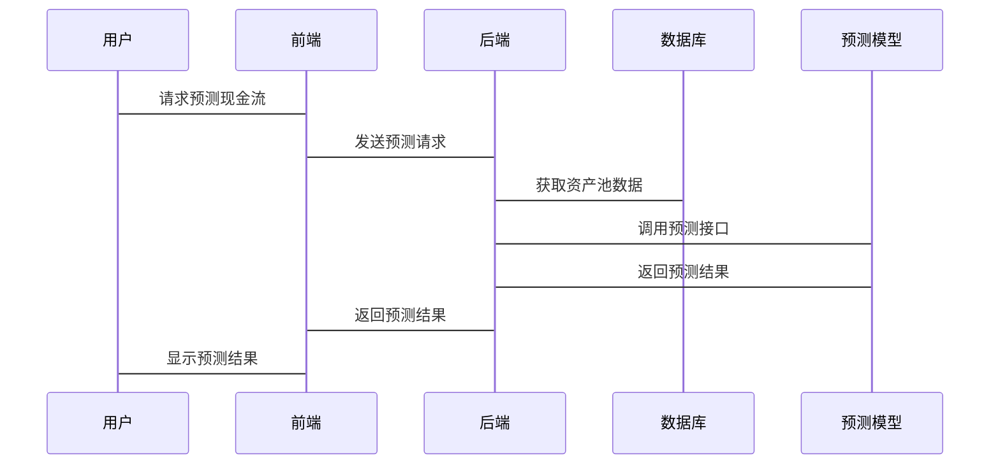

                 


```markdown
# 构建智能化的资产证券化现金流预测模型

> 关键词：资产证券化，现金流预测，机器学习，时间序列，数学模型，系统架构

> 摘要：本文详细探讨了如何构建智能化的资产证券化现金流预测模型，从核心概念、算法原理、系统架构到项目实战，逐步解析了模型构建的全过程。通过理论与实践相结合的方式，帮助读者深入理解资产证券化现金流预测的核心原理和实现方法。

---

# 第一部分: 资产证券化与现金流预测模型概述

## 第1章: 资产证券化与现金流预测模型概述

### 1.1 资产证券化的定义与特点

#### 1.1.1 资产证券化的定义
资产证券化是一种将缺乏流动性但具有未来现金流的资产转化为可在市场上流通的证券的过程。其核心在于将资产池的现金流进行结构化处理，使其符合投资者的风险偏好和收益预期。

#### 1.1.2 资产证券化的核心特点
| 特点 | 描述 |
|------|------|
| 证券化 | 将非流动性资产转化为可流通的证券 |
| 结构化 | 通过复杂的金融工具重新分配风险和收益 |
| 分层化 | 将资产池的现金流分成不同风险等级的债券 |

#### 1.1.3 资产证券化与传统融资方式的区别
| 融资方式 | 优点 | 缺点 |
|----------|------|------|
| 传统融资 | 简单快捷 | 风险集中，依赖于单一主体信用 |
| 资产证券化 | 风险分散，收益与风险匹配 | 结构复杂，操作成本高 |

### 1.2 现金流预测模型的定义与作用

#### 1.2.1 现金流预测模型的定义
现金流预测模型是一种用于预测资产池在未来一定时间内产生的现金流的数学模型，通常基于历史数据和市场特征进行建模。

#### 1.2.2 现金流预测模型在资产证券化中的作用
| 作用 | 描述 |
|------|------|
| 风险评估 | 通过预测现金流评估资产池的信用风险 |
| 价值定价 | 基于预测现金流确定证券的市场价值 |
| 投资决策 | 帮助投资者做出基于现金流预测的投资决策 |

#### 1.2.3 现金流预测模型的分类与选择
| 分类 | 描述 |
|------|------|
| 时间序列模型 | 基于历史数据预测未来现金流 |
| 机器学习模型 | 使用特征工程和算法优化预测现金流 |
| 混合模型 | 结合时间序列和机器学习的优势 |

### 1.3 资产证券化中的现金流预测问题

#### 1.3.1 资产证券化中的现金流预测问题背景
资产证券化过程中，现金流预测的准确性直接影响证券的评级、定价和市场接受度。由于资产池的复杂性和市场波动性，现金流预测面临较高的挑战。

#### 1.3.2 现金流预测模型在资产证券化中的应用场景
| 场景 | 描述 |
|------|------|
| 证券发行 | 基于预测现金流确定证券的发行价格和期限 |
| 投资决策 | 帮助投资者评估证券的投资价值和风险 |
| 风险管理 | 监控资产池现金流的变化，及时调整风险管理策略 |

#### 1.3.3 现金流预测模型的边界与外延
| 边界 | 描述 |
|------|------|
| 数据范围 | 基于特定资产池的历史数据进行预测 |
| 时间范围 | 预测未来一定时间内的现金流 |
| 模型假设 | 假设市场条件和资产池特征不变 |

### 1.4 本章小结
本章介绍了资产证券化的基本概念和特点，详细阐述了现金流预测模型在资产证券化中的作用和应用场景，明确了现金流预测模型的边界和外延。

---

# 第二部分: 资产证券化现金流预测模型的核心概念与联系

## 第2章: 资产证券化现金流预测模型的核心概念

### 2.1 资产证券化现金流预测模型的构成要素

#### 2.1.1 资产池的定义与特征
资产池是资产证券化的基础，通常由一组具有相似信用风险和市场风险的资产组成。资产池的特征包括：
- 资产类型：如住房抵押贷款、应收账款等
- 资产规模：资产池的总价值
- 资产期限：资产的平均到期时间

#### 2.1.2 资产池现金流的生成机制
资产池的现金流由资产的还款计划、违约情况和市场利率变化决定。现金流生成机制可以通过以下步骤描述：
1. 资产池中的每笔资产按其还款计划产生定期现金流
2. 考虑资产的违约情况，调整现金流的大小
3. 根据市场利率变化，调整现金流的现值

#### 2.1.3 资产池现金流的时间序列特征
现金流的时间序列特征包括：
- 趋势性：现金流随时间的变化趋势
- 季节性：现金流的周期性波动
- 随机性：现金流的不可预测部分

### 2.2 现金流预测模型的数学模型与公式

#### 2.2.1 现金流预测的基本公式
$$
\text{现金流} = \sum_{t=1}^{n} c_t
$$
其中，$c_t$ 表示第 $t$ 期的现金流，$n$ 表示预测的期数。

#### 2.2.2 时间序列预测模型的数学表达
$$
y_t = \alpha + \beta t + \epsilon_t
$$
其中，$y_t$ 表示第 $t$ 期的预测现金流，$\alpha$ 和 $\beta$ 是模型参数，$\epsilon_t$ 是误差项。

### 2.3 资产证券化现金流预测模型的ER实体关系图



---

## 第3章: 现金流预测模型的算法原理与实现

### 3.1 现金流预测模型的算法选择

#### 3.1.1 时间序列预测算法的选择
时间序列预测算法包括：
1. ARIMA（自回归积分滑动平均模型）
2. LSTM（长短期记忆网络）
3. Prophet（Facebook开源的时间序列预测算法）

#### 3.1.2 机器学习算法的选择
机器学习算法包括：
1. 线性回归
2. 支持向量回归
3. 随机森林

### 3.2 现金流预测模型的实现步骤

#### 3.2.1 数据预处理
1. 数据清洗：处理缺失值、异常值
2. 数据转换：标准化或归一化
3. 数据分割：训练集、验证集和测试集

#### 3.2.2 特征工程
1. 时间特征：如时间戳、星期、月份
2. 历史特征：如过去一段时间的现金流
3. 预测目标：如未来一期的现金流

#### 3.2.3 模型训练
1. 选择算法：如LSTM或XGBoost
2. 调参优化：如调整学习率、树深度
3. 训练模型：在训练集上训练模型

#### 3.2.4 模型评估
1. 评估指标：如均方误差（MSE）、平均绝对误差（MAE）
2. 模型调优：如调整超参数、优化特征
3. 模型部署：将模型部署到生产环境

### 3.3 现金流预测模型的数学公式

#### 3.3.1 线性回归模型
$$
y = \beta_0 + \beta_1 x_1 + \beta_2 x_2 + \dots + \beta_n x_n + \epsilon
$$

#### 3.3.2 随机森林模型
随机森林通过集成多个决策树模型，提高预测的准确性和稳定性。

---

## 第4章: 资产证券化现金流预测模型的系统架构设计

### 4.1 系统分析与设计

#### 4.1.1 问题场景介绍
资产证券化现金流预测系统需要处理大量资产池数据，实时预测现金流，支持投资者和评级机构的决策。

#### 4.1.2 系统功能设计
1. 数据采集模块：从数据库中获取资产池数据
2. 特征工程模块：提取和处理特征
3. 模型训练模块：训练和优化预测模型
4. 模型评估模块：评估模型的准确性和稳定性
5. 结果展示模块：可视化预测结果和模型报告

#### 4.1.3 领域模型设计


#### 4.1.4 系统架构设计


### 4.2 系统接口设计

#### 4.2.1 数据接口
1. 数据输入接口：从数据库读取资产池数据
2. 数据输出接口：将预测结果存入数据库

#### 4.2.2 模型接口
1. 模型训练接口：接收特征数据，返回训练好的模型
2. 模型预测接口：接收输入特征，返回预测现金流

### 4.3 系统交互流程



---

## 第5章: 资产证券化现金流预测模型的项目实战

### 5.1 环境安装与配置

#### 5.1.1 环境需求
1. Python 3.8+
2. 虚拟环境：如virtualenv或conda
3. 第三方库：如pandas、numpy、scikit-learn、xgboost

#### 5.1.2 安装依赖
```bash
pip install pandas numpy scikit-learn xgboost
```

### 5.2 系统核心实现

#### 5.2.1 数据预处理代码

```python
import pandas as pd
import numpy as np

# 读取数据
data = pd.read_csv('asset_pool.csv')

# 处理缺失值
data = data.dropna()

# 标准化处理
from sklearn.preprocessing import StandardScaler
scaler = StandardScaler()
scaled_data = scaler.fit_transform(data)
```

#### 5.2.2 特征工程代码

```python
# 提取时间特征
data['time_feature'] = data['timestamp'].apply(lambda x: x.weekday())

# 提取历史特征
window = 7
data['rolling_mean'] = data['cash_flow'].rolling(window).mean()
```

#### 5.2.3 模型训练代码

```python
from xgboost import XGBRegressor
import joblib

# 划分数据集
X_train, y_train = data[['time_feature', 'rolling_mean']], data['cash_flow']

# 训练模型
model = XGBRegressor(n_estimators=100, learning_rate=0.1)
model.fit(X_train, y_train)

# 保存模型
joblib.dump(model, 'cash_flow_model.pkl')
```

#### 5.2.4 模型评估代码

```python
from sklearn.metrics import mean_squared_error, mean_absolute_error

# 加载模型
model = joblib.load('cash_flow_model.pkl')

# 预测
y_pred = model.predict(X_test)

# 评估指标
mse = mean_squared_error(y_test, y_pred)
mae = mean_absolute_error(y_test, y_pred)
print(f'MSE: {mse}, MAE: {mae}')
```

### 5.3 案例分析与详细讲解

#### 5.3.1 数据来源与处理
以住房抵押贷款资产池为例，数据包括每笔贷款的还款金额、违约情况和市场利率变化。通过数据清洗和特征工程，提取时间特征和历史特征。

#### 5.3.2 模型选择与训练
选择XGBoost算法作为预测模型，通过调整超参数（如n_estimators和learning_rate）优化模型性能。

#### 5.3.3 模型评估与部署
通过MSE和MAE评估模型的预测精度，并将模型部署到生产环境，实现对新资产池现金流的实时预测。

### 5.4 项目总结

#### 5.4.1 项目成果
成功构建了一个智能化的资产证券化现金流预测模型，能够准确预测未来现金流，为投资者和评级机构提供可靠的决策支持。

#### 5.4.2 项目经验
- 数据质量对模型性能的影响至关重要
- 特征工程是提高模型准确性的关键
- 模型调优和评估是确保模型稳定性的必要步骤

---

## 第6章: 资产证券化现金流预测模型的最佳实践

### 6.1 小结与回顾
本文详细讲解了资产证券化现金流预测模型的构建过程，从核心概念到算法实现，再到系统架构和项目实战，帮助读者全面掌握相关知识。

### 6.2 注意事项
1. 数据来源和质量直接影响模型的预测精度
2. 模型选择和调优需要结合实际业务需求
3. 模型部署和维护需要考虑系统的可扩展性和稳定性

### 6.3 拓展阅读
1. 《时间序列分析》
2. 《机器学习实战》
3. 《资产证券化实务》

---

## 作者信息

作者：AI天才研究院/AI Genius Institute & 禅与计算机程序设计艺术 /Zen And The Art of Computer Programming

---

感谢您的阅读！希望本文能为您提供关于构建智能化资产证券化现金流预测模型的深入见解和实践指导。
```

