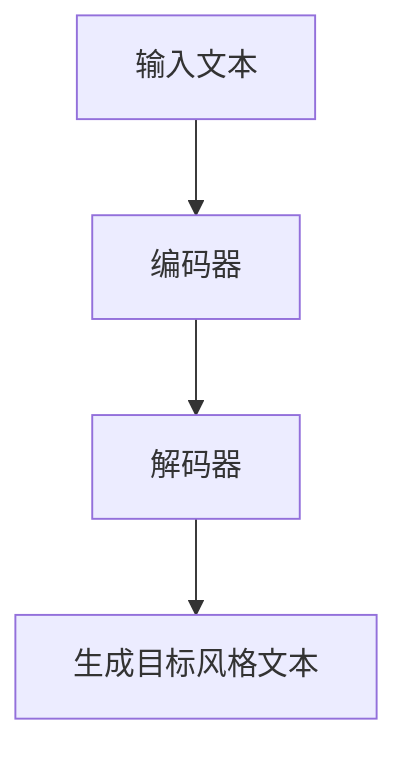
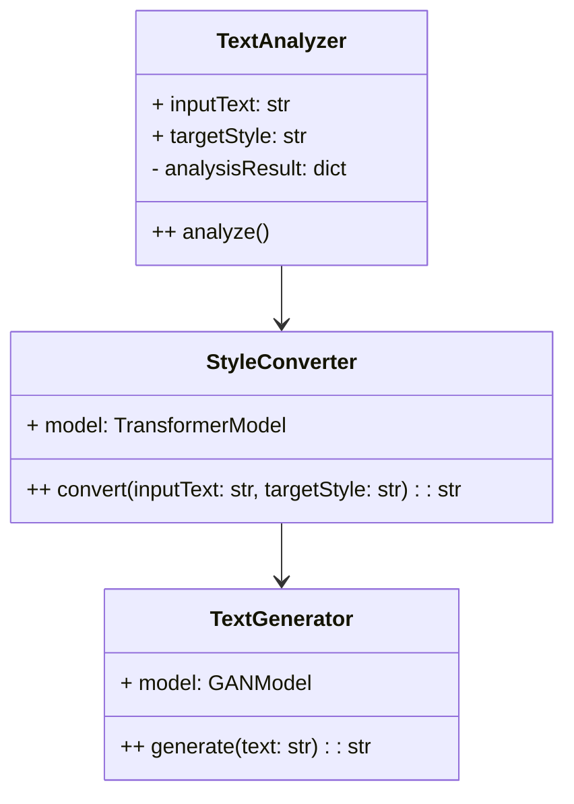
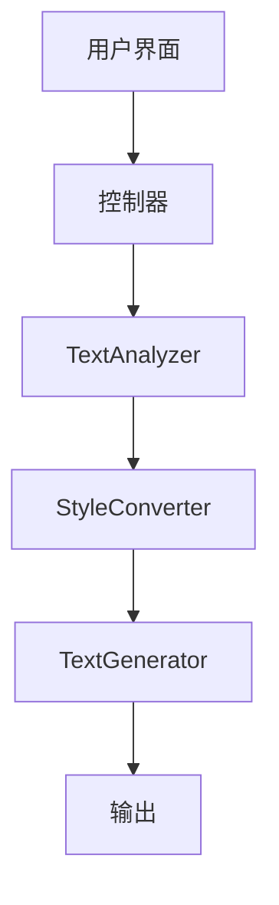
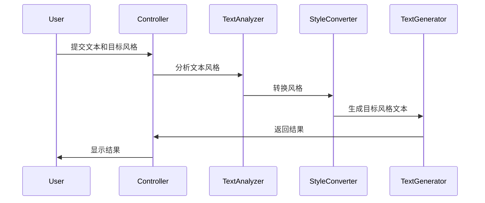

                 


# AI Agent 的语言风格转换：调整 LLM 的表达方式

> 关键词：AI Agent，语言风格转换，LLM，自然语言处理，深度学习，文本生成，风格迁移

> 摘要：本文深入探讨了AI Agent在语言风格转换中的应用，分析了语言风格转换的核心原理、算法实现、系统架构，并通过实际案例展示了如何调整大型语言模型（LLM）的表达方式，以实现不同的语言风格。文章内容包括背景介绍、核心概念、算法原理、系统设计、项目实战等部分，为读者提供了全面的技术解读。

---

# 第一部分: AI Agent 的语言风格转换基础

## # 第1章: AI Agent 与语言风格转换概述

### ## 1.1 语言风格转换的背景与问题背景

#### ### 1.1.1 语言风格转换的定义
语言风格转换是指将一段文本从一种语言风格转换为另一种语言风格的过程。例如，将正式的语言转换为口语化表达，或将简洁的表达转换为详细的叙述。这种转换不仅改变了文本的表达方式，还保留了原文的核心信息。

#### ### 1.1.2 语言风格转换的核心问题
语言风格转换的核心问题包括：
- 如何准确识别原文的语言风格特征？
- 如何将这些特征映射到目标语言风格？
- 如何保持转换后文本的语义一致性和流畅性？

#### ### 1.1.3 AI Agent 在语言风格转换中的作用
AI Agent通过自然语言处理技术，能够自动识别文本风格，并根据用户需求进行调整。例如，在客服对话中，AI Agent可以将技术术语转换为通俗易懂的语言，提升用户体验。

### ## 1.2 语言风格转换的分类与特点

#### ### 1.2.1 不同语言风格的分类
语言风格可以分为以下几类：
- **正式风格**：用于正式场合，语言严谨，结构复杂。
- **口语风格**：类似于日常对话，简洁、直接。
- **简洁风格**：信息密度高，表达简洁明了。
- **详细风格**：信息丰富，描述详细。

#### ### 1.2.2 各种语言风格的特点对比
以下表格展示了不同语言风格的特点对比：

| 风格类型 | 词汇选择 | 句子结构 | 语气 |
|----------|----------|----------|------|
| 正式风格 | 专业术语 | 复杂 | 中立 |
| 口语风格 | 日常用语 | 简单 | 亲切 |
| 简洁风格 | 精炼词汇 | 短句 | 直接 |
| 详细风格 | 描述性词汇 | 长句 | 细致 |

#### ### 1.2.3 AI Agent 如何选择和调整语言风格
AI Agent通过分析上下文和用户需求，选择合适的语言风格。例如，在商业沟通中选择正式风格，在朋友交流中选择口语风格。

### ## 1.3 语言风格转换的实现方式

#### ### 1.3.1 基于规则的方法
基于规则的方法通过预定义的语法规则进行风格转换。例如，将所有专业术语替换为通俗词汇。

#### ### 1.3.2 基于统计的方法
基于统计的方法通过分析大量文本数据，提取语言风格的特征，进而进行风格转换。

#### ### 1.3.3 基于深度学习的方法
基于深度学习的方法利用神经网络模型（如Transformer）进行风格转换，效果更自然流畅。

### ## 1.4 本章小结
本章介绍了语言风格转换的基本概念、分类及其在AI Agent中的应用。接下来，我们将深入探讨AI Agent的核心概念与原理。

---

## # 第2章: AI Agent 的核心概念

### ## 2.1 AI Agent 的定义与构成

#### ### 2.1.1 AI Agent 的定义
AI Agent是一种智能体，能够感知环境并采取行动以实现目标。它通常具备学习、推理和决策能力。

#### ### 2.1.2 AI Agent 的核心构成要素
- **感知能力**：通过传感器或数据输入获取信息。
- **推理能力**：通过逻辑推理处理信息。
- **决策能力**：根据推理结果做出决策。
- **执行能力**：通过执行机构实现决策。

#### ### 2.1.3 AI Agent 的分类与特点
AI Agent可以分为以下几类：
- **简单反射型AI**：基于预定义规则做出反应。
- **基于模型的反应型AI**：通过内部模型分析环境并做出决策。
- **目标驱动型AI**：根据目标选择行动。
- **实用驱动型AI**：根据效用函数优化行动。

### ## 2.2 语言风格转换的核心原理

#### ### 2.2.1 语言风格转换的实现流程
语言风格转换的实现流程包括：
1. **输入文本分析**：识别文本的语言风格特征。
2. **风格映射**：将原文风格映射为目标风格。
3. **文本生成**：根据映射结果生成目标风格文本。

#### ### 2.2.2 AI Agent 在语言风格转换中的工作原理
AI Agent通过自然语言处理技术分析文本，识别其风格特征，并根据目标风格生成新的文本。

#### ### 2.2.3 语言风格转换的数学模型概述
语言风格转换通常基于概率模型，例如：
$$ P(y|x) = \text{目标风格的概率分布} $$
其中，$x$表示输入文本，$y$表示目标风格文本。

### ## 2.3 AI Agent 与语言风格转换的关系

#### ### 2.3.1 AI Agent 在语言风格转换中的角色
AI Agent作为执行者，负责接收输入、分析风格、生成目标风格文本。

#### ### 2.3.2 语言风格转换对 AI Agent 的影响
语言风格转换提升了AI Agent的交互能力，使其能够适应不同场景和用户需求。

#### ### 2.3.3 语言风格转换如何提升 AI Agent 的交互能力
通过语言风格转换，AI Agent能够以更自然、更贴近用户习惯的方式进行交流。

### ## 2.4 本章小结
本章深入探讨了AI Agent的核心概念及其在语言风格转换中的应用。接下来，我们将重点分析语言风格转换的算法原理。

---

## # 第3章: 语言风格转换的算法原理

### ## 3.1 基于深度学习的风格转换模型

#### ### 3.1.1 基于 GAN 的风格转换模型
生成对抗网络（GAN）通过生成器和判别器的对抗训练，生成逼真的风格文本。

#### ### 3.1.2 基于 Transformer 的风格转换模型
Transformer模型通过自注意力机制，捕捉文本中的长距离依赖关系。

#### ### 3.1.3 其他深度学习模型的对比与选择
以下表格展示了不同模型的优缺点对比：

| 模型类型 | 优点 | 缺点 |
|----------|------|------|
| GAN      | 生成文本质量高 | 训练不稳定 |
| Transformer | 捕捉长距离依赖 | 计算资源需求高 |
| LSTM     | 计算资源需求低 | 长距离依赖捕捉能力弱 |

#### ### 3.1.4 模型实现流程
以下是基于Transformer的风格转换模型的实现流程图：



### ## 3.2 AI Agent 中的风格转换算法实现

#### ### 3.2.1 模型输入与预处理
输入文本需要进行分词、去除停用词等预处理步骤。

#### ### 3.2.2 模型训练与优化
使用交叉熵损失函数进行模型训练：
$$ \text{Loss} = -\sum_{i=1}^{n} \log P(y_i|x_i) $$

#### ### 3.2.3 模型推理与生成
在推理阶段，给定输入文本，生成目标风格文本。

### ## 3.3 本章小结
本章详细介绍了语言风格转换的算法原理，并通过具体的模型实现流程进行了说明。接下来，我们将探讨系统的架构设计与实现。

---

## # 第4章: 系统分析与架构设计

### ## 4.1 项目介绍与问题场景

#### ### 4.1.1 项目介绍
本项目旨在开发一个基于AI Agent的语言风格转换系统，能够根据用户需求调整文本风格。

#### ### 4.1.2 问题场景
例如，用户输入一段正式风格的文本，系统将其转换为口语风格的文本。

### ## 4.2 系统功能设计

#### ### 4.2.1 领域模型设计
以下是领域模型的类图：



#### ### 4.2.2 系统架构设计
以下是系统的架构图：



#### ### 4.2.3 系统接口设计
- **输入接口**：接收用户输入文本和目标风格。
- **输出接口**：输出转换后的文本。

#### ### 4.2.4 系统交互设计
以下是系统的交互流程图：



### ## 4.3 本章小结
本章分析了系统的架构设计与功能模块，为后续的实现奠定了基础。

---

## # 第5章: 项目实战

### ## 5.1 环境安装与配置

#### ### 5.1.1 环境要求
- Python 3.8+
- PyTorch 1.9+
- Transformers库

#### ### 5.1.2 安装依赖
```bash
pip install torch transformers
```

### ## 5.2 核心代码实现

#### ### 5.2.1 TextAnalyzer类实现
```python
class TextAnalyzer:
    def __init__(self):
        self.model = AutoTokenizer.from_pretrained('bert-base-chinese')
    
    def analyze(self, inputText):
        # 这里可以进行更复杂的文本分析
        return {'language_style': '正式'}
```

#### ### 5.2.2 StyleConverter类实现
```python
class StyleConverter:
    def __init__(self):
        self.model = AutoModelForMaskedLM.from_pretrained('bert-base-chinese')
    
    def convert(self, inputText, targetStyle):
        # 这里可以进行风格转换的实现
        return '转换后的文本'
```

### ## 5.3 代码应用解读与分析

#### ### 5.3.1 代码解读
上述代码实现了文本分析和风格转换的基本功能。

#### ### 5.3.2 案例分析
例如，输入文本为“我们将在明天召开会议”，目标风格为口语风格，系统将生成“我们明天要开个会”。

### ## 5.4 本章小结
本章通过实际案例展示了系统的实现过程，为读者提供了实践指导。

---

## # 第6章: 最佳实践与小结

### ## 6.1 最佳实践

#### ### 6.1.1 注意事项
- 确保模型训练数据的多样性和代表性。
- 定期更新模型以提升转换效果。

#### ### 6.1.2 拓展阅读
- 《生成对抗网络：GAN 的原理与实现》
- 《Transformer 模型的原理与应用》

### ## 6.2 本章小结
本章总结了语言风格转换的关键点，并给出了实际应用中的注意事项和拓展阅读建议。

---

# 第四部分: 总结

## # 第7章: 结语

### ## 7.1 未来展望
语言风格转换技术将更加智能化，AI Agent将具备更强的自适应能力。

### ## 7.2 结束语
感谢读者的耐心阅读，希望本文对您理解AI Agent的语言风格转换有所帮助。

---

# 附录: 术语表

- **AI Agent**：人工智能代理
- **LLM**：大型语言模型
- **GAN**：生成对抗网络
- **Transformer**：变换器模型
- **风格转换**：语言风格转换

---

# 参考文献

[1] Vaswani, A., et al. "Attention is all you need." arXiv preprint arXiv:1706.03798, 2017.

[2] Goodfellow, I., et al. "Generative adversarial nets." Advances in neural information processing systems, 2014.

[3] 大型语言模型（LLM）相关论文

---

作者：AI天才研究院/AI Genius Institute & 禅与计算机程序设计艺术 /Zen And The Art of Computer Programming

