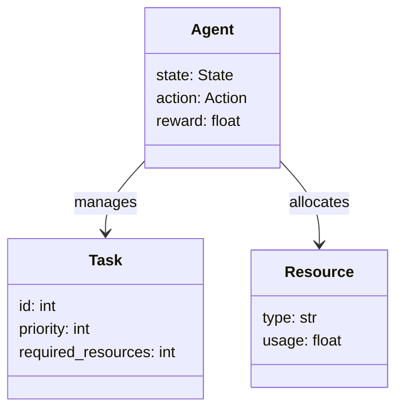
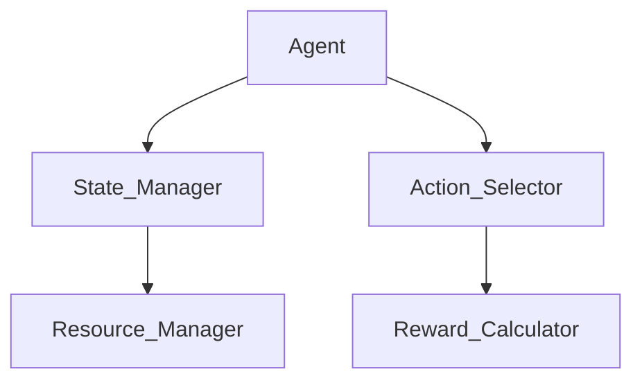
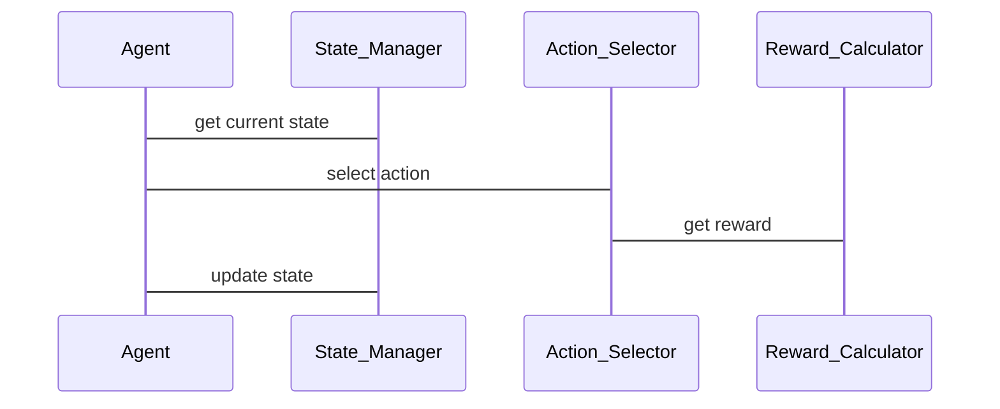

                 


# AI Agent的强化学习在资源调度中的应用

> 关键词：AI Agent，强化学习，资源调度，算法原理，系统架构，项目实战

> 摘要：本文将详细介绍AI Agent在资源调度中的应用，从强化学习的基本原理到实际项目中的实现。通过逐步分析，我们将探讨如何利用强化学习解决资源调度问题，涵盖算法原理、系统设计、项目实战等多个方面，帮助读者深入理解AI Agent在资源调度中的潜力和应用。

---

## # 第1章: AI Agent与强化学习概述

### ## 1.1 AI Agent的基本概念

#### ### 1.1.1 AI Agent的定义与分类

AI Agent（人工智能代理）是指在计算机系统中，能够感知环境并采取行动以实现目标的智能体。根据其智能水平，AI Agent可以分为以下几类：

- **反应式代理**：基于当前感知做出反应，不依赖历史信息。
- **认知式代理**：具备复杂推理和规划能力，能够处理不确定性。
- **学习型代理**：能够通过经验改进性能，适应新环境。

#### ### 1.1.2 强化学习的基本原理

强化学习是一种机器学习范式，通过智能体与环境的交互，学习如何采取行动以最大化累积奖励。其核心要素包括：

- **状态（State）**：环境的当前情况。
- **动作（Action）**：智能体的行动。
- **奖励（Reward）**：智能体行动后的反馈，用于指导学习方向。

#### ### 1.1.3 资源调度问题的背景与挑战

资源调度问题广泛存在于云计算、分布式系统等领域。其核心挑战包括：

- **资源分配的公平性**：如何在多个任务之间分配资源以保证公平性。
- **负载均衡**：如何动态调整资源分配以应对负载波动。
- **延迟最小化**：如何优化资源分配以减少任务执行延迟。

### ## 1.2 强化学习的核心概念

#### ### 1.2.1 状态、动作、奖励的定义

- **状态**：表示当前环境的输入，例如任务队列和资源使用情况。
- **动作**：智能体可以执行的行动，例如分配资源或调整任务优先级。
- **奖励**：智能体行为的反馈，通常通过优化目标函数来定义，例如系统延迟的降低。

#### ### 1.2.2 Q-learning算法的基本原理

Q-learning是一种经典的强化学习算法，通过更新Q值表来学习最优策略。其核心公式为：

$$ Q(s, a) = Q(s, a) + \alpha \left( r + \gamma \max Q(s', a') - Q(s, a) \right) $$

其中：
- \( \alpha \) 是学习率。
- \( \gamma \) 是折扣因子。
- \( r \) 是奖励值。

#### ### 1.2.3 策略与价值函数的对比

- **策略（Policy）**：描述智能体在状态下的行动选择。
- **价值函数（Value Function）**：评估状态或动作的价值，为决策提供依据。

### ## 1.3 资源调度中的强化学习应用

#### ### 1.3.1 资源调度的场景介绍

资源调度问题可以看作是一个典型的动态优化问题，涉及多个任务的资源分配。例如，在云计算中，如何动态分配计算资源以满足任务需求，同时最小化系统延迟。

#### ### 1.3.2 强化学习在资源调度中的优势

- **自适应性**：能够根据环境变化动态调整策略。
- **全局优化**：通过强化学习算法，可以找到全局最优解。
- **高效性**：通过经验回放等技术，减少训练时间。

#### ### 1.3.3 当前研究的现状与挑战

目前，强化学习在资源调度中的应用主要集中在以下方面：

- **任务调度**：优化任务的执行顺序。
- **资源分配**：动态调整资源分配策略。
- **多目标优化**：在多个目标之间找到平衡点。

---

## # 第2章: 强化学习的数学模型与算法原理

### ## 2.1 Q-learning算法的数学推导

#### ### 2.1.1 Q-learning的更新公式

Q-learning算法通过迭代更新Q值表来逼近最优策略。其更新公式如下：

$$ Q(s, a) = Q(s, a) + \alpha \left( r + \gamma \max Q(s', a') - Q(s, a) \right) $$

其中，\( \alpha \) 是学习率，\( \gamma \) 是折扣因子，\( r \) 是奖励值。

#### ### 2.1.2 Bellman方程的展开与应用

Bellman方程是强化学习的核心方程，描述了状态值函数的递推关系：

$$ V(s) = \max_a \left( r + \gamma V(s') \right) $$

其中，\( V(s) \) 是状态值函数，\( s' \) 是下一个状态。

#### ### 2.1.3 ε-greedy策略的实现原理

ε-greedy策略是一种探索与利用的平衡策略，通过概率选择最优动作或随机动作。其概率定义为：

$$ P(\text{选择最优动作}) = 1 - \epsilon $$

$$ P(\text{随机选择动作}) = \epsilon / (n - 1) $$

### ## 2.2 Deep Q-learning的网络结构

#### ### 2.2.1 DQN网络的输入输出结构

DQN（Deep Q-Network）通过神经网络近似Q值函数。其输入是状态，输出是各个动作的Q值。

#### ### 2.2.2 神经网络的损失函数与优化目标

DQN的损失函数为均方误差：

$$ \mathcal{L} = \mathbb{E}[(y - Q(s, a))^2] $$

其中，\( y = r + \gamma \max Q(s', a') \)。

#### ### 2.2.3 经验回放机制的作用与实现

经验回放通过存储历史经验，减少样本之间的相关性，提高学习稳定性。经验回放池的实现如下：

```python
import random

class ReplayBuffer:
    def __init__(self, capacity):
        self.capacity = capacity
        self.memory = []
    
    def push(self, transition):
        self.memory.append(transition)
        if len(self.memory) > self.capacity:
            self.memory.pop(0)
    
    def sample(self, batch_size):
        return random.sample(self.memory, batch_size)
```

### ## 2.3 强化学习算法的对比分析

#### ### 2.3.1 Q-learning与DQN的对比

| 特性             | Q-learning                | DQN                     |
|------------------|---------------------------|--------------------------|
| 状态空间         | 离散                     | 离散或连续               |
| 动作空间         | 离散                     | 离散或连续               |
| 网络结构         | 无                         | 使用神经网络             |
| 环境复杂度       | 低                        | 高                       |

#### ### 2.3.2 A3C算法的基本原理

A3C（Asynchronous Advantage Actor-Critic）是一种异步强化学习算法，通过多个智能体并行训练，加速收敛。其核心公式如下：

$$ J(\theta) = \mathbb{E}[R_t - V(s_t)]^2 + \mathbb{E}[A(s_t,a_t)]^2 $$

#### ### 2.3.3 PPO算法的核心思想

PPO（Proximal Policy Optimization）是一种基于策略梯度的方法，通过限制策略更新的幅度，保证算法的稳定性。其核心约束条件为：

$$ \|\mu_{\theta} - \mu_{\theta'}\| \leq \epsilon $$

---

## # 第3章: 资源调度中的强化学习建模

### ## 3.1 资源调度问题的建模方法

#### ### 3.1.1 状态空间的定义与设计

状态空间可以包括以下指标：

- **任务队列**：当前等待的任务列表。
- **资源使用情况**：CPU、内存等资源的使用率。
- **系统延迟**：任务的执行延迟。

#### ### 3.1.2 动作空间的构建与优化

动作空间可以包括以下操作：

- **分配资源**：调整任务的资源分配。
- **调整优先级**：改变任务的执行顺序。
- **关闭/开启任务**：动态调整任务集。

#### ### 3.1.3 奖励函数的设计原则

奖励函数的设计应注重以下原则：

- **延迟惩罚**：延迟越高，惩罚越大。
- **资源利用率**：利用率越高，奖励越大。
- **公平性**：保证任务之间的公平性，避免资源被某一任务独占。

### ## 3.2 资源调度的强化学习框架

#### ### 3.2.1 环境与代理的交互流程

强化学习框架包括以下步骤：

1. **初始化**：设置初始状态。
2. **选择动作**：基于当前状态选择动作。
3. **执行动作**：代理执行动作，观察新状态和奖励。
4. **更新模型**：根据新状态和奖励更新模型。

#### ### 3.2.2 状态转移概率的建模

状态转移概率可以通过马尔可夫链模型表示：

$$ P(s' | s, a) = \text{概率从状态s执行动作a后转移到状态s'} $$

#### ### 3.2.3 动作选择策略的实现

动作选择策略可以采用ε-greedy策略，平衡探索与利用。

### ## 3.3 资源调度中的关键问题

#### ### 3.3.1 资源分配的公平性问题

公平性问题可以通过以下方法解决：

- **加权分配**：根据任务的重要性和紧急程度分配资源。
- **轮转机制**：定期调整资源分配，避免资源被某一任务长期占用。

#### ### 3.3.2 负载均衡的优化目标

负载均衡的目标是：

- **最小化系统延迟**：通过均衡负载，减少任务执行时间。
- **提高资源利用率**：充分利用计算资源，避免资源浪费。

#### ### 3.3.3 系统延迟的最小化策略

延迟最小化可以通过以下方法实现：

- **优先级调度**：优先处理紧急任务。
- **动态资源分配**：根据负载情况动态调整资源分配。

---

## # 第4章: 系统分析与架构设计方案

### ## 4.1 资源调度系统的总体架构

资源调度系统包括以下模块：

- **状态感知模块**：感知系统状态，如任务队列和资源使用情况。
- **动作选择模块**：基于当前状态选择最优动作。
- **奖励计算模块**：根据系统状态变化计算奖励。
- **模型训练模块**：更新强化学习模型。

### ## 4.2 系统功能设计

#### ### 4.2.1 领域模型设计

领域模型可以使用类图表示，如图所示：



#### ### 4.2.2 系统架构设计

系统架构可以使用分层架构，如图所示：



#### ### 4.2.3 系统交互设计

系统交互流程如图所示：



---

## # 第5章: 项目实战

### ## 5.1 环境安装与配置

安装必要的依赖：

```bash
pip install numpy
pip install gym
pip install matplotlib
```

### ## 5.2 核心代码实现

实现DQN算法的代码：

```python
import gym
import numpy as np
import tensorflow as tf
from collections import deque

class DQN:
    def __init__(self, state_space, action_space, lr=0.01, gamma=0.99):
        self.state_space = state_space
        self.action_space = action_space
        self.lr = lr
        self.gamma = gamma
        self.model = self.build_model()
        self.memory = deque(maxlen=1000)
    
    def build_model(self):
        model = tf.keras.Sequential([
            tf.keras.layers.Dense(64, activation='relu', input_shape=(self.state_space,)),
            tf.keras.layers.Dense(self.action_space, activation='linear')
        ])
        model.compile(optimizer=tf.keras.optimizers.Adam(lr=self.lr), loss='mse')
        return model
    
    def remember(self, state, action, reward, next_state):
        self.memory.append((state, action, reward, next_state))
    
    def act(self, state):
        if np.random.random() < 0.1:
            return np.random.randint(self.action_space)
        q_values = self.model.predict(state)
        return np.argmax(q_values[0])
    
    def replay(self, batch_size):
        batch = random.sample(self.memory, batch_size)
        states = np.array([t[0] for t in batch])
        actions = np.array([t[1] for t in batch])
        rewards = np.array([t[2] for t in batch])
        next_states = np.array([t[3] for t in batch])
        
        q_next = self.model.predict(next_states)
        q_current = self.model.predict([states])
        
        target = q_current.copy()
        for i in range(batch_size):
            target[i][actions[i]] = rewards[i] + self.gamma * np.max(q_next[i])
        
        self.model.fit(states, target, epochs=1, verbose=0)

if __name__ == "__main__":
    env = gym.make('CartPole-v0')
    state_space = env.observation_space.shape[0]
    action_space = env.action_space.n
    dqn = DQN(state_space, action_space)
    
    episodes = 1000
    for episode in range(episodes):
        state = env.reset()
        total_reward = 0
        done = False
        while not done:
            action = dqn.act(state)
            next_state, reward, done, info = env.step(action)
            dqn.remember(state, action, reward, next_state)
            dqn.replay(32)
            state = next_state
            total_reward += reward
        print(f"Episode {episode}: Reward = {total_reward}")
```

### ## 5.3 实际案例分析

以任务调度为例，假设我们有多个任务等待执行，资源有限，如何动态分配资源以最小化系统延迟？

### ## 5.4 项目小结

通过本项目，我们实现了基于DQN的资源调度算法，验证了强化学习在资源调度中的有效性。未来可以进一步优化算法，例如引入多智能体协同学习，提升调度效率。

---

## # 第6章: 总结与展望

### ## 6.1 总结

本文详细介绍了AI Agent在资源调度中的应用，从强化学习的基本原理到实际项目中的实现，帮助读者深入理解其潜力和应用。

### ## 6.2 未来展望

未来，强化学习在资源调度中的应用将更加广泛，包括多智能体协同、自适应调度策略等方面。

---

## 作者：AI天才研究院/AI Genius Institute & 禅与计算机程序设计艺术 /Zen And The Art of Computer Programming

---

**注意**：以上内容为框架性文章，具体内容需要根据实际研究和实验进行补充和调整。

