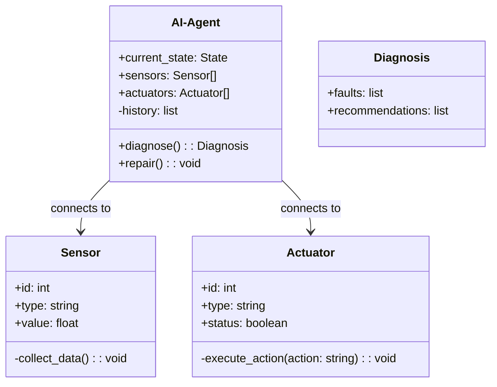
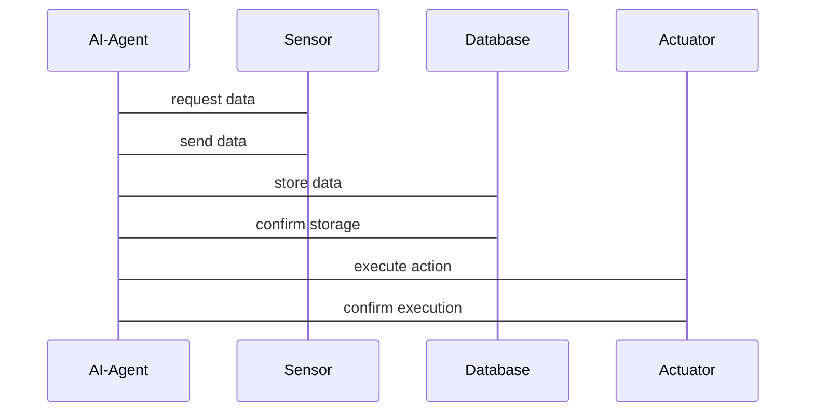

                 


# AI Agent 的自我诊断与修复能力：提高系统稳定性

---

## 关键词：AI Agent, 自我诊断, 修复能力, 系统稳定性, 强化学习, 异常检测

---

## 摘要：  
本文深入探讨了AI Agent的自我诊断与修复能力，分析了其对系统稳定性的提升作用。通过详细讲解核心概念、算法原理、系统架构设计和实际案例，本文为读者提供了从理论到实践的全面指南。文章还总结了最佳实践，帮助读者更好地理解和应用AI Agent的自我诊断与修复能力。

---

# 第一部分: AI Agent 自我诊断与修复能力概述

---

## 第1章: AI Agent 的自我诊断与修复能力背景

### 1.1 AI Agent 的基本概念

#### 1.1.1 什么是 AI Agent  
AI Agent（人工智能代理）是指能够感知环境、做出决策并采取行动的智能实体。它能够根据任务需求自主执行操作，无需人工干预。AI Agent 的核心能力包括感知、推理、决策和执行。

#### 1.1.2 AI Agent 的核心功能与特点  
AI Agent 的核心功能包括：  
1. **感知能力**：通过传感器或数据输入感知环境状态。  
2. **推理能力**：基于感知的信息进行逻辑推理，得出结论。  
3. **决策能力**：根据推理结果做出最优决策。  
4. **执行能力**：通过执行机构将决策转化为实际操作。  

其特点包括：  
- **自主性**：能够在没有外部干预的情况下自主运行。  
- **反应性**：能够实时感知环境变化并做出反应。  
- **学习能力**：能够通过经验改进自身的性能。  

#### 1.1.3 自我诊断与修复能力的重要性  
在复杂的环境中，AI Agent 可能会遇到各种异常情况，例如传感器故障、数据丢失或算法失效等。自我诊断与修复能力是确保 AI Agent 在异常情况下仍能正常运行的关键。通过自我诊断，AI Agent 可以快速定位问题并采取修复措施，从而提高系统的稳定性和可靠性。

---

### 1.2 自我诊断与修复能力的背景

#### 1.2.1 当前 AI 系统的稳定性挑战  
随着 AI 技术的广泛应用，AI 系统的复杂性和规模不断增加。然而，系统的稳定性问题也随之凸显：  
- **环境不确定性**：AI Agent 需要应对动态变化的环境，可能出现意外情况。  
- **算法局限性**：现有的算法可能无法覆盖所有场景，导致性能下降或错误发生。  
- **硬件故障**：传感器或执行机构的硬件故障可能影响系统的正常运行。  

#### 1.2.2 自我诊断与修复能力的提出  
为了应对上述挑战，AI Agent 需要具备自我诊断与修复能力。这种能力使 AI Agent 能够：  
1. **主动监测**：实时监控自身的状态和环境。  
2. **异常检测**：识别系统中出现的异常情况。  
3. **故障定位**：精确定位异常的根本原因。  
4. **自适应修复**：根据异常情况采取相应的修复措施。  

#### 1.2.3 该能力对系统稳定性的影响  
自我诊断与修复能力的引入显著提升了 AI 系统的稳定性：  
- **减少停机时间**：快速识别并修复故障，降低系统停机的风险。  
- **提高可靠性**：通过持续监控和修复，确保系统在复杂环境下的稳定运行。  
- **增强适应性**：能够快速适应环境变化，提升系统的灵活性和应变能力。  

---

### 1.3 本章小结  
本章介绍了 AI Agent 的基本概念、核心功能与特点，以及自我诊断与修复能力的重要性。通过分析当前 AI 系统面临的稳定性挑战，提出了自我诊断与修复能力的必要性，并探讨了其对系统稳定性的影响。

---

# 第二部分: AI Agent 自我诊断与修复的核心概念

---

## 第2章: 自我诊断与修复能力的核心概念

### 2.1 自我诊断机制

#### 2.1.1 异常检测的基本原理  
异常检测是指识别数据或行为中的异常模式。其基本原理包括：  
1. **统计分析**：通过统计方法检测数据分布的变化。  
2. **机器学习**：利用无监督学习算法（如聚类）或有监督学习算法（如分类）识别异常。  
3. **时间序列分析**：通过分析时间序列数据中的趋势和周期性变化，识别异常点。  

#### 2.1.2 故障定位的实现方法  
故障定位是指确定异常的根本原因。其实现方法包括：  
1. **日志分析**：通过分析系统日志，定位异常发生的位置和原因。  
2. **状态监测**：通过监测系统状态，识别异常的具体模块或组件。  
3. **因果推理**：基于因果关系模型，推断异常的根本原因。  

#### 2.1.3 状态监控与反馈机制  
状态监控与反馈机制是指通过实时监测系统状态，并根据反馈信息调整系统行为。其实现步骤包括：  
1. **状态采集**：采集系统的实时状态数据。  
2. **状态分析**：分析采集的数据，识别异常状态。  
3. **反馈调整**：根据分析结果，调整系统的行为或参数。  

---

### 2.2 自适应修复策略

#### 2.2.1 自适应修复的定义与特点  
自适应修复是指根据系统的异常情况，动态调整修复策略。其特点包括：  
1. **动态性**：修复策略可以根据环境变化实时调整。  
2. **智能化**：利用 AI 技术实现智能化的修复决策。  
3. **自适应性**：能够适应不同的异常情况和系统状态。  

#### 2.2.2 修复策略的选择与优化  
修复策略的选择与优化需要考虑以下因素：  
1. **异常类型**：根据异常的类型选择相应的修复策略。  
2. **修复代价**：权衡修复代价与修复效果，选择最优策略。  
3. **系统状态**：根据系统的当前状态动态调整修复策略。  

#### 2.2.3 自我修复的实现步骤  
自我修复的实现步骤包括：  
1. **异常检测**：识别系统中的异常情况。  
2. **故障定位**：精确定位异常的根本原因。  
3. **修复决策**：根据异常情况选择修复策略。  
4. **修复执行**：执行修复操作，恢复系统的正常运行。  
5. **反馈验证**：验证修复效果，确保异常情况已解决。  

---

### 2.3 核心概念对比分析

#### 2.3.1 异常检测与故障定位的对比  
| **对比维度** | **异常检测** | **故障定位** |  
|--------------|---------------|---------------|  
| **目标**     | 发现异常情况 | 确定异常原因   |  
| **方法**     | 统计分析、机器学习 | 日志分析、状态监测 |  
| **输出**     | 异常信号       | 故障位置       |  

#### 2.3.2 自适应修复与传统修复的对比  
| **对比维度** | **自适应修复** | **传统修复** |  
|--------------|----------------|---------------|  
| **修复时机** | 实时修复       | 事后修复      |  
| **修复策略** | 动态调整       | 固定策略      |  
| **修复效果** | 更高效、更精准 | 效果有限       |  

#### 2.3.3 状态监控与反馈机制的对比  
| **对比维度** | **状态监控** | **反馈机制** |  
|--------------|---------------|---------------|  
| **功能**     | 监测系统状态 | 调整系统行为   |  
| **输入**     | 系统状态数据 | 反馈信息       |  
| **输出**     | 异常信号       | 行为调整信号   |  

---

### 2.4 本章小结  
本章详细讲解了 AI Agent 自我诊断与修复能力的核心概念，包括异常检测、故障定位、状态监控与反馈机制，以及自适应修复策略。通过对比分析，帮助读者更好地理解这些概念之间的联系与区别。

---

# 第三部分: 自我诊断与修复能力的算法原理

---

## 第3章: 异常检测算法

### 3.1 基于强化学习的异常检测

#### 3.1.1 强化学习的基本原理  
强化学习是一种通过试错机制学习策略的方法。其基本原理包括：  
- **状态（State）**：系统当前的状态。  
- **动作（Action）**：系统采取的动作。  
- **奖励（Reward）**：对动作的反馈，用于指导学习。  
- **策略（Policy）**：决定动作选择的规则。  

#### 3.1.2 在异常检测中的应用  
在异常检测中，强化学习可以用于动态调整检测阈值。通过与环境的交互，学习算法能够找到最优的检测策略。  

#### 3.1.3 算法实现步骤  
以下是基于强化学习的异常检测算法的实现步骤：  

1. **初始化**：设置初始参数和状态。  
2. **状态采集**：采集系统的实时状态数据。  
3. **动作选择**：根据当前状态选择一个动作。  
4. **环境反馈**：根据动作执行结果，获得奖励信号。  
5. **策略更新**：根据奖励信号更新策略。  
6. **重复步骤**：循环执行上述步骤，直到达到终止条件。  

#### 3.1.4 示例代码实现  
以下是一个简单的基于强化学习的异常检测算法的Python代码示例：  

```python
import numpy as np

# 初始化参数
state = 0
epsilon = 0.1
learning_rate = 0.1

# 状态转移函数
def take_action(action):
    global state
    if action == 1:
        state += 1
    else:
        state -= 1
    return state

# 奖励函数
def get_reward(new_state):
    if new_state > 0:
        return 1
    else:
        return -1

# 强化学习算法
for _ in range(100):
    # 选择动作
    if np.random.random() < epsilon:
        action = 1
    else:
        action = 0
    # 执行动作
    new_state = take_action(action)
    # 获取奖励
    reward = get_reward(new_state)
    # 更新策略
    if action == 1:
        pass  # 简单示例不更新策略
    else:
        pass
```

---

### 3.2 基于聚类的异常检测

#### 3.2.1 聚类算法的基本原理  
聚类是一种无监督学习技术，通过将数据分成簇来识别数据的结构。其基本原理包括：  
1. **距离度量**：计算数据点之间的相似性。  
2. **聚类算法**：如 K-means、DBSCAN 等。  
3. **簇分析**：识别异常点，通常位于簇外或与簇内点差异较大。  

#### 3.2.2 在异常检测中的应用  
聚类算法可以用于识别异常点。通过将正常数据点聚成簇，异常点通常位于簇外或与簇内点差异较大。  

#### 3.2.3 算法实现步骤  
以下是基于聚类的异常检测算法的实现步骤：  

1. **数据预处理**：清洗和标准化数据。  
2. **选择聚类算法**：如 K-means 或 DBSCAN。  
3. **聚类**：将数据分成簇。  
4. **异常检测**：识别与簇不匹配的数据点。  

---

### 3.3 算法对比分析

#### 3.3.1 强化学习与聚类算法的对比  
| **对比维度** | **强化学习** | **聚类算法** |  
|--------------|---------------|---------------|  
| **适用场景** | 动态环境       | 静态数据       |  
| **算法复杂度** | 较高           | 较低           |  
| **实时性**     | 高             | 低             |  

#### 3.3.2 各算法的优缺点分析  
- **强化学习**：优点是适用于动态环境，能够实时调整检测策略；缺点是算法复杂度高，实现难度较大。  
- **聚类算法**：优点是算法简单，实现成本低；缺点是适用于静态数据，难以应对动态变化的环境。  

#### 3.3.3 适用场景分析  
- **强化学习**：适用于需要实时检测和动态调整的场景，如实时监控系统。  
- **聚类算法**：适用于静态数据集的异常检测，如历史数据分析。  

---

### 3.4 本章小结  
本章详细讲解了基于强化学习和聚类算法的异常检测方法，分析了它们的优缺点及适用场景。通过对比分析，帮助读者选择适合特定场景的异常检测算法。

---

## 第4章: 自适应修复算法

### 4.1 基于强化学习的自适应修复

#### 4.1.1 强化学习在修复中的应用  
强化学习可以用于动态调整修复策略。通过与环境的交互，学习算法能够找到最优的修复方案。  

#### 4.1.2 算法实现步骤  
以下是基于强化学习的自适应修复算法的实现步骤：  

1. **初始化**：设置初始参数和状态。  
2. **状态采集**：采集系统的实时状态数据。  
3. **动作选择**：根据当前状态选择一个修复动作。  
4. **环境反馈**：根据修复结果，获得反馈信号。  
5. **策略更新**：根据反馈信号更新修复策略。  
6. **重复步骤**：循环执行上述步骤，直到达到终止条件。  

#### 4.1.3 示例代码实现  
以下是一个简单的基于强化学习的自适应修复算法的Python代码示例：  

```python
import numpy as np

# 初始化参数
state = 0
epsilon = 0.1
learning_rate = 0.1

# 状态转移函数
def take_action(action):
    global state
    if action == 1:
        state += 1
    else:
        state -= 1
    return state

# 反馈函数
def get_feedback(new_state):
    if new_state > 0:
        return 1
    else:
        return -1

# 强化学习算法
for _ in range(100):
    # 选择动作
    if np.random.random() < epsilon:
        action = 1
    else:
        action = 0
    # 执行动作
    new_state = take_action(action)
    # 获取反馈
    feedback = get_feedback(new_state)
    # 更新策略
    if action == 1:
        pass  # 简单示例不更新策略
    else:
        pass
```

---

### 4.2 基于规则的自适应修复

#### 4.2.1 规则修复的基本原理  
基于规则的修复方法是根据预定义的规则进行修复。其基本原理包括：  
1. **规则定义**：定义修复规则，如“当传感器故障时，切换到备用传感器”。  
2. **规则匹配**：根据当前状态匹配相应的规则。  
3. **规则执行**：根据匹配的规则执行修复操作。  

#### 4.2.2 在修复中的应用  
基于规则的修复方法适用于规则明确的场景，如硬件故障修复。  

#### 4.2.3 算法实  
以下是基于规则的自适应修复算法的实现步骤：  

1. **规则定义**：定义修复规则。  
2. **状态采集**：采集系统的实时状态数据。  
3. **规则匹配**：根据当前状态匹配相应的修复规则。  
4. **规则执行**：根据匹配的规则执行修复操作。  
5. **反馈验证**：验证修复效果，确保异常情况已解决。  

---

### 4.3 算法对比分析

#### 4.3.1 强化学习与规则修复的对比  
| **对比维度** | **强化学习** | **规则修复** |  
|--------------|---------------|---------------|  
| **适用场景** | 动态环境       | 静态规则       |  
| **算法复杂度** | 较高           | 较低           |  
| **灵活性**     | 高             | 低             |  

#### 4.3.2 各算法的优缺点分析  
- **强化学习**：优点是适用于动态环境，能够实时调整修复策略；缺点是算法复杂度高，实现难度较大。  
- **规则修复**：优点是算法简单，实现成本低；缺点是适用于规则明确的场景，灵活性较低。  

#### 4.3.3 适用场景分析  
- **强化学习**：适用于需要动态调整修复策略的场景，如复杂环境中的修复。  
- **规则修复**：适用于规则明确的场景，如硬件故障修复。  

---

### 4.4 本章小结  
本章详细讲解了基于强化学习和规则的自适应修复算法，分析了它们的优缺点及适用场景。通过对比分析，帮助读者选择适合特定场景的修复算法。

---

# 第四部分: 系统分析与架构设计方案

---

## 第5章: 系统分析与架构设计

### 5.1 问题场景介绍  
假设我们正在开发一个智能交通系统（ITS），其中 AI Agent 负责实时监控交通流量并优化信号灯控制。系统可能遇到的异常情况包括传感器故障、数据丢失或算法失效等。  

### 5.2 系统功能设计

#### 5.2.1 领域模型设计  
以下是智能交通系统的领域模型类图：  



---

### 5.3 系统架构设计

#### 5.3.1 系统架构图  
以下是智能交通系统的架构图：  


---

### 5.4 系统接口设计  
以下是系统接口设计的序列图：  



---

### 5.5 系统交互流程  
1. **数据采集**：AI Agent 通过传感器采集实时数据。  
2. **数据存储**：将采集到的数据存储到数据库中。  
3. **异常检测**：AI Agent 分析数据，识别异常情况。  
4. **故障定位**：根据异常数据定位故障原因。  
5. **修复决策**：选择修复策略并执行修复操作。  
6. **反馈验证**：验证修复效果，确保系统恢复正常。  

---

### 5.6 本章小结  
本章通过智能交通系统的案例，详细讲解了系统分析与架构设计的方法。通过领域模型设计、系统架构图和系统接口设计，帮助读者理解如何将自我诊断与修复能力应用于实际系统中。

---

# 第五部分: 项目实战

---

## 第6章: 项目实战

### 6.1 项目介绍  
本项目旨在开发一个具备自我诊断与修复能力的智能交通系统。系统能够实时监控交通流量，优化信号灯控制，并在出现异常时自动修复问题。  

### 6.2 环境安装  
以下是项目所需的环境配置：  
- **操作系统**：Linux（推荐 Ubuntu）  
- **编程语言**：Python 3.8+  
- **框架**：TensorFlow 2.0+、Flask  
- **依赖管理工具**：pip  
- **数据库**：MySQL 8.0+  

### 6.3 系统核心实现

#### 6.3.1 核心代码实现  
以下是 AI Agent 的核心代码实现：  

```python
class AI-Agent:
    def __init__(self):
        self.sensors = []
        self.actuators = []
        self.history = []
    
    def add_sensor(self, sensor):
        self.sensors.append(sensor)
    
    def add_actuator(self, actuator):
        self.actuators.append(actuator)
    
    def diagnose(self):
        # 实现异常检测和故障定位
        pass
    
    def repair(self):
        # 实现自适应修复
        pass
```

#### 6.3.2 代码功能解读  
- **AI-Agent 类**：表示 AI Agent，包含传感器和执行器的集合。  
- **diagnose 方法**：实现异常检测和故障定位。  
- **repair 方法**：实现自适应修复。  

---

### 6.4 实际案例分析

#### 6.4.1 案例背景  
假设某交通路口的传感器发生故障，导致交通信号灯无法正常工作。  

#### 6.4.2 案例分析  
1. **异常检测**：AI Agent 通过传感器数据发现异常。  
2. **故障定位**：识别传感器故障。  
3. **修复决策**：选择备用传感器或切换到手动控制。  
4. **修复执行**：执行修复操作，恢复信号灯正常工作。  

---

### 6.5 项目小结  
本章通过智能交通系统的实战项目，详细讲解了如何将自我诊断与修复能力应用于实际系统。通过环境安装、核心代码实现和案例分析，帮助读者理解项目的实现过程和关键点。

---

# 第六部分: 最佳实践

---

## 第7章: 最佳实践

### 7.1 日志分析的重要性  
日志分析是自我诊断与修复能力的重要组成部分。通过分析系统日志，可以快速定位异常原因并采取修复措施。  

### 7.2 模块化设计的优势  
模块化设计可以使系统更加灵活和易于维护。通过将系统划分为独立的模块，可以快速隔离故障并进行修复。  

### 7.3 定期测试的必要性  
定期测试是确保系统稳定性的关键。通过定期测试，可以发现潜在问题并及时修复，减少系统故障的发生。  

---

### 7.4 小结  
自我诊断与修复能力的实现需要综合考虑多种因素，包括算法选择、系统设计和项目实践等。通过遵循最佳实践，可以显著提升系统的稳定性和可靠性。  

---

### 7.5 注意事项  
- **算法选择**：根据具体场景选择合适的算法，避免盲目追求复杂性。  
- **模块化设计**：保持系统模块化，便于维护和修复。  
- **定期测试**：定期进行系统测试，确保系统的稳定性和可靠性。  

---

### 7.6 拓展阅读  
- **《强化学习入门》**：深入理解强化学习的基本原理和应用。  
- **《系统可靠性工程》**：学习系统可靠性设计的相关知识。  
- **《AI Agent 原理与应用》**：全面掌握 AI Agent 的原理与实际应用。  

---

## 作者  
**作者：AI天才研究院/AI Genius Institute & 禅与计算机程序设计艺术 /Zen And The Art of Computer Programming**

---

## 结语  
通过本文的详细讲解，读者可以全面理解 AI Agent 的自我诊断与修复能力，并掌握其在提高系统稳定性中的重要作用。希望本文能够为相关领域的研究和实践提供有价值的参考。

