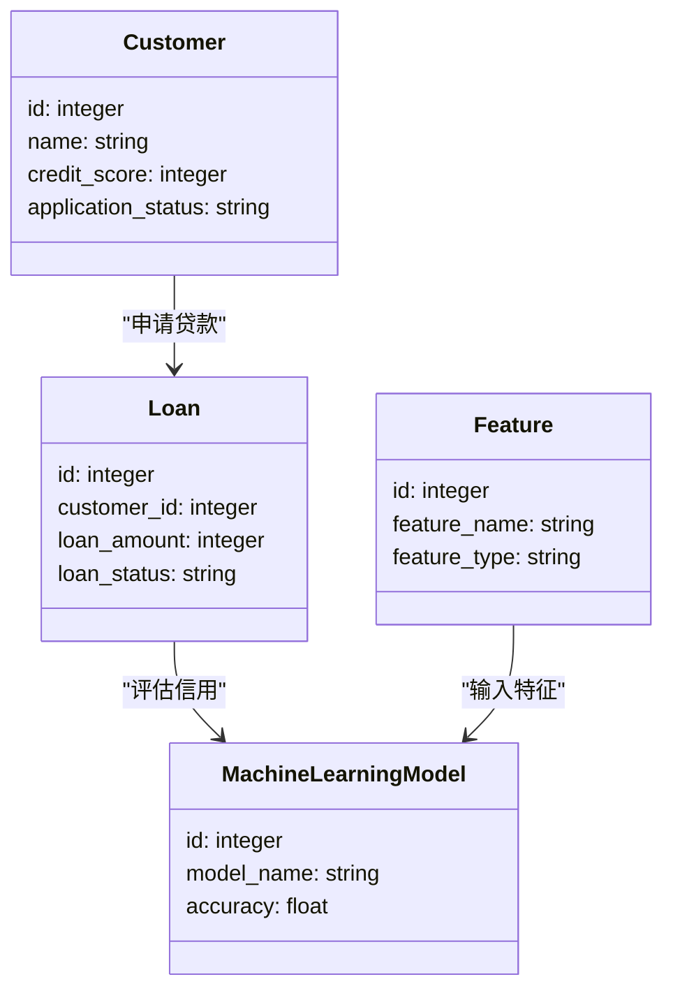
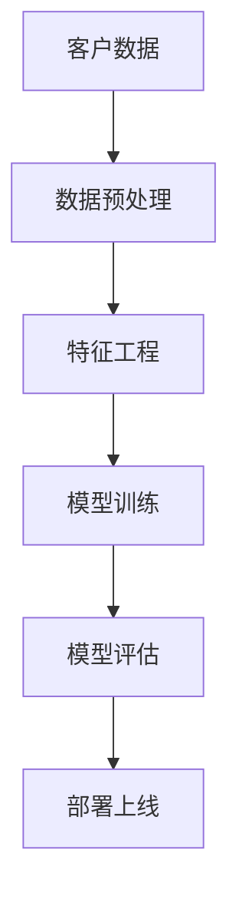
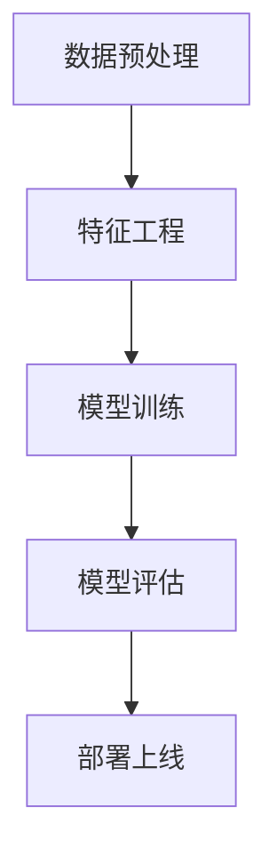
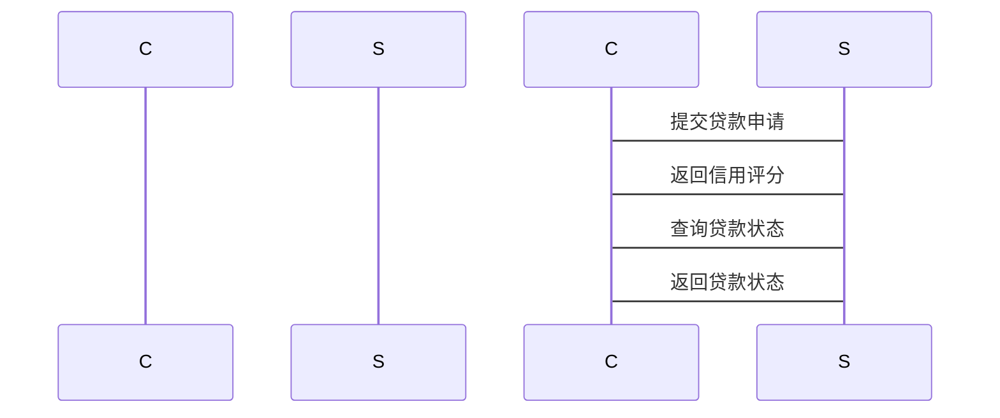

                 


# AI辅助的企业信用评分卡开发

## 关键词：
AI技术、企业信用评分卡、机器学习模型、特征工程、评分卡开发、信用风险评估

## 摘要：
本文详细探讨了AI技术在企业信用评分卡开发中的应用，重点介绍了特征工程、模型选择和优化等关键步骤。通过逻辑回归和梯度提升树的算法原理及其实现，展示了AI如何提升信用评分的准确性和效率。结合系统架构设计和项目实战，本文为读者提供了从理论到实践的全面指导。

---

# 第1章: 企业信用评分卡开发背景与问题描述

## 1.1 企业信用评分卡的定义与作用
### 1.1.1 信用评分卡的定义
企业信用评分卡是一种用于评估企业信用状况的工具，通过收集和分析企业的财务数据、市场表现等信息，生成一个综合评分，反映企业的信用风险。

### 1.1.2 信用评分卡在企业信用评估中的作用
- **信用风险控制**：帮助金融机构识别高风险企业，降低坏账率。
- **贷款决策支持**：为贷款审批提供科学依据，提高决策效率。
- **客户管理优化**：通过评分卡，企业可以更好地管理客户关系，优化资源配置。

### 1.1.3 信用评分卡的分类与应用场景
- **企业信用评分卡**：针对企业的信用评估。
- **个人信用评分卡**：针对个人的信用评估。
- **行业定制评分卡**：根据不同行业的特点定制评分模型。

## 1.2 传统信用评分卡开发的挑战
### 1.2.1 传统信用评分卡的局限性
- 数据获取困难：传统方法依赖人工收集数据，效率低且易出错。
- 特征选择复杂：需要手动筛选相关特征，耗时且可能遗漏重要信息。
- 模型优化困难：传统统计模型的优化空间有限，难以应对复杂的数据分布。

### 1.2.2 数据获取与处理的难点
- 数据清洗：处理缺失值、异常值等问题。
- 数据特征工程：提取有意义的特征，降低维度。
- 数据标注：需要人工标注正负样本，成本高。

### 1.2.3 模型选择与优化的挑战
- 模型选择：如何选择适合业务场景的模型。
- 参数调优：手动调整参数效率低，且容易陷入局部最优。
- 模型解释性：复杂模型的可解释性差，影响实际应用。

## 1.3 AI技术在信用评分卡开发中的优势
### 1.3.1 AI技术如何提升信用评分卡的准确性
- 自动化特征工程：利用机器学习技术自动提取特征，减少人工干预。
- 高效模型训练：通过深度学习算法快速训练高精度模型。
- 模型优化：自动调整模型参数，找到最优解。

### 1.3.2 AI技术在特征工程与模型优化中的应用
- 自动特征选择：使用AI技术自动筛选相关特征，提高特征的有效性。
- 模型优化：通过超参数调优和集成学习提升模型性能。
- 解释性增强：通过可解释性模型（如SHAP值）帮助理解模型决策。

### 1.3.3 AI技术在信用评分卡开发中的创新点
- 创新算法应用：引入最新的机器学习算法，如XGBoost、LightGBM等。
- 数据增强技术：利用生成对抗网络（GAN）生成合成数据，提高数据多样性。
- 实时更新：通过流数据处理技术，实时更新评分模型，保持模型的最新性。

## 1.4 本章小结
本章介绍了企业信用评分卡的定义、作用及分类，分析了传统开发方法面临的挑战，并重点阐述了AI技术如何解决这些问题，提升评分卡的开发效率和准确性。通过AI技术的应用，信用评分卡开发进入了新的阶段，为企业信用评估提供了更强大的工具支持。

---

# 第2章: 信用评分卡开发的核心概念与联系

## 2.1 信用评分卡的核心要素
### 2.1.1 信用评分卡的输入变量
- **企业基本信息**：包括注册资本、成立时间、行业等。
- **财务数据**：如资产负债表、利润表中的关键指标。
- **市场表现**：包括市场份额、客户满意度等。
- **行为数据**：如企业过去的贷款还款记录、违约情况。

### 2.1.2 信用评分卡的评分模型
- **逻辑回归模型**：用于预测企业违约概率。
- **决策树模型**：通过树状结构划分企业信用等级。
- **随机森林模型**：通过集成学习提升模型准确性。
- **梯度提升树模型**：如XGBoost、LightGBM等，性能优越。

### 2.1.3 信用评分卡的输出结果
- **信用评分**：一个综合评分，反映企业的信用风险。
- **信用等级**：如AAA、AA、A、B、C等，便于金融机构理解和应用。

## 2.2 AI辅助开发中的关键概念
### 2.2.1 特征工程的核心原理
- **特征提取**：从原始数据中提取有助于模型预测的特征。
- **特征选择**：选择最重要的特征，减少维度。
- **特征变换**：通过主成分分析（PCA）等方法降低维度，同时保留重要信息。

### 2.2.2 模型选择的策略与方法
- **模型选择标准**：准确率、召回率、F1值等指标。
- **交叉验证**：通过K折交叉验证评估模型的泛化能力。
- **超参数调优**：使用网格搜索或随机搜索优化模型参数。

### 2.2.3 模型评估与优化的指标体系
- **评估指标**：准确率、混淆矩阵、ROC-AUC曲线等。
- **优化策略**：通过调整模型结构、参数优化和数据增强提升性能。
- **模型解释性**：通过SHAP值、LIME等方法解释模型决策。

## 2.3 核心概念的ER实体关系图

以下是一个简化的ER图，展示了信用评分卡开发中的核心实体及其关系：

```mermaid
erDiagram
    customer[CUSTOMER] {
        id : integer
        name : string
        credit_score : integer
        application_status : string
    }
    loan[LOAN] {
        id : integer
        customer_id : integer
        loan_amount : integer
        loan_status : string
    }
    feature[FEATURE] {
        id : integer
        feature_name : string
        feature_type : string
    }
    model[MACHINE_LEARNING_MODEL] {
        id : integer
        model_name : string
        accuracy : float
    }
    customer --> loan : "申请贷款"
    loan --> model : "评估信用"
    feature --> model : "输入特征"
```

## 2.4 本章小结
本章详细讲解了信用评分卡的核心要素，包括输入变量、评分模型和输出结果，并通过ER图展示了各实体之间的关系。同时，阐述了AI技术在特征工程和模型优化中的关键作用，为后续的算法原理和系统设计奠定了基础。

---

# 第3章: 信用评分卡开发的算法原理与数学模型

## 3.1 逻辑回归算法
### 3.1.1 逻辑回归的原理与公式
逻辑回归是一种常用的分类算法，适用于二分类问题。其核心思想是通过sigmoid函数将线性回归的输出映射到概率空间。

#### 损失函数
逻辑回归的损失函数是交叉熵损失函数：
$$ L = -\frac{1}{m} \sum_{i=1}^{m} [y_i \cdot \ln(h(x_i)) + (1 - y_i) \cdot \ln(1 - h(x_i))] $$
其中，$h(x_i) = \frac{1}{1 + e^{-w x_i - b}}$ 是sigmoid函数。

#### 优化方法
逻辑回归通常使用梯度下降法优化参数：
$$ w := w - \eta \cdot \frac{\partial L}{\partial w} $$
$$ b := b - \eta \cdot \frac{\partial L}{\partial b} $$
其中，$\eta$ 是学习率，$\frac{\partial L}{\partial w}$ 和 $\frac{\partial L}{\partial b}$ 是损失函数对参数的偏导数。

### 3.1.2 逻辑回归的损失函数
交叉熵损失函数的最小化可以通过求解梯度并更新参数实现。以下是梯度的计算公式：
$$ \frac{\partial L}{\partial w} = \sum_{i=1}^{m} (h(x_i) - y_i) x_i $$
$$ \frac{\partial L}{\partial b} = \sum_{i=1}^{m} (h(x_i) - y_i) $$

### 3.1.3 逻辑回归的优化方法
除了梯度下降，还可以使用更高效的优化算法，如Adam优化器。Adam优化器结合了动量和自适应学习率：
$$ m_w = \beta_1 m_w + (1 - \beta_1)(\frac{\partial L}{\partial w}) $$
$$ v_w = \beta_2 v_w + (1 - \beta_2)(\frac{\partial L}{\partial w})^2 $$
$$ w := w - \eta \frac{m_w}{\sqrt{v_w} + \epsilon} $$

## 3.2 梯度提升树算法
### 3.2.1 梯度提升树的基本原理
梯度提升树是一种基于树的集成方法，通过不断优化损失函数来构建弱分类器。以下是其基本步骤：

1. 初始化：使用简单的模型（如单个决策树）作为初始估计量。
2. 计算损失函数的负梯度：$$ g^{(t)} = -\frac{\partial L}{\partial y} $$
3. 增加树：拟合新的树，以预测梯度的残差。
4. 更新模型：将新树的预测结果加权到模型中。

### 3.2.2 XGBoost算法的优化策略
XGBoost通过正则化和剪枝技术优化树的构建过程：

- **正则化**：在损失函数中加入L1和L2正则化项，防止过拟合。
- **剪枝**：通过预剪枝或后剪枝减少树的深度，降低模型复杂度。

### 3.2.3 用Python实现逻辑回归和XGBoost模型
以下是使用Scikit-learn和XGBoost库实现逻辑回归和XGBoost模型的代码示例：

```python
# 逻辑回归模型
from sklearn.linear_model import LogisticRegression
from sklearn.metrics import accuracy_score

# 数据预处理
X_train, X_test, y_train, y_test = train_test_split(X, y, test_size=0.2)

# 训练逻辑回归模型
lr_model = LogisticRegression(max_iter=1000, random_state=42)
lr_model.fit(X_train, y_train)

# 评估模型性能
y_pred = lr_model.predict(X_test)
print("逻辑回归准确率：", accuracy_score(y_test, y_pred))

# XGBoost模型
import xgboost as xgb

# 训练XGBoost模型
dtrain = xgb.DMatrix(X_train, label=y_train)
dtest = xgb.DMatrix(X_test, label=y_test)

params = {
    'objective': 'binary:logistic',
    'max_depth': 3,
    'learning_rate': 0.1,
    'n_estimators': 100
}

xgb_model = xgb.XGBClassifier(**params)
xgb_model.fit(X_train, y_train)

# 评估模型性能
y_pred_xgb = xgb_model.predict(X_test)
print("XGBoost准确率：", accuracy_score(y_test, y_pred_xgb))
```

## 3.3 算法原理的数学模型和公式
### 3.3.1 逻辑回归的数学模型
逻辑回归的决策边界由sigmoid函数决定：
$$ P(y=1|x) = \frac{1}{1 + e^{-(w^T x + b)}} $$
通过最大似然估计优化参数$w$和$b$，最小化交叉熵损失函数：
$$ L = -\frac{1}{m} \sum_{i=1}^{m} [y_i \ln(h(x_i)) + (1 - y_i) \ln(1 - h(x_i))] $$

### 3.3.2 梯度提升树的数学模型
梯度提升树通过构建多个弱分类器，逐步优化损失函数：
$$ F(x) = \sum_{t=1}^{T} \gamma \cdot h_t(x) $$
其中，$h_t(x)$是第$t$棵树的预测结果，$\gamma$是树的权重。

---

# 第4章: 系统分析与架构设计

## 4.1 系统功能设计
### 4.1.1 领域模型设计
以下是一个简化的领域模型类图：



### 4.1.2 系统架构设计
以下是系统的整体架构图：



## 4.2 系统架构设计
### 4.2.1 系统功能模块划分
- **数据预处理模块**：负责数据清洗、特征提取和数据增强。
- **特征工程模块**：进行特征选择、降维和特征变换。
- **模型训练模块**：包括模型选择、参数调优和模型训练。
- **模型评估模块**：评估模型性能，调整优化模型。
- **部署上线模块**：将模型部署到生产环境，实时处理信用评分请求。

### 4.2.2 系统架构图
以下是系统的整体架构图：



### 4.2.3 接口设计
- **输入接口**：接收企业的基本信息、财务数据和市场表现数据。
- **输出接口**：输出企业的信用评分和信用等级。
- **API接口**：提供RESTful API，供其他系统调用评分结果。

## 4.3 系统交互设计
以下是系统交互的时序图：



---

# 第5章: 项目实战

## 5.1 环境安装
为了运行本文中的代码示例，您需要安装以下Python库：
- scikit-learn
- xgboost
- pandas
- numpy
- mermaid

安装命令如下：
```bash
pip install scikit-learn xgboost pandas numpy
```

## 5.2 核心代码实现
以下是实现逻辑回归和XGBoost模型的核心代码：

```python
# 数据预处理
import pandas as pd
import numpy as np
from sklearn.model_selection import train_test_split
from sklearn.linear_model import LogisticRegression
from sklearn.metrics import accuracy_score
import xgboost as xgb

# 加载数据
data = pd.read_csv('credit_data.csv')

# 数据分割
X = data.drop('credit_score', axis=1)
y = data['credit_score']

X_train, X_test, y_train, y_test = train_test_split(X, y, test_size=0.2, random_state=42)

# 逻辑回归模型
lr_model = LogisticRegression(max_iter=1000, random_state=42)
lr_model.fit(X_train, y_train)

# 预测与评估
y_pred_lr = lr_model.predict(X_test)
print("逻辑回归准确率：", accuracy_score(y_test, y_pred_lr))

# XGBoost模型
dtrain = xgb.DMatrix(X_train, label=y_train)
dtest = xgb.DMatrix(X_test, label=y_test)

params = {
    'objective': 'binary:logistic',
    'max_depth': 3,
    'learning_rate': 0.1,
    'n_estimators': 100
}

xgb_model = xgb.XGBClassifier(**params)
xgb_model.fit(X_train, y_train)

y_pred_xgb = xgb_model.predict(X_test)
print("XGBoost准确率：", accuracy_score(y_test, y_pred_xgb))
```

## 5.3 案例分析与详细解读
### 5.3.1 数据预处理
以企业信用评分数据为例，假设我们从CSV文件中加载数据，进行如下处理：
- 删除缺失值。
- 标准化或归一化特征。
- 处理类别变量（如独热编码）。

### 5.3.2 模型训练与评估
通过训练逻辑回归和XGBoost模型，我们得到两个模型的预测结果。对比发现，XGBoost模型的准确率更高，说明在企业信用评分中，树模型表现更优。

### 5.3.3 模型部署与应用
将训练好的模型部署到生产环境，实时处理企业信用评分请求。例如，当一个新企业提交贷款申请时，系统会自动调用模型进行评分，并根据评分结果做出贷款决策。

---

# 第6章: 总结与展望

## 6.1 总结
本文详细探讨了AI技术在企业信用评分卡开发中的应用，重点介绍了特征工程、模型选择和优化等关键步骤。通过逻辑回归和梯度提升树的算法原理及其实现，展示了AI如何提升信用评分的准确性和效率。

## 6.2 展望
随着AI技术的不断发展，未来企业信用评分卡开发将更加智能化和自动化。可能出现的趋势包括：
- **自动化特征工程**：利用AI技术自动提取和选择特征，减少人工干预。
- **模型解释性增强**：通过可解释性模型（如SHAP值）帮助理解模型决策。
- **实时更新**：通过流数据处理技术，实时更新评分模型，保持模型的最新性。
- **多模态数据融合**：结合文本、图像等多种数据源，提升模型的泛化能力。

---

# 作者：AI天才研究院 & 禅与计算机程序设计艺术

通过本文的介绍，读者可以深入了解AI技术在企业信用评分卡开发中的应用，并掌握从理论到实践的完整流程。希望本文能为相关领域的研究和应用提供有价值的参考。

