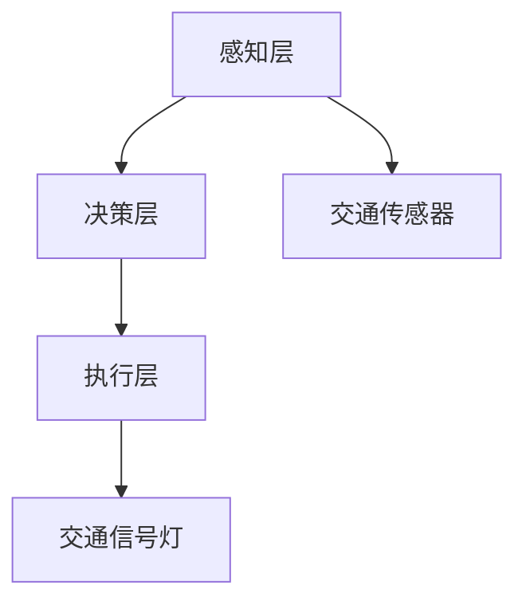

                 

# 多Agent博弈系统：策略学习与优化技术

> 关键词：多Agent系统，博弈论，策略学习，强化学习，优化技术

> 摘要：多Agent博弈系统是一种涉及多个智能体在复杂环境中互动的系统，其策略学习与优化技术是实现高效协作与竞争的核心。本文将从基础概念、算法原理到实际应用，全面解析多Agent博弈系统的策略学习与优化技术，帮助读者掌握该领域的核心知识和最新进展。

---

# 第1章: 多Agent博弈系统概述

## 1.1 多Agent系统的基本概念

### 1.1.1 多Agent系统的定义
多Agent系统（Multi-Agent System, MAS）是由多个独立但又相互协作的智能体（Agent）组成的系统。这些智能体能够通过感知环境、自主决策并采取行动，以实现特定的目标。多Agent系统的本质在于智能体之间的协作与竞争，以及它们如何在动态环境中共同解决问题。

### 1.1.2 多Agent系统的特征
多Agent系统具有以下特征：
1. **自主性**：每个Agent都是独立的，能够自主决策。
2. **反应性**：Agent能够感知环境并实时响应。
3. **协作性**：Agent之间可以协作完成复杂任务。
4. **分布性**：任务和资源分布在多个Agent之间，不存在单一的控制中心。
5. **动态性**：环境和任务可能不断变化，Agent需要适应这些变化。

### 1.1.3 多Agent系统与单Agent系统的区别
单Agent系统只有一个智能体，而多Agent系统有多个智能体。多Agent系统中，Agent之间可以协作与竞争，能够处理更复杂的问题，但同时也面临通信、协调和决策的挑战。

## 1.2 多Agent博弈系统的背景与应用

### 1.2.1 多Agent博弈系统的背景
多Agent博弈系统的研究起源于人工智能领域，随着分布式计算和机器学习技术的发展，多Agent系统在许多领域得到了广泛应用。博弈论为多Agent系统的分析提供了理论基础，而强化学习等技术则为策略优化提供了实践工具。

### 1.2.2 多Agent博弈系统的应用场景
1. **游戏AI**：如多人在线游戏中的智能NPC。
2. **机器人协作**：多个机器人协作完成任务。
3. **交通管理**：智能交通系统中车辆、路障等的协作。
4. **经济与金融**：多Agent模型用于模拟市场行为。
5. **分布式计算**：多个计算节点协作完成任务。

### 1.2.3 多Agent博弈系统的发展趋势
随着人工智能和分布式系统的进步，多Agent博弈系统将更加智能化、动态化和协作化。未来的研究将更加注重Agent之间的高效通信、自适应决策和大规模协作。

## 1.3 本章小结
本章介绍了多Agent系统的基本概念、特征以及与单Agent系统的区别，分析了多Agent博弈系统的背景和应用场景，并展望了其发展趋势。

---

# 第2章: 多Agent博弈系统的核心概念

## 2.1 多Agent系统中的Agent

### 2.1.1 Agent的定义与分类
**定义**：Agent是具有感知、决策和行动能力的智能体。  
**分类**：
1. **简单反射型Agent**：基于当前感知直接行动。
2. **基于模型的反射型Agent**：利用内部模型进行决策。
3. **目标驱动型Agent**：根据目标选择行动。
4. **效用驱动型Agent**：根据效用函数选择行动。

### 2.1.2 Agent的智能性与社会性
- **智能性**：Agent能够理解环境、推理和学习。
- **社会性**：Agent之间可以协作、通信和协商。

### 2.1.3 Agent的协作与竞争
- **协作**：Agent之间通过通信和协商共同完成任务。
- **竞争**：Agent之间争夺资源或目标，通常基于博弈论的框架。

## 2.2 多Agent博弈中的策略

### 2.2.1 策略的定义与分类
**定义**：策略是Agent在特定情况下选择行动的规则。  
**分类**：
1. **静态策略**：策略在任务执行过程中不变。
2. **动态策略**：策略根据环境变化实时调整。
3. **反应式策略**：基于当前感知选择行动。
4. **规划式策略**：基于长期规划选择行动。

### 2.2.2 策略的制定与选择
策略的制定需要考虑环境、目标和Agent的能力。策略的选择通常基于效用函数或目标函数，选择能够最大化效用或目标的行动。

### 2.2.3 策略的动态调整
在动态环境中，策略需要根据环境变化和反馈实时调整。动态调整通常基于强化学习或在线优化算法。

## 2.3 多Agent博弈的规则与机制

### 2.3.1 博弈规则的定义
博弈规则是多Agent系统中互动的基本规则，包括行动空间、奖励机制和终止条件。

### 2.3.2 博弈机制的分类
1. **完全信息博弈**：所有Agent都知道所有信息。
2. **不完全信息博弈**：Agent只知道部分信息。
3. **合作博弈**：Agent之间可以协作。
4. **非合作博弈**：Agent之间无法协作，只能竞争。

### 2.3.3 博弈机制的设计与实现
博弈机制的设计需要考虑公平性、激励性和可扩展性。实现通常基于博弈论模型和算法。

## 2.4 本章小结
本章分析了多Agent系统中的Agent及其分类，讨论了策略的定义、分类和动态调整，并详细介绍了博弈规则和机制的设计与实现。

---

# 第3章: 策略学习的基础

## 3.1 强化学习简介

### 3.1.1 强化学习的定义与特点
**定义**：强化学习（Reinforcement Learning, RL）是机器学习的一个分支，Agent通过与环境互动来学习策略。  
**特点**：
1. **试错性**：通过尝试和错误学习。
2. **延迟奖励**：行动的结果可能延迟出现。
3. **自主性**：Agent自主选择行动。

### 3.1.2 强化学习的基本原理
强化学习基于马尔可夫决策过程（MDP），Agent在每个状态下选择一个行动，根据环境反馈的奖励调整策略，以最大化累计奖励。

### 3.1.3 强化学习的应用场景
1. **游戏AI**：如AlphaGo、Dota AI。
2. **机器人控制**：机器人通过强化学习掌握动作。
3. **资源分配**：动态资源分配中的优化。

## 3.2 多Agent博弈中的策略学习

### 3.2.1 多Agent博弈中的强化学习
多Agent强化学习（Multi-Agent Reinforcement Learning, MARL）是强化学习在多Agent系统中的扩展。多个Agent在共享环境中学习协作或竞争策略。

### 3.2.2 多Agent博弈中的策略表示
策略表示需要考虑Agent之间的协作与竞争。常见的策略表示方法包括：
1. **集中式策略**：所有Agent共享一个集中策略。
2. **分布式策略**：每个Agent独立学习策略。

### 3.2.3 多Agent博弈中的策略更新
策略更新需要考虑多Agent之间的交互。常用的方法包括：
1. **同步更新**：所有Agent同时更新策略。
2. **异步更新**：Agent在不同时间更新策略。

## 3.3 策略学习的数学模型

### 3.3.1 强化学习的数学模型
强化学习的数学模型基于MDP：
- 状态空间：$S$。
- 行动空间：$A$。
- 转移概率：$P(s'|s,a)$。
- 奖励函数：$R(s,a)$。

### 3.3.2 多Agent博弈中的策略评估
策略评估的目标是找到最优策略$\pi^*$，使得累计奖励最大化：
$$
\pi^* = \arg\max_{\pi} \mathbb{E}[R]
$$

### 3.3.3 策略优化的数学表达
策略优化可以通过梯度上升或Q-learning等方法实现：
$$
Q(s,a) = Q(s,a) + \alpha (r + \gamma \max Q(s',a') - Q(s,a))
$$

## 3.4 本章小结
本章介绍了强化学习的基本原理和多Agent博弈中的策略学习方法，分析了策略表示和更新的数学模型。

---

# 第4章: 多Agent博弈中的协作与竞争

## 4.1 多Agent协作的基本原理

### 4.1.1 协作机制
协作机制包括通信、协商和任务分配。协作可以通过集中式或分布式方法实现。

### 4.1.2 协作策略
协作策略需要考虑 Agent 的目标、资源和环境。常用的协作策略包括：
1. **基于任务分配的协作**：根据任务需求分配Agent。
2. **基于角色的协作**：不同Agent扮演不同角色。

## 4.2 多Agent竞争的机制

### 4.2.1 竞争策略
竞争策略包括对抗学习和 Nash 均衡。Nash 均衡是博弈论中的关键概念，表示在竞争中没有Agent能够单方面改变策略以提高自身收益。

### 4.2.2 竞争中的策略调整
在竞争中，Agent需要实时调整策略以应对对手的变化。常用的方法包括：
1. **在线策略调整**：根据实时反馈调整策略。
2. **基于模型的调整**：基于对手模型预测其行动。

## 4.3 多Agent协作与竞争的平衡

### 4.3.1 协作与竞争的动态平衡
在多Agent系统中，协作与竞争需要动态平衡。平衡点取决于任务需求和环境条件。

### 4.3.2 协作与竞争的数学模型
协作与竞争的数学模型可以基于博弈论和多目标优化。例如，Nash均衡可以表示竞争中的平衡状态。

## 4.4 本章小结
本章分析了多Agent博弈中的协作与竞争机制，探讨了协作与竞争的策略和数学模型。

---

# 第5章: 多Agent博弈系统的优化技术

## 5.1 遗传算法在多Agent系统中的应用

### 5.1.1 遗传算法的基本原理
遗传算法（Genetic Algorithm, GA）是一种基于自然选择的优化算法。它包括编码、选择、交叉和变异等步骤。

### 5.1.2 多Agent系统中的遗传算法
遗传算法可以用于优化多Agent系统中的策略和参数。例如，可以优化Agent的行动序列或参数设置。

### 5.1.3 遗传算法的实现步骤
1. 初始化种群。
2. 计算适应度。
3. 选择适应度高的个体。
4. 进行交叉和变异。
5. 重复迭代，直到满足终止条件。

## 5.2 粒子群优化（PSO）在多Agent系统中的应用

### 5.2.1 粒子群优化的基本原理
粒子群优化是一种基于群体智能的优化算法。粒子在解空间中飞行，通过更新速度和位置找到最优解。

### 5.2.2 多Agent系统中的粒子群优化
粒子群优化可以用于多Agent系统中的任务分配和路径规划。例如，优化多个Agent的任务分配以提高效率。

### 5.2.3 粒子群优化的实现步骤
1. 初始化粒子群。
2. 计算每个粒子的适应度。
3. 更新粒子的速度和位置。
4. 重复迭代，直到满足终止条件。

## 5.3 深度强化学习在多Agent系统中的应用

### 5.3.1 深度强化学习的基本原理
深度强化学习（Deep Reinforcement Learning, DRL）是强化学习与深度学习的结合。它通过深度神经网络近似策略或值函数。

### 5.3.2 多Agent系统中的深度强化学习
深度强化学习可以用于多Agent系统中的复杂决策问题。例如，多个Agent可以通过深度强化学习学习协作策略。

### 5.3.3 多Agent深度强化学习的挑战
多Agent深度强化学习面临以下挑战：
1. **状态空间的复杂性**：多Agent系统中的状态空间非常大。
2. **策略协调性**：需要协调多个Agent的策略。
3. **计算资源需求**：深度强化学习需要大量的计算资源。

## 5.4 本章小结
本章介绍了遗传算法、粒子群优化和深度强化学习在多Agent系统中的应用，分析了它们的实现步骤和挑战。

---

# 第6章: 多Agent博弈系统的系统设计与实现

## 6.1 系统设计概述

### 6.1.1 问题场景分析
以一个多Agent交通管理系统为例，设计一个包含多个Agent的系统，每个Agent负责管理交通流量。

### 6.1.2 系统功能设计
系统功能包括交通监控、流量控制和路径规划。

### 6.1.3 系统架构设计
系统架构包括感知层、决策层和执行层。感知层负责收集交通数据，决策层负责制定策略，执行层负责执行决策。

## 6.2 系统架构设计

### 6.2.1 系统架构图
使用Mermaid绘制系统架构图，展示系统的各个模块及其关系。

### 6.2.2 模块设计
1. **感知层**：包括交通传感器和数据采集模块。
2. **决策层**：包括交通流量分析模块和策略制定模块。
3. **执行层**：包括交通信号灯和道路标识模块。

## 6.3 系统接口设计

### 6.3.1 系统接口
系统接口包括：
1. 交通传感器接口。
2. 交通信号灯接口。
3. 用户界面接口。

### 6.3.2 接口设计
使用Mermaid绘制接口设计图，展示系统接口及其交互。

## 6.4 系统交互流程

### 6.4.1 交互流程
系统交互流程包括数据采集、数据处理、策略制定和策略执行。

### 6.4.2 交互流程图
使用Mermaid绘制交互流程图，展示系统各个模块之间的交互过程。

## 6.5 本章小结
本章详细设计了多Agent交通管理系统的架构、接口和交互流程，展示了系统的整体结构和各部分之间的协作关系。

---

# 第7章: 项目实战——多Agent交通管理系统

## 7.1 项目概述

### 7.1.1 项目目标
设计一个多Agent交通管理系统，实现交通流量的实时监控和优化。

### 7.1.2 项目需求
1. 实时监控交通流量。
2. 自动调整交通信号灯。
3. 优化交通路线。

## 7.2 环境配置

### 7.2.1 硬件环境
需要配置多台计算机和传感器设备。

### 7.2.2 软件环境
需要安装Python、TensorFlow和相关库。

## 7.3 核心代码实现

### 7.3.1 传感器数据采集
代码实现传感器数据的采集和传输。

### 7.3.2 交通信号灯控制
代码实现交通信号灯的自动控制。

### 7.3.3 交通流量分析
代码实现交通流量的实时分析和优化。

## 7.4 代码应用解读与分析

### 7.4.1 代码解读
解读核心代码的功能和实现原理。

### 7.4.2 代码分析
分析代码的优缺点，提出改进建议。

## 7.5 实际案例分析和详细讲解剖析

### 7.5.1 实际案例分析
分析实际案例中的交通管理问题。

### 7.5.2 详细讲解剖析
详细讲解系统的实现过程和优化策略。

## 7.6 项目小结
总结项目的实现过程，提出改进建议和未来研究方向。

---

# 第8章: 总结与展望

## 8.1 总结

### 8.1.1 核心内容回顾
回顾本文的核心内容和主要观点。

### 8.1.2 本文的主要贡献
总结本文在多Agent博弈系统策略学习与优化技术方面的贡献。

## 8.2 未来研究方向

### 8.2.1 当前研究热点
介绍当前多Agent博弈系统研究的热点问题。

### 8.2.2 未来研究方向
提出未来多Agent博弈系统研究的方向和挑战。

## 8.3 本文的不足与改进

### 8.3.1 本文的不足
分析本文的不足之处和局限性。

### 8.3.2 改进建议
提出改进建议和未来研究计划。

## 8.4 本章小结
本章总结了本文的主要内容，展望了未来的研究方向，并提出了改进建议。

---

# 作者：AI天才研究院/AI Genius Institute & 禅与计算机程序设计艺术 /Zen And The Art of Computer Programming

---

### 附录
- **附录A**：多Agent博弈系统的相关术语表
- **附录B**：强化学习算法的详细推导
- **附录C**：项目源代码

---

通过以上内容，您可以获得一篇完整的技术博客文章，涵盖多Agent博弈系统策略学习与优化技术的各个方面。

