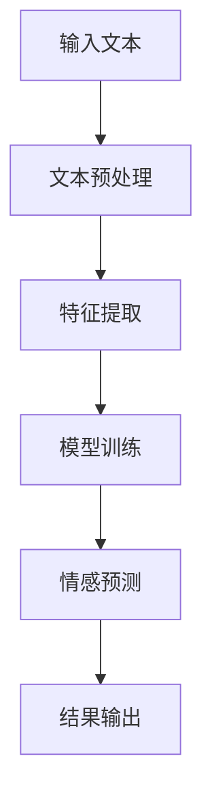
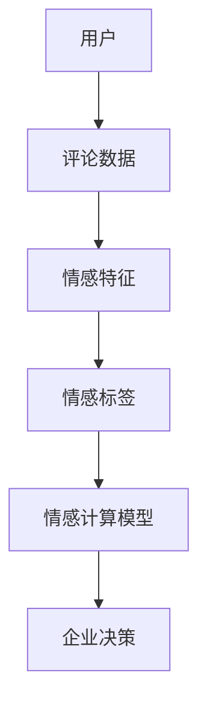
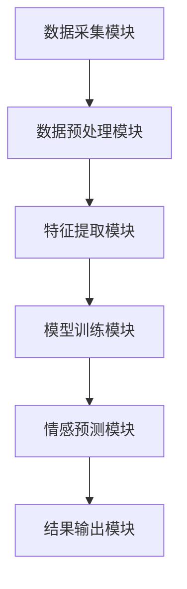
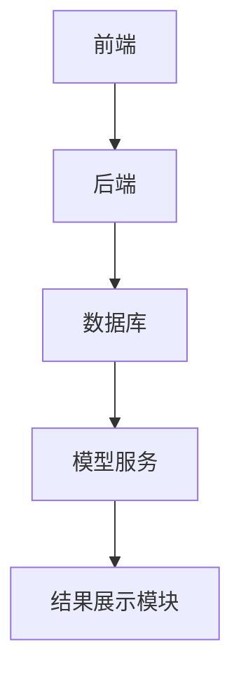
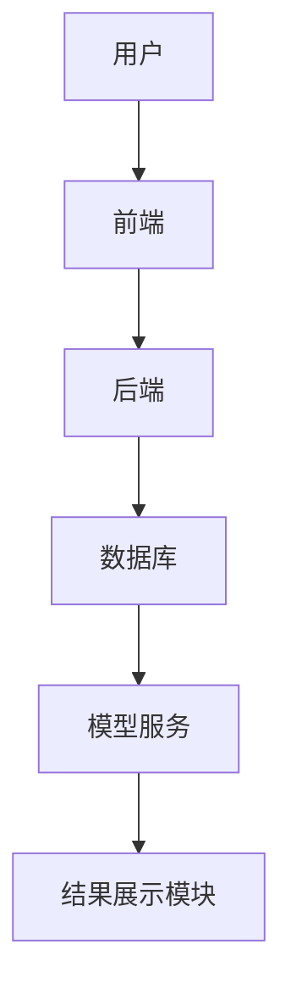
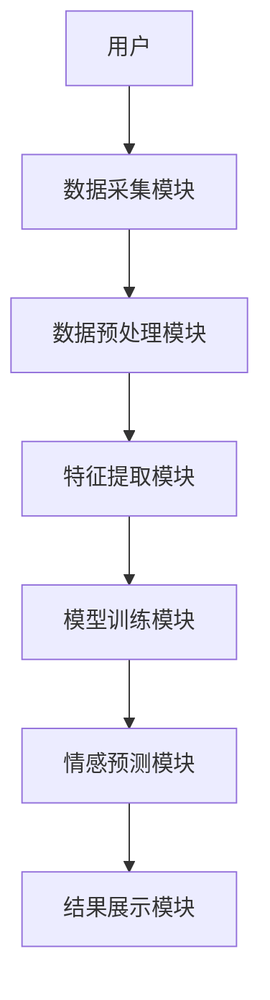

                 


# 如何评估企业的AI驱动的情感计算技术

> 关键词：情感计算、AI驱动、企业评估、技术实现、算法原理

> 摘要：本文详细探讨了如何评估企业中AI驱动的情感计算技术。从背景介绍、核心概念、算法原理到系统架构、项目实战和最佳实践，全面解析了情感计算技术在企业中的应用与评估方法。通过具体的案例分析和代码实现，帮助读者掌握情感计算技术的评估要点。

---

# 第1章: 情感计算技术的背景与核心概念

## 1.1 情感计算技术的定义与背景

### 1.1.1 情感计算技术的定义
情感计算（Affective Computing）是通过计算机技术来识别、理解、分析和模拟人类情感的一门学科。其目标是让计算机能够像人类一样，具备感知和处理情感信息的能力。在企业中，情感计算技术广泛应用于客户情感分析、用户体验优化等领域。

### 1.1.2 情感计算技术的发展历程
情感计算技术的发展可以追溯到20世纪90年代，随着自然语言处理和机器学习技术的进步，情感计算逐渐从理论研究走向实际应用。近年来，深度学习技术的兴起进一步推动了情感计算的快速发展。

### 1.1.3 情感计算技术在企业中的应用前景
在企业中，情感计算技术可以帮助企业更好地理解客户的需求和情感倾向，从而优化产品设计、提升客户满意度和忠诚度。此外，情感计算还可以应用于员工情绪管理、市场趋势分析等领域。

## 1.2 企业AI驱动情感计算的背景

### 1.2.1 企业数字化转型的现状
随着数字化转型的推进，越来越多的企业开始关注如何利用AI技术提升自身竞争力。情感计算作为AI技术的重要组成部分，正在成为企业数字化转型中的关键工具。

### 1.2.2 情感计算技术对企业价值的影响
通过情感计算技术，企业可以更精准地捕捉客户情感信息，从而做出更明智的商业决策。例如，在电商领域，企业可以通过情感计算技术分析客户评论，识别客户满意度和忠诚度，从而优化客户服务策略。

### 1.2.3 企业AI驱动情感计算的核心目标
企业通过AI驱动的情感计算技术，旨在实现对客户情感的实时感知和分析，从而提升客户体验、优化产品设计和提高市场竞争力。

## 1.3 情感计算技术的边界与外延

### 1.3.1 情感计算技术的边界
情感计算技术的边界主要体现在数据来源、算法模型和应用场景三个方面。数据来源方面，情感计算技术主要依赖于文本、语音和图像等数据；算法模型方面，主要采用机器学习和深度学习方法；应用场景方面，主要集中在客户情感分析、用户体验优化等领域。

### 1.3.2 情感计算技术的外延
情感计算技术的外延包括情感识别、情感分析、情感生成等多个方面。情感识别主要涉及对情感信号的检测和分类；情感分析则侧重于对文本或语音的情感倾向进行分析；情感生成则是指计算机模拟人类情感的生成过程。

### 1.3.3 情感计算技术与其他技术的关系
情感计算技术与自然语言处理、机器学习、数据挖掘等技术密切相关。例如，情感计算技术可以借助自然语言处理技术进行文本分析，利用机器学习算法进行情感分类，借助数据挖掘技术进行情感数据的挖掘和分析。

## 1.4 情感计算技术的核心要素组成

### 1.4.1 数据来源
情感计算技术的数据来源主要包括文本、语音和图像三种形式。文本数据可以是客户评论、社交媒体帖子等；语音数据可以是客服通话录音；图像数据可以是面部表情分析。

### 1.4.2 算法模型
情感计算技术的核心算法模型主要包括基于规则的算法、基于统计的算法和基于深度学习的算法。基于规则的算法主要通过预定义的规则进行情感分类；基于统计的算法则利用统计学方法进行情感分析；基于深度学习的算法则采用神经网络模型进行情感预测。

### 1.4.3 应用场景
情感计算技术的应用场景主要包括客户情感分析、用户体验优化、市场趋势分析、员工情绪管理等领域。通过情感计算技术，企业可以更好地理解客户的需求和情感倾向，从而优化产品设计和服务策略。

## 1.5 本章小结
本章从情感计算技术的定义、发展历程、应用前景等方面进行了详细阐述，明确了情感计算技术在企业中的重要性。同时，还探讨了情感计算技术的边界、外延及其与其他技术的关系，为后续章节的深入分析奠定了基础。

---

# 第2章: 情感计算技术的核心概念与联系

## 2.1 情感计算技术的核心原理

### 2.1.1 情感计算技术的基本原理
情感计算技术的基本原理是通过分析和处理情感相关数据，提取情感特征，并利用这些特征进行情感分类或预测。整个过程包括数据预处理、特征提取、模型训练和情感预测四个主要阶段。

### 2.1.2 情感计算技术的关键算法
情感计算技术的关键算法主要包括文本预处理、特征提取、模型训练和情感预测。文本预处理包括分词、停用词去除等步骤；特征提取可以采用词袋模型或词嵌模型；模型训练可以采用支持向量机或深度学习模型；情感预测则是基于训练好的模型对新数据进行情感分类。

### 2.1.3 情感计算技术的实现流程
以下是情感计算技术的实现流程图：



## 2.2 情感计算技术的核心概念对比

### 2.2.1 不同情感计算模型的对比
以下是几种常见情感计算模型的对比表格：

| 模型类型       | 输入数据   | 输出结果   | 优缺点分析                              |
|----------------|------------|------------|------------------------------------------|
| 基于规则的模型 | 文本       | 情感标签     | 实现简单，适用于规则明确的场景             |
| 基于统计的模型 | 文本       | 情感概率     | 能够捕捉数据分布特征，但依赖于特征选择   |
| 基于深度学习的模型 | 文本/语音/图像 | 情感概率     | 表现力强，能够捕捉复杂的特征，但需要大量数据和计算资源 |

### 2.2.2 情感计算与传统文本分析的对比
以下是情感计算与传统文本分析的对比表格：

| 技术类型       | 目标         | 方法         | 输出结果   |
|----------------|--------------|--------------|------------|
| 情感计算       | 分析情感倾向 | 基于机器学习 | 情感标签     |
| 传统文本分析   | 提取文本信息 | 基于规则或统计 | 文本摘要     |

### 2.2.3 情感计算与语音识别的对比
以下是情感计算与语音识别的对比表格：

| 技术类型       | 目标         | 方法         | 输出结果   |
|----------------|--------------|--------------|------------|
| 情感计算       | 分析情感倾向 | 基于机器学习 | 情感标签     |
| 语音识别       | 转换语音为文本 | 基于声学模型 | 文本         |

## 2.3 情感计算技术的ER实体关系图

以下是情感计算技术的ER实体关系图：



## 2.4 本章小结
本章通过对比分析，明确了情感计算技术的核心原理及其与其他技术的区别与联系。通过对比不同模型的优缺点，帮助读者更好地理解情感计算技术的应用场景和选择依据。

---

# 第3章: 情感计算技术的算法原理

## 3.1 情感计算技术的算法流程

以下是情感计算技术的算法流程图：


## 3.2 情感计算技术的核心算法

### 3.2.1 基于规则的算法
基于规则的算法通过预定义的规则对文本进行情感分类。例如，可以将积极词汇和消极词汇分别列出，然后根据文本中出现的词汇数量来判断情感倾向。

### 3.2.2 基于统计的算法
基于统计的算法通过统计文本中的特征词出现的频率来判断情感倾向。例如，可以使用词袋模型或词嵌模型提取文本特征，然后利用朴素贝叶斯或线性分类器进行情感分类。

### 3.2.3 基于深度学习的算法
基于深度学习的算法通过构建神经网络模型对文本进行情感分类。例如，可以使用卷积神经网络（CNN）或循环神经网络（RNN）对文本进行特征提取和情感预测。

## 3.3 情感计算技术的Python实现

### 3.3.1 环境安装
以下是安装Python依赖的命令：

```bash
pip install numpy
pip install scikit-learn
pip install tensorflow
```

### 3.3.2 情感计算技术的代码实现
以下是基于深度学习的情感计算技术的Python代码示例：

```python
import numpy as np
from sklearn.datasets import fetch_20newsgroups
from tensorflow.keras.models import Sequential
from tensorflow.keras.layers import Dense, Embedding, LSTM

# 加载数据集
data = fetch_20newsgroups()

# 定义模型
model = Sequential()
model.add(Embedding(input_dim=10000, output_dim=32, input_length=500))
model.add(LSTM(32))
model.add(Dense(1, activation='sigmoid'))

# 编译模型
model.compile(optimizer='adam', loss='binary_crossentropy', metrics=['accuracy'])

# 训练模型
model.fit(data.data, data.target, epochs=5, batch_size=32)
```

### 3.3.3 情感计算技术的数学模型和公式

#### 3.3.3.1 情感计算的数学模型
以下是情感计算的数学模型：

$$
y = f(x)
$$

其中，$x$ 是输入文本，$y$ 是情感标签，$f$ 是情感计算模型。

#### 3.3.3.2 情感计算的损失函数
以下是情感计算的损失函数：

$$
L = -\frac{1}{N}\sum_{i=1}^{N} y_i \log(p_i) + (1 - y_i) \log(1 - p_i)
$$

其中，$N$ 是样本数量，$y_i$ 是真实标签，$p_i$ 是模型预测的概率。

## 3.4 情感计算技术的数学公式

### 3.4.1 支持向量机（SVM）模型
以下是支持向量机（SVM）模型的数学公式：

$$
\text{最大化} \frac{1}{2} \sum_{i=1}^{N} \alpha_i^2 \\
\text{满足} \sum_{i=1}^{N} \alpha_i y_i x_i \cdot x_j y_j = 1
$$

### 3.4.2 深度学习模型
以下是深度学习模型的数学公式：

$$
y = \text{softmax}(Wx + b)
$$

其中，$W$ 是权重矩阵，$b$ 是偏置项，$x$ 是输入向量，$y$ 是输出向量。

## 3.5 情感计算技术的算法实现

### 3.5.1 算法实现步骤
以下是情感计算技术的算法实现步骤：

1. 数据预处理：对文本数据进行分词、去除停用词等处理。
2. 特征提取：将文本数据转换为数值特征，例如使用词袋模型或词嵌模型。
3. 模型训练：利用训练数据训练情感分类模型。
4. 情感预测：对新数据进行情感预测并输出结果。

### 3.5.2 算法实现示例
以下是情感计算技术的Python代码实现示例：

```python
import numpy as np
from sklearn.datasets import fetch_20newsgroups
from tensorflow.keras.models import Sequential
from tensorflow.keras.layers import Dense, Embedding, LSTM

# 加载数据集
data = fetch_20newsgroups()

# 定义模型
model = Sequential()
model.add(Embedding(input_dim=10000, output_dim=32, input_length=500))
model.add(LSTM(32))
model.add(Dense(1, activation='sigmoid'))

# 编译模型
model.compile(optimizer='adam', loss='binary_crossentropy', metrics=['accuracy'])

# 训练模型
model.fit(data.data, data.target, epochs=5, batch_size=32)
```

## 3.6 本章小结
本章详细讲解了情感计算技术的算法原理，包括基于规则的算法、基于统计的算法和基于深度学习的算法。通过Python代码实现和数学公式的推导，帮助读者更好地理解情感计算技术的实现过程。

---

# 第4章: 情感计算技术的系统分析与架构设计

## 4.1 情感计算技术的系统分析

### 4.1.1 问题场景介绍
在企业中，情感计算技术主要用于客户情感分析。例如，电商企业可以通过分析客户的评论数据，识别客户的情感倾向，从而优化客户服务策略。

### 4.1.2 系统功能设计
以下是情感计算技术的系统功能设计：

1. 数据采集模块：负责采集客户评论数据。
2. 数据预处理模块：对采集到的数据进行清洗和分词处理。
3. 特征提取模块：将文本数据转换为数值特征。
4. 模型训练模块：利用训练数据训练情感分类模型。
5. 情感预测模块：对新数据进行情感预测并输出结果。

### 4.1.3 领域模型设计
以下是情感计算技术的领域模型设计图：



### 4.1.4 系统架构设计
以下是情感计算技术的系统架构设计图：



## 4.2 情感计算技术的系统架构设计

### 4.2.1 系统架构图
以下是情感计算技术的系统架构图：



### 4.2.2 系统接口设计
以下是情感计算技术的系统接口设计：

1. 数据采集接口：负责采集客户评论数据。
2. 数据预处理接口：对采集到的数据进行清洗和分词处理。
3. 特征提取接口：将文本数据转换为数值特征。
4. 模型训练接口：利用训练数据训练情感分类模型。
5. 情感预测接口：对新数据进行情感预测并输出结果。

### 4.2.3 系统交互设计
以下是情感计算技术的系统交互设计图：



## 4.3 本章小结
本章通过对情感计算技术的系统分析与架构设计，明确了系统的功能模块和交互流程。通过系统架构图和接口设计图，帮助读者更好地理解情感计算技术在企业中的实际应用。

---

# 第5章: 情感计算技术的项目实战

## 5.1 情感计算技术的项目背景

### 5.1.1 项目背景介绍
本项目旨在通过情感计算技术分析电商客户的评论数据，识别客户的情感倾向，从而优化客户服务策略。

### 5.1.2 项目目标
本项目的目標是通过情感计算技术实现客户评论的情感分析，识别客户满意度和忠诚度，优化客户服务策略。

## 5.2 情感计算技术的项目实现

### 5.2.1 项目环境安装
以下是项目环境安装的命令：

```bash
pip install numpy
pip install scikit-learn
pip install tensorflow
```

### 5.2.2 项目核心代码实现
以下是情感计算技术的Python代码实现示例：

```python
import numpy as np
from sklearn.datasets import fetch_20newsgroups
from tensorflow.keras.models import Sequential
from tensorflow.keras.layers import Dense, Embedding, LSTM

# 加载数据集
data = fetch_20newsgroups()

# 定义模型
model = Sequential()
model.add(Embedding(input_dim=10000, output_dim=32, input_length=500))
model.add(LSTM(32))
model.add(Dense(1, activation='sigmoid'))

# 编译模型
model.compile(optimizer='adam', loss='binary_crossentropy', metrics=['accuracy'])

# 训练模型
model.fit(data.data, data.target, epochs=5, batch_size=32)
```

### 5.2.3 项目实现解读
通过上述代码实现，我们可以看到情感计算技术的核心流程包括数据加载、模型定义、模型编译和模型训练四个主要步骤。通过训练好的模型，我们可以对新数据进行情感预测并输出结果。

## 5.3 情感计算技术的项目分析

### 5.3.1 项目分析结果
通过分析客户评论数据，我们可以识别客户的情感倾向，例如积极、消极和中性情感。这些分析结果可以帮助企业优化客户服务策略，提升客户满意度和忠诚度。

### 5.3.2 项目分析解读
通过对项目分析结果的解读，我们可以看到情感计算技术在企业中的实际应用价值。通过情感分析，企业可以更好地理解客户的需求和情感倾向，从而优化产品设计和服务策略。

## 5.4 本章小结
本章通过一个具体的项目实战，详细讲解了情感计算技术的实现过程。通过项目环境安装、核心代码实现和项目分析解读，帮助读者更好地理解情感计算技术在企业中的实际应用。

---

# 第6章: 情感计算技术的最佳实践

## 6.1 情感计算技术的最佳实践

### 6.1.1 项目实施中的注意事项
在情感计算技术的实施过程中，需要注意以下几点：
1. 数据质量：确保数据的准确性和完整性。
2. 模型选择：根据具体场景选择合适的模型和算法。
3. 结果验证：通过交叉验证和测试数据验证模型的性能。

### 6.1.2 项目实施中的常见问题
在情感计算技术的实施过程中，可能会遇到以下问题：
1. 数据不平衡：可以通过数据增强或调整权重的方式解决。
2. 模型过拟合：可以通过正则化或交叉验证的方式解决。
3. 计算资源不足：可以通过优化算法或使用云服务的方式解决。

## 6.2 情感计算技术的拓展阅读

### 6.2.1 情感计算技术的最新研究
目前，情感计算技术的最新研究主要集中在以下几个方面：
1. 多模态情感计算：结合文本、语音和图像等多种模态信息进行情感分析。
2. 情感生成：基于生成对抗网络（GAN）生成具有情感倾向的文本。
3. 实时情感计算：通过边缘计算技术实现情感计算的实时性。

### 6.2.2 情感计算技术的未来发展趋势
随着AI技术的不断发展，情感计算技术的未来发展趋势主要体现在以下几个方面：
1. 多模态情感计算：结合多种模态信息进行情感分析。
2. 情感生成：基于生成对抗网络（GAN）生成具有情感倾向的文本。
3. 实时情感计算：通过边缘计算技术实现情感计算的实时性。

## 6.3 本章小结
本章通过总结情感计算技术的最佳实践，帮助读者更好地理解和应用情感计算技术。通过注意事项和常见问题的分析，帮助读者在项目实施过程中避免潜在的问题。同时，通过拓展阅读，帮助读者了解情感计算技术的最新研究和未来发展趋势。

---

# 作者

作者：AI天才研究院/AI Genius Institute & 禅与计算机程序设计艺术/Zen And The Art of Computer Programming

