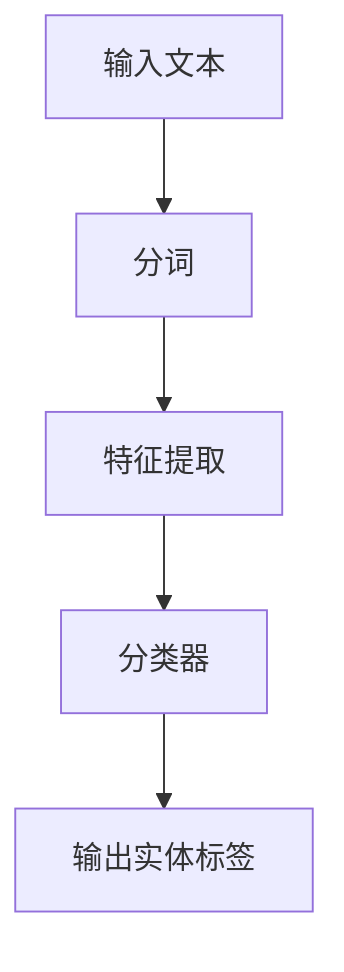
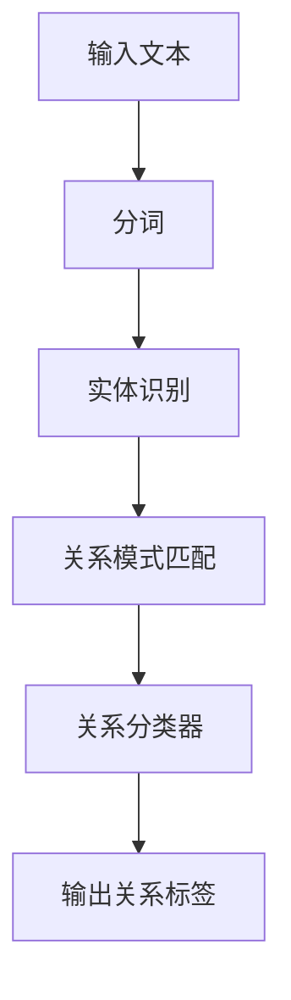
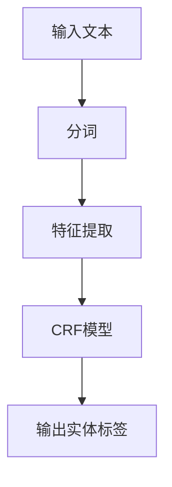
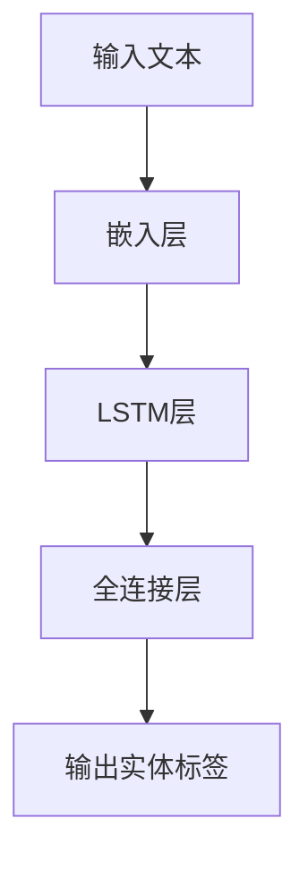
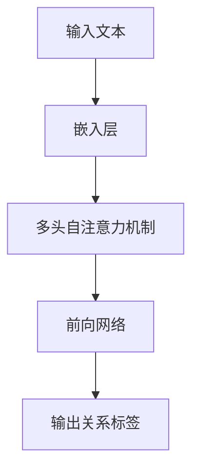
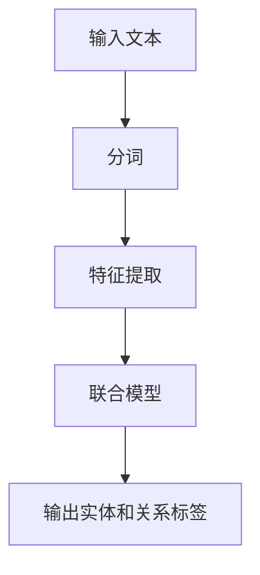
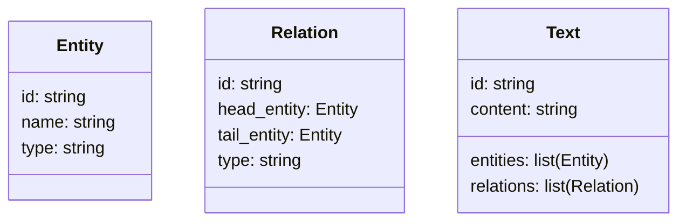
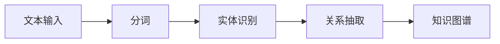
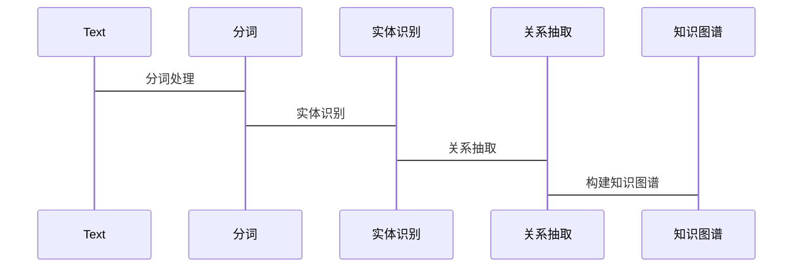

                 


```markdown
# 实体识别与关系抽取：增强AI Agent的理解深度

> 关键词：实体识别，关系抽取，自然语言处理，知识图谱，深度学习，AI Agent

> 摘要：实体识别（NER）和关系抽取（RE）是自然语言处理（NLP）中的两项核心技术，分别用于识别文本中的实体和抽取实体之间的关系。本文将详细探讨实体识别与关系抽取的原理、算法、系统设计及应用，结合实际案例，通过清晰的流程图和代码示例，帮助读者深入理解这两项技术，并掌握如何将其应用于实际项目中，以增强AI Agent的理解深度。

---

## 第一部分: 实体识别与关系抽取基础

### 第1章: 实体识别与关系抽取概述

#### 1.1 实体识别与关系抽取的背景

##### 1.1.1 问题背景
在自然语言处理任务中，理解文本的深层含义是人工智能（AI）系统的一项核心能力。实体识别（Named Entity Recognition, NER）和关系抽取（Relation Extraction, RE）是两项关键任务，分别用于识别文本中的实体和抽取实体之间的关系。通过这两项技术，AI系统能够从文本中提取结构化的信息，从而更好地理解和推理文本内容。

##### 1.1.2 问题描述
实体识别的目标是从文本中识别出命名实体，如人名、地名、组织名、时间等。关系抽取的目标是识别文本中实体之间的关系，如“X是Y的子公司”、“X与Y合作”等。这两项任务在信息抽取、问答系统、知识图谱构建等领域具有广泛的应用。

##### 1.1.3 问题解决方法
实体识别和关系抽取的主要解决方法包括基于规则的、统计的和深度学习的方法。近年来，深度学习方法，尤其是基于循环神经网络（RNN）和变换器（Transformer）的模型，已经成为主流。

##### 1.1.4 边界与外延
实体识别的边界在于如何准确地识别实体，避免漏检和误检。关系抽取的边界在于如何准确地识别实体之间的关系，并能够处理复杂的关系结构。两者的外延包括在不同领域（如医疗、法律、金融等）中的应用。

##### 1.1.5 核心要素组成
实体识别的核心要素包括分词、实体标注、特征提取和分类器设计。关系抽取的核心要素包括实体识别结果、关系模式匹配和关系分类。

#### 1.2 实体识别与关系抽取的作用

##### 1.2.1 实体识别的作用
实体识别能够帮助AI系统从文本中提取出关键实体，为后续的关系抽取和其他任务提供基础。例如，在问答系统中，实体识别可以帮助提取问题中的关键实体，从而更好地回答问题。

##### 1.2.2 关系抽取的作用
关系抽取能够帮助AI系统理解文本中实体之间的关系，从而构建知识图谱，支持推理和决策任务。例如，在金融领域，关系抽取可以帮助识别公司之间的关联关系。

##### 1.2.3 实体识别与关系抽取的结合
实体识别和关系抽取的结合可以显著增强AI系统的理解能力。通过实体识别，系统能够提取文本中的关键实体；通过关系抽取，系统能够理解这些实体之间的关系，从而构建出完整的知识图谱。

#### 1.3 实体识别与关系抽取的应用领域

##### 1.3.1 金融领域
在金融领域，实体识别可以用于识别公司名称、股票代码等实体，关系抽取可以用于识别公司之间的收购、投资关系等。

##### 1.3.2 医疗领域
在医疗领域，实体识别可以用于识别疾病名称、药物名称等实体，关系抽取可以用于识别药物之间的相互作用、疾病与药物之间的关系等。

##### 1.3.3 法律领域
在法律领域，实体识别可以用于识别案件名称、法律条款等实体，关系抽取可以用于识别法律条款之间的关联关系。

##### 1.3.4 电子商务领域
在电子商务领域，实体识别可以用于识别产品名称、品牌名称等实体，关系抽取可以用于识别产品之间的关联关系，如“产品A是产品B的升级版”。

#### 1.4 实体识别与关系抽取与其他技术的关系

##### 1.4.1 与自然语言处理的关系
实体识别和关系抽取是自然语言处理中的核心任务，它们为文本理解和信息抽取提供了基础支持。

##### 1.4.2 与知识图谱的关系
实体识别和关系抽取是构建知识图谱的重要步骤，通过这两项技术，可以将文本中的实体及其关系抽取出来，构建结构化的知识图谱。

##### 1.4.3 与机器学习的关系
实体识别和关系抽取主要依赖于机器学习技术，尤其是深度学习技术。近年来，基于深度学习的模型在这些任务上取得了显著的性能提升。

#### 1.5 本章小结
本章介绍了实体识别和关系抽取的背景、作用和应用领域，并探讨了它们与其他技术的关系。通过这些内容，读者可以初步理解实体识别和关系抽取的重要性及其在实际应用中的广泛用途。

---

## 第2章: 实体识别与关系抽取的核心概念

### 2.1 实体识别的核心概念

#### 2.1.1 实体的定义
实体是指文本中的命名实体，通常包括人名（PER）、地名（LOC）、组织名（ORG）、时间（TIME）、货币（MONEY）等。

#### 2.1.2 实体的分类
实体可以分为以下几类：
- 人名（PER）
- 地名（LOC）
- 组织名（ORG）
- 时间（TIME）
- 事件（EVENT）
- 数量（NUMBER）
- 货币（MONEY）

#### 2.1.3 实体识别的特征
- 实体识别需要准确地识别出文本中的命名实体。
- 实体识别需要考虑上下文信息，以避免误识别。
- 实体识别需要支持多种语言，包括中文、英文、法文等。

### 2.2 关系抽取的核心概念

#### 2.2.1 关系的定义
关系是指文本中两个或多个实体之间的关联，通常可以表示为“（头实体，尾实体，关系类型）”。

#### 2.2.2 关系的分类
关系可以分为以下几类：
- 实体间的关系，如“X是Y的子公司”。
- 实体与属性的关系，如“X成立于1990年”。
- 多元关系，如“X与Y和Z合作”。

#### 2.2.3 关系抽取的特征
- 关系抽取需要准确地识别出实体之间的关系。
- 关系抽取需要考虑实体识别的结果，通常在实体识别之后进行。
- 关系抽取需要支持复杂的关系结构，包括多元关系和层次化的关系。

### 2.3 实体识别与关系抽取的联系

#### 2.3.1 实体识别为关系抽取提供基础
实体识别是关系抽取的前提，只有准确识别出实体，才能进一步抽取实体之间的关系。

#### 2.3.2 关系抽取增强实体识别的效果
关系抽取可以帮助实体识别，尤其是在处理复杂文本时，通过上下文中的关系信息可以提高实体识别的准确率。

### 2.4 实体识别与关系抽取的对比

#### 2.4.1 实体识别与关系抽取的特征对比

| 特征                | 实体识别                          | 关系抽取                          |
|---------------------|----------------------------------|----------------------------------|
| 输入                | 文本段落                          | 实体识别后的结果                  |
| 输出                | 实体的标签                       | 实体之间的关系标签                |
| 难度                | 较难，需要考虑上下文             | 更难，需要考虑实体之间的关联     |
| 应用场景            | 问答系统、信息抽取                | 知识图谱构建、推理与决策          |

#### 2.4.2 实体识别与关系抽取的流程对比

##### 实体识别流程图


##### 关系抽取流程图


#### 2.4.3 实体识别与关系抽取的复杂度对比

| 复杂度维度          | 实体识别                          | 关系抽取                          |
|---------------------|----------------------------------|----------------------------------|
| 计算复杂度          | 中等，主要依赖特征提取和分类器    | 较高，需要处理实体之间的关系     |
| 数据需求            | 数据量较大，需要标注数据          | 数据量更大，需要复杂的标注数据    |
| 应用场景            | 简单场景，如问答系统               | 复杂场景，如知识图谱构建          |

### 2.5 本章小结
本章详细讲解了实体识别和关系抽取的核心概念，包括实体和关系的定义、分类以及它们的特征。通过对比分析，读者可以更好地理解两者的联系与区别。

---

## 第3章: 实体识别与关系抽取的算法原理

### 3.1 实体识别的算法原理

#### 3.1.1 基于规则的实体识别
基于规则的实体识别方法依赖于预定义的规则和模式，通常用于处理特定领域的文本。例如，在金融领域，可以预定义公司名称的模式，如“[A-Z][a-z]+”。

##### 优点
- 简单易实现，适合处理特定领域的文本。
- 对于规则设计得当的情况，准确率较高。

##### 缺点
- 需要手动设计大量规则，工作量大。
- 适用于简单场景，难以处理复杂文本。

##### 示例代码
```python
import re
text = "Apple is a company founded in 1971 by Steve Jobs."
# 提取公司名称
company_pattern = r'\b[A-Z][a-z]+'
companies = re.findall(company_pattern, text)
print(companies)  # 输出：['Apple']
```

#### 3.1.2 基于统计的实体识别
基于统计的实体识别方法依赖于统计模型，如条件随机场（Conditional Random Field, CRF）。

##### CRF算法流程图


##### 示例代码
```python
from sklearn_crfsuite import CRF
from sklearn.feature_extraction.text import TfidfVectorizer

# 假设我们有训练数据 X 和标签 y
# X 是文本列表，y 是对应的实体标签
# 使用 TF-IDF 特征
vectorizer = TfidfVectorizer()
X = vectorizer.fit_transform(X)
crf = CRF()
crf.fit(X, y)
```

##### 数学公式
条件随机场的目标函数可以表示为：
$$
P(y|x) = \frac{1}{Z} \exp\left(\sum_{i=1}^{n} w_i x_i y_i\right)
$$
其中，\( Z \) 是归一化因子。

#### 3.1.3 基于深度学习的实体识别
基于深度学习的实体识别方法主要使用循环神经网络（RNN）和变换器（Transformer）模型。

##### LSTM模型流程图


##### 示例代码
```python
import tensorflow as tf
from tensorflow.keras import layers

model = tf.keras.Sequential([
    layers.Embedding(input_dim=10000, output_dim=128),
    layers.Bidirectional(layers.LSTM(64, return_sequences=True)),
    layers.TimeDistributed(layers.Dense(4, activation='softmax'))
])
```

##### 数学公式
LSTM的遗忘门计算公式为：
$$
f_t = \sigma(W_f a_t + U_f h_{t-1} + b_f)
$$

### 3.2 关系抽取的算法原理

#### 3.2.1 基于规则的关系抽取
基于规则的关系抽取方法依赖于预定义的关系模式，通常用于处理特定领域的文本。

##### 示例代码
```python
import re
text = "Apple is a company founded in 1971 by Steve Jobs."
# 提取关系 "founded by"
pattern = r'\b(\w+) (is|was) (\w+) founded by (\w+)\b'
matches = re.findall(pattern, text)
print(matches)  # 输出：[('Apple', 'founded', '1971', 'Steve Jobs')]
```

#### 3.2.2 基于统计的关系抽取
基于统计的关系抽取方法依赖于统计模型，如最大熵模型（Maximum Entropy Model）。

##### 示例代码
```python
from sklearn.feature_extraction.text import TfidfVectorizer
from sklearn.linear_model import LogisticRegression

# 假设我们有训练数据 X 和标签 y
# X 是文本列表，y 是对应的关系标签
vectorizer = TfidfVectorizer()
X = vectorizer.fit_transform(X)
lr = LogisticRegression()
lr.fit(X, y)
```

##### 数学公式
最大熵模型的目标函数可以表示为：
$$
P(y|x) = \frac{\exp(\sum_{i=1}^{n} w_i x_i)}{\sum_{y} \exp(\sum_{i=1}^{n} w_i x_i)}
$$

#### 3.2.3 基于深度学习的关系抽取
基于深度学习的关系抽取方法主要使用循环神经网络（RNN）和变换器（Transformer）模型。

##### Transformer模型流程图


##### 示例代码
```python
import tensorflow as tf
from tensorflow.keras import layers

model = tf.keras.Sequential([
    layers.Embedding(input_dim=10000, output_dim=128),
    layers.MultiHeadAttention(heads=8, key_dim=16),
    layers.GlobalMaxPooling1D(),
    layers.Dense(4, activation='softmax')
])
```

##### 数学公式
自注意力机制的计算公式为：
$$
\text{Attention}(Q, K, V) = \text{softmax}\left(\frac{QK^T}{\sqrt{d_k}}\right)V
$$

### 3.3 实体识别与关系抽取的联合学习

#### 3.3.1 联合学习的定义
联合学习是指同时进行实体识别和关系抽取，利用两者之间的关联性来提升整体性能。

#### 3.3.2 联合学习的算法流程


#### 3.3.3 联合学习的优势
- 提高了实体识别的准确率，因为关系信息可以为实体识别提供上下文信息。
- 提高了关系抽取的准确率，因为实体识别结果可以直接用于关系抽取。

### 3.4 本章小结
本章详细讲解了实体识别和关系抽取的算法原理，包括基于规则、统计和深度学习的方法。通过对比分析，读者可以更好地理解不同方法的优缺点，并选择合适的算法进行实际应用。

---

## 第4章: 实体识别与关系抽取的系统分析与架构设计

### 4.1 系统分析

#### 4.1.1 项目介绍
本项目旨在开发一个基于实体识别和关系抽取的智能系统，能够从文本中提取实体及其关系，构建知识图谱，并支持基于知识图谱的推理与决策。

#### 4.1.2 系统功能需求
- 实体识别功能：支持多种语言，支持复杂文本。
- 关系抽取功能：支持多元关系，支持层次化关系。
- 知识图谱构建：支持可视化展示，支持数据导出。
- 推理与决策：支持基于知识图谱的推理，支持决策支持。

#### 4.1.3 领域模型设计


### 4.2 系统架构设计

#### 4.2.1 系统架构图


#### 4.2.2 接口设计
- 输入接口：接受文本内容，支持多种格式（如文本文件、数据库）。
- 输出接口：输出实体和关系结果，支持多种格式（如JSON、XML）。
- 接口规范：定义了输入和输出的格式，确保系统的可扩展性和可维护性。

#### 4.2.3 交互设计


### 4.3 本章小结
本章详细分析了实体识别和关系抽取系统的功能需求和架构设计，通过领域模型和架构图的展示，读者可以清晰地理解系统的整体结构和各部分之间的关系。

---

## 第5章: 实体识别与关系抽取的项目实战

### 5.1 环境搭建

#### 5.1.1 安装Python环境
- 安装Python 3.8及以上版本。
- 安装Jupyter Notebook或其他IDE。

#### 5.1.2 安装依赖库
- 使用pip安装以下库：
  - `tensorflow`
  - `scikit-learn`
  - `numpy`
  - `scipy`

#### 5.1.3 配置开发环境
- 配置Jupyter Notebook，确保所有依赖库已安装。
- 下载或创建训练数据集，包括文本、实体标签和关系标签。

### 5.2 系统核心实现

#### 5.2.1 实体识别实现

##### 实体识别代码实现
```python
import tensorflow as tf
from tensorflow.keras import layers

# 定义模型
model = tf.keras.Sequential([
    layers.Embedding(input_dim=10000, output_dim=128),
    layers.Bidirectional(layers.LSTM(64, return_sequences=True)),
    layers.TimeDistributed(layers.Dense(4, activation='softmax'))
])

# 编译模型
model.compile(optimizer='adam', loss='sparse_categorical_crossentropy', metrics=['accuracy'])

# 训练模型
model.fit(X_train, y_train, epochs=10, batch_size=32)
```

##### 代码解读
- 使用嵌入层将文本转换为向量表示。
- 使用双向LSTM提取文本的上下文信息。
- 使用时间分布的全连接层输出实体标签。

#### 5.2.2 关系抽取实现

##### 关系抽取代码实现
```python
import tensorflow as tf
from tensorflow.keras import layers

# 定义模型
model = tf.keras.Sequential([
    layers.Embedding(input_dim=10000, output_dim=128),
    layers.MultiHeadAttention(heads=8, key_dim=16),
    layers.GlobalMaxPooling1D(),
    layers.Dense(4, activation='softmax')
])

# 编译模型
model.compile(optimizer='adam', loss='sparse_categorical_crossentropy', metrics=['accuracy'])

# 训练模型
model.fit(X_train, y_train, epochs=10, batch_size=32)
```

##### 代码解读
- 使用嵌入层将文本转换为向量表示。
- 使用多头自注意力机制提取文本的语义信息。
- 使用全局最大池化层提取句子的特征。
- 使用全连接层输出关系标签。

#### 5.2.3 知识图谱构建

##### 知识图谱构建代码实现
```python
from networkx import DiGraph
import matplotlib.pyplot as plt

# 创建图
graph = DiGraph()

# 添加节点
graph.add_nodes_from(entities)

# 添加边
for relation in relations:
    graph.add_edge(relation.head_entity, relation.tail_entity, label=relation.type)

# 可视化图
plt.figure(figsize=(10, 10))
pos = nx.spring_layout(graph)
nx.draw(graph, pos, labels=nx.get_node_attributes(graph, 'name'), edge_labels='label', arrows=True)
plt.show()
```

##### 代码解读
- 使用NetworkX库构建知识图谱。
- 添加节点和边，边带有标签表示关系类型。
- 可视化图谱，展示实体及其关系。

### 5.3 项目总结

#### 5.3.1 实体识别与关系抽取的应用
- 实体识别可以用于信息抽取、问答系统等任务。
- 关系抽取可以用于知识图谱构建、推理与决策等任务。

#### 5.3.2 项目小结
通过本项目的实战，读者可以掌握实体识别和关系抽取的具体实现方法，并能够将其应用于实际项目中。

---

## 第6章: 实体识别与关系抽取的高级应用与优化

### 6.1 实体识别与关系抽取的高级应用

#### 6.1.1 基于预训练模型的应用
- 使用BERT、GPT等预训练模型进行实体识别和关系抽取。
- 预训练模型能够捕捉文本的上下文信息，提高识别和抽取的准确率。

##### 示例代码
```python
from transformers import BertTokenizer, BertForTokenClassification

# 初始化tokenizer和模型
tokenizer = BertTokenizer.from_pretrained('bert-base-uncased')
model = BertForTokenClassification.from_pretrained('bert-base-uncased')

# 定义输入
input_text = "Apple is a company founded in 1971 by Steve Jobs."

# 分词
inputs = tokenizer(input_text, return_tensors='np', padding=True, truncation=True)

# 预测
outputs = model(**inputs)
predicted_labels = outputs.logits.argmax(axis=1).numpy()

# 解析标签
label_map = {0: 'O', 1: 'PER', 2: 'LOC', 3: 'ORG', 4: 'MONEY'}
entities = []
for i in range(len(predicted_labels[0])):
    label = label_map[predicted_labels[0][i]]
    entities.append(label)

print(entities)  # 输出：['O', 'ORG', 'O', 'O', 'O', 'MONEY', 'O', 'PER']
```

#### 6.1.2 多模态数据的应用
- 结合图像、语音等多模态数据，进行跨模态的实体识别和关系抽取。
- 多模态数据能够提供更多的上下文信息，提高识别和抽取的准确率。

### 6.2 实体识别与关系抽取的优化策略

#### 6.2.1 数据增强
- 使用数据增强技术，如同义词替换、句式变换等，提高训练数据的多样性。
- 数据增强可以有效缓解数据不足的问题，提高模型的泛化能力。

#### 6.2.2 模型优化
- 使用更复杂的模型结构，如更深的网络、更大的参数空间等，提高模型的表达能力。
- 模型优化可以通过调整超参数、使用早停法等方法实现。

#### 6.2.3 算法优化
- 使用更高效的算法，如并行计算、分布式训练等，提高训练效率。
- 算法优化可以通过优化代码、使用更高效的库等方法实现。

### 6.3 本章小结
本章介绍了实体识别和关系抽取的高级应用与优化策略，包括基于预训练模型的应用和多模态数据的应用，以及数据增强、模型优化和算法优化等策略。通过这些内容，读者可以进一步提升实体识别和关系抽取的性能和应用范围。

---

## 第7章: 实体识别与关系抽取的最佳实践与总结

### 7.1 最佳实践

#### 7.1.1 数据处理
- 数据清洗：去除噪声数据，确保数据质量。
- 数据标注：使用标注工具（如Brat、Prodigy）进行人工标注，确保标注的准确性和一致性。
- 数据分割：将数据集划分为训练集、验证集和测试集，确保模型的泛化能力。

#### 7.1.2 模型选择
- 根据任务需求选择合适的模型，如对于小数据集，选择基于规则的方法；对于大数据集，选择深度学习模型。
- 选择合适的模型参数，如嵌入维度、网络层数等，通过实验验证模型性能。

#### 7.1.3 系统设计
- 设计合理的系统架构，确保系统的可扩展性和可维护性。
- 使用模块化设计，将实体识别和关系抽取模块独立设计，方便后续优化和维护。

### 7.2 小结

#### 7.2.1 核心技术总结
- 实体识别和关系抽取是自然语言处理中的核心技术，能够帮助AI系统从文本中提取结构化的信息。
- 深度学习模型在这些任务上表现优异，尤其是基于Transformer的模型。

#### 7.2.2 技术趋势
- 预训练模型的应用越来越广泛，未来可能会有更多的研究基于这些模型进行。
- 多模态数据的应用将成为趋势，能够提供更多的信息，提高识别和抽取的准确率。

#### 7.2.3 注意事项
- 数据标注需要仔细，确保标注的准确性和一致性。
- 模型选择需要根据任务需求和数据规模进行，避免盲目追求复杂模型。
- 系统设计需要考虑可扩展性和可维护性，方便后续优化和维护。

### 7.3 拓展阅读

#### 7.3.1 推荐书籍
- 《自然语言处理入门》
- 《深度学习实战》
- 《知识图谱构建与应用》

#### 7.3.2 推荐论文
- "BERT: Pre-training of Deep Bidirectional Transformers for NLP"
- "Entity Linking: Leveraging Knowledge Bases in NLP"
- "Knowledge Graphs for Question Answering"

### 7.4 本章小结
本章总结了实体识别和关系抽取的最佳实践，包括数据处理、模型选择和系统设计等方面，并展望了未来的技术趋势。通过这些内容，读者可以更好地应用这些技术，并在实际项目中取得更好的效果。

---

## 作者：AI天才研究院/AI Genius Institute & 禅与计算机程序设计艺术 /Zen And The Art of Computer Programming
```

