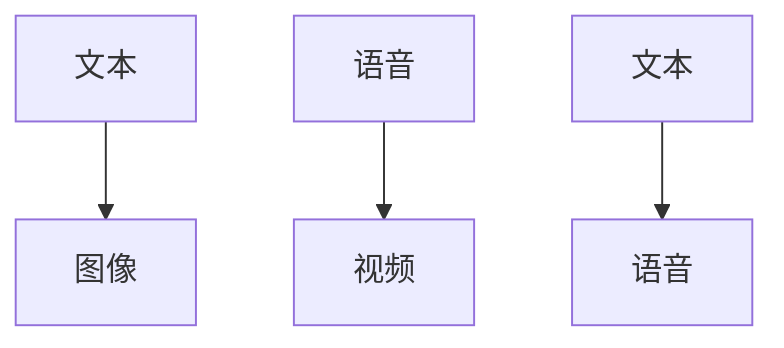
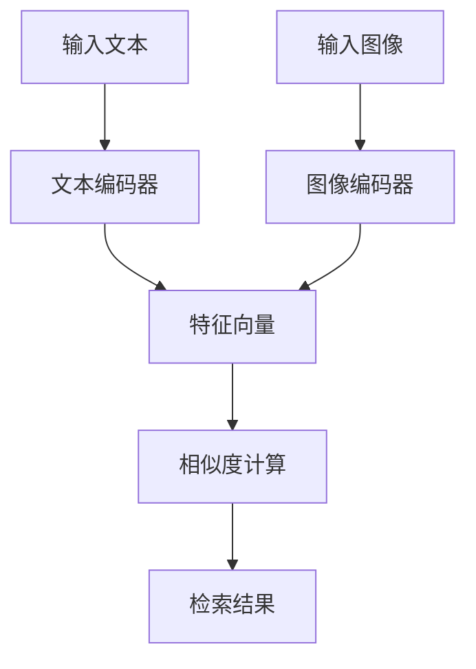
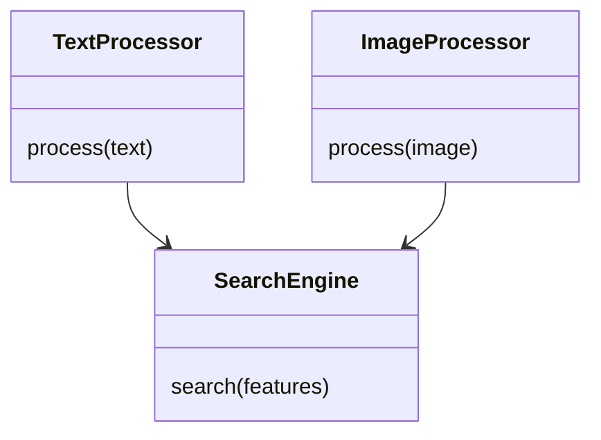
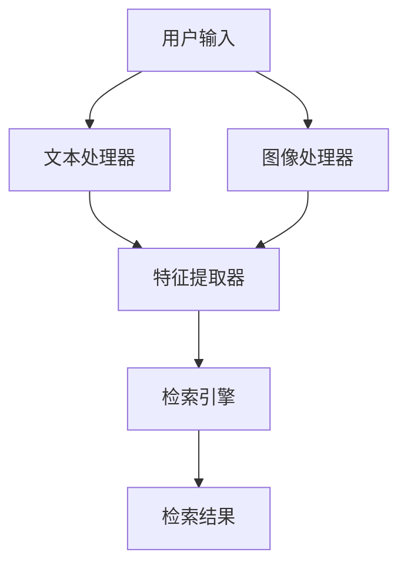

                 


# 实现AI Agent的跨模态检索能力

## 关键词：跨模态检索、AI Agent、深度学习、多模态数据、相似度计算、系统架构

## 摘要：  
跨模态检索是实现AI Agent智能化的重要技术之一，通过整合不同数据模态（如文本、图像、语音、视频等）的信息，AI Agent能够更全面地理解和处理复杂任务。本文将从跨模态检索的基本概念出发，深入分析其核心原理，结合主流算法和系统架构设计，最后通过实际项目实战，全面展示如何实现AI Agent的跨模态检索能力。本文适合AI开发人员、研究人员以及对跨模态检索技术感兴趣的读者阅读。

---

# 第1章 跨模态检索与AI Agent概述

## 1.1 跨模态检索的基本概念

### 1.1.1 跨模态检索的定义  
跨模态检索是指在多个数据模态之间进行信息检索的过程。例如，在给定一段文本的情况下，检索与之相关的图像或视频；或者在给定一张图像的情况下，检索相关的文本描述。跨模态检索的核心在于不同数据模态之间的信息关联与匹配。

### 1.1.2 跨模态检索的核心要素  
- **数据模态**：包括文本、图像、语音、视频等。  
- **特征提取**：将不同模态的数据转化为共同的特征空间，以便进行相似度计算。  
- **相似度计算**：衡量不同模态数据之间的关联程度。  
- **检索算法**：基于相似度计算的结果，实现高效的信息检索。  

### 1.1.3 跨模态检索的应用场景  
- **搜索引擎**：结合文本和图像搜索结果。  
- **智能客服**：通过文本和语音进行用户意图识别。  
- **推荐系统**：基于用户行为（如点击、收藏）推荐相关内容。  

## 1.2 AI Agent的基本概念

### 1.2.1 AI Agent的定义  
AI Agent是一种智能代理系统，能够感知环境、理解用户需求，并通过自主决策和行动来满足用户需求。AI Agent可以是软件程序，也可以是物理机器人。

### 1.2.2 AI Agent的核心能力  
- **感知能力**：通过传感器或数据接口获取环境信息。  
- **推理能力**：基于获取的信息进行逻辑推理和决策。  
- **交互能力**：通过自然语言处理（NLP）或语音识别与用户进行交互。  

### 1.2.3 AI Agent与跨模态检索的关系  
跨模态检索是AI Agent实现复杂任务的核心技术之一。通过跨模态检索，AI Agent能够整合多种数据模态的信息，从而更准确地理解用户需求并提供更智能的服务。

## 1.3 跨模态检索在AI Agent中的作用

### 1.3.1 跨模态检索对AI Agent能力的提升  
- **信息整合**：跨模态检索能够将文本、图像等多种数据源的信息整合到一起，提供更全面的结果。  
- **语义理解**：通过跨模态检索，AI Agent能够更好地理解用户的意图。  
- **决策优化**：基于多模态信息的检索结果，AI Agent可以做出更优化的决策。  

### 1.3.2 跨模态检索在AI Agent中的应用场景  
- **智能助手**：例如Siri、Alexa等，通过跨模态检索提供更精准的服务。  
- **智能监控**：通过视频和语音检索异常事件。  
- **医疗健康**：结合医学图像和病历文本，辅助医生进行诊断。  

### 1.3.3 跨模态检索对AI Agent未来发展的影响  
跨模态检索技术的进步将推动AI Agent向更智能化、更人性化的方向发展，使其能够更好地理解和满足用户需求。

## 1.4 本章小结  
本章介绍了跨模态检索的基本概念、核心要素及其在AI Agent中的作用，并通过实际应用场景展示了跨模态检索技术的重要性。

---

# 第2章 跨模态检索的核心原理

## 2.1 跨模态检索的原理

### 2.1.1 跨模态数据的表示方法  
跨模态数据表示的核心在于将不同模态的数据映射到一个共同的特征空间。常用的方法包括：  
- **模态独立表示**：分别对每个模态进行特征提取，再通过相似度计算进行关联。  
- **模态共享表示**：通过共享参数或嵌入空间，实现跨模态数据的联合表示。  

### 2.1.2 跨模态检索的匹配策略  
- **基于相似度的匹配**：通过计算不同模态数据之间的相似度，选择最相关的检索结果。  
- **基于概率的匹配**：利用概率模型计算不同模态数据的匹配概率。  

### 2.1.3 跨模态检索的评价指标  
- **准确率（Accuracy）**：检索结果与实际相关结果的匹配程度。  
- **召回率（Recall）**：检索结果中相关结果的比例。  
- **F1分数**：综合准确率和召回率的调和平均值。  

## 2.2 跨模态检索的核心概念联系

### 2.2.1 跨模态数据的特征提取  
特征提取是跨模态检索的关键步骤。例如：  
- **文本模态**：使用词袋模型或词嵌入（如Word2Vec、BERT）提取文本特征。  
- **图像模态**：使用卷积神经网络（CNN）提取图像特征。  

### 2.2.2 跨模态检索的相似度计算  
- **余弦相似度**：衡量两个向量在方向上的相似程度。公式为：  
  $$ \text{cos}(\theta) = \frac{\mathbf{a} \cdot \mathbf{b}}{\|\mathbf{a}\| \|\mathbf{b}\|} $$  
- **欧氏距离**：衡量两个向量在空间中的距离。公式为：  
  $$ \text{distance} = \sqrt{(a_1 - b_1)^2 + (a_2 - b_2)^2} $$  

### 2.2.3 跨模态检索的优化方法  
- **对比学习**：通过最大化正样本的相似度和最小化负样本的相似度来优化检索性能。  
- **多任务学习**：结合多个任务（如分类、检索）进行联合优化。  

## 2.3 跨模态检索的ER实体关系图  


## 2.4 本章小结  
本章从跨模态数据的表示方法、相似度计算到优化方法进行了详细讲解，并通过ER实体关系图展示了跨模态数据之间的关联关系。

---

# 第3章 跨模态检索算法原理

## 3.1 跨模态检索的主流算法

### 3.1.1 多模态编码器  
多模态编码器是一种将多种数据模态映射到共同特征空间的模型。例如：  
- **Dual-Encoder Model**：分别对文本和图像进行编码，再通过相似度计算进行检索。  
- **Multi-Modal Transformer**：结合文本和图像的特征，通过自注意力机制进行联合编码。  

### 3.1.2 对比学习  
对比学习是一种通过最大化正样本相似度和最小化负样本相似度来优化模型性能的方法。公式为：  
$$ \text{损失} = \log(\frac{1}{1 + e^{-\text{sim}(x,y)}}) $$  

### 3.1.3 多任务学习  
多任务学习是一种通过同时学习多个任务来提升模型性能的方法。例如，同时学习文本分类和图像检索任务。  

## 3.2 跨模态检索算法的流程图  


## 3.3 跨模态检索算法的Python实现

### 3.3.1 数据预处理
```python
import numpy as np

# 文本数据处理
def text_preprocess(text):
    return text.lower().split()

# 图像数据处理
def image_preprocess(image):
    return image.reshape(-1) / 255.0
```

### 3.3.2 模型训练
```python
import torch
import torch.nn as nn

class MultiModalEncoder(nn.Module):
    def __init__(self, input_dim, hidden_dim):
        super().__init__()
        self.encoder = nn.Linear(input_dim, hidden_dim)
    
    def forward(self, x):
        return torch.relu(self.encoder(x))

# 训练函数
def train(model, optimizer, criterion, text_data, image_data):
    optimizer.zero_grad()
    text_features = model(text_data)
    image_features = model(image_data)
    loss = criterion(text_features, image_features)
    loss.backward()
    optimizer.step()
    return loss.item()
```

### 3.3.3 相似度计算
```python
def compute_similarity(text_encoder, image_encoder, text_vec, image_vec):
    text_emb = text_encoder(text_vec)
    image_emb = image_encoder(image_vec)
    similarity = np.dot(text_emb, image_emb)
    return similarity
```

## 3.4 本章小结  
本章详细介绍了跨模态检索的主流算法，包括多模态编码器、对比学习和多任务学习，并通过Python代码展示了算法的实现过程。

---

# 第4章 跨模态检索的系统架构设计

## 4.1 问题场景介绍  
假设我们正在开发一个智能问答系统，用户可以通过输入文本或图像进行检索，系统需要整合多种数据模态的信息来提供更精准的答案。

## 4.2 系统功能设计  


## 4.3 系统架构设计  


## 4.4 接口设计  
- **文本处理器接口**：`process(text: str) -> feature_vector`  
- **图像处理器接口**：`process(image: np.array) -> feature_vector`  
- **检索引擎接口**：`search(query: feature_vector) -> list[results]`  

## 4.5 本章小结  
本章通过系统功能设计和架构设计，展示了如何将跨模态检索技术应用到实际系统中。

---

# 第5章 项目实战：实现一个简单的跨模态检索系统

## 5.1 环境安装  
```bash
pip install numpy torch matplotlib
```

## 5.2 核心代码实现

### 5.2.1 数据加载
```python
import torch
import numpy as np

# 加载文本数据
text_data = ["This is a text example.", "Another text example."]
# 加载图像数据
image_data = np.random.rand(2, 3, 64, 64)
```

### 5.2.2 模型训练
```python
class MultiModalModel(nn.Module):
    def __init__(self, text_dim, image_dim, hidden_dim):
        super().__init__()
        self.text_encoder = nn.Linear(text_dim, hidden_dim)
        self.image_encoder = nn.Linear(image_dim, hidden_dim)
    
    def forward(self, text_input, image_input):
        text_features = torch.relu(self.text_encoder(text_input))
        image_features = torch.relu(self.image_encoder(image_input))
        return text_features, image_features

model = MultiModalModel(100, 4096, 512)
criterion = nn.MSELoss()
optimizer = torch.optim.Adam(model.parameters(), lr=0.001)

# 训练
text_input = torch.randn(2, 100)
image_input = torch.randn(2, 4096)
loss = train(model, optimizer, criterion, text_input, image_input)
print(f"Training Loss: {loss}")
```

### 5.2.3 相似度计算与检索
```python
text_vec = text_input[0].numpy()
image_vec = image_input[0].numpy()
similarity = compute_similarity(model.text_encoder, model.image_encoder, text_vec, image_vec)
print(f"Similarity: {similarity}")
```

## 5.3 项目小结  
本章通过实际项目实战，展示了如何从数据加载、模型训练到相似度计算与检索实现跨模态检索系统。

---

# 第6章 总结与展望

## 6.1 本章总结  
本文从跨模态检索的基本概念出发，详细讲解了其核心原理、算法实现和系统架构设计，并通过实际项目展示了如何实现跨模态检索能力。

## 6.2 最佳实践 tips  
- 在实际应用中，建议结合具体业务需求选择合适的算法和模型。  
- 数据预处理和特征提取是跨模态检索的关键步骤，需要仔细设计和优化。  

## 6.3 注意事项  
- 数据隐私和安全问题需要高度重视。  
- 模型的泛化能力需要通过大量数据进行验证和优化。  

## 6.4 拓展阅读  
- 《Deep Learning for Multimodal Data Analysis》  
- 《Cross-Modal Retrieval with Deep Learning》  

## 6.5 本章小结  
本章总结了全文内容，并给出了实际应用中的建议和注意事项。

---

# 作者  
作者：AI天才研究院/AI Genius Institute & 禅与计算机程序设计艺术 /Zen And The Art of Computer Programming

---

**本文由AI天才研究院的AI专家团队倾力打造，旨在为读者提供跨模态检索领域的深度技术解析和实践指导。**

