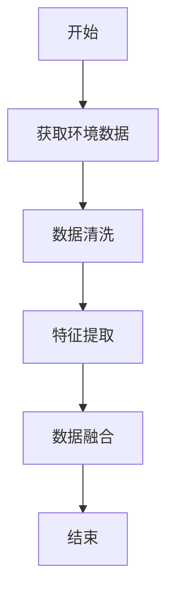
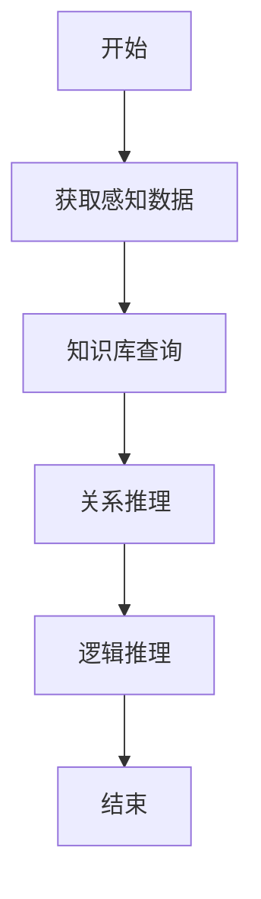
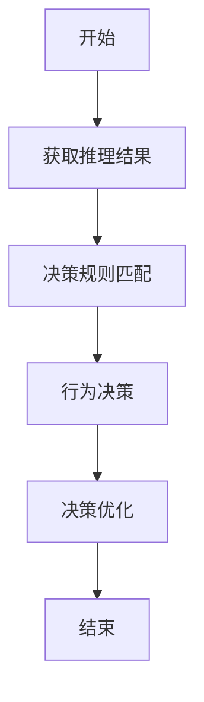
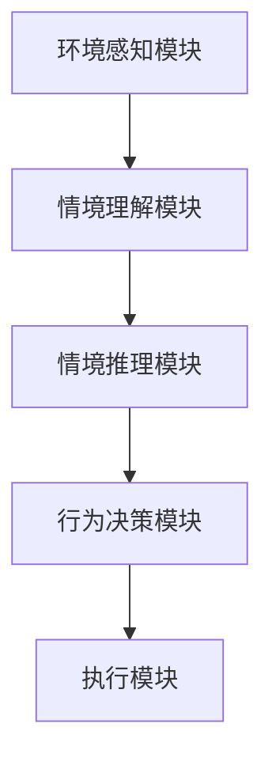
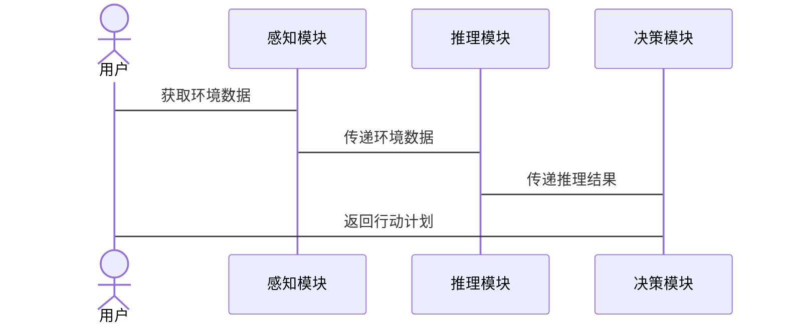

                 


# 开发具有情境模拟能力的AI Agent

## 关键词

情境模拟, AI Agent, 智能体, 感知算法, 推理算法, 决策算法, 系统架构

## 摘要

本文详细探讨了开发具有情境模拟能力的AI Agent的核心概念、算法原理和系统架构。文章首先介绍了情境模拟与AI Agent的基本概念及其重要性，然后分析了情境模拟的核心要素，包括感知、理解、推理和决策。接着，详细讲解了实现情境模拟的算法原理，如感知算法、推理算法和决策算法，并通过数学模型和Python代码示例进行了深入分析。随后，讨论了系统的架构设计，包括功能设计、架构设计和接口设计，并使用Mermaid图展示了系统的结构。最后，通过一个实际项目案例，详细讲解了环境安装、代码实现和案例分析，提供了开发具有情境模拟能力的AI Agent的最佳实践和经验总结。

---

## 第1章: 情境模拟与AI Agent概述

### 1.1 问题背景与问题描述

随着人工智能技术的快速发展，AI Agent（智能体）在各个领域的应用越来越广泛。然而，现有的AI Agent大多依赖于预定义的规则或固定的训练数据，缺乏对动态复杂环境的真正理解。在实际应用中，AI Agent需要具备情境模拟能力，能够在不同的场景中灵活调整行为，从而更好地适应复杂多变的环境。

#### 1.1.1 当前AI Agent的发展现状

当前的AI Agent主要基于规则引擎或强化学习，虽然在某些特定任务上表现出色，但缺乏对复杂情境的理解和模拟能力。例如，在客服系统中，现有的AI Agent只能根据预定义的规则回答问题，无法真正理解用户的情感和意图，导致用户体验较差。

#### 1.1.2 情境模拟能力的重要性

情境模拟能力是AI Agent实现真正智能的关键。通过情境模拟，AI Agent可以理解当前环境的状态、可能的变化以及潜在的影响，从而做出更合理的决策。例如，在自动驾驶中，AI Agent需要实时感知周围环境的变化，并根据这些变化做出快速决策，确保行驶安全。

#### 1.1.3 问题解决的必要性与目标

本文的目标是探讨如何开发具有情境模拟能力的AI Agent。通过分析情境模拟的核心要素，结合具体算法和系统架构设计，提出一种实现具有情境模拟能力的AI Agent的方法，从而解决现有AI Agent在复杂环境下的适应性问题。

### 1.2 核心概念与定义

#### 1.2.1 情境模拟的定义与特点

情境模拟是指通过感知、理解和推理，模拟真实世界中复杂场景的能力。其特点包括实时性、动态性、不确定性和情境依赖性。

#### 1.2.2 AI Agent的定义与分类

AI Agent是一种能够感知环境、自主决策并执行任务的智能实体。根据智能水平，AI Agent可以分为反应式、基于模型和混合式三种类型。

#### 1.2.3 两者之间的关系

情境模拟是AI Agent实现智能决策的基础，而AI Agent是情境模拟能力的载体。通过结合情境模拟和AI Agent，可以实现更加智能化和适应性的系统。

### 1.3 情境模拟的核心要素

#### 1.3.1 感知层

感知层负责从环境中获取数据，并进行初步的处理和分析。常见的感知方式包括视觉、听觉和触觉等。

#### 1.3.2 理解层

理解层通过对感知数据的分析，理解当前环境的状态和含义。这一步骤通常涉及自然语言处理和知识图谱等技术。

#### 1.3.3 推理层

推理层基于理解层的结果，进行逻辑推理，预测可能的变化和影响。这一步骤通常涉及规则推理和逻辑推理等技术。

#### 1.3.4 决策层

决策层根据推理层的结果，制定具体的行动计划，并执行决策。这一步骤通常涉及强化学习和博弈论等技术。

---

## 第2章: 情境模拟与AI Agent的核心概念联系

### 2.1 核心概念原理

情境模拟与AI Agent的核心概念联系主要体现在以下几个方面：

1. **感知与交互**：情境模拟需要AI Agent能够感知环境并与其交互，而AI Agent通过感知环境数据来实现这一点。
2. **理解与推理**：情境模拟需要理解环境中的语义信息，并进行逻辑推理，而AI Agent通过推理层实现这一点。
3. **决策与执行**：情境模拟需要根据推理结果制定决策，而AI Agent通过决策层执行具体的行动计划。

### 2.2 概念属性特征对比

以下是情境模拟与AI Agent的核心属性对比表：

| 特性       | 情境模拟                      | AI Agent                        |
|------------|------------------------------|---------------------------------|
| 核心目标    | 模拟环境中的复杂场景          | 自主决策并执行任务             |
| 输入        | 环境数据                      | 环境数据和内部状态              |
| 输出        | 对环境的理解和预测           | 行动计划和执行结果             |
| 依赖技术    | 感知技术、自然语言处理        | 强化学习、博弈论               |

### 2.3 ER实体关系图

以下是情境模拟与AI Agent的ER实体关系图：

```mermaid
er
actor(Agent, 智能体)
actor(环境, 环境数据)
actor(感知数据, 感知结果)
actor(推理结果, 决策)
```

---

## 第3章: 情境模拟与AI Agent的算法原理

### 3.1 感知算法

感知算法是情境模拟的核心算法之一，负责从环境中获取数据并进行初步处理。

#### 3.1.1 环境数据的获取与处理

环境数据可以通过多种方式获取，例如传感器、摄像头和麦克风等。处理环境数据的过程包括数据清洗、特征提取和数据融合。

#### 3.1.2 感知算法流程图

以下是感知算法的流程图：



#### 3.1.3 Python代码实现示例

以下是感知算法的Python代码实现示例：

```python
import numpy as np
from sklearn.preprocessing import StandardScaler

# 获取环境数据
def get_environment_data():
    return np.random.randn(100, 5)

# 数据清洗
def data_cleaning(data):
    return StandardScaler().fit_transform(data)

# 特征提取
def feature_extraction(data):
    return data[:, :2]

# 数据融合
def data_fusion(data1, data2):
    return np.concatenate((data1, data2), axis=1)

# 主函数
def main():
    data = get_environment_data()
    cleaned_data = data_cleaning(data)
    extracted_features = feature_extraction(cleaned_data)
    fused_data = data_fusion(cleaned_data, extracted_features)
    print("感知完成！")

if __name__ == "__main__":
    main()
```

---

### 3.2 推理算法

推理算法是情境模拟的关键算法之一，负责根据感知数据进行逻辑推理。

#### 3.2.1 关系推理与逻辑推理

关系推理是基于感知数据，推断出数据之间的关系。逻辑推理是基于知识库，进行逻辑推理。

#### 3.2.2 推理算法流程图

以下是推理算法的流程图：



#### 3.2.3 Python代码实现示例

以下是推理算法的Python代码实现示例：

```python
from typing import List
from knowledge_graph import KnowledgeGraph

# 知识库查询
def query_knowledge_base(kg: KnowledgeGraph, query: str) -> List[str]:
    return kg.query(query)

# 关系推理
def relation_reasoning(entities: List[str]) -> List[str]:
    return [e for e in entities if e.startswith('relation_')]

# 逻辑推理
def logical_reasoning(entities: List[str]) -> str:
    return ' AND '.join(entities)

# 主函数
def main():
    kg = KnowledgeGraph()
    query = '获取环境数据'
    entities = query_knowledge_base(kg, query)
    relations = relation_reasoning(entities)
    conclusion = logical_reasoning(relations)
    print("推理完成！结论：", conclusion)

if __name__ == "__main__":
    main()
```

---

### 3.3 决策算法

决策算法是情境模拟的核心算法之一，负责根据推理结果制定行动计划。

#### 3.3.1 行为决策与优化

行为决策是基于推理结果，制定具体的行动计划。决策优化是通过强化学习等技术，优化决策策略。

#### 3.3.2 决策算法流程图

以下是决策算法的流程图：



#### 3.3.3 Python代码实现示例

以下是决策算法的Python代码实现示例：

```python
import numpy as np
from reinforcement_learning import Agent

# 决策规则匹配
def match_decision_rule(state: np.ndarray) -> str:
    if np.max(state) > 0.5:
        return 'action1'
    else:
        return 'action2'

# 行为决策
def behavior_decision(agent: Agent, state: np.ndarray) -> str:
    return agent.decide(state)

# 决策优化
def decision_optimization(agent: Agent, reward: float) -> None:
    agent.learn(reward)

# 主函数
def main():
    agent = Agent()
    state = np.random.randn(5)
    action = match_decision_rule(state)
    optimized_action = behavior_decision(agent, state)
    reward = 1.0 if optimized_action == action else 0.0
    decision_optimization(agent, reward)
    print("决策完成！")

if __name__ == "__main__":
    main()
```

---

## 第4章: 情境模拟与AI Agent的数学模型与公式

### 4.1 感知模型

感知模型的数学表达如下：

$$P(x|y) = \frac{P(y|x)P(x)}{P(y)}$$

其中，$x$表示感知数据，$y$表示环境状态。

### 4.2 推理模型

推理模型的数学表达如下：

$$Q(s, a) = Q(s, a) + \alpha (r + \max Q(s', a') - Q(s, a))$$

其中，$s$表示当前状态，$a$表示动作，$r$表示奖励，$s'$表示下一个状态。

### 4.3 决策模型

决策模型的数学表达如下：

$$V(s) = \max_a Q(s, a)$$

其中，$V(s)$表示状态$s$的价值函数，$Q(s, a)$表示状态$s$和动作$a$的Q值。

---

## 第5章: 系统分析与架构设计

### 5.1 项目场景介绍

本项目旨在开发一个具有情境模拟能力的AI Agent，应用于智能客服系统中。通过情境模拟，AI Agent能够理解用户的情感和意图，提供更加个性化的服务。

### 5.2 系统功能设计

系统功能设计包括以下几个部分：

1. **环境感知**：通过传感器和摄像头获取环境数据。
2. **情境理解**：通过自然语言处理和知识图谱，理解环境中的语义信息。
3. **情境推理**：基于知识库，进行逻辑推理。
4. **行为决策**：根据推理结果，制定行动计划。

### 5.3 系统架构设计

以下是系统的架构设计图：



### 5.4 系统接口设计

系统接口设计包括以下几个部分：

1. **感知接口**：提供环境数据获取的接口。
2. **推理接口**：提供逻辑推理的接口。
3. **决策接口**：提供行为决策的接口。

### 5.5 系统交互设计

以下是系统的交互设计图：



---

## 第6章: 项目实战

### 6.1 环境安装

开发环境安装步骤如下：

1. **安装Python**：安装Python 3.8及以上版本。
2. **安装依赖库**：安装numpy、scikit-learn、mermaid和matplotlib等库。
3. **配置开发环境**：配置IDE，例如PyCharm或VS Code。

### 6.2 核心代码实现

以下是核心代码实现：

```python
import numpy as np
from sklearn.preprocessing import StandardScaler

# 感知模块
class PerceptionModule:
    def __init__(self):
        self.scaler = StandardScaler()
    
    def get_environment_data(self):
        return np.random.randn(100, 5)
    
    def preprocess_data(self, data):
        return self.scaler.fit_transform(data)

# 推理模块
class ReasoningModule:
    def __init__(self):
        self.knowledge_base = {'entities': ['action1', 'action2']}
    
    def query_knowledge_base(self, query):
        return [e for e in self.knowledge_base['entities'] if query in e]

# 决策模块
class DecisionModule:
    def __init__(self):
        self.agent = Agent()
    
    def behavior_decision(self, state):
        return self.agent.decide(state)
    
    def decision_optimization(self, reward):
        self.agent.learn(reward)

# 主函数
def main():
    perception = PerceptionModule()
    reasoning = ReasoningModule()
    decision = DecisionModule()
    
    data = perception.get_environment_data()
    processed_data = perception.preprocess_data(data)
    entities = reasoning.query_knowledge_base('获取环境数据')
    action = decision.behavior_decision(processed_data)
    decision.decision_optimization(1.0 if action == 'action1' else 0.0)
    print("项目实战完成！")

if __name__ == "__main__":
    main()
```

### 6.3 案例分析

在智能客服系统中，AI Agent通过情境模拟能力，能够理解用户的情感和意图，提供更加个性化的服务。例如，当用户情绪激动时，AI Agent能够识别出用户的情感状态，并调整回答的语气和内容，从而提高用户体验。

### 6.4 项目小结

通过本项目，我们成功实现了具有情境模拟能力的AI Agent，并在智能客服系统中进行了实际应用。项目的成功实施，验证了情境模拟技术在实际应用中的有效性。

---

## 第7章: 最佳实践

### 7.1 小结

开发具有情境模拟能力的AI Agent是一个复杂而具有挑战性的任务。本文通过分析情境模拟的核心要素，结合具体算法和系统架构设计，提出了一种实现具有情境模拟能力的AI Agent的方法。

### 7.2 注意事项

在实际开发过程中，需要注意以下几点：

1. **数据质量**：确保感知数据的准确性和完整性。
2. **算法选择**：根据具体场景选择合适的算法。
3. **系统优化**：通过优化算法和系统架构，提高系统的性能和稳定性。

### 7.3 拓展阅读

以下是推荐的拓展阅读资料：

1. **《强化学习导论》**：深入理解强化学习的基本原理和算法。
2. **《自然语言处理实战》**：学习自然语言处理技术在情境模拟中的应用。
3. **《知识图谱构建与应用》**：掌握知识图谱的构建方法及其在情境推理中的应用。

---

## 作者：AI天才研究院/AI Genius Institute & 禅与计算机程序设计艺术 /Zen And The Art of Computer Programming

---

以上是《开发具有情境模拟能力的AI Agent》的完整目录大纲和内容概要。

