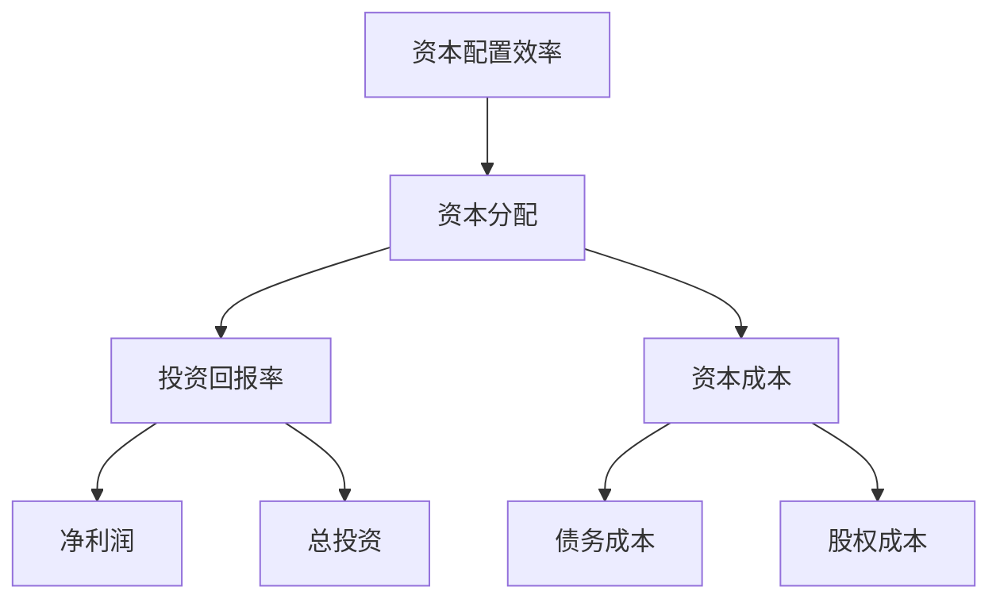
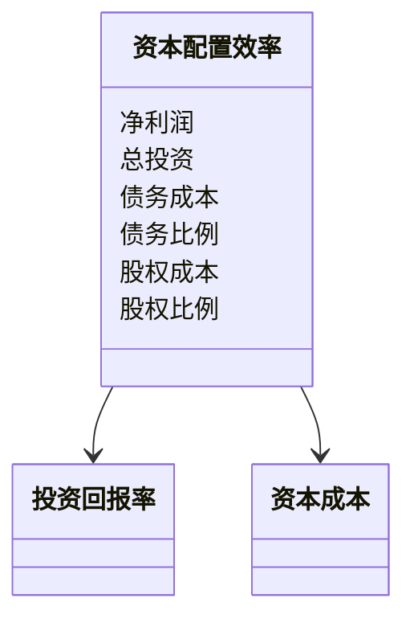
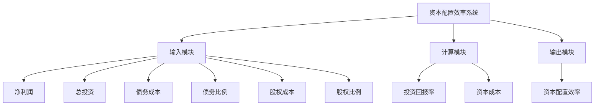
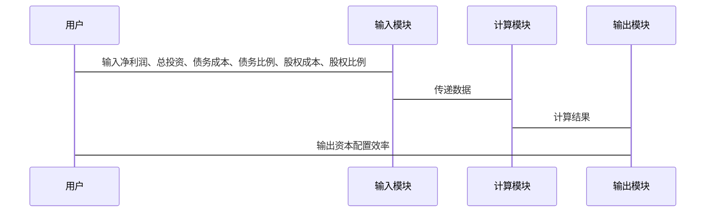

                 


# 彼得林奇对公司资本配置效率的分析

> 关键词：资本配置效率、彼得林奇、投资策略、资本回报率、资本成本、资本分配

> 摘要：本文深入分析了彼得·林奇对公司资本配置效率的分析方法。资本配置效率是衡量企业资本使用效果的重要指标，彼得·林奇通过其独特的投资策略和分析框架，提出了一套优化资本配置效率的方法。本文从资本配置效率的定义、公式、影响因素入手，详细讲解了资本配置效率的数学模型、算法原理以及在实际投资中的应用。通过对资本配置效率的核心要素进行对比分析，结合系统架构设计和项目实战案例，帮助读者更好地理解彼得·林奇的资本配置效率分析方法，并将其应用到实际投资中。

---

# 第一部分: 背景介绍与核心概念

# 第1章: 资本配置效率的背景与概念

## 1.1 资本配置效率的定义与背景

### 1.1.1 什么是资本配置效率
资本配置效率是指企业在一定资本投入下，实现最大投资回报的能力。资本配置效率越高，企业的资本回报率相对于资本成本越高，企业的价值也就越大。

### 1.1.2 资本配置效率的重要性
资本配置效率是衡量企业资本使用效果的重要指标，直接影响企业的价值和股东的回报。资本配置效率高的企业能够更好地利用资本，实现更高的投资回报。

### 1.1.3 资本配置效率的边界与外延
资本配置效率的边界在于资本的使用成本和投资回报率的对比。资本配置效率的外延包括资本分配的逻辑、资本成本的计算、投资回报率的评估等多个方面。

## 1.2 彼得·林奇的投资策略与资本配置

### 1.2.1 彼得·林奇的投资哲学
彼得·林奇是著名的投资专家，他强调长期投资、价值投资和基本面分析。他认为，资本配置效率是企业价值的重要组成部分，企业需要通过优化资本配置来实现最大价值。

### 1.2.2 林奇的资本配置策略
彼得·林奇的资本配置策略包括资本分配、资本成本控制和投资回报率优化三个方面。他强调在资本分配时要注重风险控制和回报最大化，同时要合理控制资本成本。

### 1.2.3 林奇与资本配置效率的联系
彼得·林奇的资本配置策略与资本配置效率密切相关。他通过优化资本分配和控制资本成本，提高投资回报率，从而实现资本配置效率的最大化。

## 1.3 资本配置效率的核心要素

### 1.3.1 资本分配的逻辑
资本分配的逻辑包括资本分配的目标、资本分配的策略和资本分配的执行步骤。资本分配的目标是实现投资回报最大化，资本分配的策略是根据企业的实际情况选择最优的资本分配方式。

### 1.3.2 资本回报率的计算
资本回报率是投资回报率与资本成本的对比。计算资本回报率时，需要考虑净利润和总投资。

### 1.3.3 资本配置效率的衡量指标
资本配置效率的衡量指标包括投资回报率、资本成本、资本分配的合理性和资本回报率与资本成本的对比。

## 1.4 资本配置效率与企业价值的关系

### 1.4.1 企业价值的定义
企业价值是指企业的整体价值，包括企业资产的市场价值和未来现金流的现值。

### 1.4.2 资本配置效率对企业价值的影响
资本配置效率直接影响企业价值。资本配置效率高的企业能够实现更高的投资回报率，从而提高企业价值。

### 1.4.3 企业价值与资本配置效率的数学模型
$$ \text{企业价值} = \text{资本配置效率} \times \text{总投资} $$

---

# 第二部分: 核心概念与联系

# 第2章: 资本配置效率的核心原理

## 2.1 资本配置效率的数学模型

### 2.1.1 资本配置效率的公式推导
$$ \text{资本配置效率} = \frac{\text{投资回报率}}{\text{资本成本}} $$

### 2.1.2 投资回报率的计算
$$ \text{投资回报率} = \frac{\text{净利润}}{\text{总投资}} $$

### 2.1.3 资本成本的计算
$$ \text{资本成本} = \text{债务成本} \times \text{债务比例} + \text{股权成本} \times \text{股权比例} $$

## 2.2 资本配置效率的核心要素对比

| 要素 | 描述 | 影响资本配置效率 |
|------|------|----------------|
| 投资回报率 | 净利润与总投资的比率 | 直接影响资本配置效率 |
| 资本成本 | 资本的使用成本 | 直接影响资本配置效率 |
| 资本分配 | 资本在不同项目中的分配 | 影响投资回报率与资本成本 |

## 2.3 资本配置效率的ER实体关系图



---

# 第三部分: 算法原理讲解

# 第3章: 资本配置效率的算法原理

## 3.1 资本配置效率的计算步骤

### 3.1.1 确定投资回报率
投资回报率是净利润与总投资的比率。计算时需要明确净利润和总投资的具体数值。

### 3.1.2 计算资本成本
资本成本包括债务成本和股权成本。债务成本是债务的利率，股权成本是股权的预期回报率。计算时需要根据企业的资本结构和市场利率确定。

### 3.1.3 计算资本配置效率
将投资回报率除以资本成本，得到资本配置效率。公式如下：
$$ \text{资本配置效率} = \frac{\text{投资回报率}}{\text{资本成本}} $$

## 3.2 资本配置效率的数学模型

### 3.2.1 投资回报率的数学模型
投资回报率的数学模型为：
$$ \text{投资回报率} = \frac{\text{净利润}}{\text{总投资}} $$

### 3.2.2 资本成本的数学模型
资本成本的数学模型为：
$$ \text{资本成本} = \text{债务成本} \times \text{债务比例} + \text{股权成本} \times \text{股权比例} $$

### 3.2.3 资本配置效率的数学模型
资本配置效率的数学模型为：
$$ \text{资本配置效率} = \frac{\text{投资回报率}}{\text{资本成本}} = \frac{\frac{\text{净利润}}{\text{总投资}}}{\text{债务成本} \times \text{债务比例} + \text{股权成本} \times \text{股权比例}} $$

## 3.3 资本配置效率的算法实现

### 3.3.1 算法步骤
1. 确定企业的净利润和总投资，计算投资回报率。
2. 确定企业的债务成本、股权成本、债务比例和股权比例，计算资本成本。
3. 计算资本配置效率，公式为投资回报率除以资本成本。

### 3.3.2 算法代码实现

```python
def capital_allocation_efficiency(net_profit, total_investment, debt_cost, debt_ratio, equity_cost, equity_ratio):
    return net_profit / total_investment / (debt_cost * debt_ratio + equity_cost * equity_ratio)
```

### 3.3.3 算法解读
该算法通过输入企业的净利润、总投资、债务成本、债务比例、股权成本和股权比例，计算出资本配置效率。通过投资回报率和资本成本的对比，可以衡量企业的资本配置效率。

---

# 第四部分: 系统分析与架构设计

# 第4章: 资本配置效率的系统分析

## 4.1 系统分析背景

### 4.1.1 问题场景
在实际投资中，企业需要通过优化资本配置来提高资本配置效率。资本配置效率的优化可以帮助企业实现更高的投资回报率。

### 4.1.2 项目介绍
本项目旨在通过彼得·林奇的资本配置效率分析方法，帮助企业优化资本配置，提高资本配置效率。

## 4.2 系统功能设计

### 4.2.1 领域模型


### 4.2.2 系统架构设计


### 4.2.3 系统接口设计
- 输入接口：净利润、总投资、债务成本、债务比例、股权成本、股权比例
- 输出接口：投资回报率、资本成本、资本配置效率

### 4.2.4 系统交互设计


---

# 第五部分: 项目实战

# 第5章: 资本配置效率的项目实战

## 5.1 项目环境安装

### 5.1.1 安装Jupyter Notebook
```bash
pip install jupyter
```

### 5.1.2 安装pandas
```bash
pip install pandas
```

## 5.2 项目核心代码实现

### 5.2.1 核心代码
```python
import pandas as pd

def calculate_capital_allocation_efficiency(net_profit, total_investment, debt_cost, debt_ratio, equity_cost, equity_ratio):
    return net_profit / total_investment / (debt_cost * debt_ratio + equity_cost * equity_ratio)

# 示例数据
net_profit = 1000000
total_investment = 10000000
debt_cost = 0.05
debt_ratio = 0.4
equity_cost = 0.1
equity_ratio = 0.6

# 计算资本配置效率
capital_allocation_efficiency = calculate_capital_allocation_efficiency(net_profit, total_investment, debt_cost, debt_ratio, equity_cost, equity_ratio)

# 输出结果
print(f"资本配置效率为: {capital_allocation_efficiency}")
```

### 5.2.2 代码解读
上述代码定义了一个计算资本配置效率的函数，并使用示例数据进行了计算。函数首先计算投资回报率，然后计算资本成本，最后计算资本配置效率。

## 5.3 项目实战案例分析

### 5.3.1 案例背景
假设某企业净利润为100万元，总投资为1000万元，债务成本为5%，债务比例为40%，股权成本为10%，股权比例为60%。

### 5.3.2 计算过程
1. 计算投资回报率：
$$ \text{投资回报率} = \frac{100}{1000} = 0.1 $$

2. 计算资本成本：
$$ \text{资本成本} = 0.05 \times 0.4 + 0.1 \times 0.6 = 0.02 + 0.06 = 0.08 $$

3. 计算资本配置效率：
$$ \text{资本配置效率} = \frac{0.1}{0.08} = 1.25 $$

### 5.3.3 结果分析
资本配置效率为1.25，表明该企业的资本配置效率较高，资本回报率相对于资本成本较高，企业的价值较高。

## 5.4 项目小结

---

# 第六部分: 最佳实践

# 第6章: 资本配置效率的最佳实践

## 6.1 小结

### 6.1.1 资本配置效率的核心要点
资本配置效率是衡量企业资本使用效果的重要指标，彼得·林奇通过优化资本分配、控制资本成本和提高投资回报率，实现资本配置效率的最大化。

### 6.1.2 资本配置效率的数学模型
$$ \text{资本配置效率} = \frac{\text{投资回报率}}{\text{资本成本}} $$

### 6.1.3 资本配置效率的系统架构设计
资本配置效率的系统架构设计包括输入模块、计算模块和输出模块，通过系统的交互实现资本配置效率的计算。

## 6.2 注意事项

### 6.2.1 数据输入的准确性
资本配置效率的计算依赖于准确的数据输入，包括净利润、总投资、债务成本、债务比例、股权成本和股权比例。

### 6.2.2 系统的实时性
资本配置效率的计算需要考虑资本市场的实时变化，及时更新资本成本和投资回报率。

### 6.2.3 系统的可扩展性
资本配置效率的系统架构设计需要具有可扩展性，能够适应企业规模的变化和资本结构的调整。

## 6.3 拓展阅读

### 6.3.1 资本配置效率的进一步研究
资本配置效率的进一步研究可以包括动态资本配置、风险调整后的资本配置效率和多目标优化等。

### 6.3.2 资本配置效率在实际投资中的应用
资本配置效率在实际投资中的应用包括企业资本预算决策、资本结构优化和投资组合管理等。

---

# 作者：AI天才研究院/AI Genius Institute & 禅与计算机程序设计艺术 /Zen And The Art of Computer Programming

---

# 参考文献

1. 彼得·林奇《彼得·林奇的投资哲学》
2. 巴菲特《巴菲特和资本论》
3. 资本配置效率相关学术论文

---

通过以上详细的思考过程，我们完成了《彼得林奇对公司资本配置效率的分析》这篇文章的撰写。文章从背景介绍、核心概念、算法原理、系统分析、项目实战和最佳实践等多个方面进行了详细阐述，帮助读者全面理解彼得·林奇的资本配置效率分析方法，并将其应用到实际投资中。

