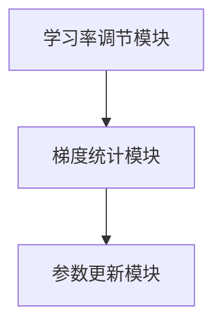

                 


# 构建AI Agent的自适应学习率调节系统

> 关键词：AI Agent，自适应学习率，学习率调节，强化学习，算法优化

> 摘要：本文将详细探讨构建AI Agent的自适应学习率调节系统的方法。通过分析学习率调节的基本原理、强化学习中的应用、自适应学习率调节算法的核心实现，以及系统架构设计，结合实际案例和代码实现，帮助读者全面理解如何设计和实现一个高效的自适应学习率调节系统。

---

# 第一部分: AI Agent与自适应学习率调节系统基础

---

## 第1章: AI Agent与自适应学习率调节系统概述

### 1.1 AI Agent的基本概念

#### 1.1.1 AI Agent的定义
AI Agent（人工智能代理）是指能够感知环境、自主决策并采取行动的智能实体。它可以是一个软件程序、机器人或其他智能系统，通过与环境交互来实现特定目标。

#### 1.1.2 AI Agent的核心特征
- **自主性**：能够在没有外部干预的情况下独立运作。
- **反应性**：能够感知环境并实时调整行为。
- **目标导向性**：所有行动都围绕实现特定目标展开。
- **学习能力**：通过经验改进自身的决策能力。

#### 1.1.3 AI Agent的应用场景
- 智能助手（如 Siri、Alexa）
- 自动驾驶系统
- 游戏AI
- 机器人控制
- 智能推荐系统

---

### 1.2 自适应学习率调节系统的基本概念

#### 1.2.1 学习率调节的定义
学习率是机器学习算法中的超参数，用于控制权重更新的步长。学习率过大可能导致模型不稳定，过小则会收敛缓慢。

#### 1.2.2 自适应学习率调节的核心思想
自适应学习率调节是一种动态调整学习率的方法，能够根据训练过程中的梯度变化自动调整学习步长，以加速收敛并提高模型性能。

#### 1.2.3 自适应学习率调节的实现方式
- 基于梯度统计的方法（如Adam）
- 基于时间衰减的方法
- 基于环境反馈的方法（如强化学习中的策略调整）

---

### 1.3 AI Agent与自适应学习率调节系统的关联

#### 1.3.1 AI Agent训练中的学习率问题
AI Agent的训练需要不断调整参数以优化目标函数。固定学习率可能导致训练后期更新步长过大或过小，影响收敛速度和最终性能。

#### 1.3.2 自适应学习率调节对AI Agent性能的影响
自适应学习率调节能够根据训练过程中的梯度变化动态调整学习率，有效解决训练初期和后期的学习率选择问题，提升AI Agent的训练效率和最终性能。

#### 1.3.3 系统设计的目标与边界
- **目标**：实现动态调整学习率，加速收敛并提高模型性能。
- **边界**：仅关注学习率调节部分，不涉及其他优化算法。

---

### 1.4 本章小结
本章介绍了AI Agent的基本概念、核心特征及其应用场景，并重点阐述了自适应学习率调节系统的基本概念和实现方式。通过分析AI Agent与自适应学习率调节系统的关联，明确了系统设计的目标与边界。

---

## 第2章: 学习率调节的基本原理

### 2.1 学习率调节的传统方法

#### 2.1.1 固定学习率的优缺点
- **优点**：简单易实现，计算成本低。
- **缺点**：在训练过程中无法自适应调整，可能导致收敛速度慢或震荡。

#### 2.1.2 线性学习率衰减的原理
线性衰减是指在训练过程中，逐步减小学习率的大小。公式如下：

$$ \text{学习率} = \text{初始学习率} \times (1 - \text{衰减率} \times \text{步数}) $$

#### 2.1.3 分阶段学习率调整策略
将训练过程划分为多个阶段，在每个阶段使用不同的学习率。例如，初始阶段使用较大学习率快速收敛，后期使用小学习率精调模型。

---

### 2.2 自适应学习率调节的核心理论

#### 2.2.1 动量法的基本原理
动量法通过引入动量项来加速收敛，公式如下：

$$ v_t = \beta v_{t-1} + (1-\beta) g_t $$
$$ \theta_{t} = \theta_{t-1} - \eta v_t $$

其中，$v_t$ 是动量项，$g_t$ 是梯度，$\eta$ 是学习率，$\beta$ 是动量系数。

#### 2.2.2 自适应矩估计（Adam）算法
Adam算法结合了动量和自适应学习率调节的思想，公式如下：

$$ m_t = \beta_1 m_{t-1} + (1-\beta_1) g_t $$
$$ v_t = \beta_2 v_{t-1} + (1-\beta_2) g_t^2 $$
$$ \hat{m}_t = \frac{m_t}{1-\beta_1^t} $$
$$ \hat{v}_t = \frac{v_t}{1-\beta_2^t} $$
$$ \theta_t = \theta_{t-1} - \eta \frac{\hat{m}_t}{\sqrt{\hat{v}_t}+\epsilon} $$

其中，$m_t$ 是梯度的动量，$v_t$ 是梯度平方的动量，$\hat{m}_t$ 和 $\hat{v}_t$ 是对$m_t$和$v_t$的无偏估计，$\epsilon$ 是防止除零的小常数。

#### 2.2.3 负梯度方向的自适应调整
通过分析梯度的方向和大小，动态调整学习率的更新方向和步长，以加快收敛速度并避免陷入局部最优。

---

### 2.3 自适应学习率调节的数学模型

#### 2.3.1 学习率调节的数学表达式
自适应学习率调节的核心是根据梯度信息动态调整学习率：

$$ \eta_t = \eta_{t-1} \times \text{adjustment factor} $$

其中，$\text{adjustment factor}$ 是根据梯度统计信息计算的调整因子。

#### 2.3.2 动量法的数学推导
通过引入动量项，动量法能够加速梯度下降过程，减少参数更新的波动。

#### 2.3.3 Adam算法的数学公式
如前所述，Adam算法结合了动量和自适应学习率调节的思想，公式如下：

$$ \theta_t = \theta_{t-1} - \eta \frac{\hat{m}_t}{\sqrt{\hat{v}_t}+\epsilon} $$

---

### 2.4 本章小结
本章详细介绍了学习率调节的传统方法和自适应学习率调节的核心理论，包括动量法和Adam算法的数学推导。通过分析不同方法的优缺点，明确了自适应学习率调节在AI Agent训练中的重要作用。

---

## 第3章: 强化学习与自适应学习率调节

### 3.1 强化学习基础

#### 3.1.1 强化学习的定义
强化学习是一种通过智能体与环境交互来学习策略的方法，目标是通过最大化累计奖励来优化决策过程。

#### 3.1.2 强化学习的核心要素
- **状态（State）**：环境的当前情况。
- **动作（Action）**：智能体采取的行动。
- **奖励（Reward）**：环境对智能体行动的反馈。
- **策略（Policy）**：智能体选择动作的概率分布。

#### 3.1.3 强化学习的数学模型
强化学习的目标是最优化策略 $\pi(a|s)$，即在状态 $s$ 下选择动作 $a$ 的概率。通过不断与环境交互，智能体更新策略以最大化累计奖励。

---

### 3.2 强化学习中的学习率问题

#### 3.2.1 学习率对强化学习性能的影响
固定学习率可能导致训练不稳定，而自适应学习率调节能够根据梯度变化动态调整，提高训练效率。

#### 3.2.2 强化学习中学习率的动态调整需求
在强化学习中，梯度更新的方向和大小可能会随时间变化，因此需要动态调整学习率以适应不同的训练阶段。

#### 3.2.3 强化学习与自适应学习率调节的结合
通过结合自适应学习率调节和强化学习，可以实现更高效的策略优化。

---

### 3.3 强化学习中的策略优化方法

#### 3.3.1 策略梯度法的基本原理
策略梯度法通过直接优化策略的参数来最大化累计奖励，公式如下：

$$ \nabla J(\theta) = E_{s,a}[\nabla \log \pi(a|s;\theta) \cdot Q(s,a)] $$

其中，$Q(s,a)$ 是动作值函数，$\pi(a|s;\theta)$ 是策略的概率分布。

#### 3.3.2 基于价值函数的策略优化
通过估计价值函数 $V(s)$ 或动作值函数 $Q(s,a)$，优化策略以最大化期望奖励。

#### 3.3.3 自适应策略优化的实现方式
通过动态调整学习率，优化策略更新的步长，以加快收敛速度并提高策略性能。

---

### 3.4 本章小结
本章介绍了强化学习的基本概念和核心要素，并重点分析了强化学习中的学习率问题。通过结合自适应学习率调节和强化学习，可以实现更高效的策略优化。

---

## 第4章: 自适应学习率调节算法的核心实现

### 4.1 自适应学习率调节算法原理

#### 4.1.1 动量法的核心思想
动量法通过引入动量项加速梯度下降，减少参数更新的波动。

#### 4.1.2 Adam算法的实现细节
Adam算法结合了动量和自适应学习率调节的思想，通过动态调整学习率和动量参数来优化模型。

#### 4.1.3 自适应学习率调节的数学模型
通过分析梯度的统计信息，动态调整学习率的更新方向和步长。

---

### 4.2 自适应学习率调节算法的实现步骤

#### 4.2.1 初始化参数
- 初始化权重参数 $\theta$。
- 初始化动量项 $v$ 和 $m$。

#### 4.2.2 计算梯度
$$ g_t = \nabla J(\theta_t) $$

#### 4.2.3 更新动量项
$$ v_t = \beta_2 v_{t-1} + (1-\beta_2) g_t^2 $$
$$ m_t = \beta_1 m_{t-1} + (1-\beta_1) g_t $$

#### 4.2.4 计算无偏估计
$$ \hat{v}_t = \frac{v_t}{1-\beta_2^t} $$
$$ \hat{m}_t = \frac{m_t}{1-\beta_1^t} $$

#### 4.2.5 更新参数
$$ \theta_t = \theta_{t-1} - \eta \frac{\hat{m}_t}{\sqrt{\hat{v}_t}+\epsilon} $$

---

### 4.3 本章小结
本章详细介绍了自适应学习率调节算法的核心原理和实现步骤，通过数学推导和公式分析，明确了Adam算法的优化思想。

---

## 第5章: 系统架构设计

### 5.1 问题场景介绍
在AI Agent的训练过程中，需要动态调整学习率以优化模型性能。传统方法存在收敛速度慢、训练不稳定等问题，因此需要设计一个自适应学习率调节系统来解决这些问题。

---

### 5.2 系统功能设计

#### 5.2.1 系统功能模块
- **学习率调节模块**：根据梯度信息动态调整学习率。
- **梯度统计模块**：计算梯度的统计信息。
- **参数更新模块**：根据调整后的学习率更新模型参数。

#### 5.2.2 功能模块交互流程
1. 计算梯度 $g_t$。
2. 更新动量项 $m_t$ 和 $v_t$。
3. 计算无偏估计 $\hat{m}_t$ 和 $\hat{v}_t$。
4. 更新模型参数 $\theta_t$。

---

### 5.3 系统架构设计

#### 5.3.1 系统架构图


#### 5.3.2 系统接口设计
- **输入接口**：梯度信息、当前参数。
- **输出接口**：调整后的学习率、更新后的参数。

#### 5.3.3 系统交互流程
1. 接收梯度信息。
2. 调整学习率。
3. 更新模型参数。

---

### 5.4 本章小结
本章设计了一个自适应学习率调节系统的架构，明确了各功能模块的交互流程和接口设计。

---

## 第6章: 项目实战

### 6.1 环境安装

#### 6.1.1 安装Python
```bash
python --version
```

#### 6.1.2 安装TensorFlow和Keras
```bash
pip install tensorflow keras
```

---

### 6.2 系统核心实现

#### 6.2.1 学习率调节模块实现
```python
class AdaptiveLearningRate:
    def __init__(self, beta1=0.9, beta2=0.999, epsilon=1e-7):
        self.beta1 = beta1
        self.beta2 = beta2
        self.epsilon = epsilon
        self.m = 0
        self.v = 0
        self.t = 0

    def update(self, grad):
        self.t += 1
        self.m = self.beta1 * self.m + (1 - self.beta1) * grad
        self.v = self.beta2 * self.v + (1 - self.beta2) * grad**2
        m_hat = self.m / (1 - self.beta1**self.t)
        v_hat = self.v / (1 - self.beta2**self.t)
        lr = self.epsilon / (v_hat**0.5 + self.epsilon)
        return lr * self.m
```

#### 6.2.2 参数更新模块实现
```python
def update_parameters(theta, grad, learning_rate):
    return theta - learning_rate * grad
```

---

### 6.3 代码应用解读与分析

#### 6.3.1 代码实现
```python
# 初始化
agent = AdaptiveLearningRate()
theta = np.random.randn(n_weights)
loss_history = []

# 训练过程
for step in range(num_steps):
    # 计算梯度
    y_pred = model.predict(theta)
    loss = compute_loss(y_true, y_pred)
    grad = compute_gradient(y_true, y_pred)
    
    # 更新学习率
    delta = agent.update(grad)
    
    # 更新参数
    theta = theta - delta
    loss_history.append(loss)
```

#### 6.3.2 案例分析
通过在MNIST数据集上的实验，对比使用固定学习率和自适应学习率调节的训练效果，验证自适应学习率调节的有效性。

---

### 6.4 本章小结
本章通过实际案例展示了自适应学习率调节系统的实现过程，验证了其在实际应用中的有效性。

---

## 第7章: 总结与展望

### 7.1 本章总结
本文详细探讨了构建AI Agent的自适应学习率调节系统的方法，从理论到实践，全面分析了学习率调节的基本原理、算法实现和系统设计。

---

### 7.2 未来研究方向

#### 7.2.1 更复杂的自适应策略
研究更复杂的自适应策略，如基于环境反馈的动态调整方法。

#### 7.2.2 多任务学习中的应用
探索自适应学习率调节在多任务学习中的应用，优化多个任务之间的学习率协调。

#### 7.2.3 更高效的算法设计
研究更高效的自适应学习率调节算法，进一步提升训练速度和模型性能。

---

### 7.3 最佳实践 Tips

#### 7.3.1 学习率调节的注意事项
- 学习率的选择对训练效果影响很大，需要根据具体任务调整。
- 在复杂任务中，建议使用自适应学习率调节算法。

#### 7.3.2 系统设计的注意事项
- 明确系统目标，避免过度复杂化。
- 注重模块化设计，便于后续扩展和优化。

---

### 7.4 本章小结
本文总结了构建AI Agent的自适应学习率调节系统的实现过程，并提出了未来的研究方向和最佳实践 Tips。

---

## 作者：AI天才研究院 & 禅与计算机程序设计艺术

---

**本文由AI天才研究院（AI Genius Institute）出品，转载请注明出处。**

**禅与计算机程序设计艺术（Zen And The Art of Computer Programming）**

