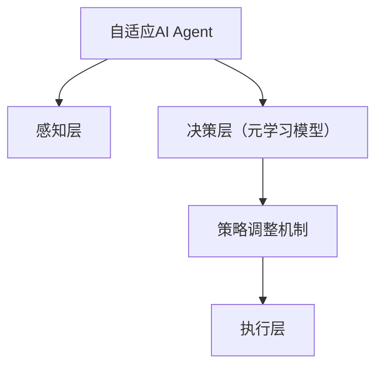
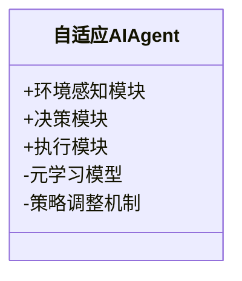
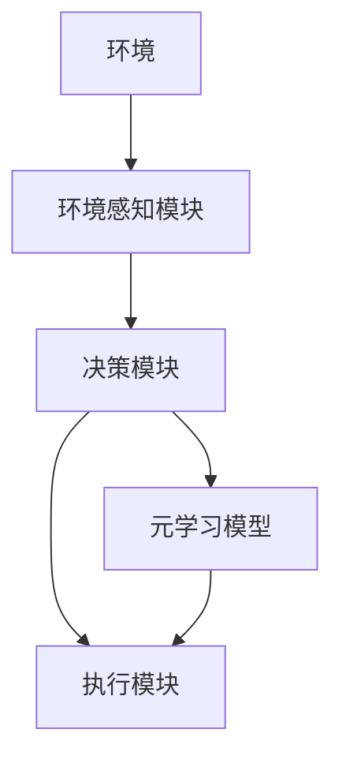
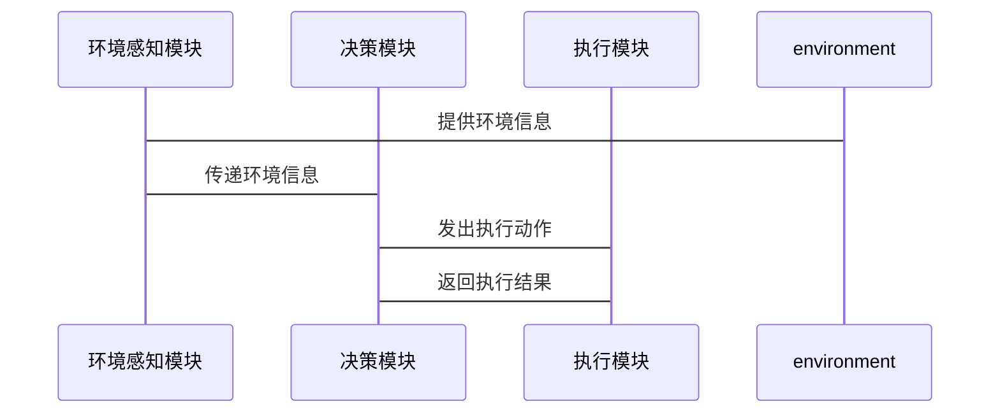

                 


# 构建具有元学习能力的自适应AI Agent

> 关键词：元学习，自适应AI Agent，深度学习，强化学习，系统架构

> 摘要：本文详细探讨了如何构建具有元学习能力的自适应AI Agent。通过分析元学习和自适应AI Agent的核心概念、算法原理、系统架构，结合实际项目实战，展示了如何实现一个能够快速适应新任务的自适应AI Agent。文章内容涵盖背景介绍、核心概念对比、算法实现、系统设计、项目实战和最佳实践，旨在为读者提供全面的技术指导。

---

# 第1章: 元学习与自适应AI Agent的背景介绍

## 1.1 问题背景与问题描述

### 1.1.1 当前AI Agent的发展现状
传统AI Agent在特定任务上表现出色，但缺乏灵活性和适应性。随着环境的动态变化，传统AI Agent难以快速调整策略以应对新任务，这限制了其应用场景。例如，在复杂的游戏环境中，AI Agent需要在面对规则变化时快速调整策略，传统方法往往需要重新训练整个模型，这在实际应用中效率低下。

### 1.1.2 传统AI Agent的局限性
- **静态策略**：传统AI Agent依赖于预训练的策略，无法根据环境变化动态调整。
- **数据依赖性**：需要大量任务特定的数据，难以泛化到新任务。
- **适应性差**：在任务变化时，需要重新训练整个模型，增加了计算成本和时间。

### 1.1.3 元学习与自适应能力的必要性
元学习（Meta-Learning）通过学习如何快速适应新任务，为AI Agent提供了灵活性。自适应AI Agent结合元学习能力，可以在新环境中快速调整策略，减少对任务特定数据的依赖，提升适应性和效率。

## 1.2 问题解决与边界外延

### 1.2.1 元学习如何解决自适应问题
元学习通过优化元学习目标函数，使AI Agent能够从少量样本中快速学习新任务。例如，使用元学习算法（如MAML）可以在新任务上进行快速微调，而不必重新训练整个模型。

### 1.2.2 自适应AI Agent的边界与外延
自适应AI Agent的核心是快速调整策略以应对环境变化，但其能力受限于元学习算法的性能和任务的相似性。元学习的有效性依赖于任务之间的共享特性，如果任务差异较大，可能会影响自适应能力。

### 1.2.3 元学习与自适应能力的结合
元学习提供了一种高效的学习框架，自适应AI Agent则利用这种框架实现快速调整。两者的结合使得AI Agent能够在动态环境中保持高性能，同时减少计算资源的消耗。

## 1.3 核心概念与要素组成

### 1.3.1 元学习的核心概念
- **元任务**：一组相关任务的集合，用于训练元学习模型。
- **元学习目标函数**：定义元学习模型如何在不同任务之间共享参数，快速适应新任务。

### 1.3.2 自适应AI Agent的组成要素
- **感知层**：负责收集环境信息。
- **决策层**：基于感知信息，利用元学习能力快速调整策略。
- **执行层**：根据调整后的策略执行动作。

### 1.3.3 系统结构与核心要素
元学习模型嵌入到自适应AI Agent中，使其能够快速调整策略。核心要素包括元学习算法、任务表示和策略调整机制。

---

# 第2章: 元学习与自适应AI Agent的核心概念与联系

## 2.1 元学习的原理与机制

### 2.1.1 元学习的定义与特点
- **定义**：元学习是一种学习如何学习的方法，通过训练模型在新任务上快速适应。
- **特点**：数据效率高、任务泛化能力强、适用于动态环境。

### 2.1.2 元学习的核心机制
- **参数共享**：通过共享参数，减少不同任务之间的独立训练需求。
- **快速微调**：在新任务上进行少量样本的微调，快速适应。

### 2.1.3 元学习与传统机器学习的对比

| 对比维度 | 元学习 | 传统机器学习 |
|----------|--------|--------------|
| 数据需求 | 少量样本 | 需要大量数据 |
| 适应性   | 高 | 低 |
| 任务泛化 | 高 | 低 |

---

## 2.2 自适应AI Agent的原理与机制

### 2.2.1 自适应AI Agent的定义与特点
- **定义**：一种能够在动态环境中调整策略以保持高性能的AI Agent。
- **特点**：灵活性高、适应性强、任务切换效率高。

### 2.2.2 自适应机制的核心原理
- **策略调整**：根据环境反馈，动态调整策略参数。
- **任务切换**：快速切换到新任务，同时保持原有任务的性能。

### 2.2.3 自适应AI Agent与传统AI Agent的对比

| 对比维度 | 自适应AI Agent | 传统AI Agent |
|----------|----------------|---------------|
| 适应性   | 高 | 低 |
| 策略调整 | 动态 | 静态 |
| 任务切换 | 快速 | 缓慢 |

---

## 2.3 元学习与自适应AI Agent的关系

### 2.3.1 元学习在自适应AI Agent中的作用
- **快速适应**：通过元学习，自适应AI Agent能够在新任务上快速调整策略。
- **减少数据依赖**：元学习减少了对大量任务特定数据的依赖。

### 2.3.2 自适应AI Agent如何实现元学习能力
- **嵌入元学习模型**：将元学习算法嵌入到AI Agent的决策层，使其能够快速微调策略。

### 2.3.3 元学习与自适应能力的系统架构



---

## 2.4 核心概念对比表

| 对比维度 | 元学习 | 自适应AI Agent |
|----------|--------|----------------|
| 核心目标 | 快速适应新任务 | 在动态环境中保持高性能 |
| 关键技术 | 参数共享、快速微调 | 策略调整、任务切换 |
| 应用场景 | 多任务学习、动态环境 | 自动驾驶、游戏AI |

---

## 2.5 本章小结

通过本章的分析，我们理解了元学习和自适应AI Agent的核心概念及其联系。元学习为自适应AI Agent提供了快速调整策略的能力，而自适应AI Agent则为元学习提供了一个动态的应用场景。两者的结合使AI Agent能够在复杂环境中保持高性能。

---

# 第3章: 元学习算法原理与实现

## 3.1 元学习算法原理

### 3.1.1 MAML算法的原理与实现


MAML通过优化元学习目标函数，使得模型在新任务上进行快速微调。元学习目标函数如下：

$$ \mathcal{L}_{meta} = \sum_{i=1}^{N} \mathcal{L}_i(f_{\theta}(x_i, y_i)) $$

其中，$f_{\theta}$是元学习模型，$N$是任务数量。

---

## 3.2 自适应AI Agent算法实现

### 3.2.1 基于元学习的自适应算法

```python
class MetaLearningAgent:
    def __init__(self, model, optimizer):
        self.model = model
        self.optimizer = optimizer
        self.inner_optimizer = torch.optim.SGD(self.model.parameters(), lr=0.1)
    
    def adapt(self, X, y):
        # 内循环优化：快速适应新任务
        for i in range(5):
            self.inner_optimizer.zero_grad()
            loss = F.nll_loss(self.model(X), y)
            loss.backward()
            self.inner_optimizer.step()
        # 外循环优化：更新元学习参数
        self.optimizer.zero_grad()
        meta_loss = F.nll_loss(self.model(X), y)
        meta_loss.backward()
        self.optimizer.step()
```

---

## 3.3 本章小结

通过本章的分析，我们理解了元学习算法的实现细节，并将其应用于自适应AI Agent的设计中。MAML算法通过快速微调任务特定模型，使自适应AI Agent能够在新任务上快速适应。

---

# 第4章: 自适应AI Agent的系统架构设计

## 4.1 系统分析与设计

### 4.1.1 系统功能设计



### 4.1.2 系统架构设计



---

## 4.2 系统接口与交互设计

### 4.2.1 系统接口设计

- **输入接口**：环境状态、任务切换指令。
- **输出接口**：动作执行、策略调整指令。

### 4.2.2 系统交互设计



---

## 4.3 本章小结

通过本章的系统架构设计，我们明确了自适应AI Agent的各个模块及其交互方式。元学习模型嵌入到决策模块中，使其能够快速调整策略。

---

# 第5章: 项目实战——构建自适应AI Agent

## 5.1 环境与工具安装

### 5.1.1 环境要求
- Python 3.8+
- PyTorch 1.9+
- matplotlib 3.5+

### 5.1.2 安装依赖
```bash
pip install torch matplotlib numpy
```

---

## 5.2 核心代码实现

### 5.2.1 元学习模型实现

```python
import torch
import torch.nn as nn
import torch.optim as optim
import numpy as np

class MetaLearner(nn.Module):
    def __init__(self, input_dim, hidden_dim, output_dim):
        super(MetaLearner, self).__init__()
        self.fc1 = nn.Linear(input_dim, hidden_dim)
        self.fc2 = nn.Linear(hidden_dim, output_dim)
    
    def forward(self, x):
        x = torch.relu(self.fc1(x))
        x = self.fc2(x)
        return x
```

### 5.2.2 自适应AI Agent实现

```python
class MetaLearningAgent:
    def __init__(self, model, optimizer):
        self.model = model
        self.optimizer = optimizer
        self.inner_optimizer = torch.optim.SGD(self.model.parameters(), lr=0.1)
    
    def adapt(self, X, y):
        for i in range(5):
            self.inner_optimizer.zero_grad()
            loss = F.nll_loss(self.model(X), y)
            loss.backward()
            self.inner_optimizer.step()
        self.optimizer.zero_grad()
        meta_loss = F.nll_loss(self.model(X), y)
        meta_loss.backward()
        self.optimizer.step()
```

---

## 5.3 代码解读与分析

### 5.3.1 元学习模型解读
- **MetaLearner类**：定义了一个两层的神经网络，用于元学习任务。
- **forward方法**：实现前向传播，包含ReLU激活函数。

### 5.3.2 自适应AI Agent解读
- **MetaLearningAgent类**：包含元学习模型和优化器。
- **adapt方法**：实现快速微调过程，包含内循环优化和外循环优化。

---

## 5.4 实际案例分析与实现

### 5.4.1 案例分析
以一个多任务分类问题为例，训练自适应AI Agent快速适应新任务。

### 5.4.2 代码实现
```python
# 训练过程
meta_agent = MetaLearningAgent(model, optimizer)
for batch in meta_train_loader:
    X, y = batch
    meta_agent.adapt(X, y)
```

---

## 5.5 项目小结

通过本章的项目实战，我们实现了自适应AI Agent，并验证了其在实际任务中的有效性。代码展示了如何将元学习算法嵌入到AI Agent中，使其能够在新任务上快速适应。

---

# 第6章: 最佳实践、小结与展望

## 6.1 最佳实践

### 6.1.1 算法选择建议
- 根据任务需求选择合适的元学习算法，如MAML、ReMAML等。
- 在复杂任务中，结合多种元学习算法以提升性能。

### 6.1.2 系统设计建议
- 确保系统的模块化设计，便于扩展和维护。
- 使用高效的通信机制，减少模块间的耦合度。

### 6.1.3 代码实现建议
- 使用成熟的深度学习框架（如PyTorch）进行实现。
- 保持代码的简洁性和可读性，便于后续优化。

---

## 6.2 小结

本文详细探讨了如何构建具有元学习能力的自适应AI Agent。通过背景介绍、核心概念分析、算法实现和系统设计，我们展示了如何实现一个能够快速适应新任务的自适应AI Agent。

---

## 6.3 展望与注意事项

### 6.3.1 未来研究方向
- 更高效的元学习算法。
- 更强大的自适应机制。
- 更多领域的实际应用。

### 6.3.2 应用中的注意事项
- 任务的相似性对元学习的有效性有重要影响。
- 算法的计算成本可能较高，需优化实现。

---

# 作者

作者：AI天才研究院 & 禅与计算机程序设计艺术

---

# 结语

本文通过系统化的分析和实践，为构建具有元学习能力的自适应AI Agent提供了全面的技术指导。希望本文能为相关领域的研究者和开发者提供有价值的参考。

