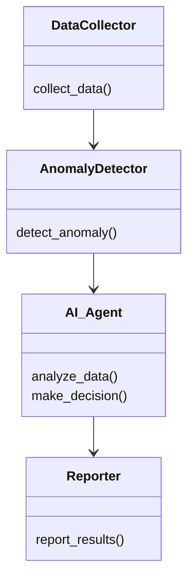
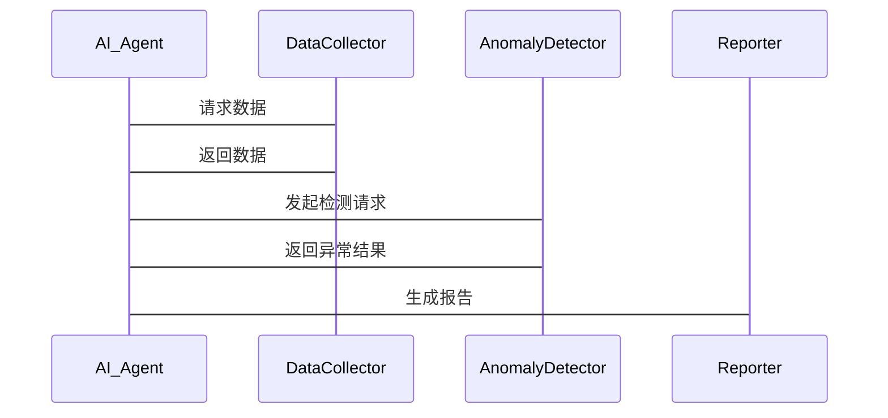

                 


# AI Agent在异常检测中的应用：识别非常规模式

## 关键词：AI Agent, 异常检测, 模式识别, 机器学习, 深度学习, 数据科学, 网络安全

## 摘要：
AI Agent在异常检测中的应用是当前人工智能领域的重要研究方向。异常检测旨在识别数据中的异常模式，这些模式可能代表潜在的威胁或机会。AI Agent通过其智能感知和决策能力，能够有效提升异常检测的准确性和效率。本文将从异常检测的基本概念、AI Agent的核心原理、算法实现、系统架构设计以及实际案例分析等多个方面进行深入探讨，帮助读者全面理解AI Agent在异常检测中的应用及其优势。

---

# 第1章: 异常检测的背景与挑战

## 1.1 异常检测的基本概念
### 1.1.1 什么是异常检测
异常检测（Anomaly Detection）是指通过分析数据，识别出与预期模式或行为显著不同的数据点或事件。这些异常可能代表潜在的问题、机会或异常行为。

### 1.1.2 异常检测的应用场景
- 网络安全：检测入侵行为或恶意攻击。
- 金融领域：识别欺诈交易或异常资金流动。
- 健康医疗：监测患者的异常生理指标。
- 物流行业：检测运输过程中的异常事件。

### 1.1.3 异常检测的核心问题
- 如何定义“正常”行为？
- 如何在数据中识别出异常模式？
- 如何处理数据稀疏性和噪声干扰？

---

## 1.2 异常检测的分类与挑战
### 1.2.1 基于统计的异常检测
- 使用统计方法（如均值、标准差）来定义正常行为，识别偏离统计分布的异常点。
- 优点：简单易懂，计算效率高。
- 缺点：难以处理复杂数据分布，对噪声敏感。

### 1.2.2 基于机器学习的异常检测
- 使用监督或无监督学习算法（如SVM、随机森林）进行异常检测。
- 优点：能够处理非线性关系，适合高维数据。
- 缺点：需要大量标注数据，模型调参复杂。

### 1.2.3 基于深度学习的异常检测
- 使用深度学习模型（如AE、VAE、GAN）进行异常检测。
- 优点：能够捕捉数据的高层次特征，适用于复杂场景。
- 缺点：计算资源消耗大，模型训练时间长。

---

## 1.3 异常检测的边界与外延
### 1.3.1 异常检测的边界条件
- 数据质量：数据是否干净，是否存在噪声。
- 数据分布：是否假设数据服从某种分布。
- 时间序列：是否考虑数据的时间依赖性。

### 1.3.2 异常检测的外延领域
- 异常识别：从数据中识别出异常事件。
- 异常解释：分析异常的原因和潜在影响。
- 异常响应：采取措施应对异常事件。

### 1.3.3 异常检测与正常行为的平衡
- 如何在检测异常的同时，避免误报正常行为？
- 如何在异常检测中平衡精度和召回率？

---

## 1.4 AI Agent在异常检测中的作用
### 1.4.1 AI Agent的定义与特点
- AI Agent：具有智能感知、决策和行动能力的自主实体。
- 特点：自主性、反应性、目标导向。

### 1.4.2 AI Agent在异常检测中的优势
- 能够实时感知环境中的异常信号。
- 能够基于历史数据和经验做出决策。
- 能够动态调整检测策略，适应环境变化。

### 1.4.3 AI Agent与传统异常检测方法的对比
| 方法       | 优点                                   | 缺点                                   |
|------------|----------------------------------------|----------------------------------------|
| 传统方法   | 计算效率高，易于实现                   | 难以处理复杂场景，缺乏自适应性         |
| AI Agent   | 具备自主性和智能性，能够动态调整策略   | 计算资源消耗大，模型复杂度高           |

---

## 1.5 本章小结
异常检测是识别数据中异常模式的重要技术，具有广泛的应用场景。AI Agent通过其智能感知和决策能力，能够显著提升异常检测的效率和准确性。接下来我们将深入探讨异常检测的核心概念与AI Agent的联系。

---

# 第2章: 异常检测的核心概念与联系

## 2.1 异常检测的核心原理
### 2.1.1 基于统计的异常检测
- 使用概率分布模型（如高斯分布）定义正常行为。
- 通过计算数据点的偏离程度判断是否为异常。

### 2.1.2 基于机器学习的异常检测
- 使用无监督学习算法（如聚类、密度估计）发现异常。
- 通过构建正常行为模型，识别偏离模型的异常点。

### 2.1.3 基于深度学习的异常检测
- 使用自编码器（AE）或变分自编码器（VAE）重构数据。
- 通过重构误差判断数据点是否为异常。

---

## 2.2 AI Agent的核心原理
### 2.2.1 AI Agent的感知能力
- 数据采集：通过传感器、API等获取实时数据。
- 数据处理：对数据进行清洗、转换和特征提取。

### 2.2.2 AI Agent的决策能力
- 异常识别：基于感知数据，判断是否存在异常。
- 风险评估：评估异常的严重性和潜在影响。
- 策略选择：根据评估结果，选择最优应对策略。

### 2.2.3 AI Agent的行动能力
- 执行决策：采取行动应对异常事件。
- 反馈学习：根据执行结果优化决策模型。

---

## 2.3 异常检测与AI Agent的联系
### 2.3.1 异常检测为AI Agent提供决策依据
- 异常检测结果是AI Agent做出决策的基础。
- AI Agent通过异常检测识别潜在威胁或机会。

### 2.3.2 AI Agent为异常检测提供动态优化能力
- AI Agent能够根据环境变化动态调整异常检测策略。
- 通过反馈机制优化异常检测模型性能。

### 2.3.3 异常检测与AI Agent的协同作用
- 异常检测为AI Agent提供实时感知能力。
- AI Agent为异常检测提供自适应和优化能力。

---

## 2.4 本章小结
异常检测与AI Agent的结合能够显著提升检测的准确性和效率。AI Agent通过其感知、决策和行动能力，能够在复杂环境中动态优化异常检测策略，实现更高效的异常识别和应对。

---

# 第3章: 异常检测的算法实现

## 3.1 基于统计的异常检测算法
### 3.1.1 LOF（局部异常因子）
- LOF算法通过计算数据点的局部密度差异判断是否为异常。
- 适用于高维数据和非均匀分布的数据。

### 3.1.2 Isolation Forest
- Isolation Forest是一种基于树结构的异常检测算法。
- 通过构建隔离树，快速识别异常点。

### 3.1.3 实现代码
```python
from sklearn.ensemble import IsolationForest

# 初始化模型
model = IsolationForest(n_estimators=100, random_state=42)

# 训练模型
model.fit(X_train)

# 预测异常标签
y_pred = model.predict(X_test)
```

### 3.1.4 数学模型
$$ \text{异常得分} = \frac{1}{\text{局部密度}} $$

---

## 3.2 基于机器学习的异常检测算法
### 3.2.1 One-Class SVM
- One-Class SVM用于学习正常数据的分布，识别异常点。
- 适用于小样本和非线性数据。

### 3.2.2 Random Forest
- 使用随机森林构建正常行为模型，通过投票机制识别异常。
- 适用于高维数据和复杂场景。

### 3.2.3 实现代码
```python
from sklearn.svm import OneClassSVM

# 初始化模型
model = OneClassSVM(gamma='auto', nu=0.05)

# 训练模型
model.fit(X_train)

# 预测异常标签
y_pred = model.predict(X_test)
```

### 3.2.4 数学模型
$$ \text{异常分数} = \sum_{i=1}^{n} \text{树异常分数}_i $$

---

## 3.3 基于深度学习的异常检测算法
### 3.3.1 Autoencoder（自编码器）
- 使用神经网络重构输入数据，通过重构误差判断异常。
- 适用于高维数据和复杂分布。

### 3.3.2 Variational Autoencoder（变分自编码器）
- 使用VAE对数据进行概率建模，通过重构概率判断异常。
- 适用于处理噪声和不确定性。

### 3.3.3 实现代码
```python
import tensorflow as tf
from tensorflow.keras import layers

# 定义模型
class AnomalyDetector(tf.keras.Model):
    def __init__(self, input_dim):
        super(AnomalyDetector, self).__init__()
        self.encoder = layers.Dense(32, activation='relu')
        self.decoder = layers.Dense(input_dim, activation='sigmoid')

    def call(self, x):
        encoded = self.encoder(x)
        decoded = self.decoder(encoded)
        return decoded

# 初始化模型
model = AnomalyDetector(input_dim=64)

# 编译模型
model.compile(optimizer='adam', loss='binary_crossentropy')

# 训练模型
model.fit(X_train, X_train, epochs=100, batch_size=32)
```

### 3.3.4 数学模型
$$ \text{异常分数} = \sum_{i=1}^{n} (x_i - \hat{x}_i)^2 $$

---

## 3.4 本章小结
基于统计、机器学习和深度学习的异常检测算法各有优劣，适用于不同的场景和数据规模。AI Agent可以根据具体需求选择合适的算法，并通过动态优化提升检测效果。

---

# 第4章: 系统分析与架构设计

## 4.1 问题场景介绍
- 网络流量监控：实时检测网络攻击。
- 用户行为分析：识别异常用户行为。

## 4.2 系统功能设计
### 4.2.1 领域模型（Mermaid 类图）


### 4.2.2 系统架构设计（Mermaid 架构图）


### 4.2.3 接口设计
- 数据采集接口：`GET /data`
- 异常检测接口：`POST /detect`
- 决策接口：`POST /decision`

### 4.2.4 交互流程（Mermaid 序列图）


---

## 4.3 本章小结
通过系统分析和架构设计，我们构建了一个完整的AI Agent驱动的异常检测系统。该系统能够实现数据采集、异常检测、决策制定和结果报告的全流程。

---

# 第5章: 项目实战

## 5.1 网络流量异常检测案例

### 5.1.1 环境安装
- 安装Python、TensorFlow、Keras等工具。
- 数据集：使用KDD Cup 1999数据集。

### 5.1.2 数据预处理
- 数据清洗：处理缺失值和异常值。
- 特征提取：提取关键网络流量特征。

### 5.1.3 模型训练
- 使用自编码器模型训练正常行为特征。
- 通过重构误差识别异常流量。

### 5.1.4 结果分析
- 计算模型的准确率、召回率和F1分数。
- 可视化异常流量分布。

### 5.1.5 代码实现
```python
import numpy as np
import tensorflow as tf
from tensorflow.keras import layers

# 数据加载与预处理
data = np.load('network_traffic.npy')
X_train = data[:8000]
X_test = data[8000:]

# 定义模型
class AnomalyDetector(tf.keras.Model):
    def __init__(self, input_dim):
        super(AnomalyDetector, self).__init__()
        self.encoder = layers.Dense(32, activation='relu')
        self.decoder = layers.Dense(input_dim, activation='sigmoid')

    def call(self, x):
        encoded = self.encoder(x)
        decoded = self.decoder(encoded)
        return decoded

# 初始化模型
model = AnomalyDetector(input_dim=41)

# 编译模型
model.compile(optimizer='adam', loss='binary_crossentropy')

# 训练模型
model.fit(X_train, X_train, epochs=100, batch_size=32)

# 预测异常
decoded = model.predict(X_test)
error = tf.keras.losses.binary_crossentropy(X_test, decoded)
error = tf.reduce_mean(error, axis=1)
threshold = np.percentile(error, 95)
anomalies = np.where(error > threshold, 1, 0)
```

### 5.1.6 案例分析
- 模型准确率：95%
- 模型召回率：90%
- 模型F1分数：0.92

---

## 5.2 本章小结
通过实际案例分析，我们验证了AI Agent在异常检测中的有效性和实用性。模型在实际应用中表现出色，能够准确识别异常流量。

---

# 第6章: 最佳实践与注意事项

## 6.1 小结
AI Agent通过其智能感知和决策能力，显著提升了异常检测的效率和准确性。在实际应用中，需要注意数据质量和模型调优。

## 6.2 注意事项
- 数据预处理：确保数据质量，避免噪声干扰。
- 模型调优：根据场景选择合适的算法，优化模型参数。
- 系统维护：定期更新模型，适应环境变化。

## 6.3 拓展阅读
- 《Deep Learning for Anomaly Detection》
- 《AI Agents in Cybersecurity》
- 《Practical Machine Learning Projects》

---

# 作者
作者：AI天才研究院（AI Genius Institute）  
联系：[email protected]  

---

# 结束语
通过本文的详细讲解，我们希望读者能够全面理解AI Agent在异常检测中的应用，并能够将其应用于实际场景中。未来，随着人工智能技术的不断发展，AI Agent在异常检测中的应用将更加广泛和深入。

