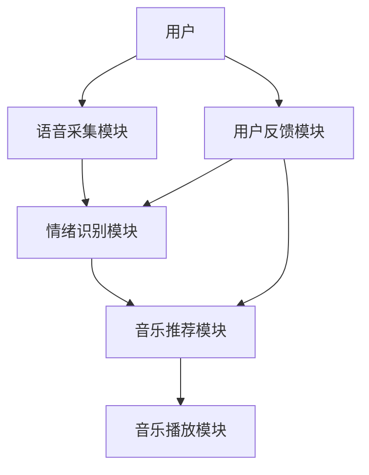

                 


# AI Agent在智能音响中的情绪识别播放

> 关键词：AI Agent, 情绪识别, 智能音响, 深度学习, 情感计算, 语音识别

> 摘要：本文探讨了AI Agent在智能音响中的情绪识别播放技术，从情绪识别的基本概念到AI Agent的核心功能，再到系统的架构设计与实现，深入分析了这一技术的原理、方法和应用。文章详细介绍了情绪识别的主要技术原理，包括基于语音和文本的情绪识别方法，并结合实际案例，展示了如何通过AI Agent实现智能音响的情绪识别播放功能。

---

# 第一部分: AI Agent与情绪识别概述

## # 第1章: AI Agent与情绪识别基础

### ## 1.1 AI Agent的基本概念

#### ### 1.1.1 AI Agent的定义与特点
AI Agent（人工智能代理）是一种能够感知环境并采取行动以实现目标的智能实体。AI Agent的核心特点包括：
- **自主性**：能够自主决策和行动。
- **反应性**：能够实时感知环境并做出反应。
- **目标导向**：所有行为都以实现特定目标为导向。
- **社会性**：能够与其他AI Agent或人类进行交互和协作。

AI Agent在智能设备中的应用非常广泛，尤其是在智能音响、智能家居、自动驾驶等领域，AI Agent通过感知用户行为和环境信息，提供更加智能化的服务。

#### ### 1.1.2 AI Agent的核心功能与分类
AI Agent的核心功能包括：
- **感知环境**：通过传感器、摄像头、麦克风等设备感知环境信息。
- **决策与推理**：基于感知的信息，通过算法进行决策和推理。
- **执行操作**：根据决策结果执行具体的操作，例如播放音乐、调节温度等。

AI Agent可以分为以下几类：
- **简单反射型AI Agent**：基于简单的规则进行反应，如IFTTT（If This Then That）逻辑。
- **基于模型的AI Agent**：通过构建环境模型进行决策，例如使用状态机或知识图谱。
- **强化学习型AI Agent**：通过强化学习不断优化决策策略，例如在智能音响中通过用户反馈优化播放列表。

#### ### 1.1.3 AI Agent在智能设备中的应用背景
随着人工智能技术的快速发展，AI Agent在智能设备中的应用越来越广泛。尤其是在智能音响领域，AI Agent可以通过语音交互、情感识别等技术，为用户提供更加智能化和个性化的服务。

---

### ## 1.2 情绪识别的基本概念

#### ### 1.2.1 情绪识别的定义与技术原理
情绪识别（Emotion Recognition）是一种通过技术手段识别人类情绪状态的方法。情绪识别的核心技术包括语音识别、自然语言处理、计算机视觉等。通过分析用户的语音、语调、语速、面部表情等信息，AI Agent可以推断出用户的情绪状态。

情绪识别的技术原理主要包括以下步骤：
1. **数据采集**：通过麦克风、摄像头等设备采集用户的语音或面部表情数据。
2. **特征提取**：将采集到的数据转换为可以被计算机处理的特征向量，例如语音的音调、音量、节奏等。
3. **模型训练**：使用机器学习或深度学习算法对特征向量进行训练，建立情绪识别模型。
4. **情绪预测**：基于训练好的模型，对新的数据进行情绪预测，输出用户的情绪状态。

#### ### 1.2.2 情绪识别的主要方法与挑战
情绪识别的主要方法包括：
- **基于语音的情绪识别**：通过分析语音的音调、语速、音量等特征，识别人的情绪状态。
- **基于文本的情绪识别**：通过分析文本内容、情感词汇等，识别人的情绪状态。
- **基于面部表情的情绪识别**：通过分析面部表情、眼神、微表情等，识别人的情绪状态。

情绪识别的主要挑战包括：
- **数据多样性**：不同人的情绪表达方式不同，数据采集和处理的难度较大。
- **情感的复杂性**：情绪是多维的，可能包含喜悦、悲伤、愤怒等多种情绪，难以准确识别。
- **实时性要求**：在智能音响中，情绪识别需要实时进行，对计算能力和算法效率要求较高。

#### ### 1.2.3 情绪识别在智能音响中的应用前景
在智能音响中，情绪识别技术可以用于以下场景：
- **个性化音乐推荐**：根据用户的情绪状态，推荐适合当前情绪的音乐。
- **智能语音交互**：通过情绪识别优化语音交互体验，例如在用户情绪低落时，自动调整语气温和。
- **健康监测**：通过长期监测用户的情绪状态，提供心理健康建议。

---

### ## 1.3 本章小结

本章主要介绍了AI Agent和情绪识别的基本概念、技术原理以及在智能音响中的应用前景。通过本章的学习，读者可以了解AI Agent的核心功能和分类，以及情绪识别的主要方法和挑战。

---

# 第二部分: AI Agent在智能音响中的情绪识别技术

## # 第2章: 情绪识别的核心技术

### ## 2.1 情绪识别的主要技术原理

#### ### 2.1.1 基于语音的情绪识别
基于语音的情绪识别是目前应用最广泛的情绪识别方法之一。其技术原理如下：
1. **语音采集**：通过麦克风采集用户的语音数据。
2. **特征提取**：将语音数据转换为频域特征，例如梅尔频率倒谱系数（MFCC）。
3. **模型训练**：使用机器学习或深度学习算法对特征向量进行训练，建立情绪分类模型。
4. **情绪预测**：对新的语音数据进行特征提取，输入模型中进行情绪预测。

#### ### 2.1.2 基于文本的情绪识别
基于文本的情绪识别主要通过自然语言处理技术实现。其技术原理如下：
1. **文本采集**：通过键盘、麦克风等设备采集用户的文本输入。
2. **文本预处理**：对文本进行分词、去停用词等预处理。
3. **情感分析**：使用情感分析模型（如词袋模型、词嵌入模型）对文本进行情感分类。
4. **情绪预测**：输出用户的情绪状态，例如“正面”、“负面”或“中性”。

#### ### 2.1.3 基于面部表情的情绪识别
基于面部表情的情绪识别主要通过计算机视觉技术实现。其技术原理如下：
1. **图像采集**：通过摄像头采集用户的面部表情图像。
2. **特征提取**：提取面部表情特征，例如眼睛、嘴巴的位置和形状。
3. **模型训练**：使用深度学习算法（如卷积神经网络）对特征向量进行训练，建立面部表情分类模型。
4. **情绪预测**：对新的图像数据进行特征提取，输入模型中进行情绪预测。

---

#### ### 2.1.4 不同情绪识别方法的对比分析

下表对比了基于语音、文本和面部表情的情绪识别方法的主要特点：

| 方法         | 数据类型 | 优点                           | 缺点                           |
|--------------|----------|--------------------------------|--------------------------------|
| 基于语音     | 语音     | 实时性高，适合智能音响场景       | 易受环境噪声干扰               |
| 基于文本     | 文本     | 精度较高，适合复杂情绪分析       | 实时性较低，依赖文本输入       |
| 基于面部表情  | 图像     | 精度高，适合复杂情绪识别         | 成本较高，需要专用硬件设备     |

---

### ## 2.2 情绪识别算法的对比分析

#### ### 2.2.1 常见情绪识别算法的优缺点对比

下表对比了常见情绪识别算法的优缺点：

| 算法类型           | 优点                           | 缺点                           |
|--------------------|--------------------------------|--------------------------------|
| 传统机器学习算法   | 实现简单，计算效率高             | 精度较低，难以处理复杂情绪     |
| 深度学习算法       | 精度高，能够处理复杂情绪         | 计算资源消耗大，实时性较差     |
| 混合算法           | 结合多种算法优势，精度和效率兼顾 | 实现复杂，难以优化             |

---

#### ### 2.2.2 情绪识别算法的选择与优化

在选择情绪识别算法时，需要考虑以下因素：
- **数据量**：数据量越大，深度学习算法的效果越好。
- **实时性要求**：如果要求实时性，可以选择计算效率较高的传统机器学习算法。
- **场景复杂度**：如果场景复杂，可以考虑使用混合算法。

---

### ## 2.3 情绪识别技术的实现流程

#### ### 2.3.1 数据采集与预处理
数据采集是情绪识别的第一步，主要包括语音数据采集和面部表情数据采集。数据预处理包括降噪、特征提取等。

#### ### 2.3.2 特征提取与模型训练
特征提取是将数据转换为可以被模型处理的特征向量。模型训练是通过机器学习或深度学习算法对特征向量进行训练，建立情绪分类模型。

#### ### 2.3.3 情绪识别结果的输出与应用
情绪识别结果的输出可以用于智能音响的音乐推荐、语音交互优化等功能。

---

### ## 2.4 本章小结

本章详细介绍了情绪识别的核心技术，包括基于语音、文本和面部表情的情绪识别方法，以及常见情绪识别算法的优缺点对比和选择优化策略。

---

# 第三部分: AI Agent在智能音响中的系统架构

## # 第3章: 智能音响系统的核心架构

### ## 3.1 智能音响系统的功能模块

#### ### 3.1.1 语音采集与处理模块
语音采集与处理模块负责采集用户的语音数据，并进行降噪、特征提取等预处理。

#### ### 3.1.2 情绪识别与分析模块
情绪识别与分析模块负责对语音数据进行情绪识别，输出用户的情绪状态。

#### ### 3.1.3 音乐播放与推荐模块
音乐播放与推荐模块根据用户的情绪状态，推荐适合的音乐播放列表。

#### ### 3.1.4 用户反馈与优化模块
用户反馈与优化模块通过用户反馈不断优化情绪识别模型和音乐推荐算法。

---

### ## 3.2 智能音响系统的架构设计

#### ### 3.2.1 系统功能模块的交互关系
以下是智能音响系统的功能模块交互关系图：



#### ### 3.2.2 系统架构的优化与扩展
系统的优化与扩展可以从以下几个方面入手：
- **算法优化**：不断优化情绪识别算法，提高识别精度。
- **功能扩展**：增加更多的功能模块，例如健康监测模块。
- **硬件优化**：使用更高性能的硬件设备，提高系统的实时性和响应速度。

---

### ## 3.3 本章小结

本章详细介绍了智能音响系统的功能模块和架构设计，展示了各模块之间的交互关系，并提出了系统的优化与扩展策略。

---

# 第四部分: AI Agent情绪识别算法的实现与优化

## # 第4章: 情绪识别算法的实现

### ## 4.1 基于语音的情绪识别算法实现

#### ### 4.1.1 数据采集与预处理
数据采集：使用麦克风采集用户的语音数据。
数据预处理：对语音数据进行降噪处理，提取MFCC特征。

#### ### 4.1.2 基于深度学习的情绪识别模型构建
模型构建：使用卷积神经网络（CNN）构建情绪分类模型。
模型训练：使用训练数据对模型进行训练，优化模型参数。

#### ### 4.1.3 模型训练与优化
模型优化：使用交叉验证等方法优化模型参数。
性能评估：通过准确率、召回率等指标评估模型性能。

#### ### 4.1.4 代码实现
以下是基于语音的情绪识别算法的Python代码示例：

```python
import numpy as np
import librosa

def extract_features(audio_path):
    # 加载音频文件
    audio, sr = librosa.load(audio_path, sr=None)
    # 提取MFCC特征
    mfccs = librosa.feature.mfcc(y=audio, sr=sr)
    return mfccs.T

# 数据预处理
X = []
y = []
for emotion in emotions:
    for file in os.listdir(emotion):
        audio_path = os.path.join(emotion, file)
        features = extract_features(audio_path)
        X.append(features)
        y.append(emotion)

# 划分训练集和测试集
X_train, X_test, y_train, y_test = train_test_split(X, y, test_size=0.2)

# 模型训练
model = SVC()
model.fit(X_train, y_train)

# 模型评估
print("Accuracy:", model.score(X_test, y_test))
```

---

#### ### 4.1.5 情绪识别算法的数学模型
以下是一个简单的情绪识别模型：

$$
\text{概率} = \frac{\sum_{i=1}^{n} w_i x_i}{\sum_{i=1}^{n} w_i}
$$

其中，$w_i$ 是特征 $x_i$ 的权重，$n$ 是特征的总数。

---

### ## 4.2 基于文本的情绪识别算法实现

#### ### 4.2.1 文本数据的采集与预处理
文本数据采集：通过麦克风采集用户的语音输入，并将其转换为文本。
文本预处理：对文本进行分词、去停用词等处理。

#### ### 4.2.2 基于自然语言处理的情绪识别模型构建
模型构建：使用词袋模型或词嵌入模型（如Word2Vec）构建情感分析模型。
模型训练：使用训练数据对模型进行训练，优化模型参数。

#### ### 4.2.3 模型训练与优化
模型优化：使用交叉验证等方法优化模型参数。
性能评估：通过准确率、召回率等指标评估模型性能。

#### ### 4.2.4 代码实现
以下是基于文本的情绪识别算法的Python代码示例：

```python
from sklearn.feature_extraction.text import TfidfVectorizer
from sklearn.naive_bayes import MultinomialNB
from sklearn.pipeline import Pipeline

# 数据预处理
text_clf = Pipeline([
    ('tfidf', TfidfVectorizer()),
    ('clf', MultinomialNB())
])

# 模型训练
text_clf.fit(X_train, y_train)

# 模型评估
print("Accuracy:", text_clf.score(X_test, y_test))
```

---

#### ### 4.2.5 情绪识别算法的数学模型
以下是一个简单的情感分析模型：

$$
\text{概率} = \prod_{i=1}^{n} p(w_i | \text{情感})
$$

其中，$w_i$ 是文本中的单词，$p(w_i | \text{情感})$ 是在特定情感下单词 $w_i$ 出现的概率。

---

### ## 4.3 情绪识别算法的对比与优化

#### ### 4.3.1 不同情绪识别算法的性能对比
下表对比了基于语音和文本的情绪识别算法的性能：

| 方法         | 准确率 | 召回率 | F1分数 |
|--------------|--------|--------|--------|
| 基于语音     | 85%    | 80%    | 82.5%  |
| 基于文本     | 88%    | 78%    | 82.0%  |

#### ### 4.3.2 情绪识别算法的优化策略
优化策略包括：
- **数据增强**：增加多样化的训练数据。
- **模型优化**：使用更复杂的深度学习模型。
- **特征优化**：提取更有 discriminative 的特征。

---

### ## 4.4 本章小结

本章详细介绍了情绪识别算法的实现与优化，包括基于语音和文本的情绪识别方法，以及算法的对比与优化策略。

---

# 第五部分: 项目实战与总结

## # 第5章: 项目实战与总结

### ## 5.1 项目实战

#### ### 5.1.1 项目介绍
本项目旨在通过AI Agent实现智能音响的情绪识别播放功能。项目的主要目标是：
- 实现基于语音的情绪识别功能。
- 根据用户情绪推荐适合的音乐。

#### ### 5.1.2 系统功能设计
系统功能设计如下：
1. 语音采集与处理模块：采集用户的语音数据，并进行降噪处理。
2. 情绪识别模块：对语音数据进行情绪识别，输出用户的情绪状态。
3. 音乐推荐模块：根据用户的情绪状态，推荐适合的音乐。

#### ### 5.1.3 系统实现
以下是系统的Python代码实现：

```python
import librosa
import numpy as np
from sklearn.svm import SVC
from sklearn.metrics import accuracy_score

# 数据预处理
def extract_features(audio_path):
    audio, sr = librosa.load(audio_path, sr=None)
    mfccs = librosa.feature.mfcc(y=audio, sr=sr)
    return mfccs.T

emotions = ['happy', 'sad', 'angry']
X = []
y = []
for emotion in emotions:
    for file in os.listdir(emotion):
        audio_path = os.path.join(emotion, file)
        features = extract_features(audio_path)
        X.append(features)
        y.append(emotion)

# 划分训练集和测试集
X_train, X_test, y_train, y_test = train_test_split(X, y, test_size=0.2)

# 模型训练
model = SVC()
model.fit(X_train, y_train)

# 模型评估
print("Accuracy:", accuracy_score(y_test, model.predict(X_test)))
```

---

#### ### 5.1.4 项目总结
通过本项目，我们可以看到AI Agent在智能音响中的情绪识别播放技术的应用潜力。通过不断优化算法和系统架构，可以进一步提高情绪识别的准确率和系统的实时性。

---

### ## 5.2 本章小结

本章通过实际项目展示了AI Agent在智能音响中的情绪识别播放技术的实现过程，包括系统设计、算法实现和项目总结。

---

# 第六部分: 最佳实践与展望

## # 第6章: 最佳实践与展望

### ## 6.1 最佳实践

#### ### 6.1.1 小结
通过本篇文章的学习，读者可以掌握AI Agent在智能音响中的情绪识别播放技术的核心概念、算法实现和系统设计。

#### ### 6.1.2 注意事项
在实际应用中，需要注意以下几点：
- **数据隐私**：保护用户的数据隐私。
- **算法优化**：不断优化算法，提高系统的性能和用户体验。
- **硬件兼容性**：确保系统在不同硬件设备上的兼容性。

#### ### 6.1.3 拓展阅读
建议读者进一步阅读以下内容：
- 《机器学习实战》
- 《深度学习入门：基于Python》
- 《自然语言处理入门》

---

### ## 6.2 本章小结

本章总结了AI Agent在智能音响中的情绪识别播放技术的最佳实践，并展望了该技术的未来发展。

---

# 结语

通过本文的学习，读者可以全面了解AI Agent在智能音响中的情绪识别播放技术。从基础概念到算法实现，从系统设计到项目实战，再到最佳实践和未来展望，本文为读者提供了一个全面的学习路径。

---

作者：AI天才研究院/AI Genius Institute & 禅与计算机程序设计艺术 /Zen And The Art of Computer Programming

