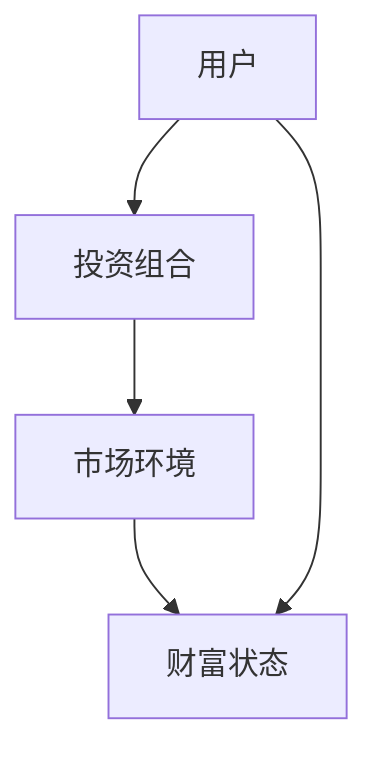
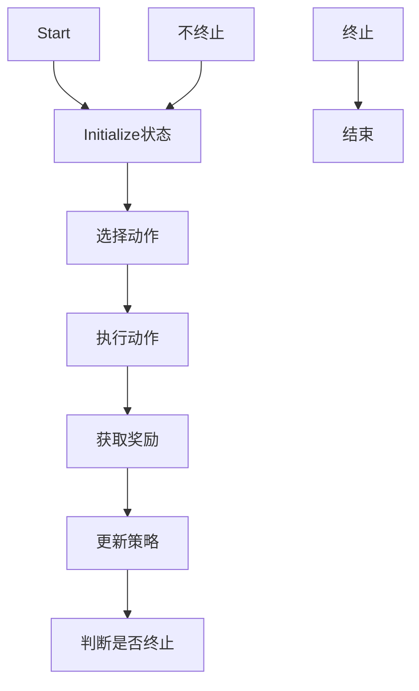
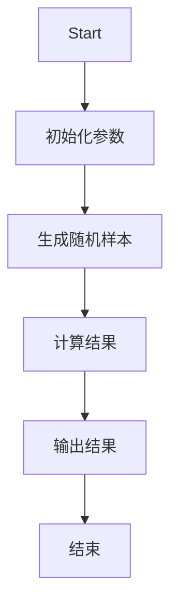
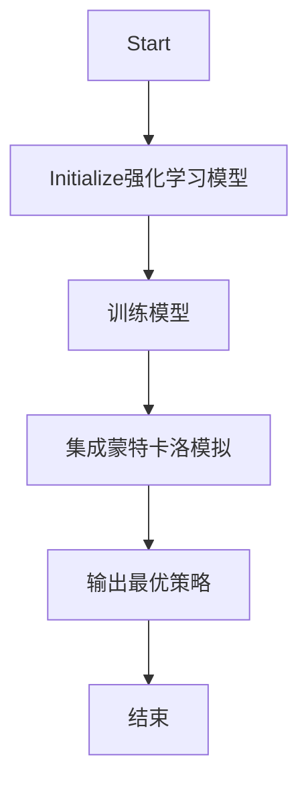
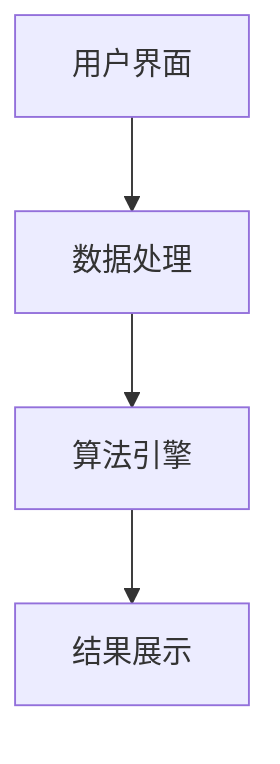
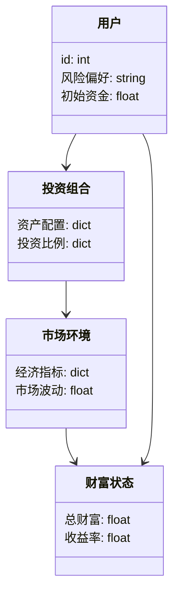
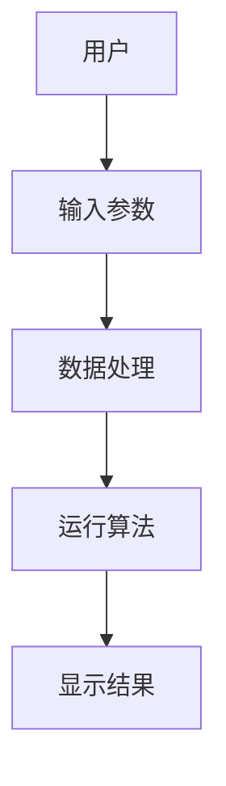

                 


# AI驱动的个人财富积累路径多场景模拟器

> 关键词：AI驱动、财富积累、路径模拟、多场景、强化学习、蒙特卡洛模拟

> 摘要：本文将详细探讨AI驱动的个人财富积累路径多场景模拟器的设计与实现。通过分析传统财富管理工具的不足，提出一种基于强化学习和蒙特卡洛模拟的AI驱动模拟器，旨在帮助用户在不同场景下优化财富积累策略。文章内容包括背景介绍、核心概念、算法原理、系统架构、项目实战和最佳实践等部分，为读者提供全面的技术解读。

---

# 第1章: AI驱动的个人财富积累路径模拟器背景介绍

## 1.1 问题背景与现状
### 1.1.1 传统财富积累路径的局限性
传统的财富积累路径主要依赖于固定的投资组合和简单的历史数据分析，难以应对市场波动和复杂多变的经济环境。例如，简单的资产配置模型无法有效捕捉市场变化，导致财富增长受限。

### 1.1.2 AI技术在财富管理中的应用现状
近年来，AI技术在金融领域的应用越来越广泛。通过机器学习模型，可以实时分析市场数据，预测投资回报率，并优化投资组合。然而，现有的AI驱动财富管理工具大多集中在单一场景，缺乏多场景下的全局优化能力。

### 1.1.3 当前财富模拟工具的不足
现有的财富模拟工具通常基于静态数据和简单的线性模型，难以应对复杂的经济环境和多样化的需求。用户需要一个能够模拟多种场景并提供优化建议的工具。

## 1.2 问题描述与需求分析
### 1.2.1 财富积累路径模拟的核心问题
如何在多种经济环境下，找到最优的财富积累路径，实现财富最大化。

### 1.2.2 用户需求与场景分析
用户需要一个能够模拟不同经济场景，提供个性化投资建议的工具。例如，用户可能关心通货膨胀、市场波动、税收政策变化等多种因素对财富积累的影响。

### 1.2.3 模拟器的功能需求
- 多场景模拟：支持不同经济环境下的财富积累路径模拟。
- AI驱动：利用强化学习和蒙特卡洛模拟优化投资策略。
- 个性化建议：根据用户风险偏好提供定制化建议。

## 1.3 模拟器的目标与意义
### 1.3.1 模拟器的目标
实现一个能够模拟多种经济场景，并提供最优财富积累策略的AI驱动模拟器。

### 1.3.2 模拟器的应用价值
帮助用户在复杂多变的经济环境中，制定最优的财富积累策略，实现财富最大化。

### 1.3.3 对个人财富管理的潜在影响
通过AI模拟器，用户可以更好地理解不同投资策略的风险和收益，在复杂环境中做出更明智的决策。

## 1.4 本章小结
本章介绍了AI驱动的个人财富积累路径模拟器的背景和需求，明确了模拟器的目标和意义。

---

# 第2章: AI驱动的个人财富积累路径模拟器核心概念

## 2.1 核心概念定义
### 2.1.1 个人财富积累路径的定义
个人财富积累路径是指在一定时间内，通过不同投资组合和策略，实现财富最大化的过程。

### 2.1.2 多场景模拟器的定义
多场景模拟器是指能够模拟多种经济环境下财富积累路径的工具。

### 2.1.3 AI驱动的核心机制
AI驱动的核心机制是通过强化学习和蒙特卡洛模拟，优化投资策略。

## 2.2 核心概念的属性对比
### 2.2.1 财富积累路径的属性分析
| 属性 | 描述 |
|------|------|
| 时间范围 | 指定的时间段 |
| 投资组合 | 包含多种资产的投资组合 |
| 风险偏好 | 用户对风险的偏好程度 |
| 市场环境 | 不同的经济环境 |

### 2.2.2 不同场景的特征对比
| 场景 | 特征 |
|------|------|
| 牛市 | 高回报，低风险 |
| 熊市 | 低回报，高风险 |

### 2.2.3 AI驱动的特征与传统方法的对比
| 特征 | AI驱动 | 传统方法 |
|------|--------|----------|
| 模拟精度 | 高 | 低 |
| 算法复杂度 | 高 | 低 |

## 2.3 实体关系模型
### 2.3.1 实体关系图（ER图）


### 2.3.2 实体之间的关系描述
- 用户通过投资组合与市场环境交互，最终影响财富状态。

### 2.3.3 实体属性与关系的详细说明
- 用户：包括风险偏好、初始资金等属性。
- 投资组合：包括资产配置、投资比例等属性。
- 市场环境：包括经济指标、市场波动等属性。

## 2.4 本章小结
本章详细定义了AI驱动的个人财富积累路径模拟器的核心概念，并通过属性对比和实体关系图，明确了各实体之间的关系。

---

# 第3章: AI驱动的个人财富积累路径模拟器算法原理

## 3.1 算法原理概述
### 3.1.1 强化学习在财富模拟中的应用
强化学习通过不断试错，找到最优的投资策略。

### 3.1.2 蒙特卡洛模拟的基本原理
蒙特卡洛模拟通过随机采样，预测市场波动对财富的影响。

### 3.1.3 深度学习在路径预测中的作用
深度学习可以捕捉市场数据中的复杂模式，提高预测精度。

## 3.2 算法流程图
### 3.2.1 强化学习算法流程


### 3.2.2 蒙特卡洛模拟流程


### 3.2.3 组合算法的协同流程


## 3.3 算法实现代码
### 3.3.1 环境搭建与依赖安装
```bash
pip install numpy matplotlib keras
```

### 3.3.2 核心算法代码实现
```python
import numpy as np
import keras
import matplotlib.pyplot as plt

# 定义强化学习模型
model = keras.Sequential([
    keras.layers.Dense(32, activation='relu'),
    keras.layers.Dense(1, activation='linear')
])

# 编译模型
model.compile(optimizer='adam', loss='mean_squared_error')

# 训练模型
model.fit(x_train, y_train, epochs=100, batch_size=32)
```

### 3.3.3 代码运行与结果分析
通过训练模型，可以预测市场波动下的最优投资策略，并通过蒙特卡洛模拟验证策略的有效性。

## 3.4 本章小结
本章详细介绍了AI驱动模拟器的算法原理，包括强化学习和蒙特卡洛模拟，并通过代码示例展示了算法的实现过程。

---

# 第4章: AI驱动的个人财富积累路径模拟器系统架构设计

## 4.1 系统架构概述
### 4.1.1 系统功能模块划分
- 用户界面模块
- 数据处理模块
- 算法引擎模块
- 结果展示模块

### 4.1.2 系统架构的分层设计
- 数据层：存储用户数据和市场数据。
- 业务逻辑层：处理用户请求，调用算法引擎。
- 表现层：展示结果，提供用户交互界面。

### 4.1.3 模块之间的交互关系


## 4.2 领域模型设计
### 4.2.1 领域模型类图


### 4.2.2 类与类之间的关系描述
- 用户通过投资组合与市场环境交互，最终影响财富状态。

### 4.2.3 类的属性与方法设计
- 用户类：属性包括id、风险偏好、初始资金。
- 投资组合类：方法包括调整资产配置、计算投资比例。
- 市场环境类：方法包括获取经济指标、计算市场波动。

## 4.3 系统架构图
### 4.3.1 系统架构的Mermaid图


### 4.3.2 各模块的功能描述
- 用户界面：接收用户输入，显示模拟结果。
- 数据处理：处理市场数据，生成输入数据。
- 算法引擎：运行强化学习和蒙特卡洛模拟，生成优化策略。
- 结果展示：展示模拟结果，提供可视化界面。

### 4.3.3 系统扩展性分析
系统架构设计具有良好的扩展性，可以方便地添加新的算法和场景。

## 4.4 接口与交互设计
### 4.4.1 系统接口设计
- 用户界面提供输入参数，如风险偏好、初始资金等。
- 数据处理模块接收市场数据，生成输入数据。
- 算法引擎接收输入数据，运行算法，生成结果。
- 结果展示模块接收结果，显示给用户。

### 4.4.2 交互流程图


## 4.5 本章小结
本章详细设计了AI驱动模拟器的系统架构，包括功能模块划分、类图设计和交互流程。

---

# 第5章: AI驱动的个人财富积累路径模拟器项目实战

## 5.1 环境安装与配置
### 5.1.1 安装依赖
```bash
pip install numpy keras matplotlib
```

### 5.1.2 配置开发环境
- 安装Jupyter Notebook或PyCharm作为开发环境。

## 5.2 核心代码实现
### 5.2.1 强化学习模型实现
```python
import numpy as np
import keras
import matplotlib.pyplot as plt

# 定义强化学习模型
model = keras.Sequential([
    keras.layers.Dense(32, activation='relu'),
    keras.layers.Dense(1, activation='linear')
])

# 编译模型
model.compile(optimizer='adam', loss='mean_squared_error')

# 训练模型
model.fit(x_train, y_train, epochs=100, batch_size=32)
```

### 5.2.2 蒙特卡洛模拟实现
```python
import numpy as np
import matplotlib.pyplot as plt

def monte_carlo_simulation():
    np.random.seed(42)
    simulations = 1000
    results = []
    for _ in range(simulations):
        # 生成随机市场数据
        market_data = np.random.normal(0, 1, 100)
        # 计算财富变化
        wealth_change = np.cumsum(market_data)
        results.append(wealth_change)
    # 绘制结果
    plt.plot(results)
    plt.show()

monte_carlo_simulation()
```

### 5.2.3 组合算法实现
```python
import numpy as np
import keras
import matplotlib.pyplot as plt

# 定义强化学习模型
model = keras.Sequential([
    keras.layers.Dense(32, activation='relu'),
    keras.layers.Dense(1, activation='linear')
])

# 编译模型
model.compile(optimizer='adam', loss='mean_squared_error')

# 训练模型
model.fit(x_train, y_train, epochs=100, batch_size=32)

# 运行蒙特卡洛模拟
def monte_carlo_simulation():
    np.random.seed(42)
    simulations = 1000
    results = []
    for _ in range(simulations):
        market_data = np.random.normal(0, 1, 100)
        wealth_change = np.cumsum(market_data)
        results.append(wealth_change)
    plt.plot(results)
    plt.show()

monte_carlo_simulation()
```

## 5.3 案例分析与结果展示
### 5.3.1 案例分析
通过模拟不同市场环境下的财富积累路径，验证算法的有效性。

### 5.3.2 结果展示
通过图表展示模拟结果，分析不同策略下的财富增长情况。

## 5.4 项目总结
### 5.4.1 项目实现的关键点
- 强化学习模型的训练与优化
- 蒙特卡洛模拟的实现与应用
- 系统架构的设计与实现

### 5.4.2 项目的局限性
- 数据依赖性强，需要大量历史数据
- 算法复杂度高，运行时间较长

## 5.5 本章小结
本章通过实战项目，详细展示了AI驱动模拟器的实现过程，包括环境配置、代码实现和案例分析。

---

# 第6章: AI驱动的个人财富积累路径模拟器最佳实践

## 6.1 小结
### 6.1.1 核心要点总结
- 强化学习和蒙特卡洛模拟的应用
- 系统架构的设计与实现

## 6.2 注意事项
### 6.2.1 数据质量的重要性
确保输入数据的准确性和完整性。

### 6.2.2 算法选择的策略
根据具体需求选择合适的算法组合。

## 6.3 拓展阅读
### 6.3.1 相关领域的最新研究
- 基于深度学习的财富管理研究
- 多目标优化在财富模拟中的应用

## 6.4 本章小结
本章总结了AI驱动模拟器的最佳实践，提供了注意事项和拓展阅读方向。

---

# 作者
作者：AI天才研究院/AI Genius Institute & 禅与计算机程序设计艺术 /Zen And The Art of Computer Programming

---

感谢您的阅读！如果需要进一步了解或有任何问题，请随时联系。

