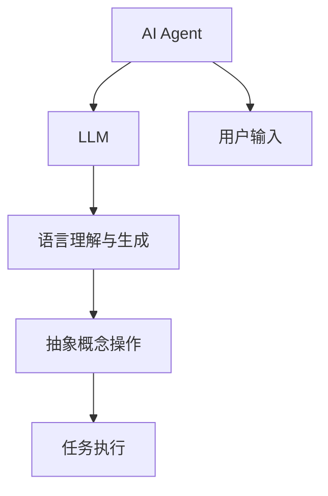
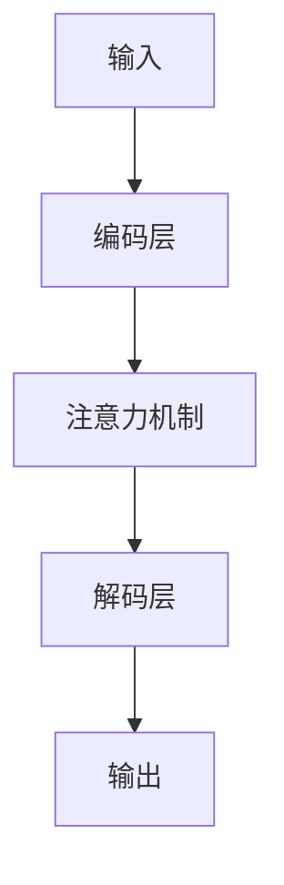
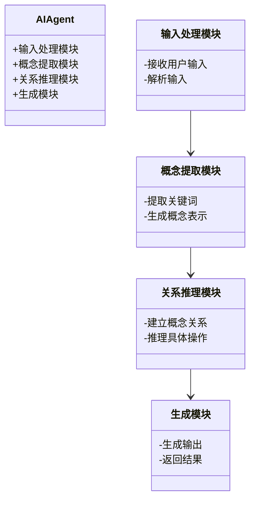
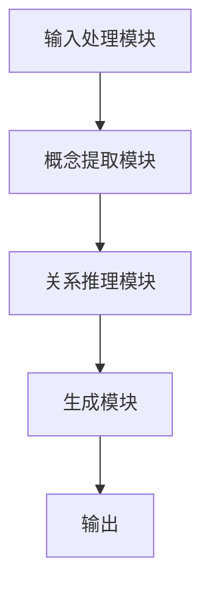
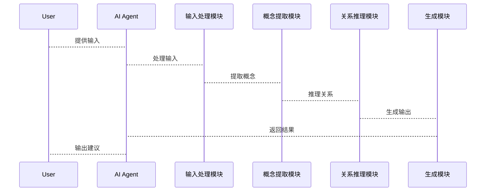

                 


# LLM在AI Agent抽象概念操作中的应用

> 关键词：LLM, AI Agent, 抽象概念操作, 大语言模型, AI智能体, 自然语言处理

> 摘要：本文深入探讨了大语言模型（LLM）在AI Agent抽象概念操作中的应用，从理论基础到实际案例，详细分析了如何利用LLM实现抽象概念的识别、推理和生成。文章涵盖了核心概念、算法原理、系统架构和项目实战等部分，为读者提供了全面的技术指南。

---

# 第一部分: 问题背景与概念描述

## 第1章: 问题背景

### 1.1 问题背景

#### 1.1.1 当前AI Agent的发展现状

AI Agent（人工智能代理）近年来得到了快速发展，广泛应用于自动驾驶、智能助手、智能客服等领域。AI Agent能够自主感知环境、理解用户需求，并执行复杂任务。然而，现有的AI Agent在处理抽象概念操作时仍面临诸多挑战，例如如何理解复杂的语义关系、如何进行多步推理等。

#### 1.1.2 LLM技术的崛起与应用

大语言模型（LLM）如GPT-3、PaLM等在自然语言处理领域取得了突破性进展。LLM能够处理大规模的文本数据，具备强大的上下文理解和生成能力，为AI Agent的抽象概念操作提供了强大的技术支持。

#### 1.1.3 问题提出的必要性

尽管LLM和AI Agent都取得了显著进展，但如何将LLM应用于AI Agent的抽象概念操作仍是一个开放性问题。本文旨在探讨LLM在AI Agent中的具体应用，分析其优势与挑战，并提出可行的解决方案。

### 1.2 问题描述

#### 1.2.1 AI Agent的核心功能与目标

AI Agent的核心功能包括感知环境、理解用户需求、执行任务、学习优化等。其目标是通过智能化手段，为用户提供高效、准确的服务。

#### 1.2.2 LLM在AI Agent中的角色与作用

LLM在AI Agent中主要扮演语言理解与生成的角色，能够帮助AI Agent更好地理解用户的输入、生成自然的回复，并进行复杂的语义推理。

#### 1.2.3 抽象概念操作的定义与范围

抽象概念操作是指对抽象概念（如“建议”、“推荐”等）的识别、理解和生成过程。例如，当用户说“建议我明天穿什么衣服”，AI Agent需要理解“建议”这一概念，并结合天气数据生成具体的穿衣建议。

### 1.3 问题解决思路

#### 1.3.1 LLM与AI Agent的结合方式

通过将LLM嵌入到AI Agent中，利用其强大的语言处理能力，提升AI Agent的理解与生成能力。

#### 1.3.2 抽象概念操作的具体实现方法

通过概念识别、关系建模和生成推理等步骤，实现抽象概念的操作。

#### 1.3.3 系统设计与优化策略

设计模块化的系统架构，优化LLM与AI Agent的交互流程，提升系统的效率和准确性。

### 1.4 边界与外延

#### 1.4.1 LLM在AI Agent中的应用边界

LLM的应用主要集中在语言理解和生成方面，对于非语言信息（如图像、视频）的处理能力有限。

#### 1.4.2 抽象概念操作的适用场景

适用于需要处理复杂语义关系的任务，如智能客服、个性化推荐等。

#### 1.4.3 相关技术的对比与区分

对比了LLM与传统NLP技术、AI Agent与传统智能系统的差异，明确了LLM在AI Agent中的独特优势。

### 1.5 概念结构与核心要素

#### 1.5.1 LLM与AI Agent的关系图



#### 1.5.2 抽象概念操作的核心要素分解

- **输入处理**：接收用户的输入，提取关键词和语义信息。
- **概念识别**：识别输入中的抽象概念。
- **关系建模**：建立概念之间的关系。
- **生成推理**：根据概念关系生成具体的操作。

---

# 第二部分: 核心概念与联系

## 第2章: 核心概念原理

### 2.1 LLM的核心原理

#### 2.1.1 大语言模型的训练机制

LLM通过大规模的数据训练，学习语言的分布规律。训练过程包括前向传播和反向传播，通过梯度下降优化模型参数。

#### 2.1.2 前向传播与后向传播的数学模型



数学公式：
$$
\text{损失函数} = \text{交叉熵损失} = -\sum_{i=1}^{n} y_i \log(p(y_i))
$$
$$
\text{梯度下降} = \theta := \theta - \eta \frac{\partial L}{\partial \theta}
$$

#### 2.1.3 注意力机制与Transformer架构

注意力机制通过计算输入序列中每个词的重要性，帮助模型关注关键信息。Transformer架构通过自注意力机制和前馈网络提升模型的表达能力。

### 2.2 AI Agent的核心原理

#### 2.2.1 AI Agent的定义与功能模块

AI Agent由感知模块、决策模块、执行模块和学习模块组成，能够自主完成复杂任务。

#### 2.2.2 状态感知、决策与执行的流程

AI Agent通过感知模块获取环境信息，通过决策模块制定策略，通过执行模块完成任务。

#### 2.2.3 多模态交互与任务执行机制

AI Agent能够处理多种输入形式（如文本、语音、图像），并根据输入生成相应的输出。

### 2.3 抽象概念操作的原理

#### 2.3.1 抽象概念的提取与表示

通过NLP技术提取关键词和语义信息，将其表示为向量或符号。

#### 2.3.2 概念间的关系建模

使用知识图谱或语义网络建立概念之间的关系，如“建议”与“天气”的关系。

#### 2.3.3 操作的抽象与具体实现的映射

将抽象概念映射到具体的操作步骤，如“建议”映射到“查询天气”和“推荐穿衣”。

---

## 第3章: 核心概念对比与联系

### 3.1 LLM与AI Agent的对比分析

| 特性          | LLM                     | AI Agent                  |
|---------------|-------------------------|---------------------------|
| 核心功能      | 语言理解与生成         | 环境感知与任务执行       |
| 技术特点      | 基于Transformer架构     | 多模态交互与自主决策     |
| 应用场景      | 自然语言处理           | 智能助手、自动驾驶等      |

### 3.2 LLM与传统NLP技术的对比

| 特性          | LLM                     | 传统NLP技术               |
|---------------|-------------------------|---------------------------|
| 处理能力      | 强大上下文理解           | 局限于特定任务             |
| 模型规模      | 大规模预训练             | 较小规模，针对性训练       |
| 应用范围      | 广泛应用于各种任务       | 适用于特定领域             |

### 3.3 抽象概念操作与传统任务的对比

| 特性          | 抽象概念操作             | 传统任务                 |
|---------------|-------------------------|---------------------------|
| 任务类型      | 需要理解抽象概念         | 处理具体数据或任务         |
| 难度级别      | 高，涉及复杂推理         | 中等或低，基于具体规则     |
| 应用场景      | 智能客服、个性化推荐       | 数据分类、文本摘要         |

---

## 第4章: 核心概念的联系

### 4.1 LLM与AI Agent的关系

通过将LLM嵌入到AI Agent中，AI Agent能够更准确地理解和生成语言，从而提升其抽象概念操作的能力。

### 4.2 抽象概念操作与AI Agent功能的联系

抽象概念操作是AI Agent完成复杂任务的核心环节，直接影响其用户体验和服务质量。

---

# 第三部分: 算法原理

## 第5章: 算法原理

### 5.1 LLM的算法原理

#### 5.1.1 前向传播过程

1. 输入文本经过编码层，生成嵌入表示。
2. 应用注意力机制，计算每个词的重要性。
3. 通过解码层生成输出文本。

#### 5.1.2 后向传播过程

1. 计算预测输出与真实输出的损失。
2. 使用梯度下降优化模型参数。

### 5.2 AI Agent的决策算法

#### 5.2.1 基于规则的决策算法

通过预定义的规则进行决策，适用于简单场景。

#### 5.2.2 基于机器学习的决策算法

通过训练模型进行决策，适用于复杂场景。

### 5.3 抽象概念操作的算法实现

#### 5.3.1 概念提取算法

使用NLP技术提取关键词和语义信息。

#### 5.3.2 概念关系推理算法

基于知识图谱进行关系推理。

---

## 第6章: 算法实现的数学模型

### 6.1 LLM的数学模型

损失函数：
$$
L = -\sum_{i=1}^{n} y_i \log(p(y_i))
$$

梯度下降：
$$
\theta := \theta - \eta \frac{\partial L}{\partial \theta}
$$

### 6.2 AI Agent的决策模型

基于Q-learning的决策模型：
$$
Q(s, a) = r + \gamma \max_{a'} Q(s', a')
$$

---

# 第四部分: 系统分析与架构设计

## 第7章: 系统分析

### 7.1 问题场景介绍

设计一个AI Agent，能够根据用户输入生成具体的穿衣建议。

### 7.2 系统功能设计



---

## 第8章: 系统架构设计

### 8.1 系统架构设计



### 8.2 系统接口设计

- 输入接口：接收用户输入。
- 输出接口：生成具体的穿衣建议。

### 8.3 系统交互流程



---

## 第9章: 系统优化

### 9.1 系统优化策略

1. 优化LLM的推理速度。
2. 提升概念提取的准确率。
3. 增强关系推理的深度。

---

# 第五部分: 项目实战

## 第10章: 项目实战

### 10.1 环境安装

安装Python、TensorFlow、Keras等库。

### 10.2 核心代码实现

```python
def extract_concepts(text):
    # 实现概念提取算法
    pass

def infer_relations(concepts):
    # 实现关系推理算法
    pass

def generate_output(relations):
    # 实现生成算法
    pass
```

### 10.3 代码解读与分析

1. `extract_concepts`函数：从输入文本中提取关键词和语义信息。
2. `infer_relations`函数：根据提取的概念建立关系，并推理具体操作。
3. `generate_output`函数：根据推理结果生成具体的输出。

### 10.4 实际案例分析

以“建议我明天穿什么衣服”为例，展示代码的实现过程和结果。

### 10.5 项目总结

通过该项目，验证了LLM在AI Agent中的应用效果，为后续研究提供了参考。

---

## 第11章: 最佳实践

### 11.1 技巧与经验分享

1. 合理选择模型参数，避免过拟合。
2. 定期更新模型，保持其性能。

### 11.2 注意事项

1. 注意模型的计算效率。
2. 确保数据的安全性和隐私性。

### 11.3 拓展阅读

推荐相关领域的书籍和论文，供读者深入学习。

---

## 第12章: 总结与展望

### 12.1 总结

本文详细探讨了LLM在AI Agent中的应用，分析了其核心概念、算法原理和系统架构，并通过项目实战验证了其可行性。

### 12.2 展望

未来，随着LLM和AI Agent技术的不断发展，其在抽象概念操作中的应用将更加广泛和深入。

---

# 作者

作者：AI天才研究院/AI Genius Institute & 禅与计算机程序设计艺术/Zen And The Art of Computer Programming

