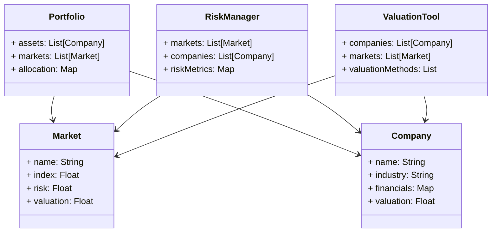
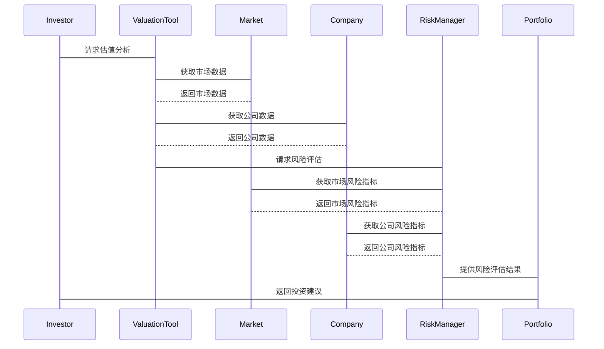

                 


# 价值投资中的全球视野：跨境投资的机遇与挑战

> 关键词：价值投资，全球视野，跨境投资，风险管理，估值方法，资产配置

> 摘要：本文从价值投资的全球视角出发，深入探讨跨境投资的机遇与挑战。通过分析全球经济一体化背景下的投资环境，结合具体案例，阐述如何在全球市场中寻找投资机会，制定合理的投资策略，并有效管理相关风险。文章还介绍了跨境投资中的估值方法与风险管理工具，为投资者提供实用的指导。

---

## 第一章：价值投资与全球视野的背景介绍

### 1.1 价值投资的核心概念

#### 1.1.1 价值投资的定义与起源

价值投资是一种以基本面分析为基础的投资策略，起源于20世纪初，由本杰明·格雷厄姆和戴维·多德提出。其核心思想是寻找市场价值低于内在价值的股票，长期持有以获得超额收益。

#### 1.1.2 全球化视角在价值投资中的重要性

随着全球经济一体化的深入，单一市场的投资机会逐渐受限，投资者需要从全球范围内寻找投资标的。全球化视角可以帮助投资者分散风险，捕捉不同市场的投资机会。

#### 1.1.3 跨境投资的定义与特点

跨境投资是指跨越国界进行的投资活动，包括股票、债券、基金等多种资产类别。其特点包括全球化资产配置、多样化风险分散以及对不同市场环境的适应性。

### 1.2 跨境投资的背景与发展趋势

#### 1.2.1 全球经济一体化的背景

随着国际贸易和资本流动的自由化，全球经济一体化趋势明显，为跨境投资提供了基础条件。

#### 1.2.2 跨境投资的发展历程

从早期的国际投资到现在的全球化配置，跨境投资经历了从局部到全球的扩展过程。

#### 1.2.3 当前全球投资环境的特点

当前全球投资环境呈现出市场分割、政策差异大、经济周期异步等特点，为跨境投资者提供了多样化的选择。

---

## 第二章：跨境投资的机遇与挑战

### 2.1 跨境投资的主要机遇

#### 2.1.1 全球市场分散化的优势

通过分散投资不同市场，可以降低单一市场的风险，提高整体投资组合的稳定性。

#### 2.1.2 不同地区的投资机会

不同地区的经济结构和发展阶段不同，存在多样化的投资机会。

#### 2.1.3 行业趋势的全球视角

全球化视角下，投资者可以更好地把握行业趋势，寻找具有竞争优势的公司。

### 2.2 跨境投资的主要挑战

#### 2.2.1 汇率风险

汇率波动对跨境投资的收益和成本有直接影响，是投资者需要重点关注的风险之一。

#### 2.2.2 政治与政策风险

不同国家的政治环境和政策变化可能对投资产生重大影响，尤其是在新兴市场。

#### 2.2.3 市场波动性与流动性风险

不同市场的波动性和流动性差异可能导致投资组合的价值波动和变现困难。

### 2.3 跨境投资的策略选择

#### 2.3.1 风险分散策略

通过资产多元化配置，降低单一资产或市场的风险敞口。

#### 2.3.2 行业与地区配置策略

根据全球经济周期和行业趋势，调整投资组合的行业和地区的配置比例。

#### 2.3.3 估值比较与投资时机选择

通过横向比较不同市场的估值水平，选择具有相对优势的市场和行业进行投资。

---

## 第三章：全球价值投资的核心原则与框架

### 3.1 价值投资的核心原则

#### 3.1.1 企业基本面分析

通过对公司的财务报表、盈利能力、竞争优势等进行深入分析，寻找具有持续竞争优势的企业。

#### 3.1.2 安全边际的概念

在投资时，应考虑安全边际，即市场价格与内在价值之间的差距，以降低投资风险。

#### 3.1.3 长期投资与复利效应

价值投资强调长期持有优质资产，通过复利效应实现财富的长期增长。

### 3.2 全球视角下的投资框架

#### 3.2.1 全球经济周期与资产配置

根据全球经济周期的变化，动态调整投资组合的资产配置比例。

#### 3.2.2 行业比较与竞争优势分析

在全球范围内寻找具有竞争优势的行业和企业，进行投资布局。

#### 3.2.3 财务指标的跨国比较与调整

在跨国比较中，需要对财务指标进行调整，以消除汇率、税收等差异的影响。

---

## 第四章：跨境投资中的风险管理与控制

### 4.1 跨境投资中的汇率风险管理

#### 4.1.1 汇率波动对企业估值的影响

汇率波动可能导致企业估值的变化，影响投资决策。

#### 4.1.2 外汇衍生工具的应用

通过使用远期合约、期权等外汇衍生工具，有效管理汇率风险。

#### 4.1.3 汇率风险管理的策略

制定合理的汇率风险管理策略，包括风险对冲、风险转移等。

### 4.2 政治与政策风险的管理

#### 4.2.1 政治稳定性分析

对投资国家的政治环境进行评估，选择政治稳定的国家进行投资。

#### 4.2.2 政策变化对企业的影响

关注政策变化对企业经营和投资的影响，及时调整投资策略。

#### 4.2.3 投资组合的多元化策略

通过多元化配置，降低政治与政策风险的影响。

### 4.3 市场波动性与流动性风险的应对

#### 4.3.1 不同市场的波动性特征

了解不同市场的波动性特征，制定相应的投资策略。

#### 4.3.2 流动性管理策略

通过合理配置流动性较高的资产，确保在需要时能够及时变现。

#### 4.3.3 应急预案与风险对冲工具

制定应急预案，使用风险对冲工具，降低市场波动性带来的影响。

---

## 第五章：跨境投资中的估值方法与实践

### 5.1 跨境估值的核心方法

#### 5.1.1 市盈率与市净率的跨国比较

通过市盈率和市净率的跨国比较，评估不同市场的估值水平。

#### 5.1.2 自由现金流折现法的适用性

在跨国投资中，自由现金流折现法需要考虑汇率、税率等因素。

#### 5.1.3 货币中性与市场比较法

通过货币中性分析和市场比较法，评估资产的相对价值。

### 5.2 行业估值差异的分析

#### 5.2.1 不同行业的估值差异

不同行业在不同市场中的估值差异可能受到行业周期、竞争格局等因素的影响。

#### 5.2.2 估值差异的套利机会

通过分析估值差异，寻找套利机会，实现投资收益。

#### 5.2.3 估值调整与投资决策

根据估值分析结果，调整投资策略，优化投资组合。

---

## 第六章：全球价值投资的系统架构与实现

### 6.1 问题场景介绍

#### 6.1.1 全球投资环境的复杂性

全球经济环境的复杂性要求投资者具备全球视野和系统性思维。

#### 6.1.2 跨境投资中的信息获取与处理

投资者需要获取和处理全球范围内的信息，进行投资决策。

### 6.2 项目介绍

#### 6.2.1 项目目标

构建一个基于全球视角的价值投资分析系统。

#### 6.2.2 项目范围

涵盖全球主要市场的数据收集、分析、估值和风险评估。

### 6.3 系统功能设计

#### 6.3.1 领域模型（Mermaid 类图）



#### 6.3.2 系统架构设计（Mermaid 架构图）

```mermaid
architecturalDiagram

    Market Data Layer --> Valuation Layer
    Valuation Layer --> Risk Management Layer
    Risk Management Layer --> Investment Decision Layer
```

#### 6.3.3 系统接口设计

- 数据接口：从全球数据库获取市场和公司数据。
- 估值接口：计算公司和市场的估值指标。
- 风险接口：评估投资组合的风险敞口。

#### 6.3.4 系统交互（Mermaid 序列图）



### 6.4 核心实现源代码

#### 6.4.1 数据获取与处理

```python
import pandas as pd

def get_market_data(countries):
    data = {}
    for country in countries:
        # 获取市场数据
        market_data = pd.DataFrame({'index': [100], 'risk': [0.1]})
        data[country] = market_data
    return data

def get_company_data(markets):
    company_data = {}
    for market in markets:
        companies = []
        for _ in range(2):
            # 获取公司数据
            company = {
                'name': 'Company ' + str(_),
                'industry': 'Industry ' + str(_),
                'financials': {'revenue': 1000, 'profit': 200},
                'valuation': 500
            }
            companies.append(company)
        company_data[market] = companies
    return company_data
```

#### 6.4.2 估值与风险评估

```python
def calculate_valuation(company, market):
    # 简单的估值方法
    pe_ratio = company['financials']['profit'] / 20
    market_pe = market['index'][0]
    valuation_adjustment = 1 if pe_ratio < market_pe else 0.8
    adjusted_valuation = company['valuation'] * valuation_adjustment
    return adjusted_valuation

def assess_risk(portfolio, markets):
    # 简单的风险评估
    risk_factors = {'currency': 0.3, 'policy': 0.2, 'market': 0.5}
    total_risk = 0
    for asset in portfolio['assets']:
        for factor, weight in risk_factors.items():
            total_risk += asset['risk'] * weight
    return total_risk
```

#### 6.4.3 投资决策

```python
def make_investment_decision(adjusted_valuations, total_risk):
    # 简单的投资决策逻辑
    if total_risk < 0.4 and adjusted_valuations['opportunity'] > 1.2:
        return 'Invest'
    else:
        return 'Hold'

# 示例应用
markets = ['US', 'EU', 'Asia']
market_data = get_market_data(markets)
company_data = get_company_data(markets)

portfolio = {
    'markets': markets,
    'assets': []
}

for market in markets:
    for company in company_data[market]:
        valuation = calculate_valuation(company, market_data[market])
        if valuation > company['valuation']:
            portfolio['assets'].append(company)

risk = assess_risk(portfolio, market_data)
decision = make_investment_decision(valuation_adjustments, risk)
print(decision)
```

### 6.5 项目实战：全球投资组合优化

#### 6.5.1 环境安装

- 安装Python和必要的库：`pandas`, `numpy`, `matplotlib`

#### 6.5.2 核心实现

```python
import pandas as pd
import numpy as np

def optimize_portfolio(portfolio_assets, market_data):
    # 优化投资组合
    returns = pd.DataFrame({'return': [0.05, 0.07, 0.04]}, index=portfolio_assets)
    covariance = pd.DataFrame({
        'Asset1': [0.02, 0.015, 0.01],
        'Asset2': [0.015, 0.03, 0.02],
        'Asset3': [0.01, 0.02, 0.03]
    }, index=portfolio_assets)

    # 使用优化算法
    n = len(portfolio_assets)
    return_weights = np.ones(n) / n
    risk_weights = np.array([0.5, 0.3, 0.2])
    optimized_weights = np.maximum(return_weights * risk_weights, 0.1)

    return optimized_weights

# 示例应用
assets = ['Stock1', 'Stock2', 'Stock3']
market_data = {'Stock1': {'risk': 0.1}, 'Stock2': {'risk': 0.12}, 'Stock3': {'risk': 0.08}}
weights = optimize_portfolio(assets, market_data)
print(weights)
```

#### 6.5.3 代码应用解读

通过优化算法，调整投资组合的权重，以实现风险与收益的最佳平衡。代码中使用了简单的优化方法，实际应用中可以根据具体情况选择更复杂的算法。

---

## 第七章：总结与展望

### 7.1 全文总结

本文从价值投资的全球视角出发，探讨了跨境投资的机遇与挑战，分析了全球投资环境的特点，提出了风险管理与控制的策略，并通过系统架构与实现展示了如何在实践中应用这些理论。

### 7.2 对未来发展的展望

未来，随着全球经济的进一步一体化和科技的进步，跨境投资将更加便捷和复杂。投资者需要不断学习和适应新的环境，利用技术手段提高投资决策的效率和准确性。

---

## 附录：工具与资源

### 附录A：数据分析工具

- Python库：`pandas`, `numpy`, `scipy`
- 数据源：Yahoo Finance, Bloomberg, World Bank

### 附录B：推荐书籍与资源

- 《The Intelligent Investor》 by Benjamin Graham
- 《Global Portfolio Construction》 by Roger G. Clarke

---

作者：AI天才研究院/AI Genius Institute & 禅与计算机程序设计艺术/Zen And The Art of Computer Programming

---

**注意：** 由于篇幅限制，以上内容为简要示例，实际撰写时需要根据具体情况进行扩展和详细分析。

