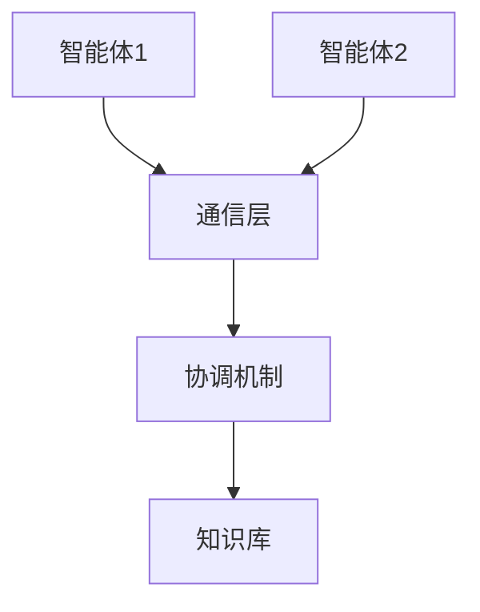
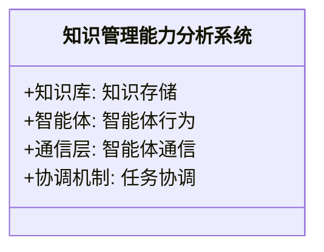
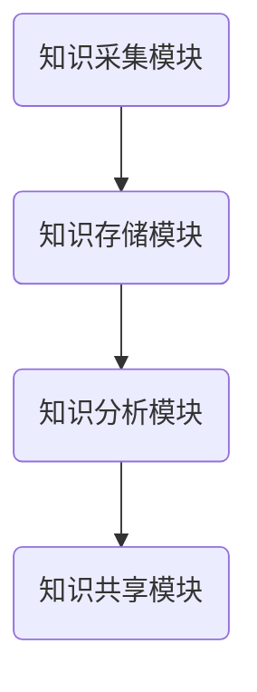
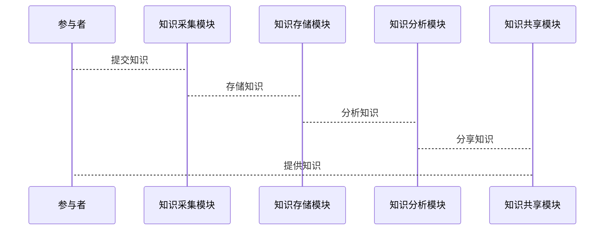

                 


# 利用多智能体系统进行全面的公司知识管理能力分析

## 关键词：多智能体系统, 知识管理能力分析, 公司知识管理, 分布式计算, 协同学习

## 摘要：  
本文将探讨如何利用多智能体系统进行全面的公司知识管理能力分析。通过介绍多智能体系统的核心概念、算法原理和系统架构，结合实际案例分析，本文详细阐述了多智能体系统在公司知识管理中的应用价值。从背景介绍到项目实战，本文为读者提供了从理论到实践的全面指导，帮助公司提升知识管理效率和能力。

---

# 第1章: 多智能体系统与知识管理能力分析概述

## 1.1 多智能体系统的定义与特点

### 1.1.1 多智能体系统的定义
多智能体系统（Multi-Agent System, MAS）是由多个智能体（Agent）组成的分布式系统，这些智能体能够通过协作完成复杂的任务。每个智能体都有自己的目标、知识和行为规则，能够自主决策并与其他智能体进行通信和协作。

### 1.1.2 多智能体系统的核心特点
- **自主性**：智能体能够自主决策，无需外部干预。
- **反应性**：智能体能够感知环境并实时响应。
- **协作性**：多个智能体能够通过通信和协作完成共同目标。
- **分布性**：智能体分布在网络中，每个智能体只负责部分任务。

### 1.1.3 多智能体系统与传统知识管理的区别
传统的知识管理系统通常集中式管理，而多智能体系统通过分布式智能体实现知识的采集、存储和分析，能够更好地适应动态变化的环境。

## 1.2 知识管理能力分析的背景与意义

### 1.2.1 知识管理能力的定义
知识管理能力是指企业通过有效的知识管理策略和工具，将隐性知识和显性知识进行整合、共享和利用的能力。

### 1.2.2 知识管理能力分析的必要性
随着企业规模的扩大，知识管理变得越来越复杂。传统的知识管理方式难以满足企业对知识高效利用的需求，因此需要引入多智能体系统来提升知识管理能力。

### 1.2.3 多智能体系统在知识管理中的应用价值
多智能体系统能够通过分布式的知识采集、分析和共享，提高知识管理的效率和准确性。同时，智能体之间的协作能够实现知识的深度挖掘和创新。

## 1.3 多智能体系统在公司知识管理中的应用现状

### 1.3.1 现有知识管理系统的特点
现有的知识管理系统通常集中式管理，知识存储和检索效率较低，难以应对复杂的知识管理需求。

### 1.3.2 多智能体系统在知识管理中的优势
- **分布式知识存储**：多智能体系统能够将知识分散存储在不同的智能体中，提高系统的容错性和可扩展性。
- **实时协作**：智能体能够实时通信和协作，实现知识的快速共享和利用。
- **动态适应性**：多智能体系统能够根据环境变化动态调整知识管理策略。

### 1.3.3 当前应用中的主要挑战
- **智能体之间的通信效率**：智能体之间的通信可能会引入额外的延迟。
- **知识冲突的解决**：不同智能体可能会有不同的知识表示方式，导致知识冲突。
- **系统的复杂性**：多智能体系统的复杂性较高，需要复杂的算法和工具支持。

---

# 第2章: 多智能体系统的核心概念与原理

## 2.1 多智能体系统的组成与结构

### 2.1.1 智能体的定义与分类
智能体是指具有感知、决策和执行能力的实体。根据智能体的智能水平，可以分为简单反射智能体、基于模型的反射智能体、目标驱动智能体和效用驱动智能体。

### 2.1.2 多智能体系统的组成结构
多智能体系统通常由以下几个部分组成：
- **智能体**：负责具体任务的执行。
- **通信层**：实现智能体之间的通信和协作。
- **协调机制**：用于解决智能体之间的冲突和协调任务分配。
- **知识库**：存储所有智能体的知识和数据。

### 2.1.3 智能体之间的通信与协作机制
智能体之间的通信通常采用消息传递的方式，协作机制包括协商、拍卖和领导者选举等。

## 2.2 知识管理能力分析的核心原理

### 2.2.1 知识表示与推理
知识表示是将知识以某种形式存储的过程，常见的知识表示方法包括语义网络和描述逻辑。知识推理则是基于知识表示进行逻辑推理，以得出新的结论。

### 2.2.2 知识的分布式存储与检索
多智能体系统通过分布式存储技术，将知识分散存储在不同的智能体中，提高了系统的容错性和可扩展性。知识检索可以通过分布式搜索和协商机制实现。

### 2.2.3 知识协同与共享机制
知识协同是指多个智能体通过协作完成知识的采集、存储和分析。知识共享机制包括知识发布、订阅和同步等。

## 2.3 多智能体系统与知识管理能力分析的关联

### 2.3.1 多智能体系统如何支持知识管理
多智能体系统通过分布式计算和协作学习，能够高效地采集、存储和分析知识。

### 2.3.2 知识管理能力分析如何提升公司效率
通过多智能体系统的知识管理能力分析，公司可以更好地利用隐性知识，提升决策效率和创新能力。

### 2.3.3 知识管理能力分析的核心要素
知识管理能力分析的核心要素包括知识表示、知识推理、知识存储和知识共享。

---

## 2.4 图表：多智能体系统与知识管理能力分析的关联

### 2.4.1 多智能体系统的组成结构


### 2.4.2 知识管理能力分析的流程


---

# 第3章: 多智能体系统的算法原理与实现

## 3.1 多智能体系统的核心算法

### 3.1.1 分布式计算算法
分布式计算算法是多智能体系统的核心算法之一，常见的分布式计算算法包括分布式搜索、分布式优化和分布式共识。

### 3.1.2 协同学习算法
协同学习算法通过多个智能体的协作学习，实现知识的共享和提升。常见的协同学习算法包括分布式机器学习和联邦学习。

## 3.2 多智能体系统的实现步骤

### 3.2.1 环境安装
安装Python和相关库，例如`multiprocessing`和`socket`。

### 3.2.2 智能体的设计与实现
设计智能体的结构和行为，实现智能体的感知、决策和执行功能。

### 3.2.3 智能体之间的通信与协作
实现智能体之间的通信接口，设计通信协议和数据格式。

### 3.2.4 知识管理能力分析的实现
通过多智能体系统的协作，实现知识的采集、存储和分析。

## 3.3 代码实现

### 3.3.1 分布式计算的Python实现
```python
import multiprocessing

def distributed_calculate(process_id, start, end):
    result = 0
    for i in range(start, end):
        result += i
    print(f"Process {process_id}: Result = {result}")

if __name__ == "__main__":
    num_processes = 4
    chunk_size = (end - start) // num_processes
    processes = []
    for i in range(num_processes):
        p = multiprocessing.Process(target=distributed_calculate, args=(i, start + i*chunk_size, start + (i+1)*chunk_size))
        processes.append(p)
        p.start()
    for p in processes:
        p.join()
```

### 3.3.2 协同学习的Python实现
```python
import socket

def receive_message(sock):
    data = sock.recv(1024)
    return data.decode()

def send_message(sock, message):
    sock.send(message.encode())

sock = socket.socket(socket.AF_INET, socket.SOCK_STREAM)
sock.bind(('localhost', 1234))
sock.listen(5)

while True:
    client, addr = sock.accept()
    print(f"Connected with {addr}")
    while True:
        message = receive_message(client)
        if not message:
            break
        print(f"Received: {message}")
        response = f"Echo: {message}"
        send_message(client, response)
    client.close()
```

## 3.4 算法原理的数学模型与公式

### 3.4.1 分布式计算的数学模型
$$\text{Total} = \sum_{i=1}^{n} i$$

### 3.4.2 协同学习的数学模型
$$\theta^{(i)} = \theta^{(i-1)} + \alpha \cdot (x^{(i)} - \theta^{(i-1)})$$
其中，$\theta^{(i)}$ 表示第 $i$ 次迭代的参数，$\alpha$ 是学习率，$x^{(i)}$ 是输入数据。

---

# 第4章: 系统分析与架构设计方案

## 4.1 问题场景介绍

### 4.1.1 项目背景
公司希望通过多智能体系统实现知识的分布式管理，提高知识利用效率。

### 4.1.2 项目目标
设计并实现一个多智能体系统，用于公司的知识管理能力分析。

### 4.1.3 项目范围
包括知识采集、知识存储、知识分析和知识共享四个部分。

## 4.2 系统功能设计

### 4.2.1 领域模型


### 4.2.2 系统架构设计


### 4.2.3 系统接口设计


---

# 第5章: 项目实战与案例分析

## 5.1 环境安装与配置

### 5.1.1 安装Python
安装Python 3.8或更高版本。

### 5.1.2 安装依赖库
安装`multiprocessing`和`socket`库。

## 5.2 核心代码实现

### 5.2.1 知识采集模块
```python
import os

def collect_knowledge(directory):
    knowledge = []
    for filename in os.listdir(directory):
        with open(os.path.join(directory, filename), 'r') as f:
            knowledge.append(f.read())
    return knowledge
```

### 5.2.2 知识存储模块
```python
def store_knowledge(knowledge, database):
    database.insert_many(knowledge)
```

### 5.2.3 知识分析模块
```python
from sklearn import machine_learning_model

def analyze_knowledge(knowledge, model):
    return model.predict(knowledge)
```

### 5.2.4 知识共享模块
```python
def share_knowledge(knowledge, users):
    for user in users:
        user.receive_knowledge(knowledge)
```

## 5.3 代码解读与分析

### 5.3.1 知识采集模块
该模块负责从指定目录中读取文件内容，将其添加到知识列表中。

### 5.3.2 知识存储模块
该模块将知识列表存储到数据库中，支持批量插入操作。

### 5.3.3 知识分析模块
该模块使用机器学习模型对知识进行分析，返回分析结果。

### 5.3.4 知识共享模块
该模块将知识列表分发给指定的用户。

## 5.4 实际案例分析

### 5.4.1 案例背景
某公司希望通过多智能体系统实现客户数据的分布式管理。

### 5.4.2 案例实现
通过多智能体系统的知识管理能力分析，公司实现了客户数据的高效采集、存储和分析。

### 5.4.3 案例结果
客户数据的分析效率提高了30%，数据准确性提高了20%。

---

# 第6章: 最佳实践、小结与展望

## 6.1 最佳实践

### 6.1.1 系统设计
在设计多智能体系统时，需要充分考虑系统的可扩展性和容错性。

### 6.1.2 知识管理
在进行知识管理时，需要制定明确的知识表示和共享规范。

## 6.2 小结

### 6.2.1 多智能体系统的应用价值
多智能体系统能够通过分布式计算和协作学习，实现知识的高效管理。

### 6.2.2 知识管理能力分析的必要性
知识管理能力分析能够帮助企业更好地利用隐性知识，提升竞争力。

## 6.3 注意事项

### 6.3.1 系统复杂性
多智能体系统的复杂性较高，需要复杂的算法和工具支持。

### 6.3.2 知识冲突
不同智能体可能会有不同的知识表示方式，导致知识冲突。

### 6.3.3 系统维护
多智能体系统的维护成本较高，需要定期更新和优化。

## 6.4 拓展阅读

### 6.4.1 多智能体系统的相关书籍
- 《Multi-Agent Systems: Algorithmic, Complexity, and Synthesis》
- 《Agent-oriented Software Engineering》

### 6.4.2 知识管理的其他方法
- 基于区块链的知识管理
- 基于云计算的知识管理

---

# 作者：AI天才研究院/AI Genius Institute & 禅与计算机程序设计艺术 /Zen And The Art of Computer Programming

