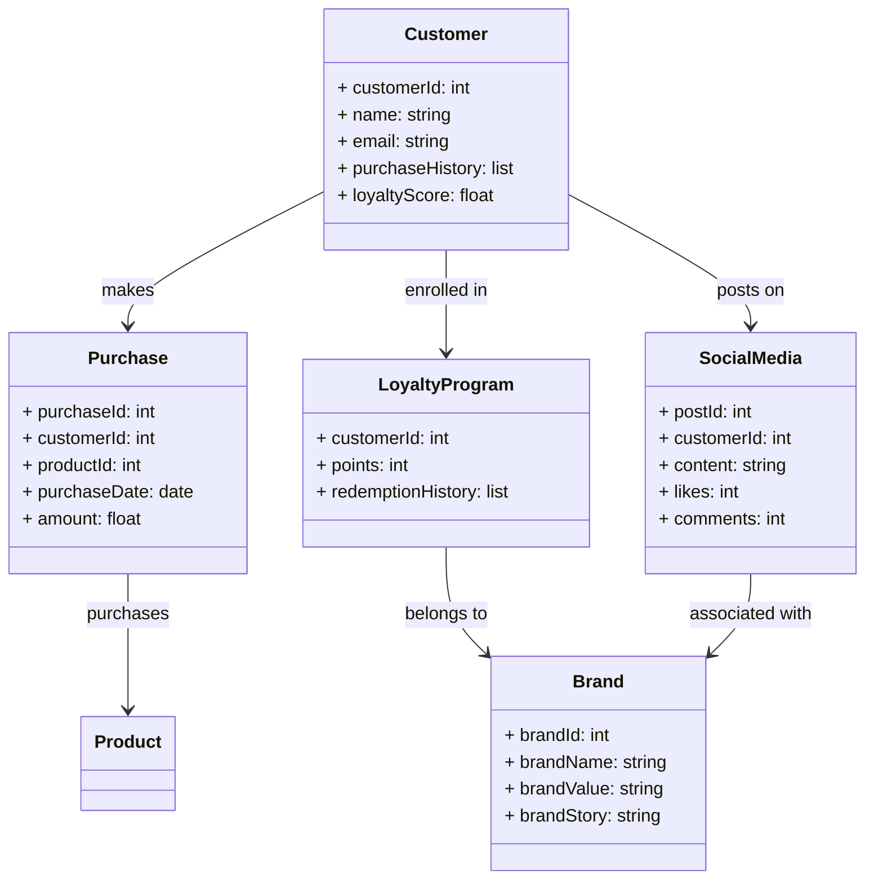
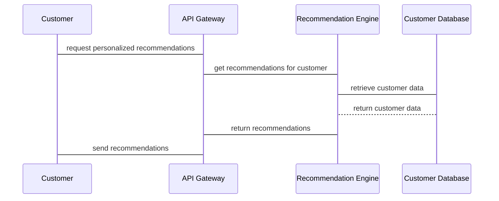

                 


# 巴菲特的品牌忠诚度在数字时代的重新定义

> 关键词：巴菲特，品牌忠诚度，数字时代，投资策略，长期价值

> 摘要：本文从巴菲特的投资理念出发，分析品牌忠诚度在数字时代的重新定义。通过探讨品牌忠诚度的核心概念、数字技术的影响、驱动因素以及长期价值，结合实际案例和系统设计，详细阐述如何在数字时代保持和提升品牌忠诚度，为投资者和企业提供新的视角和策略。

---

## 第一部分：品牌忠诚度的核心概念与背景

### 第1章：巴菲特投资理念与品牌忠诚度概述

#### 1.1 巴菲特投资理念的核心要素

- **长期投资与价值投资的定义**
  - 长期投资：关注企业的内在价值，而非短期市场波动。
  - 价值投资：寻找具有持续竞争优势和长期盈利能力的企业。

- **品牌忠诚度在巴菲特投资中的重要性**
  - 巴菲特倾向于投资那些能够持续吸引 loyal customers 的企业。
  - 品牌忠诚度是企业长期盈利能力的重要保障。

- **数字时代对品牌忠诚度的影响**
  - 数字技术改变了消费者行为，品牌忠诚度的定义和实现方式也在发生变化。
  - 数据驱动的营销和个性化体验成为品牌忠诚度管理的关键。

#### 1.2 品牌忠诚度的定义与特征

- **品牌忠诚度的定义**
  - 品牌忠诚度是指消费者对某一品牌产品的偏好程度和持续购买行为。
  - 忠诚的客户不仅会重复购买，还会推荐他人使用。

- **品牌忠诚度的特征**
  - 持续性：客户会长期支持某一品牌。
  - 抵抗力：面对竞争品牌时，客户更倾向于选择自己的品牌。
  - 情感性：客户对品牌有情感上的认同和依赖。

- **数字时代品牌忠诚度的新特征**
  - 个性化体验：数字技术使得品牌可以根据客户需求提供定制化服务。
  - 社交媒体影响：客户通过社交媒体分享品牌体验，影响其他消费者的行为。
  - 数据驱动：通过数据分析，企业可以更精准地理解客户行为和偏好。

---

### 第2章：数字时代品牌忠诚度的重新定义

#### 2.1 数字技术对企业品牌忠诚度的影响

- **数字技术对消费者行为的改变**
  - 消费者可以通过在线平台获取信息、比较产品、购买商品。
  - 社交媒体和在线评论成为消费者决策的重要参考。

- **数字营销对品牌忠诚度的促进作用**
  - 个性化营销：通过数据驱动的营销策略，提供客户感兴趣的产品和服务。
  - 社交媒体营销：通过与客户互动，增强品牌认知度和忠诚度。

- **数据驱动的品牌忠诚度管理**
  - 企业可以通过数据分析客户行为，预测客户需求，优化品牌体验。
  - 数据挖掘和机器学习技术可以帮助企业识别高忠诚度客户，制定针对性的营销策略。

#### 2.2 巴菲特投资理念与数字时代的结合

- **巴菲特对数字技术的适应与调整**
  - 巴菲特认识到数字技术对企业的影响，关注那些能够适应数字时代变化的企业。
  - 他倾向于投资那些在数字时代依然具有竞争优势的企业。

- **数字时代下企业长期价值的评估**
  - 企业不仅要考虑当前的盈利能力，还要关注其在数字时代中的可持续发展能力。
  - 品牌忠诚度是企业长期价值的重要组成部分。

- **巴菲特对品牌忠诚度的新看法**
  - 在数字时代，品牌忠诚度不仅是客户对品牌的偏好，还体现在客户对品牌的长期支持和参与。
  - 巴菲特强调，品牌忠诚度是企业抵御市场竞争的重要因素。

---

### 第3章：品牌忠诚度的核心概念与驱动因素

#### 3.1 品牌忠诚度的核心概念

- **品牌忠诚度的构成要素**
  - 品牌认知：客户对品牌的理解和记忆。
  - 品牌情感：客户对品牌的情感认同和品牌体验。
  - 品牌行为：客户对品牌的实际购买和推荐行为。

- **品牌忠诚度与消费者满意度的关系**
  - 满意的客户更有可能成为忠诚客户。
  - 忠诚客户通常对品牌有较高的满意度和信任度。

- **品牌忠诚度与企业长期价值的关联**
  - 忠诚客户为企业带来稳定的收入来源。
  - 忠诚客户通常愿意为品牌支付更高的价格，从而提高企业的利润率。

#### 3.2 数字时代品牌忠诚度的驱动因素

- **个性化体验对品牌忠诚度的影响**
  - 客户期望获得个性化的服务和产品体验。
  - 通过数据分析和人工智能技术，企业可以实现客户体验的个性化。

- **社交媒体对品牌忠诚度的作用**
  - 社交媒体成为品牌与客户互动的重要渠道。
  - 通过社交媒体，客户可以分享品牌体验，增强品牌认知度和忠诚度。

- **品牌故事与价值观的重要性**
  - 在数字时代，客户不仅关注产品的功能，还关注品牌的使命和价值观。
  - 与客户价值观一致的品牌更容易获得客户的忠诚支持。

---

## 第二部分：品牌忠诚度的系统分析与算法实现

### 第4章：品牌忠诚度的系统分析

#### 4.1 问题场景介绍

- 假设一家企业希望提升品牌忠诚度，通过数字技术优化客户体验。
- 目标是通过数据分析和个性化服务，提高客户的忠诚度和满意度。

#### 4.2 系统功能设计

- **领域模型设计（Mermaid类图）**



- **系统架构设计（Mermaid架构图）**


#### 4.3 系统接口设计

- **API接口**
  - `/api/customers`: 获取客户信息。
  - `/api/purchases`: 获取购买记录。
  - `/api/loyalty`: 获取忠诚度评分。
  - `/api/recommendations`: 获取个性化推荐。

#### 4.4 系统交互设计（Mermaid序列图）



---

### 第5章：品牌忠诚度的算法实现

#### 5.1 忠诚度指数计算算法

- **忠诚度指数公式**
  $$ loyalty\_score = (repeat\_purchase\_rate + positive\_review\_rate + referral\_rate) / 3 $$

- **算法实现步骤**
  1. 收集客户购买记录和评价数据。
  2. 计算重复购买率、正面评价率和推荐率。
  3. 计算忠诚度指数。

#### 5.2 数据挖掘与客户分群

- **客户分群算法**
  - 使用聚类分析将客户分为忠诚客户、潜在流失客户和其他客户。
  - 通过K-means算法实现客户分群。

- **代码实现**

```python
from sklearn.cluster import KMeans

# 假设 customer_data 是一个包含客户行为数据的 DataFrame
features = ['purchase_frequency', 'average_spend', 'positive_reviews']
kmeans = KMeans(n_clusters=3, random_state=0)
customer_data['loyalty_cluster'] = kmeans.fit_predict(customer_data[features])
```

#### 5.3 个性化推荐系统

- **推荐算法选择**
  - 使用协同过滤算法推荐客户可能感兴趣的产品。

- **代码实现**

```python
from surprise import SVD, Dataset, Reader

# 加载数据集
data = Dataset.load_from_file('ratings.csv', format='csv', sep=',', header=None)
reader = Reader(rating_scale=(1, 5))
data = Dataset.load_from Reader(reader)

# 训练模型
model = SVD()
model.fit(data.build_full_trainset())

# 生成推荐
def get_recommendations(user_id, n=5):
    predictions = model.test([(user_id, 0, 0, 0, 0)])  # 这里需要调整数据格式
    return [(iid, pred.est) for iid, pred in predictions]

# 示例推荐
print(get_recommendations(1, 5))
```

---

## 第三部分：项目实战与最佳实践

### 第6章：项目实战

#### 6.1 环境安装与数据准备

- **安装必要的库**
  ```bash
  pip install numpy pandas scikit-learn surprise
  ```

- **数据准备**
  - 收集客户购买记录、评价数据、社交媒体互动数据等。

#### 6.2 系统核心实现

- **客户忠诚度评分计算**
  ```python
  import pandas as pd

  # 假设 data 是一个包含客户行为数据的 DataFrame
  data['loyalty_score'] = data.apply(lambda row: 
      (row['repeat_purchase'] + row['positive_review'] + row['referral']) / 3, 
      axis=1)
  ```

- **个性化推荐系统实现**
  ```python
  from surprise import SVD, Dataset, Reader

  # 加载数据集
  data = Dataset.load_from_file('ratings.csv', format='csv', sep=',', header=None)
  reader = Reader(rating_scale=(1, 5))
  data = Dataset.load_from Reader(reader)

  # 训练模型
  model = SVD()
  model.fit(data.build_full_trainset())

  # 生成推荐
  def get_recommendations(user_id, n=5):
      predictions = model.test([(user_id, 0, 0, 0, 0)])
      return [(iid, pred.est) for iid, pred in predictions]

  # 示例推荐
  print(get_recommendations(1, 5))
  ```

#### 6.3 实际案例分析

- **案例：苹果的品牌忠诚度**
  - 苹果通过持续创新和优质用户体验，建立了强大的品牌忠诚度。
  - 在数字时代，苹果通过定期的产品更新和生态系统整合，进一步提升了客户忠诚度。

#### 6.4 项目小结

- 通过数据驱动的方法，企业可以更精准地管理品牌忠诚度。
- 个性化体验和社交媒体互动是提升品牌忠诚度的重要手段。

---

## 第四部分：最佳实践与投资建议

### 第7章：最佳实践

#### 7.1 投资建议

- **关注具有强大品牌忠诚度的企业**
  - 投资那些能够持续吸引 loyal customers 的企业。
  - 选择在数字时代具有竞争优势的企业。

#### 7.2 品牌忠诚度管理策略

- **客户体验优化**
  - 提供个性化服务，增强客户满意度。
  - 通过数据分析优化客户互动。

- **品牌故事与价值观**
  - 强调品牌的核心价值观，与客户建立情感联系。
  - 通过社会责任和可持续发展提升品牌形象。

#### 7.3 数字技术的应用

- **数据驱动的决策**
  - 利用数据分析优化品牌忠诚度管理。
  - 通过机器学习技术预测客户行为，制定精准营销策略。

---

## 附录

### 附录A：巴菲特经典语录

- “时间是伟大企业的朋友，平庸企业的敌人。”
- “品牌是企业的灵魂，品牌忠诚度是企业最宝贵的资产。”

### 附录B：品牌忠诚度相关工具

- 数据分析工具：Python、R、Tableau。
- 个性化推荐系统：协同过滤、机器学习模型。
- 社交媒体分析：Twitter API、Instagram API。

### 附录C：推荐阅读

- 《巴菲特投资策略：从零开始学价值投资》
- 《数字营销：如何在数字时代赢得客户忠诚度》
- 《品牌管理：从理论到实践》

---

## 作者：AI天才研究院 & 禅与计算机程序设计艺术

这篇文章从巴菲特的投资理念出发，结合数字时代的特点，详细探讨了品牌忠诚度的重新定义。通过理论分析、系统设计和实际案例，为投资者和企业提供了一个全新的视角，帮助他们在数字时代中保持和提升品牌忠诚度。

