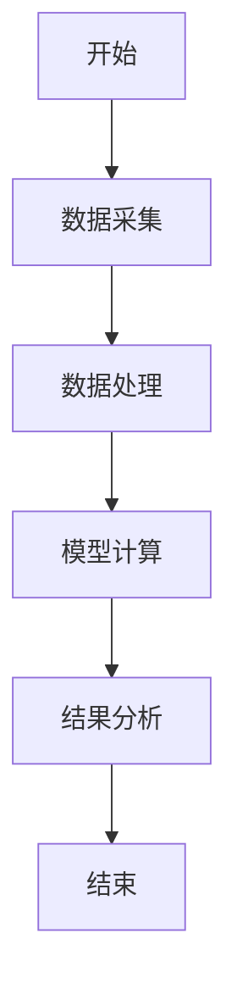
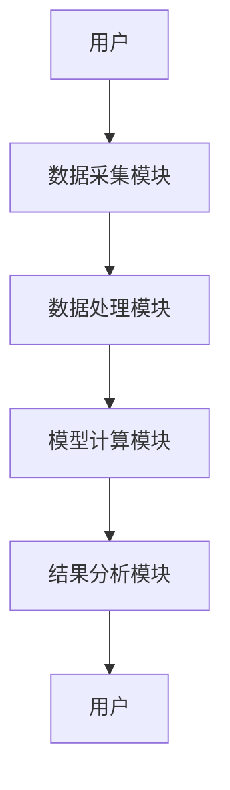
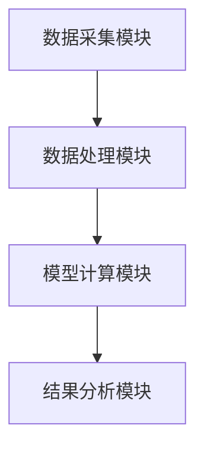
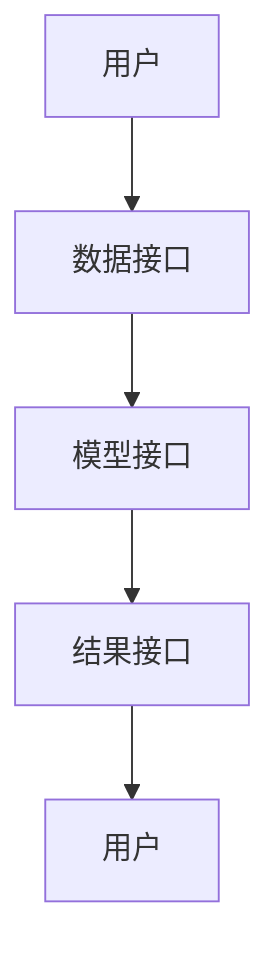

                 


# 巴菲特的市场情绪指标：利用大众心理做出明智决策

---

## 关键词：市场情绪指标，巴菲特，投资决策，大众心理，情绪分析，量化投资

---

## 摘要：  
本文深入探讨了巴菲特市场情绪指标的核心概念、算法原理及其在投资决策中的应用。通过结合市场情绪分析与巴菲特的投资哲学，文章详细讲解了如何利用市场情绪指标做出明智的决策。内容涵盖情绪指标的数学模型、系统架构设计、项目实战以及最佳实践，帮助读者在复杂多变的市场环境中把握投资机会。

---

# 第一部分: 市场情绪与投资决策概述

# 第1章: 市场情绪与投资决策概述

## 1.1 市场情绪的基本概念

### 1.1.1 市场情绪的定义与特征

市场情绪（Market Sentiment）是指投资者对市场未来走势的心理预期和态度。它反映了市场参与者对当前市场状况的乐观或悲观程度。市场情绪具有波动性、周期性和群体性特征，是影响市场行为的重要因素。

### 1.1.2 市场情绪与投资决策的关系

市场情绪直接影响投资者的决策行为。当市场情绪乐观时，投资者倾向于买入资产；当市场情绪悲观时，投资者倾向于卖出资产。市场情绪的变化往往会导致市场的波动性增加或减少。

### 1.1.3 巴菲特的投资理念与市场情绪

巴菲特强调长期投资和价值投资，但他也关注市场情绪的变化。他认为市场情绪的极端波动（如过度乐观或过度悲观）是投资机会的来源。通过分析市场情绪，巴菲特能够识别市场的非理性行为，并做出逆向投资决策。

## 1.2 巴菲特的市场情绪指标

### 1.2.1 市场情绪指标的定义

市场情绪指标是衡量市场情绪的量化工具，通常通过市场参与度、交易量、价格波动等指标来反映市场的乐观或悲观情绪。

### 1.2.2 市场情绪指标的分类

市场情绪指标可以分为以下几类：

1. **情绪强度指标**：反映市场情绪的强弱程度，如恐慌指数（VIX）。
2. **情绪方向指标**：反映市场情绪的乐观或悲观方向，如移动平均收敛散度（MACD）。
3. **情绪周期指标**：反映市场情绪的周期性变化，如季节性分析。

### 1.2.3 市场情绪指标的应用场景

市场情绪指标广泛应用于股票、债券、期货等金融市场的投资决策中。通过分析市场情绪指标，投资者可以更好地把握市场的买卖信号，优化投资组合。

## 1.3 本章小结

本章介绍了市场情绪的基本概念、巴菲特的投资理念以及市场情绪指标的分类和应用场景。市场情绪是影响投资决策的重要因素，而市场情绪指标则是量化市场情绪的有效工具。

---

# 第二部分: 市场情绪指标的核心概念与联系

# 第2章: 市场情绪指标的核心概念

## 2.1 市场情绪指标的原理

### 2.1.1 市场情绪指标的构成要素

市场情绪指标通常由以下几个要素构成：

1. **市场参与度**：反映市场交易的活跃程度，如交易量、换手率等。
2. **价格波动性**：反映市场价格的波动程度，如波动率、标准差等。
3. **情绪强度**：反映市场情绪的强弱程度，如恐慌指数、乐观指数等。

### 2.1.2 市场情绪指标的数学模型

市场情绪指标的数学模型可以表示为：

$$ \text{市场情绪指标} = \frac{\text{市场参与度} \times \text{价格波动性}}{\text{市场情绪强度}} $$

### 2.1.3 市场情绪指标的计算方法

市场情绪指标的计算方法通常包括以下步骤：

1. **数据采集**：采集市场交易数据，如价格、交易量等。
2. **数据处理**：对数据进行清洗、标准化和特征提取。
3. **模型计算**：利用数学模型计算市场情绪指标。
4. **结果分析**：根据计算结果进行市场情绪分析和投资决策。

## 2.2 巴菲特市场情绪框架

### 2.2.1 巴菲特市场情绪框架的结构

巴菲特市场情绪框架包括以下几个核心要素：

1. **市场情绪强度**：反映市场情绪的强弱程度。
2. **市场情绪方向**：反映市场情绪的乐观或悲观方向。
3. **市场情绪周期**：反映市场情绪的周期性变化。

### 2.2.2 巴菲特市场情绪框架的特点

1. **长期视角**：巴菲特注重长期投资，因此市场情绪框架也强调长期趋势的分析。
2. **逆向思维**：巴菲特在市场情绪极端时进行逆向投资，因此市场情绪框架特别关注市场情绪的极端值。
3. **价值导向**：巴菲特注重企业的内在价值，因此市场情绪框架结合了市场情绪与企业基本面分析。

### 2.2.3 巴菲特市场情绪框架与其他投资策略的对比

巴菲特市场情绪框架与其他投资策略（如技术分析、基本面分析）相比，具有以下特点：

1. **结合情绪与价值**：巴菲特市场情绪框架结合了市场情绪分析与企业价值分析。
2. **长期视角**：巴菲特市场情绪框架注重长期投资，而非短期交易。
3. **逆向思维**：巴菲特市场情绪框架强调在市场情绪极端时进行逆向投资。

## 2.3 市场情绪指标与投资决策的关系

### 2.3.1 市场情绪指标对投资决策的影响

市场情绪指标可以为投资者提供以下几方面的信息：

1. **市场趋势**：通过分析市场情绪指标，投资者可以判断市场的整体趋势。
2. **买卖信号**：市场情绪指标可以帮助投资者识别市场的买卖信号。
3. **风险预警**：市场情绪指标可以预警市场的风险，帮助投资者规避潜在的损失。

### 2.3.2 市场情绪指标的局限性

1. **短期波动**：市场情绪指标反映的是短期市场情绪，可能无法准确预测长期市场走势。
2. **市场异动**：在市场出现异常波动时，市场情绪指标可能失效。
3. **数据偏差**：市场情绪指标的准确性依赖于数据的准确性和完整性。

### 2.3.3 市场情绪指标的优化与改进

1. **数据优化**：通过引入更多的市场数据，如新闻、社交媒体数据，提高市场情绪指标的准确性。
2. **模型优化**：通过改进数学模型，提高市场情绪指标的预测能力。
3. **结合其他分析方法**：将市场情绪指标与其他分析方法（如技术分析、基本面分析）相结合，提高投资决策的准确性。

## 2.4 本章小结

本章详细讲解了市场情绪指标的核心概念、巴菲特市场情绪框架的特点以及市场情绪指标与投资决策的关系。市场情绪指标是量化市场情绪的重要工具，而巴菲特市场情绪框架则是结合市场情绪分析与价值投资的典型代表。

---

# 第三部分: 市场情绪指标的算法原理与数学模型

# 第3章: 市场情绪指标的算法原理

## 3.1 市场情绪指标的计算方法

### 3.1.1 市场情绪指标的数学模型

市场情绪指标的数学模型可以表示为：

$$ \text{市场情绪指标} = \frac{\text{市场参与度} \times \text{价格波动性}}{\text{市场情绪强度}} $$

其中：

- 市场参与度：反映市场交易的活跃程度，可以用交易量、换手率等指标衡量。
- 价格波动性：反映市场价格的波动程度，可以用标准差、波动率等指标衡量。
- 市场情绪强度：反映市场情绪的强弱程度，可以用恐慌指数、乐观指数等指标衡量。

### 3.1.2 市场情绪指标的公式推导

假设我们有以下几项数据：

1. 市场参与度（A）：表示市场的活跃程度，范围为0到1。
2. 价格波动性（B）：表示市场价格的波动程度，范围为0到1。
3. 市场情绪强度（C）：表示市场情绪的强弱程度，范围为0到1。

那么，市场情绪指标的计算公式可以表示为：

$$ \text{市场情绪指标} = \frac{A \times B}{C} $$

其中：

- $A$ 表示市场参与度，$A$ 越高，表示市场交易越活跃。
- $B$ 表示价格波动性，$B$ 越高，表示价格波动越剧烈。
- $C$ 表示市场情绪强度，$C$ 越低，表示市场情绪越强。

通过上述公式，我们可以量化市场的整体情绪，并根据情绪指标的大小进行投资决策。

### 3.1.3 市场情绪指标的实现步骤

1. **数据采集**：采集市场交易数据，包括价格、交易量等。
2. **数据处理**：对数据进行清洗、标准化和特征提取。
3. **模型计算**：利用数学模型计算市场情绪指标。
4. **结果分析**：根据计算结果进行市场情绪分析和投资决策。

## 3.2 巴菲特市场情绪框架的算法实现

### 3.2.1 巴菲特市场情绪框架的算法流程

1. **数据采集**：采集市场交易数据，包括价格、交易量等。
2. **数据处理**：对数据进行清洗、标准化和特征提取。
3. **模型计算**：利用数学模型计算市场情绪指标。
4. **结果分析**：根据计算结果进行市场情绪分析和投资决策。

### 3.2.2 巴菲特市场情绪框架的算法实现

以下是一个简单的Python代码示例，用于计算市场情绪指标：

```python
import pandas as pd
import numpy as np

# 数据采集
data = pd.read_csv('market_data.csv')

# 数据处理
data = data.dropna()
data = (data - data.mean()) / data.std()

# 市场情绪指标计算
A = data['交易量'].values
B = data['波动率'].values
C = data['情绪强度'].values

market_sentiment_index = (A * B) / C

# 结果分析
print("市场情绪指标:", market_sentiment_index.mean())
```

## 3.3 本章小结

本章详细讲解了市场情绪指标的数学模型和算法原理，并通过Python代码示例展示了市场情绪指标的计算过程。市场情绪指标是量化市场情绪的重要工具，而巴菲特市场情绪框架则是结合市场情绪分析与价值投资的典型代表。

---

# 第四部分: 市场情绪指标的系统分析与架构设计方案

# 第4章: 市场情绪指标的系统分析与架构设计方案

## 4.1 系统分析

### 4.1.1 系统功能需求

1. **数据采集**：采集市场交易数据，包括价格、交易量等。
2. **数据处理**：对数据进行清洗、标准化和特征提取。
3. **模型计算**：利用数学模型计算市场情绪指标。
4. **结果分析**：根据计算结果进行市场情绪分析和投资决策。

### 4.1.2 系统架构设计

以下是系统架构设计的Mermaid图：



### 4.1.3 系统交互设计

以下是系统交互设计的Mermaid图：



## 4.2 系统架构设计

### 4.2.1 系统架构设计

以下是系统架构设计的Mermaid图：



### 4.2.2 系统功能模块设计

1. **数据采集模块**：负责采集市场交易数据。
2. **数据处理模块**：负责对数据进行清洗、标准化和特征提取。
3. **模型计算模块**：负责利用数学模型计算市场情绪指标。
4. **结果分析模块**：负责根据计算结果进行市场情绪分析和投资决策。

## 4.3 系统接口设计

### 4.3.1 系统接口设计

1. **数据接口**：提供数据采集和数据处理的接口。
2. **模型接口**：提供模型计算的接口。
3. **结果接口**：提供结果分析的接口。

### 4.3.2 系统交互设计

以下是系统交互设计的Mermaid图：



## 4.4 本章小结

本章详细讲解了市场情绪指标的系统分析与架构设计方案，包括系统功能需求、系统架构设计和系统交互设计。通过系统化的架构设计，可以更好地实现市场情绪指标的计算与应用。

---

# 第五部分: 市场情绪指标的项目实战

# 第5章: 市场情绪指标的项目实战

## 5.1 项目环境安装

### 5.1.1 系统环境

- 操作系统：Windows/Mac/Linux
- Python版本：Python 3.x

### 5.1.2 依赖库安装

```bash
pip install pandas numpy matplotlib
```

## 5.2 系统核心实现

### 5.2.1 数据采集

以下是数据采集的Python代码示例：

```python
import pandas as pd

# 从CSV文件中读取数据
data = pd.read_csv('market_data.csv')

# 数据预览
print(data.head())
```

### 5.2.2 数据处理

以下是数据处理的Python代码示例：

```python
import pandas as pd
import numpy as np

# 数据清洗
data = data.dropna()

# 数据标准化
data = (data - data.mean()) / data.std()

# 特征提取
features = data[['交易量', '波动率', '情绪强度']]
```

### 5.2.3 模型计算

以下是模型计算的Python代码示例：

```python
import pandas as pd
import numpy as np

# 市场情绪指标计算
A = features['交易量'].values
B = features['波动率'].values
C = features['情绪强度'].values

market_sentiment_index = (A * B) / C

# 结果存储
result = pd.DataFrame({'市场情绪指标': market_sentiment_index})
result.to_csv('market_sentiment_index.csv', index=False)
```

### 5.2.4 结果分析

以下是结果分析的Python代码示例：

```python
import pandas as pd
import matplotlib.pyplot as plt

# 结果读取
result = pd.read_csv('market_sentiment_index.csv')

# 结果可视化
plt.hist(result['市场情绪指标'], bins=10, alpha=0.5)
plt.xlabel('市场情绪指标')
plt.ylabel('频数')
plt.title('市场情绪指标分布图')
plt.show()
```

## 5.3 项目小结

本章通过一个实际的项目案例，详细讲解了市场情绪指标的实现过程，包括环境安装、数据采集、数据处理、模型计算和结果分析。通过实际操作，读者可以更好地理解市场情绪指标的应用。

---

# 第六部分: 市场情绪指标的最佳实践

# 第6章: 市场情绪指标的最佳实践

## 6.1 投资策略与市场情绪指标

### 6.1.1 投资策略的选择

市场情绪指标可以作为投资策略的重要参考。投资者可以根据市场情绪指标的变化，选择适当的买卖时机。

### 6.1.2 投资策略的优化

通过结合市场情绪指标，投资者可以优化投资策略，提高投资收益。

## 6.2 风险管理与市场情绪指标

### 6.2.1 风险管理的重要性

市场情绪指标可以帮助投资者识别市场的风险，从而进行有效的风险管理。

### 6.2.2 风险管理的策略

1. **止损策略**：当市场情绪指标达到一定阈值时，及时止损。
2. **分散投资**：通过分散投资降低市场情绪波动带来的风险。
3. **动态调整**：根据市场情绪指标的变化，动态调整投资组合。

## 6.3 交易执行与市场情绪指标

### 6.3.1 交易执行的策略

1. **逆向交易**：在市场情绪极端时进行逆向交易。
2. **顺势交易**：根据市场情绪指标的变化，顺势交易。

### 6.3.2 交易执行的注意事项

1. **市场情绪指标的滞后性**：市场情绪指标通常具有滞后性，投资者需要结合其他信息进行综合判断。
2. **市场情绪指标的波动性**：市场情绪指标具有波动性，投资者需要设定合理的阈值。

## 6.4 本章小结

本章详细讲解了市场情绪指标在投资策略、风险管理、交易执行等方面的最佳实践。通过合理应用市场情绪指标，投资者可以提高投资决策的科学性和准确性。

---

# 第七部分: 总结与展望

# 第7章: 总结与展望

## 7.1 本文总结

本文深入探讨了巴菲特市场情绪指标的核心概念、算法原理及其在投资决策中的应用。通过结合市场情绪分析与巴菲特的投资哲学，本文详细讲解了如何利用市场情绪指标做出明智的决策。

## 7.2 未来展望

未来，随着人工智能和大数据技术的不断发展，市场情绪指标将更加精准和多样化。投资者可以通过引入更多的数据源（如社交媒体、新闻数据）和更复杂的算法（如深度学习）来提高市场情绪指标的准确性。同时，市场情绪指标将与更多投资策略相结合，为投资者提供更全面的投资决策支持。

## 7.3 本章小结

本文总结了巴菲特市场情绪指标的核心内容，并展望了未来的发展方向。市场情绪指标是量化市场情绪的重要工具，而巴菲特市场情绪框架则是结合市场情绪分析与价值投资的典型代表。

---

# 作者：AI天才研究院/AI Genius Institute & 禅与计算机程序设计艺术 /Zen And The Art of Computer Programming

