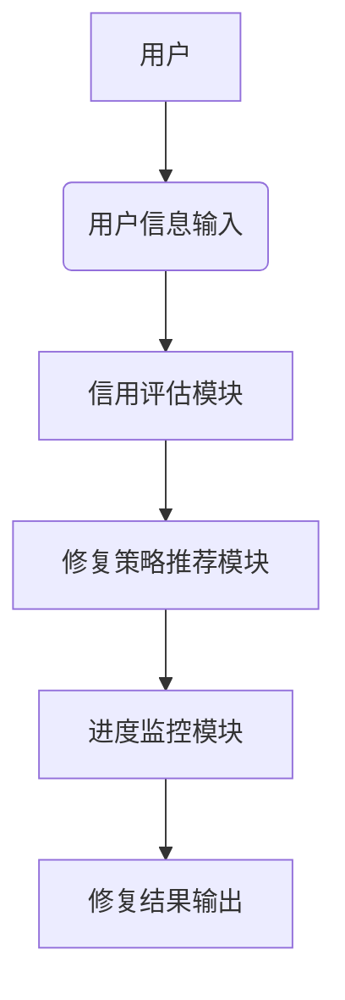
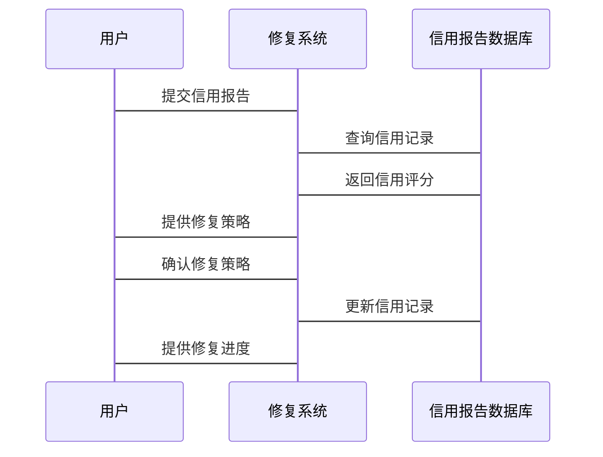
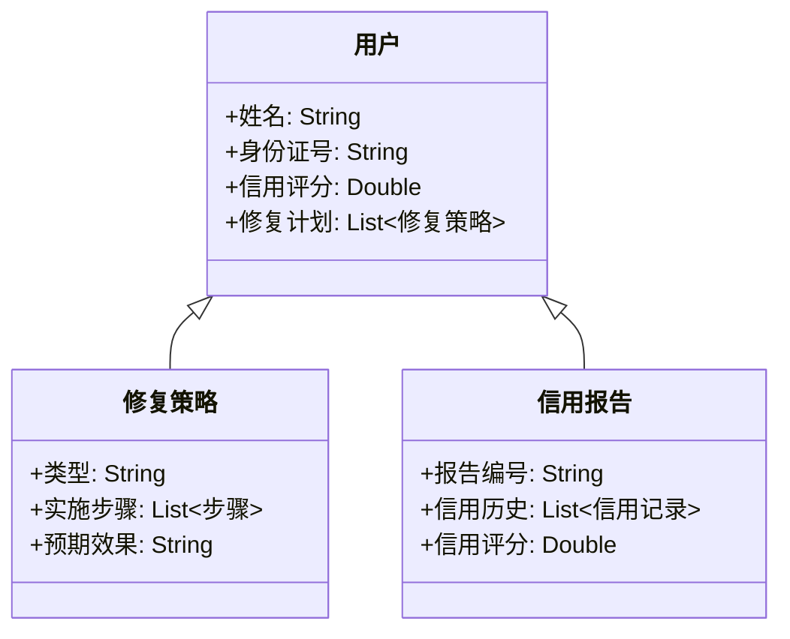

                 


# 智能个人信用修复策略推荐系统

> 关键词：智能推荐系统，信用修复，机器学习，系统架构，数据挖掘

> 摘要：本文探讨了智能个人信用修复策略推荐系统的设计与实现，结合了机器学习和推荐系统的技术，通过分析个人信用修复需求，构建了基于协同过滤、基于内容的推荐和混合推荐算法的推荐模型，并设计了系统的架构和接口，最后通过实际案例展示了系统的实现过程。

---

# 第一部分：智能个人信用修复策略推荐系统的背景与概念

## 第1章：信用修复的概念与问题背景

### 1.1 信用修复的基本概念

#### 1.1.1 信用修复的定义
信用修复是指通过合法手段，纠正和改善个人或企业的信用记录，使其信用评分得到提升或恢复的过程。信用修复的核心在于识别和修正信用记录中的负面信息，从而改善信用状况。

#### 1.1.2 信用修复的核心要素
- **信用报告**：记录个人或企业的信用历史，包括借贷记录、还款情况等。
- **信用评分**：基于信用报告的量化指标，反映个人或企业的信用风险。
- **修复策略**：针对信用记录中的负面信息，采取的改善措施。

#### 1.1.3 信用修复的法律与伦理框架
信用修复需要遵守相关法律法规，确保过程合法合规。同时，修复过程应遵循伦理原则，避免对他人造成不良影响。

### 1.2 个人信用修复的必要性

#### 1.2.1 个人信用问题的现状
- 随着信用评分在贷款、信用卡审批等领域的广泛应用，信用问题日益重要。
- 一些人在信用报告中存在负面记录，影响了他们的信用评分，进而影响到贷款申请、就业机会等。

#### 1.2.2 信用修复对个人和企业的影响
- **对个人**：良好的信用记录有助于个人获得贷款、信用卡等金融服务，提升社会信任度。
- **对企业**：良好的信用记录是企业获得融资、合作伙伴信任的重要依据。

#### 1.2.3 信用修复的边界与外延
信用修复并非完全消除负面记录，而是通过合法手段改善信用评分。修复过程应遵循法律和道德规范，避免恶意操作。

### 1.3 信用修复策略推荐系统的目标

#### 1.3.1 系统的目标与功能
- **目标**：为用户提供个性化的信用修复策略推荐，帮助用户有效改善信用记录。
- **功能**：评估用户信用状况，分析信用问题，推荐修复策略，监控修复进度。

#### 1.3.2 系统的预期价值
- 提高用户信用评分，增强信用可塑性。
- 降低信用修复过程中的风险和不确定性。
- 提供透明、高效的信用修复解决方案。

#### 1.3.3 系统的创新点与优势
- 结合机器学习技术，实现智能推荐。
- 个性化修复策略，满足用户多样化需求。
- 实时监控修复进度，提供动态调整。

## 第2章：智能推荐系统的核心概念

### 2.1 智能推荐系统的定义与特点

#### 2.1.1 智能推荐系统的定义
智能推荐系统是一种基于机器学习、数据挖掘等技术，通过分析用户行为和数据，预测用户需求并提供个性化推荐的系统。

#### 2.1.2 智能推荐系统的分类
- **协同过滤推荐**：基于用户行为相似性进行推荐。
- **基于内容的推荐**：基于商品或内容本身的特征进行推荐。
- **混合推荐**：结合协同过滤和基于内容的推荐方法。

#### 2.1.3 智能推荐系统的核心特征
- 数据驱动：依赖大量数据进行分析和预测。
- 个性化：根据用户需求提供定制化推荐。
- 实时性：能够快速响应用户需求变化。

### 2.2 信用修复推荐系统的独特性

#### 2.2.1 信用修复推荐系统的应用场景
- 个人信用修复：帮助用户制定修复计划，改善信用评分。
- 企业信用修复：提升企业信用形象，增强合作伙伴信任。

#### 2.2.2 信用修复推荐系统的特点
- 高度依赖信用数据：推荐策略基于信用报告和评分。
- 需求多样性：不同用户有不同的信用问题和修复需求。
- 时间敏感性：信用评分的变化可能影响用户的财务状况。

---

# 第二部分：智能个人信用修复策略推荐系统的算法与实现

## 第3章：推荐算法原理与实现

### 3.1 协同过滤推荐算法

#### 3.1.1 协同过滤的定义
协同过滤是一种基于用户行为相似性的推荐方法，通过找到与当前用户行为相似的其他用户，推荐这些用户喜欢的物品。

#### 3.1.2 协同过滤的实现步骤
1. 数据收集：收集用户行为数据，如评分、点击、购买等。
2. 相似性计算：使用余弦相似度或皮尔逊相关系数计算用户相似性。
3. 推荐生成：基于相似用户的偏好，推荐当前用户可能感兴趣的内容。

#### 3.1.3 协同过滤的代码实现
```python
import numpy as np

def cosine_similarity(user_similarity_matrix):
    # 计算余弦相似度
    return user_similarity_matrix.dot(user_similarity_matrix.T)

def pearson_correlation(user_similarity_matrix):
    # 计算皮尔逊相关系数
    return np.corrcoef(user_similarity_matrix)

# 示例数据
user_similarity_matrix = np.array([[1, 0.8, 0.6], [0.8, 1, 0.7], [0.6, 0.7, 1]])

# 计算并返回相似度矩阵
cosine = cosine_similarity(user_similarity_matrix)
pearson = pearson_correlation(user_similarity_matrix)

print("余弦相似度矩阵：\n", cosine)
print("皮尔逊相关系数矩阵：\n", pearson)
```

### 3.2 基于内容的推荐算法

#### 3.2.1 基于内容的推荐定义
基于内容的推荐是通过分析物品本身的特征，向用户推荐与已感兴趣物品相似的内容。

#### 3.2.2 基于内容的推荐实现步骤
1. 特征提取：提取物品的特征表示，如文本、图像等。
2. 相似度计算：计算目标物品与候选物品的相似度。
3. 推荐生成：根据相似度排序，推荐相似度高的物品。

#### 3.2.3 基于内容的推荐代码实现
```python
from sklearn.feature_extraction.text import TfidfVectorizer

# 示例数据
texts = ["cat likes fish", "dog likes meat", "cat likes meat"]

# 创建TF-IDF向量化器
vectorizer = TfidfVectorizer()
tfidf_matrix = vectorizer.fit_transform(texts)

# 计算余弦相似度
cosine_sim = tfidf_matrix * tfidf_matrix.T

print("TF-IDF矩阵：\n", tfidf_matrix.toarray())
print("余弦相似度矩阵：\n", cosine_sim)
```

### 3.3 混合推荐算法

#### 3.3.1 混合推荐的定义
混合推荐是将协同过滤和基于内容的推荐方法结合起来，利用两种方法的优势，提升推荐效果。

#### 3.3.2 混合推荐的实现步骤
1. 分别生成协同过滤和基于内容的推荐列表。
2. 根据一定的策略（如加权）合并两个推荐列表。
3. 去重和排序，生成最终的推荐结果。

#### 3.3.3 混合推荐的代码实现
```python
def hybrid_recommendation协同过滤推荐和基于内容的推荐：
    # 假设协同过滤推荐和基于内容的推荐分别返回推荐列表
    collaborative_recommendations = [item1, item2, item3]
    content_based_recommendations = [item3, item4, item5]

    # 合并并去重
    hybrid_recommendations = list(set(collaborative_recommendations + content_based_recommendations))
    hybrid_recommendations.sort(key=lambda x: x.rating, reverse=True)

    return hybrid_recommendations
```

---

## 第4章：智能推荐系统中的数学模型与公式

### 4.1 协同过滤中的余弦相似度

$$
\text{余弦相似度} = \frac{\vec{A} \cdot \vec{B}}{|\vec{A}| |\vec{B}|}
$$

其中，$\vec{A}$和$\vec{B}$分别表示两个用户的特征向量。

### 4.2 皮尔逊相关系数

$$
r = \frac{n\sum xy - (\sum x)(\sum y)}{\sqrt{n\sum x^2 - (\sum x)^2} \sqrt{n\sum y^2 - (\sum y)^2}}
$$

其中，$x$和$y$分别表示两个变量的观测值，$n$为观测次数。

### 4.3 混合推荐中的加权平均

$$
\text{最终评分} = \alpha \cdot \text{协同过滤评分} + (1 - \alpha) \cdot \text{基于内容评分}
$$

其中，$\alpha$为协同过滤的权重，取值范围在$[0,1]$之间。

---

# 第三部分：智能个人信用修复策略推荐系统的系统架构与实现

## 第5章：系统分析与架构设计

### 5.1 系统功能模块划分

#### 5.1.1 用户信息输入模块
- 用户输入个人信息，如姓名、身份证号、信用报告等。

#### 5.1.2 信用评估模块
- 分析用户信用报告，计算信用评分，识别负面记录。

#### 5.1.3 修复策略推荐模块
- 根据信用评估结果，推荐修复策略，如还款计划、债务重组等。

#### 5.1.4 进度监控模块
- 监控修复进度，评估修复效果，动态调整修复策略。

### 5.2 系统架构设计

#### 5.2.1 系统架构图


#### 5.2.2 系统接口设计
- 输入接口：用户信息输入接口。
- 输出接口：修复策略推荐接口、修复进度监控接口。

#### 5.2.3 系统交互流程


### 5.3 系统功能实现

#### 5.3.1 领域模型类图


---

# 第四部分：项目实战与实现细节

## 第6章：项目实战

### 6.1 环境安装与配置

#### 6.1.1 安装Python与依赖库
- 安装Python 3.x
- 安装必要的库：pandas、numpy、scikit-learn、mermaid、latex

#### 6.1.2 安装开发环境
- 安装Jupyter Notebook或VS Code
- 配置虚拟环境，安装必要的包

### 6.2 系统核心代码实现

#### 6.2.1 信用评估模块

```python
import pandas as pd
from sklearn.metrics.pairwise import cosine_similarity

# 示例数据
credit_data = pd.DataFrame({
    '用户ID': [1, 2, 3],
    '信用评分': [650, 700, 580],
    '信用历史': ['逾期', '正常', '违约']
})

# 计算用户信用相似度
user_similarity = cosine_similarity(credit_data[['信用评分']], metric='cosine')
print("用户相似度矩阵：\n", user_similarity)
```

#### 6.2.2 修复策略推荐模块

```python
from sklearn.feature_extraction.text import TfidfVectorizer

# 示例数据
修复策略 = ["提前还款", "债务重组", "信用修复培训"]

# 创建TF-IDF向量化器
vectorizer = TfidfVectorizer()
tfidf_matrix = vectorizer.fit_transform([修复策略[i] for i in range(len(修复策略))])

# 计算余弦相似度
cosine_sim = tfidf_matrix * tfidf_matrix.T

print("修复策略相似度矩阵：\n", cosine_sim)
```

### 6.3 实际案例分析与解读

#### 6.3.1 案例背景
- 用户A，信用评分为580，信用历史中有违约记录。

#### 6.3.2 修复策略推荐
- 根据协同过滤和基于内容的推荐，推荐用户A采取“提前还款”策略。

#### 6.3.3 修复过程监控
- 监控用户A的信用评分变化，动态调整修复策略。

### 6.4 项目小结

#### 6.4.1 项目总结
- 成功实现了智能信用修复策略推荐系统。
- 系统具备高效、个性化的推荐能力。

#### 6.4.2 经验与教训
- 数据质量对推荐效果影响重大，需确保数据的准确性和完整性。
- 用户隐私保护至关重要，需遵守相关法律法规。

---

# 第五部分：最佳实践与注意事项

## 第7章：最佳实践与注意事项

### 7.1 最佳实践

#### 7.1.1 数据处理
- 确保数据的准确性和完整性。
- 处理缺失值和异常值。

#### 7.1.2 模型选择
- 根据具体场景选择合适的推荐算法。
- 结合协同过滤和基于内容的推荐方法。

#### 7.1.3 系统优化
- 定期更新模型参数，提升推荐效果。
- 优化系统架构，提高处理效率。

### 7.2 小结

#### 7.2.1 系统优势
- 提供个性化的修复策略，满足用户需求。
- 实时监控修复进度，动态调整策略。

#### 7.2.2 需要注意的问题
- 数据隐私保护，防止用户信息泄露。
- 模型的可解释性，确保推荐策略的透明性。

## 第8章：注意事项与拓展阅读

### 8.1 注意事项

#### 8.1.1 数据隐私
- 遵守相关法律法规，保护用户隐私。
- 确保数据处理过程中的安全性。

#### 8.1.2 模型更新
- 定期更新模型参数，适应数据变化。
- 监控模型性能，及时调整优化。

### 8.2 拓展阅读

#### 8.2.1 推荐系统前沿
- 深度学习在推荐系统中的应用。
- 图神经网络在推荐系统中的应用。

#### 8.2.2 信用修复相关研究
- 信用修复的法律与伦理问题。
- 信用修复的国际实践与案例研究。

---

# 作者：AI天才研究院/AI Genius Institute & 禅与计算机程序设计艺术 /Zen And The Art of Computer Programming

---

### 总结
这篇文章详细探讨了智能个人信用修复策略推荐系统的各个方面，从背景概念到算法实现，再到系统架构和项目实战，为读者提供了全面的知识和实践指导。通过结合协同过滤、基于内容的推荐和混合推荐算法，系统能够为用户提供个性化的信用修复策略，帮助他们有效改善信用记录。希望本文能为相关领域的研究和实践提供有价值的参考。

