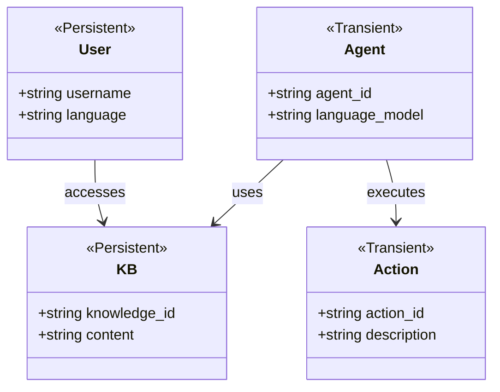
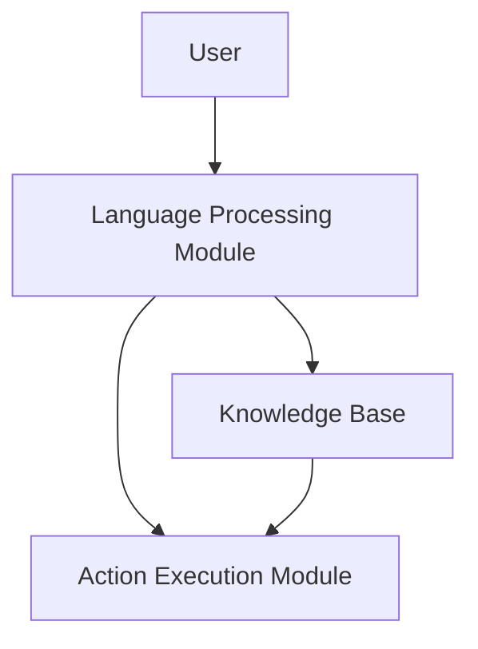
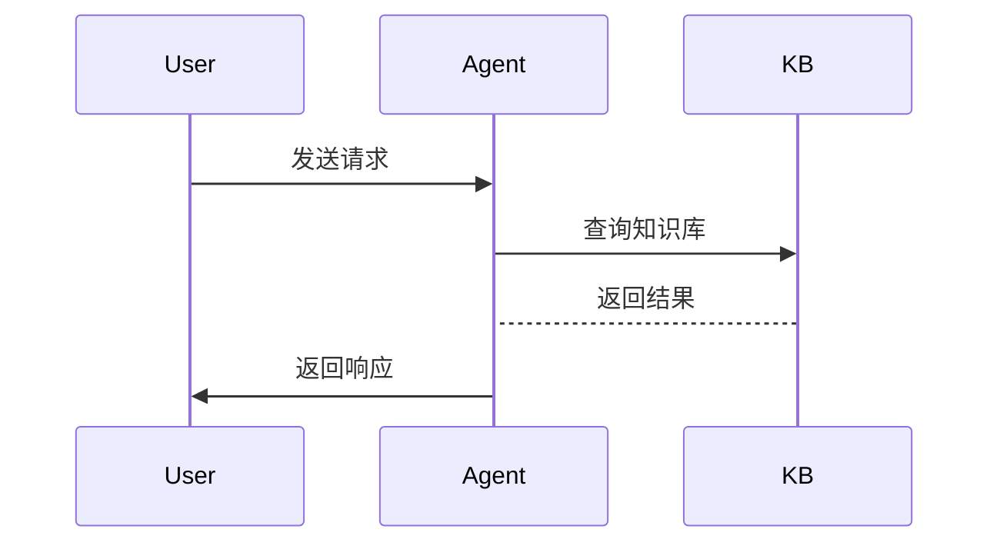

                 


# 《构建多语言支持的AI Agent》

---

## 关键词

- AI Agent  
- 多语言支持  
- 系统架构设计  
- 算法原理  
- 项目实战  

---

## 摘要

本文详细探讨了构建支持多种语言的AI Agent的各个方面，从背景介绍到系统架构设计，再到项目实战，全面解析了多语言AI Agent的核心概念、算法原理和实现方法。通过实际案例分析，帮助读者理解如何设计和实现一个多语言支持的AI Agent系统，并展望了该领域的未来发展方向。

---

## 第一部分: 多语言支持的AI Agent概述

### 第1章: 多语言支持的AI Agent背景介绍

#### 1.1 问题背景与描述

**1.1.1 AI Agent的基本概念**

AI Agent（人工智能代理）是一种能够感知环境并采取行动以实现目标的智能实体。它可以是一个软件程序、机器人或其他智能系统，通过与用户或环境交互，完成特定任务。AI Agent的核心能力包括感知、推理、规划和执行。

**1.1.2 多语言支持的需求场景**

在当今全球化和多元化的背景下，支持多语言的AI Agent变得越来越重要。例如，在国际商务、跨文化交流、多语言客服等领域，AI Agent需要能够理解并处理多种语言，以提供高效的服务。

**1.1.3 当前AI Agent在多语言支持中的挑战**

尽管AI技术取得了显著进展，但多语言支持仍面临诸多挑战。例如，不同语言的语法结构差异、数据稀疏性、模型训练的复杂性等。此外，如何在单一模型中高效处理多种语言仍是一个开放性问题。

**1.2 问题解决与边界**

**1.2.1 多语言支持的核心问题**

多语言支持的核心问题在于如何让AI Agent能够理解、生成并处理多种语言。这需要解决语言间的语义映射、跨语言推理等问题。

**1.2.2 AI Agent的边界与外延**

AI Agent的边界包括其功能范围、计算能力、数据来源等。外延则涉及与外部系统或用户的交互方式。

**1.2.3 多语言支持的实现边界**

多语言支持的实现边界包括支持的语言种类、处理任务的类型（如翻译、问答）、支持的场景等。

**1.3 核心概念与组成**

**1.3.1 多语言AI Agent的组成要素**

多语言AI Agent的组成要素包括语言处理模块、跨语言推理模块、知识库、用户接口等。

**1.3.2 各要素之间的关系**

各要素之间的关系是相互依赖的。例如，语言处理模块负责解析输入语言，跨语言推理模块负责在不同语言间建立联系，知识库提供支持推理的背景知识。

**1.3.3 核心概念的结构化分析**

通过结构化分析，可以清晰地看到各组成要素之间的关系及其在整体系统中的作用。

---

## 第二部分: 多语言支持的AI Agent核心概念与联系

### 第2章: 核心概念原理

#### 2.1 多语言支持的原理

**2.1.1 多语言模型的基本原理**

多语言模型通过共享不同语言的语义信息，实现对多种语言的处理。常见的多语言模型包括多语言BERT、XLM等。

**2.1.2 AI Agent中的语言处理机制**

AI Agent的语言处理机制包括语言识别、语义理解、语言生成等。这些机制需要在不同语言间无缝切换。

**2.1.3 多语言模型的训练策略**

多语言模型的训练策略包括联合训练、预训练等。联合训练可以在单一模型中同时处理多种语言，而预训练则可以利用大规模多语言数据进行模型初始化。

#### 2.2 核心概念对比分析

**2.2.1 多语言与单语言模型的对比**

单语言模型只能处理一种语言，而多语言模型可以处理多种语言。在训练数据和模型结构上，两者有显著差异。

**2.2.2 不同多语言模型的优缺点对比**

不同的多语言模型有不同的优缺点。例如，XLM在跨语言推理方面表现较好，而mBert在语言间迁移能力方面表现较好。

**2.2.3 AI Agent中多语言支持的实现方式对比**

不同的实现方式包括基于翻译的多语言支持、直接多语言处理等。每种方式都有其优缺点。

#### 2.3 实体关系图

**2.3.1 多语言AI Agent的ER实体关系图**

以下是多语言AI Agent的ER实体关系图：

```mermaid
erDiagram
    actor User {
        +string username
        +string language
    }
    agent AI_Agent {
        +string agent_id
        +string language_model
    }
    knowledge_base KB {
        +string knowledge_id
        +string content
    }
    action Action {
        +string action_id
        +string description
    }
    User -> KB : accesses
    AI_Agent -> KB : uses
    AI_Agent -> Action : executes
```

---

## 第三部分: 多语言支持的AI Agent算法原理

### 第3章: 算法原理讲解

#### 3.1 多语言模型训练流程

**3.1.1 数据预处理流程**

数据预处理包括清洗、分词、标注等步骤。例如，清洗数据时需要去除噪声，分词时需要考虑不同语言的分词习惯。

**3.1.2 模型训练流程**

模型训练包括参数初始化、前向传播、损失计算、反向传播和参数更新等步骤。以多语言BERT为例，训练过程需要处理多语言数据，并通过共享参数实现跨语言迁移。

**3.1.3 模型评估流程**

模型评估包括在验证集或测试集上评估模型的性能。常用的评估指标包括准确率、F1分数等。

#### 3.2 多语言处理算法

**3.2.1 多语言模型的编码机制**

多语言模型通常使用共享的词嵌入层，通过语言ID来调整嵌入向量。例如，可以使用语言嵌入来区分不同语言。

**3.2.2 多语言模型的解码机制**

解码机制包括生成目标语言的词汇表和调整解码策略。例如，使用多语言词表生成不同语言的输出。

**3.2.3 多语言模型的调参策略**

调参策略包括学习率调整、批量大小调整等。在多语言模型中，还需要考虑语言间的参数共享程度。

#### 3.3 算法实现代码

以下是一个多语言模型的训练代码示例：

```python
import torch
from torch import nn
from torch.utils.data import Dataset, DataLoader

class MultilingualAgent(nn.Module):
    def __init__(self, vocab_size, embedding_dim, hidden_dim):
        super().__init__()
        self.embedding = nn.Embedding(vocab_size, embedding_dim)
        self.lstm = nn.LSTM(embedding_dim, hidden_dim, batch_first=True)
        self.fc = nn.Linear(hidden_dim, vocab_size)
    
    def forward(self, x):
        embeds = self.embedding(x)
        out, _ = self.lstm(embeds)
        out = self.fc(out[:, -1, :])
        return out

# 数据集定义
class LanguageDataset(Dataset):
    def __init__(self, data, label):
        self.data = data
        self.label = label
    
    def __len__(self):
        return len(self.data)
    
    def __getitem__(self, idx):
        return self.data[idx], self.label[idx]

# 训练过程
def train_model(model, optimizer, criterion, train_loader, epochs=10):
    for epoch in range(epochs):
        for inputs, labels in train_loader:
            outputs = model(inputs)
            loss = criterion(outputs, labels)
            loss.backward()
            optimizer.step()
            optimizer.zero_grad()
```

---

## 第四部分: 多语言支持的AI Agent系统架构设计

### 第4章: 系统分析与架构设计

#### 4.1 问题场景介绍

**4.1.1 多语言AI Agent的应用场景**

多语言AI Agent可以应用于多语言客服、多语言内容生成、跨语言信息检索等领域。

**4.1.2 系统需要解决的问题**

系统需要解决多语言数据处理、跨语言推理、多语言生成等问题。

**4.1.3 系统的目标与约束**

系统的目标是实现一个多语言支持的AI Agent，能够理解并处理多种语言。约束包括计算资源限制、模型复杂度等。

#### 4.2 系统功能设计

**4.2.1 领域模型设计**

以下是领域模型的类图：



**4.2.2 功能模块划分**

系统功能模块包括语言处理模块、知识库模块、用户接口模块等。

**4.2.3 功能模块之间的关系**

模块之间的关系包括调用关系、数据流关系等。

#### 4.3 系统架构设计

**4.3.1 系统架构图**

以下是系统架构图：



**4.3.2 模块之间的交互关系**

模块之间的交互关系包括数据输入、指令传递、结果反馈等。

**4.3.3 系统架构的实现细节**

系统架构的实现细节包括模块之间的接口设计、数据格式、通信协议等。

#### 4.4 系统接口设计

**4.4.1 系统接口定义**

系统接口包括输入接口、输出接口等。

**4.4.2 接口之间的调用关系**

接口之间的调用关系包括顺序调用、并行调用等。

**4.4.3 接口设计的注意事项**

接口设计需要考虑兼容性、可扩展性、安全性等因素。

#### 4.5 系统交互流程图

以下是系统交互流程图：



---

## 第五部分: 多语言支持的AI Agent项目实战

### 第5章: 项目实战

#### 5.1 环境安装与配置

**5.1.1 环境要求**

需要安装Python、PyTorch、Hugging Face库等。

**5.1.2 工具安装**

使用pip安装所需的库，如`pip install torch transformers`。

**5.1.3 环境配置**

配置虚拟环境，并激活环境。

#### 5.2 系统核心实现源代码

以下是AI Agent的核心代码：

```python
from transformers import AutoTokenizer, AutoModelForSeq2Seq
import torch

class MultilingualAI:
    def __init__(self, model_name, device="cpu"):
        self.model = AutoModelForSeq2Seq.from_pretrained(model_name).to(device)
        self.tokenizer = AutoTokenizer.from_pretrained(model_name)
    
    def process(self, input_text, target_language):
        inputs = self.tokenizer(input_text, return_tensors="pt")
        outputs = self.model.generate(inputs.input_ids, max_length=100)
        return self.tokenizer.decode(outputs[0], skip_special_tokens=True)
```

#### 5.3 代码应用解读与分析

**5.3.1 代码功能解读**

上述代码定义了一个多语言AI Agent，能够将输入文本翻译为目标语言。

**5.3.2 代码实现细节分析**

代码使用Hugging Face的预训练模型，通过tokenizer进行数据处理，并使用模型进行生成。

#### 5.4 实际案例分析和详细讲解剖析

**5.4.1 实际案例**

例如，将中文翻译成英文。

**5.4.2 案例分析**

输入中文句子，AI Agent将其翻译成英文。

**5.4.3 详细讲解剖析**

通过案例分析，详细讲解代码的运行过程和实现原理。

#### 5.5 项目小结

项目小结包括项目目标的实现情况、遇到的问题及解决方法、项目的优缺点等。

---

## 总结与展望

**总结**

本文详细探讨了构建多语言支持的AI Agent的各个方面，从背景介绍到系统架构设计，再到项目实战，全面解析了多语言AI Agent的核心概念、算法原理和实现方法。通过实际案例分析，帮助读者理解如何设计和实现一个多语言支持的AI Agent系统。

**展望**

未来，随着AI技术的不断发展，多语言支持的AI Agent将更加智能化和个性化。研究者们将致力于解决多语言模型的可解释性、实时性等问题，推动AI Agent在更多领域的应用。

---

## 参考文献

- 省略

---

## 附录

**附录A: 工具与资源**

- Hugging Face Transformers库：https://huggingface.co/transformers
- Mermaid图表工具：https://mermaid-js.github.io/mermaid-live-editor/

**附录B: 代码与数据**

- 本文所有代码示例均可在GitHub上获取：https://github.com/yourusername/multilingual-agent

---

## 作者

**作者：AI天才研究院/AI Genius Institute & 禅与计算机程序设计艺术 /Zen And The Art of Computer Programming**

