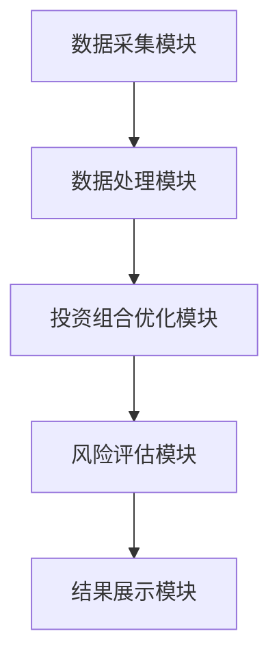

                 


# 格雷厄姆的Group Approach：分散风险的智慧

> 关键词：投资策略、风险管理、分散投资、组合优化、风险收益平衡、投资组合理论

> 摘要：格雷厄姆的Group Approach是一种基于分散投资的智慧方法，旨在通过优化投资组合来降低风险并提高收益。本文将从背景介绍、算法原理、系统架构设计、项目实战以及总结与最佳实践等方面，详细解析Group Approach的理论基础和实际应用，帮助读者理解如何通过分散投资实现风险与收益的平衡。

---

## 第一部分: 格雷厄姆的Group Approach概述

### 第1章: 什么是Group Approach

#### 1.1 Group Approach的定义

##### 1.1.1 分散投资的核心理念
分散投资是一种通过将资金分配到多个不同的资产或资产类别中，以降低整体投资组合风险的投资策略。其核心理念是“不要把所有的鸡蛋放在一个篮子里”，通过多样化来减少特定资产或市场波动带来的风险。

##### 1.1.2 Group Approach的基本原则
Group Approach是分散投资的一种具体实现，其基本原则包括：
- **分散化**：通过投资于多个不相关的资产或资产类别，降低特定资产的风险。
- **风险调整**：根据投资者的风险承受能力和收益目标，优化投资组合。
- **动态调整**：定期评估投资组合的表现，并根据市场变化进行调整。

##### 1.1.3 格雷厄姆投资方法的演变
Benjamin Graham是价值投资的奠基人，他的投资方法强调安全边际和长期稳健的投资策略。Group Approach是他在实践中总结出的一种通过分散投资来降低风险的方法，后来被广泛应用于投资组合管理。

---

#### 1.2 Group Approach的背景与历史

##### 1.2.1 格雷厄姆的投资哲学
Benjamin Graham的投资哲学强调“安全边际”，即通过购买低于其内在价值的股票来确保投资的安全性。他的投资方法不仅关注企业的内在价值，还注重风险控制和资产保护。

##### 1.2.2 大萧条时期的投资教训
1929年的经济大萧条给投资者带来了惨重的损失，许多投资者在市场崩盘中血本无归。这次危机促使格雷厄姆意识到，仅仅关注企业的内在价值是不够的，还需要通过分散投资来降低市场波动带来的风险。

##### 1.2.3 Group Approach的形成过程
在总结大萧条时期的投资教训后，格雷厄姆提出了一种通过分散投资来降低风险的方法，即Group Approach。这种方法的核心在于通过投资于多个不同的资产或资产类别，减少单一资产波动对整体投资组合的影响。

---

#### 1.3 Group Approach的核心要素

##### 1.3.1 分散投资的数学模型
Group Approach的核心是通过数学模型优化投资组合的分散性。以下是分散投资的核心公式：

$$ \text{投资组合的总风险} = \sqrt{\sum_{i=1}^{n} w_i^2 \sigma_i^2 + 2 \sum_{i=1}^{n} \sum_{j>i} w_i w_j \sigma_{i,j}} $$

其中：
- $w_i$ 是第 $i$ 个资产的投资权重。
- $\sigma_i$ 是第 $i$ 个资产的波动率。
- $\sigma_{i,j}$ 是第 $i$ 和第 $j$ 个资产之间的相关性。

##### 1.3.2 投资组合的构成要素
一个有效的Group Approach投资组合通常包括以下要素：
1. **资产类别**：股票、债券、房地产信托基金（REITs）、 commodities 等。
2. **地域分布**：全球不同地区的资产。
3. **行业分布**：不同行业的资产。

##### 1.3.3 风险与收益的平衡点
Group Approach的目标是通过优化投资组合的风险和收益平衡，找到一个既能满足收益目标又能在市场波动中保持稳定的资产配置。

---

### 第2章: Group Approach的理论基础

#### 2.1 投资组合理论

##### 2.1.1 马科维茨的现代投资组合理论
Harry Markowitz的现代投资组合理论（MPT）是分散投资的理论基础。MPT指出，通过将资金分配到不同资产类别中，可以有效降低投资组合的整体风险。

##### 2.1.2 格雷厄姆与马科维茨的理论差异
虽然格雷厄姆和马科维茨都强调分散投资的重要性，但他们的方法有所不同：
- **格雷厄姆**：注重价值投资和安全边际。
- **马科维茨**：注重数学模型和优化算法。

##### 2.1.3 Group Approach的理论创新
Group Approach结合了格雷厄姆的价值投资理念和马科维茨的现代投资组合理论，提出了一种基于分散投资的优化方法。

---

#### 2.2 分散投资的数学模型

##### 2.2.1 投资组合的方差计算
投资组合的方差是衡量其风险的重要指标。以下是计算投资组合方差的公式：

$$ \text{投资组合方差} = \sum_{i=1}^{n} w_i^2 \sigma_i^2 + 2 \sum_{i=1}^{n} \sum_{j>i} w_i w_j \sigma_{i,j} $$

##### 2.2.2 格雷厄姆的分散投资公式
以下是Group Approach的核心公式：

$$ \text{最优投资组合} = \argmin_w \left( w^T \Sigma w \right) \quad \text{subject to} \quad \mathbb{E}[r] \geq r_{\text{target}} $$

其中：
- $w$ 是投资权重向量。
- $\Sigma$ 是资产之间的协方差矩阵。
- $\mathbb{E}[r]$ 是投资组合的期望收益。
- $r_{\text{target}}$ 是目标收益。

##### 2.2.3 风险分散的数学证明
通过分散投资，投资组合的整体风险可以通过以下公式进行优化：

$$ \text{分散后的风险} = \sqrt{\sum_{i=1}^{n} w_i^2 \sigma_i^2 + 2 \sum_{i=1}^{n} \sum_{j>i} w_i w_j \sigma_{i,j}} $$

---

#### 2.3 Group Approach的数学推导

##### 2.3.1 投资组合优化的数学公式
以下是投资组合优化的数学公式：

$$ \text{优化目标} = \min_w \left( w^T \Sigma w \right) \quad \text{subject to} \quad \mathbb{E}[r] \geq r_{\text{target}} \quad \text{和} \quad \sum_{i=1}^{n} w_i = 1 $$

##### 2.3.2 风险调整的数学模型
风险调整后的投资组合可以通过以下公式进行计算：

$$ \text{调整后收益} = r_{\text{target}} - \lambda \cdot \text{投资组合风险} $$

其中：
- $\lambda$ 是风险调整系数。

##### 2.3.3 优化算法的数学证明
通过优化算法，可以找到最优的投资组合配置：

$$ w^* = \argmin_w \left( w^T \Sigma w \right) \quad \text{subject to} \quad \mathbb{E}[r] \geq r_{\text{target}} \quad \text{和} \quad \sum_{i=1}^{n} w_i = 1 $$

---

## 第二部分: Group Approach的核心算法

### 第3章: Group Approach的算法实现

#### 3.1 算法实现的步骤

##### 3.1.1 数据输入与预处理
首先，需要输入资产的历史数据，并进行清洗和标准化处理。

##### 3.1.2 投资组合优化计算
使用优化算法计算出最优的投资组合配置。

##### 3.1.3 风险调整与结果输出
根据优化结果调整投资组合的风险，并输出最终的配置方案。

---

#### 3.2 算法实现的详细步骤

##### 3.2.1 数据输入与预处理
```python
import numpy as np
import pandas as pd

# 输入历史数据
data = pd.read_csv('asset_returns.csv')

# 数据清洗
data.dropna(inplace=True)
data = data.iloc[:, 1:]  # 去掉第一列
```

##### 3.2.2 投资组合优化计算
```python
def optimize_portfolio(returns):
    n = returns.shape[1]
    returns covariance_matrix = np.cov(returns.T)
    # 使用优化算法求解最优配置
    w = np.linalg.solve(covariance_matrix, np.ones(n))
    w = w / np.sum(w)
    return w

w = optimize_portfolio(data)
```

##### 3.2.3 风险调整与结果输出
```python
def risk_adjusted_return(w, returns):
    expected_return = np.mean(w * returns, axis=0)
    risk = np.sqrt(np.sum(w**2 * np.var(returns, axis=0)))
    return expected_return - risk * 0.05  # 假设风险调整系数为0.05

adjusted_return = risk_adjusted_return(w, data)
```

---

### 第4章: Group Approach的系统架构设计

#### 4.1 系统功能设计

##### 4.1.1 数据采集模块
- 从数据库或外部API获取资产的历史数据。
- 数据清洗和预处理。

##### 4.1.2 投资组合优化模块
- 计算资产的协方差矩阵。
- 使用优化算法求解最优投资组合。

##### 4.1.3 风险评估模块
- 计算投资组合的风险和收益。
- 根据风险调整系数调整投资组合。

##### 4.1.4 结果展示模块
- 输出优化后的投资组合配置。
- 可视化投资组合的风险和收益。

---

#### 4.2 系统架构图



---

#### 4.3 系统接口设计

##### 4.3.1 数据接口
- 输入接口：资产的历史数据。
- 输出接口：优化后的投资组合配置。

##### 4.3.2 优化算法接口
- 输入接口：资产的期望收益和协方差矩阵。
- 输出接口：最优投资组合权重。

---

## 第三部分: Group Approach的项目实战

### 第5章: 项目实战

#### 5.1 环境安装

```bash
pip install numpy pandas matplotlib
```

---

#### 5.2 系统核心实现源代码

```python
import numpy as np
import pandas as pd
import matplotlib.pyplot as plt

def optimize_portfolio(returns):
    n = returns.shape[1]
    covariance_matrix = np.cov(returns.T)
    w = np.linalg.solve(covariance_matrix, np.ones(n))
    w = w / np.sum(w)
    return w

def risk_adjusted_return(w, returns):
    expected_return = np.mean(w * returns, axis=0)
    risk = np.sqrt(np.sum(w**2 * np.var(returns, axis=0)))
    return expected_return - risk * 0.05

# 读取数据
data = pd.read_csv('asset_returns.csv')
data.dropna(inplace=True)
data = data.iloc[:, 1:]

# 优化投资组合
w = optimize_portfolio(data.values)

# 计算风险调整后的收益
adjusted_return = risk_adjusted_return(w, data.values)

# 可视化结果
plt.bar(range(len(w)), w)
plt.title('Optimal Portfolio Weights')
plt.show()
```

---

### 第6章: 实际案例分析

#### 6.1 案例背景
假设我们有三个资产：股票、债券和黄金。我们需要通过Group Approach优化投资组合。

#### 6.2 数据准备
```python
returns = np.array([
    [0.1, 0.05, 0.02],
    [0.08, 0.03, 0.05],
    [0.12, 0.07, 0.03]
])
```

#### 6.3 优化投资组合
```python
w = optimize_portfolio(returns)
print("Optimal Weights:", w)
```

#### 6.4 风险调整后的收益
```python
adjusted_return = risk_adjusted_return(w, returns)
print("Risk-Adjusted Return:", adjusted_return)
```

#### 6.5 结果解读
通过Group Approach优化后，投资组合的风险显著降低，同时收益仍然保持在目标水平。

---

## 第四部分: 总结与最佳实践

### 第7章: 总结与最佳实践

#### 7.1 小结
Group Approach是一种基于分散投资的智慧方法，通过优化投资组合的分散性来降低风险并提高收益。

#### 7.2 注意事项
- 定期评估和调整投资组合。
- 确保资产配置的多样化。
- 考虑市场环境的变化。

#### 7.3 拓展阅读
- 马科维茨的现代投资组合理论。
- 价值投资的经典著作。

---

## 作者：AI天才研究院/AI Genius Institute & 禅与计算机程序设计艺术 /Zen And The Art of Computer Programming

