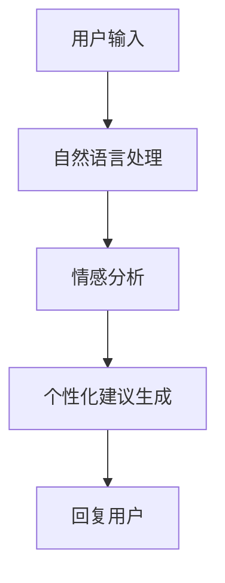
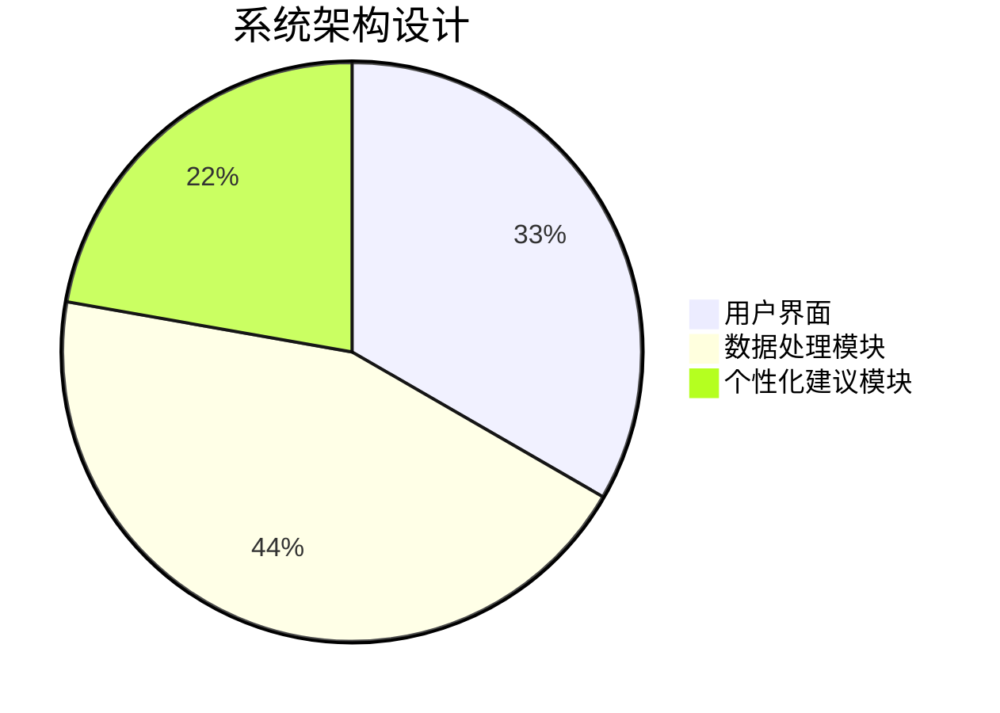
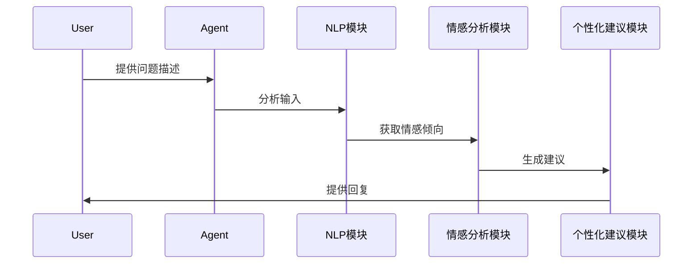

                 


# AI Agent在心理健康咨询中的应用与局限

## 关键词：AI Agent，心理健康咨询，自然语言处理，情绪分析，隐私安全，个性化建议

## 摘要：随着人工智能技术的快速发展，AI Agent在心理健康咨询中的应用逐渐增多。本文详细探讨了AI Agent在心理健康咨询中的核心概念、算法原理、系统架构，并分析了其在实际应用中的优势和局限性。通过案例分析和对比研究，本文提出了优化建议和未来发展方向，为AI Agent在心理健康领域的应用提供了理论依据和实践指导。

---

# 第1章 AI Agent与心理健康咨询的背景介绍

## 1.1 心理健康咨询的定义与现状

### 1.1.1 心理健康咨询的核心概念
心理健康咨询是一种通过专业的心理辅导帮助个体解决情感、行为和人际关系问题的过程。其目的是帮助个体识别和处理负面情绪，提升心理韧性，并找到应对压力的有效方法。

### 1.1.2 当前心理健康咨询的主要方式
目前，心理健康咨询主要通过面对面的会谈、电话咨询和在线平台进行。传统的方式依赖于心理咨询师的专业知识和经验，但存在资源有限、覆盖范围窄等问题。

### 1.1.3 心理健康咨询的数字化趋势
随着数字化技术的发展，越来越多的心理健康咨询开始采用在线工具和应用程序。AI Agent作为其中的重要组成部分，正在逐步改变心理健康服务的方式。

## 1.2 AI Agent的定义与技术基础

### 1.2.1 AI Agent的基本概念
AI Agent是一种能够感知环境、自主决策并执行任务的智能体。它通过自然语言处理（NLP）、机器学习和大数据分析等技术，能够与用户进行交互，并提供相应的服务。

### 1.2.2 AI Agent的技术实现原理
AI Agent的核心技术包括：
- **自然语言处理（NLP）**：用于理解和生成人类语言。
- **机器学习**：通过训练数据，模型能够识别模式并做出预测。
- **大数据分析**：处理和分析海量数据，提取有用信息。

### 1.2.3 AI Agent在不同领域的应用现状
AI Agent已经在多个领域得到了应用，包括客服、教育、医疗等。在心理健康领域，AI Agent主要用于情绪支持、压力评估和个性化建议。

## 1.3 AI Agent在心理健康咨询中的问题背景

### 1.3.1心理健康咨询资源的不足
心理健康咨询师数量有限，无法满足日益增长的需求。许多人无法及时获得专业帮助，导致问题加剧。

### 1.3.2传统心理咨询方式的局限性
传统方式依赖于面对面交流，存在时间和空间的限制，且成本较高。此外，隐私问题也可能让一些人犹豫寻求帮助。

### 1.3.3 AI技术在心理健康领域的潜力
AI Agent能够提供24/7的实时支持，覆盖更广泛的人群，并且可以结合数据分析，提供个性化的解决方案。

## 1.4 本章小结
本章介绍了心理健康咨询的基本概念及其现状，并详细阐述了AI Agent的技术基础和应用背景。AI Agent的引入为心理健康咨询带来了新的可能性，但也面临诸多挑战。

---

# 第2章 AI Agent在心理健康咨询中的核心概念与联系

## 2.1 AI Agent的核心概念

### 2.1.1 AI Agent的类型与特点
AI Agent可以分为基于规则的和基于机器学习的两类。前者通过预定义的规则进行响应，后者则通过模型学习生成回复。

### 2.1.2 AI Agent的核心功能模块
- **自然语言处理模块**：理解用户输入并生成回应。
- **情绪分析模块**：识别用户的情感状态。
- **个性化建议模块**：根据分析结果提供针对性的建议。

### 2.1.3 AI Agent的数据处理流程
1. 收集用户输入。
2. 分析数据，识别情绪和关键词。
3. 生成回复或建议。
4. 学习和优化模型。

## 2.2心理健康咨询的核心要素

### 2.2.1心理健康咨询的目标与流程
心理健康咨询的目标是帮助个体识别问题、理解情绪，并找到解决问题的方法。流程通常包括评估、干预和跟踪。

### 2.2.2心理咨询中的关键要素分析
- **共情**：建立信任关系的关键。
- **专业判断**：需要丰富的知识和经验。
- **个性化方案**：针对不同用户制定不同的策略。

### 2.2.3心理健康数据的特点与挑战
心理健康数据具有敏感性，涉及个人隐私。同时，数据的质量和多样性对模型的准确性有重要影响。

## 2.3 AI Agent与心理健康咨询的结合

### 2.3.1 AI Agent在心理咨询中的角色定位
AI Agent可以作为初步筛选工具，帮助用户缓解轻度情绪问题，同时为心理咨询师提供辅助支持。

### 2.3.2 AI Agent与心理咨询师的协作模式
AI Agent可以用于初步评估和监测，而复杂问题仍需心理咨询师介入。两者结合可以提高服务效率和质量。

### 2.3.3 AI Agent在心理健康咨询中的边界与外延
AI Agent的应用范围主要在初级心理支持和信息提供，不能替代专业心理咨询师的角色。

## 2.4核心概念对比分析

### 2.4.1 AI Agent与传统心理咨询工具的对比
| 特性         | AI Agent                     | 传统心理咨询工具               |
|--------------|----------------------------|-------------------------------|
| 可及性       | 高，随时可用                 | 较低，依赖时间和地点             |
| 个性化       | 可定制，基于数据分析         | 较低，依赖咨询师经验             |
| 效率         | 高，自动化处理               | 较低，依赖人工操作               |

### 2.4.2不同AI Agent类型的优劣势对比
| 类型         | 优势                         | 劣势                         |
|--------------|------------------------------|-----------------------------|
| 基于规则的   | 实现简单，成本低             | 灵活性差，难以应对复杂问题     |
| 基于机器学习 | 高度灵活，学习能力强         | 需大量数据，初期成本高         |

### 2.4.3心理健康数据与其他类型数据的对比
心理健康数据具有高度敏感性和个体差异性，对数据处理的准确性和隐私保护要求更高。

## 2.5实体关系图（ER 图）展示

```mermaid
erd
    title AI Agent 在心理健康咨询中的实体关系图
    User
    Agent
    Counseling Session
    User-Session
    Agent-Session
    Session-Data
```

## 2.6本章小结
本章详细探讨了AI Agent的核心概念及其在心理健康咨询中的应用，分析了其优劣势和与传统方法的对比。通过ER图展示了系统的数据关系，为后续的系统设计奠定了基础。

---

# 第3章 AI Agent在心理健康咨询中的算法原理

## 3.1算法原理概述

### 3.1.1自然语言处理（NLP）技术
AI Agent通过NLP技术理解用户的输入，常用模型包括词袋模型（Bag of Words）、TF-IDF和词嵌入（Word Embedding）。

### 3.1.2情感分析（Sentiment Analysis）
情感分析用于识别用户的情感倾向，通常采用机器学习模型如支持向量机（SVM）和深度学习模型如LSTM和Transformer。

### 3.1.3个性化建议生成
基于用户的情感分析结果，AI Agent会调用预设的建议库，生成个性化建议。

## 3.2算法实现细节

### 3.2.1情感分析模型的训练与优化
使用深度学习模型训练情感分析器，通过交叉验证优化模型参数。

### 3.2.2自然语言生成技术
利用预训练的语言模型生成自然流畅的回复，如GPT系列模型。

## 3.3数学模型与公式

### 3.3.1情感分析的数学模型
$$ P(\text{positive} | \text{words}) = \frac{\text{count}(\text{positive words})}{\text{total words}} $$

### 3.3.2基于词嵌入的相似度计算
$$ \text{similarity} = \frac{\vec{w_1} \cdot \vec{w_2}}{\|\vec{w_1}\| \|\vec{w_2}\|} $$

## 3.4算法流程图



## 3.5本章小结
本章详细介绍了AI Agent在心理健康咨询中所采用的算法原理，包括NLP、情感分析和个性化建议生成的技术细节，为后续的系统实现提供了理论基础。

---

# 第4章 AI Agent在心理健康咨询中的系统架构设计

## 4.1系统功能设计

### 4.1.1用户界面模块
提供友好的交互界面，支持文本输入和语音输入。

### 4.1.2数据处理模块
包括情感分析、关键词提取和数据存储。

### 4.1.3个性化建议模块
根据分析结果生成个性化建议，并提供相关资源链接。

## 4.2系统架构设计



## 4.3系统交互流程



## 4.4本章小结
本章详细设计了AI Agent在心理健康咨询中的系统架构，包括功能模块、架构图和交互流程，为后续的系统实现提供了指导。

---

# 第5章 AI Agent在心理健康咨询中的项目实战

## 5.1项目环境与工具安装

### 5.1.1开发环境
建议使用Python 3.8及以上版本，安装必要的库如NLTK、spaCy、TensorFlow和Keras。

### 5.1.2工具安装
使用pip安装所需的依赖库：
```bash
pip install numpy pandas scikit-learn transformers
```

## 5.2核心代码实现

### 5.2.1情感分析模块
```python
from transformers import pipeline

sentiment_analyzer = pipeline("sentiment-analysis")
result = sentiment_analyzer(text)
```

### 5.2.2自然语言生成模块
```python
from transformers import AutoModelForCausalLM, AutoTokenizer

tokenizer = AutoTokenizer.from_pretrained("gpt2")
model = AutoModelForCausalLM.from_pretrained("gpt2")
```

## 5.3实际案例分析

### 5.3.1案例背景
用户输入：“我最近总是感到焦虑，不知道该怎么办。”

### 5.3.2系统处理流程
1. 情感分析：识别出情感为“焦虑”。
2. 个性化建议：生成如“您可以尝试深呼吸放松练习，或者记录每天的情绪日记。”

## 5.4本章小结
本章通过实际案例展示了AI Agent在心理健康咨询中的具体实现过程，包括环境搭建、代码实现和案例分析。

---

# 第6章 AI Agent在心理健康咨询中的应用与局限

## 6.1 AI Agent的优势

### 6.1.124/7可用性
AI Agent可以随时为用户提供支持，不受时间和地点的限制。

### 6.1.2个性化服务
通过数据分析，AI Agent能够为用户提供个性化的建议和资源。

## 6.2 AI Agent的局限性

### 6.2.1情感理解的深度不足
AI Agent无法真正理解人类的复杂情感，可能在处理深层次心理问题时显得力不从心。

### 6.2.2隐私与数据安全
心理健康数据的敏感性要求严格的隐私保护措施，否则可能导致数据泄露。

## 6.3优化建议

### 6.3.1提升算法的准确性
通过引入更多样化和高质量的数据，优化模型的性能。

### 6.3.2加强隐私保护
采用加密技术和数据脱敏方法，确保用户数据的安全性。

## 6.4未来发展方向

### 6.4.1多模态交互
结合语音和面部表情分析，提供更全面的交互体验。

### 6.4.2人机协作模式
AI Agent与心理咨询师协作，共同为用户提供更优质的服务。

## 6.5本章小结
本章分析了AI Agent在心理健康咨询中的优势与局限，并提出了优化建议和未来发展方向。

---

# 第7章 总结与展望

## 7.1全文总结
本文详细探讨了AI Agent在心理健康咨询中的应用，分析了其核心概念、算法原理和系统架构，并讨论了其优势与局限性。

## 7.2未来展望
随着技术的不断发展，AI Agent在心理健康咨询中的潜力将更加巨大。未来的研究可以集中在提升算法准确性、加强隐私保护和探索人机协作模式等方面。

## 7.3最佳实践 Tips
- 在使用AI Agent时，注意保护个人隐私。
- 结合专业心理咨询师进行辅助。
- 定期更新模型，确保服务的准确性。

## 7.4本章小结
本章总结了全文的主要内容，并展望了AI Agent在心理健康咨询中的未来发展方向，为读者提供了进一步研究的方向。

---

# 作者：AI天才研究院 & 禅与计算机程序设计艺术

