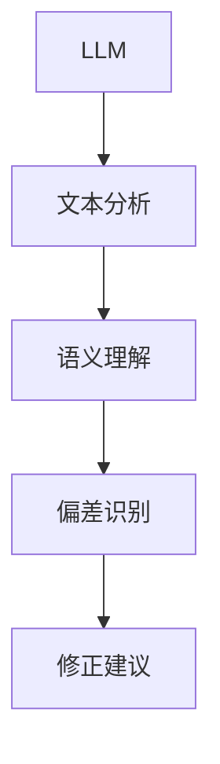
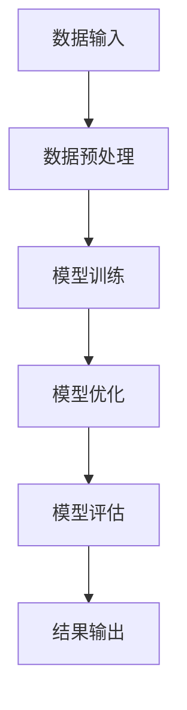
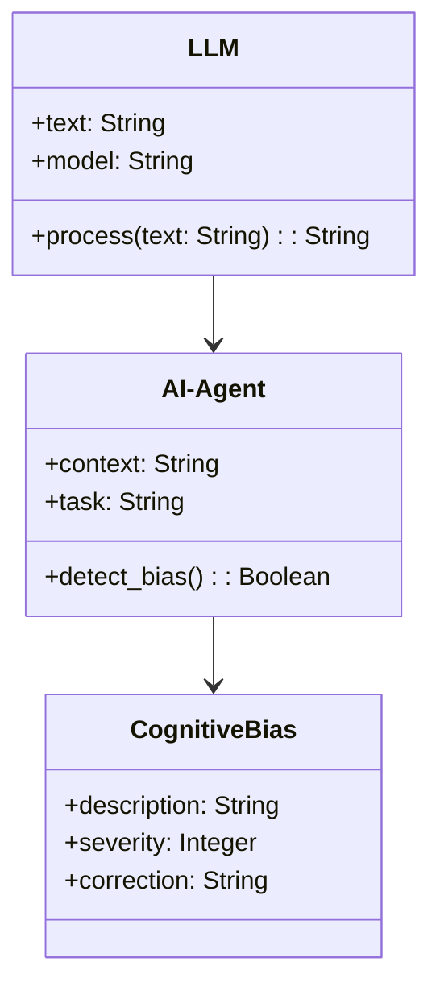
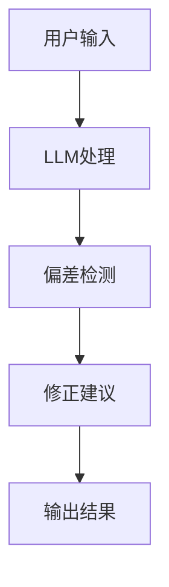
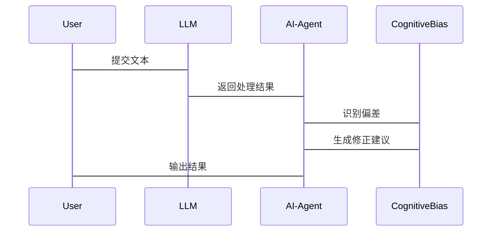

                 


# LLM在AI Agent认知偏差识别中的应用

> **关键词**: 大语言模型（LLM）、AI Agent、认知偏差、自然语言处理、人工智能

> **摘要**: 本文探讨了大语言模型（LLM）在AI Agent认知偏差识别中的应用。通过分析LLM与AI Agent的基本概念，认知偏差的定义与分类，以及LLM在认知偏差识别中的技术原理和算法实现，本文深入剖析了LLM如何帮助AI Agent更准确地识别和修正认知偏差。同时，本文通过实际案例分析，展示了LLM在AI Agent认知偏差识别中的具体应用场景和实现方法。

---

# 1. LLM与AI Agent认知偏差概述

## 1.1 LLM与AI Agent的基本概念

### 1.1.1 大语言模型（LLM）的定义与特点

大语言模型（Large Language Model, LLM）是指基于深度学习技术训练的、具有大规模参数的自然语言处理模型。LLM的核心特点包括：

- **大规模训练数据**: LLM通常使用海量的文本数据进行训练，使其能够理解多种语言和语境。
- **上下文理解能力**: LLM能够通过上下文理解文本的含义，生成连贯且符合逻辑的文本。
- **多任务能力**: LLM可以应用于多种任务，如文本生成、问答系统、文本摘要等。

### 1.1.2 AI Agent的定义与分类

AI Agent（人工智能代理）是指能够感知环境、执行任务并做出决策的智能系统。AI Agent可以根据不同的标准进行分类：

- **按智能水平**: 分为简单反射型Agent、基于模型的反应式Agent、目标驱动的Agent、实用驱动的Agent等。
- **按应用场景**: 分为软件Agent、服务Agent、机器人Agent等。

### 1.1.3 认知偏差的定义与分类

认知偏差是指人在信息处理过程中，由于主观因素或信息不完整而导致的判断错误。常见的认知偏差包括确认偏差、选择性感知偏差、归因偏差等。认知偏差对AI Agent的决策能力有重要影响，因此识别和修正认知偏差是提升AI Agent性能的关键。

---

## 1.2 LLM在AI Agent认知偏差识别中的应用背景

### 1.2.1 AI Agent在智能决策中的重要性

AI Agent作为智能决策的核心组件，广泛应用于自动驾驶、智能助手、机器人等领域。然而，AI Agent在决策过程中容易受到认知偏差的影响，导致决策错误。

### 1.2.2 认知偏差对AI Agent决策的影响

认知偏差可能导致AI Agent在信息处理过程中出现以下问题：

- **信息过滤偏差**: AI Agent可能过度关注某些信息，忽略其他重要信息。
- **决策失误**: 认知偏差可能导致AI Agent做出不符合实际的决策。
- **信任问题**: 认知偏差可能影响AI Agent与人类用户的交互信任。

### 1.2.3 LLM在认知偏差识别中的优势

LLM具有强大的文本理解和生成能力，能够帮助AI Agent识别和修正认知偏差。LLM的优势包括：

- **自然语言理解能力**: LLM能够准确理解复杂文本，识别潜在的认知偏差。
- **多语言支持**: LLM支持多种语言，适用于全球范围内的认知偏差识别。
- **动态适应能力**: LLM可以根据实时反馈不断优化认知偏差识别模型。

---

## 1.3 本章小结

本章介绍了LLM与AI Agent的基本概念，分析了认知偏差对AI Agent决策的影响，并探讨了LLM在认知偏差识别中的优势。这些内容为后续章节的技术分析奠定了基础。

---

# 2. LLM与认知偏差识别的核心概念

## 2.1 LLM在认知偏差识别中的核心原理

### 2.1.1 LLM的文本理解和生成能力

LLM通过大规模预训练，掌握了丰富的语言知识和语境信息。这种能力使得LLM能够识别文本中的潜在偏差，并生成合理的修正建议。

### 2.1.2 LLM在认知偏差识别中的优势

LLM的优势体现在以下几个方面：

- **高精度识别**: LLM能够准确识别文本中的认知偏差。
- **实时反馈**: LLM可以实时提供偏差识别结果，并生成修正建议。
- **多任务处理**: LLM能够同时处理多种认知偏差识别任务。

### 2.1.3 LLM与认知偏差识别的结合点

LLM与认知偏差识别的结合点主要体现在以下几个方面：

- **文本分析**: LLM通过文本分析识别认知偏差。
- **语境理解**: LLM通过语境理解修正认知偏差。
- **反馈机制**: LLM通过反馈机制优化认知偏差识别模型。

---

## 2.2 认知偏差识别的关键技术

### 2.2.1 基于LLM的偏差检测方法

基于LLM的偏差检测方法包括：

- **文本相似度计算**: 通过计算文本相似度，识别潜在的认知偏差。
- **语义分析**: 通过语义分析，识别文本中的偏差。
- **上下文推理**: 通过上下文推理，修正认知偏差。

### 2.2.2 基于上下文的偏差识别技术

基于上下文的偏差识别技术包括：

- **上下文敏感性**: 通过上下文敏感性识别偏差。
- **情境分析**: 通过情境分析修正偏差。
- **动态调整**: 根据实时反馈动态调整偏差识别模型。

### 2.2.3 基于反馈机制的偏差修正方法

基于反馈机制的偏差修正方法包括：

- **实时反馈**: 根据用户反馈实时修正偏差。
- **模型优化**: 根据反馈优化偏差识别模型。
- **持续学习**: 通过持续学习不断优化偏差识别能力。

---

## 2.3 核心概念关系图

### 2.3.1 LLM与认知偏差识别的概念关系表

| 概念 | 描述 |
|------|------|
| LLM  | 大规模预训练语言模型 |
| AI Agent | 智能代理 |
| 认知偏差 | 信息处理中的判断错误 |

### 2.3.2 认知偏差识别的实体关系图（Mermaid流程图）



---

## 2.4 本章小结

本章详细讲解了LLM与认知偏差识别的核心概念，分析了LLM在认知偏差识别中的优势，并通过关系图展示了核心概念之间的关系。

---

# 3. LLM认知偏差识别的算法原理

## 3.1 基于LLM的认知偏差识别算法流程

### 3.1.1 数据输入与预处理

数据输入与预处理步骤如下：

1. **数据清洗**: 去除噪声数据，确保数据质量。
2. **文本分词**: 将文本分解为词语或短语。
3. **特征提取**: 提取文本特征，为后续分析做准备。

### 3.1.2 偏差检测模型的构建

偏差检测模型的构建步骤如下：

1. **模型训练**: 使用预训练的LLM模型进行微调，构建偏差检测模型。
2. **模型优化**: 通过优化算法（如梯度下降）优化模型参数。
3. **模型评估**: 使用验证集评估模型性能。

### 3.1.3 偏差识别结果的输出

偏差识别结果的输出步骤如下：

1. **结果生成**: 生成偏差识别结果。
2. **结果解释**: 对结果进行解释，生成修正建议。
3. **结果输出**: 输出最终的偏差识别结果和修正建议。

---

## 3.2 认知偏差识别的数学模型与公式

### 3.2.1 偏差检测的概率模型

偏差检测的概率模型如下：

$$ P(\text{偏差}) = \frac{\text{偏差出现的次数}}{\text{总样本数}} $$

### 3.2.2 偏差修正的优化算法

偏差修正的优化算法如下：

$$ \text{优化目标} = \min_{\theta} \left( \text{损失函数} + \text{正则化项} \right) $$

### 3.2.3 偏差识别的评价指标公式

偏差识别的评价指标公式如下：

$$ \text{准确率} = \frac{\text{正确识别的次数}}{\text{总识别次数}} $$

---

## 3.3 算法实现的Python代码示例

### 3.3.1 数据预处理代码

```python
import pandas as pd
from sklearn.model_selection import train_test_split

# 加载数据
data = pd.read_csv('data.csv')

# 数据预处理
X = data['text'].values
y = data['label'].values

# 划分训练集和测试集
X_train, X_test, y_train, y_test = train_test_split(X, y, test_size=0.2)
```

### 3.3.2 偏差检测模型代码

```python
from transformers import AutoTokenizer, AutoModelForSequenceClassification
import torch

# 加载预训练模型
model_name = 'bert-base-uncased'
tokenizer = AutoTokenizer.from_pretrained(model_name)
model = AutoModelForSequenceClassification.from_pretrained(model_name)

# 定义模型训练函数
def train_model(model, tokenizer, X_train, y_train):
    optimizer = torch.optim.AdamW(model.parameters(), lr=1e-5)
    loss_fn = torch.nn.CrossEntropyLoss()
    for epoch in range(3):
        for batch in range(0, len(X_train), 32):
            inputs = tokenizer(X_train[batch:batch+32], return_tensors='pt', padding=True, truncation=True)
            labels = torch.tensor(y_train[batch:batch+32])
            outputs = model(**inputs)
            loss = loss_fn(outputs.logits, labels)
            loss.backward()
            optimizer.step()
    return model

# 训练模型
model = train_model(model, tokenizer, X_train, y_train)
```

### 3.3.3 偏差修正算法代码

```python
import torch.nn as nn
import torch.optim as optim

# 定义修正模型
class BiasCorrectionModel(nn.Module):
    def __init__(self, input_size, output_size):
        super(BiasCorrectionModel, self).__init__()
        self.linear = nn.Linear(input_size, output_size)
    
    def forward(self, x):
        return self.linear(x)

# 定义优化器和损失函数
optimizer = optim.SGD(model.parameters(), lr=0.01)
criterion = nn.MSELoss()

# 训练修正模型
for epoch in range(100):
    for batch in range(0, len(X_train), 32):
        inputs = tokenizer(X_train[batch:batch+32], return_tensors='pt', padding=True, truncation=True)
        outputs = model(**inputs)
        loss = criterion(outputs.logits, y_train[batch:batch+32])
        loss.backward()
        optimizer.step()
```

---

## 3.4 算法流程图（Mermaid图）



---

## 3.5 本章小结

本章详细讲解了基于LLM的认知偏差识别算法，包括数据预处理、模型训练、优化和评估等步骤，并通过代码示例展示了算法的实现过程。

---

# 4. 系统分析与架构设计

## 4.1 问题场景介绍

### 4.1.1 问题背景

认知偏差识别是提升AI Agent决策能力的关键技术。本文旨在通过LLM实现认知偏差识别，提升AI Agent的智能水平。

### 4.1.2 项目目标

本项目的目标是开发一个基于LLM的AI Agent认知偏差识别系统，能够实时识别和修正认知偏差。

### 4.1.3 项目范围

项目范围包括：

- 系统设计
- 算法实现
- 应用测试

---

## 4.2 系统功能设计

### 4.2.1 领域模型（Mermaid类图）



### 4.2.2 系统架构设计（Mermaid架构图）



### 4.2.3 系统接口设计

系统接口设计包括：

- 输入接口：接收用户输入的文本或指令。
- 输出接口：输出偏差识别结果和修正建议。

### 4.2.4 系统交互流程（Mermaid序列图）



---

## 4.3 本章小结

本章通过系统分析与架构设计，展示了基于LLM的认知偏差识别系统的实现过程，包括系统功能设计、架构设计和交互流程设计。

---

# 5. 项目实战与案例分析

## 5.1 环境安装与配置

### 5.1.1 开发环境安装

安装必要的开发环境，包括Python、Jupyter Notebook、TensorFlow、Hugging Face Transformers库等。

### 5.1.2 代码实现

实现基于LLM的认知偏差识别系统，包括数据预处理、模型训练和结果输出等步骤。

### 5.1.3 代码运行与测试

在开发环境中运行代码，测试系统的偏差识别能力。

---

## 5.2 项目实战代码实现

### 5.2.1 环境安装

```bash
pip install transformers pandas scikit-learn
```

### 5.2.2 数据加载与预处理

```python
import pandas as pd
from transformers import AutoTokenizer, AutoModelForSequenceClassification
import torch

# 加载数据
data = pd.read_csv('data.csv')

# 数据预处理
X = data['text'].values
y = data['label'].values

# 划分训练集和测试集
X_train, X_test, y_train, y_test = train_test_split(X, y, test_size=0.2)
```

### 5.2.3 模型训练与优化

```python
from transformers import AutoTokenizer, AutoModelForSequenceClassification
import torch

# 加载预训练模型
model_name = 'bert-base-uncased'
tokenizer = AutoTokenizer.from_pretrained(model_name)
model = AutoModelForSequenceClassification.from_pretrained(model_name)

# 定义模型训练函数
def train_model(model, tokenizer, X_train, y_train):
    optimizer = torch.optim.AdamW(model.parameters(), lr=1e-5)
    loss_fn = torch.nn.CrossEntropyLoss()
    for epoch in range(3):
        for batch in range(0, len(X_train), 32):
            inputs = tokenizer(X_train[batch:batch+32], return_tensors='pt', padding=True, truncation=True)
            labels = torch.tensor(y_train[batch:batch+32])
            outputs = model(**inputs)
            loss = loss_fn(outputs.logits, labels)
            loss.backward()
            optimizer.step()
    return model

# 训练模型
model = train_model(model, tokenizer, X_train, y_train)
```

---

## 5.3 案例分析与解读

通过具体案例分析，展示LLM在AI Agent认知偏差识别中的实际应用效果。

### 5.3.1 案例背景

假设一个AI Agent在处理用户查询时，由于信息过滤偏差，忽略了某些重要信息。

### 5.3.2 案例分析

通过LLM识别并修正信息过滤偏差，生成更准确的响应。

---

## 5.4 本章小结

本章通过项目实战与案例分析，展示了基于LLM的认知偏差识别系统的具体实现过程和实际应用效果。

---

# 6. 总结与展望

## 6.1 总结

本文探讨了LLM在AI Agent认知偏差识别中的应用，分析了认知偏差的定义与分类，以及LLM在认知偏差识别中的技术原理和算法实现。通过系统分析与架构设计，本文展示了基于LLM的认知偏差识别系统的实现过程，并通过实际案例分析，验证了系统的有效性。

---

## 6.2 展望

未来的研究方向包括：

- **模型优化**: 进一步优化LLM模型，提升认知偏差识别的准确率。
- **多模态应用**: 结合图像、语音等多种模态信息，提升认知偏差识别的全面性。
- **实时性提升**: 优化算法实现，提升认知偏差识别的实时性。

---

# 作者

**作者：AI天才研究院/AI Genius Institute & 禅与计算机程序设计艺术 /Zen And The Art of Computer Programming**

---

以上是文章的详细目录和部分内容。如需完整文章，请按照上述结构进行扩展，确保每部分内容详细且技术深度足够。

