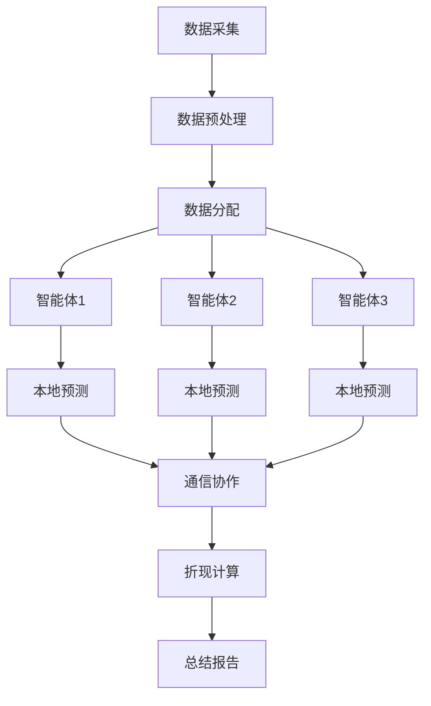

                 


# 多智能体AI如何改进巴菲特的现金流折现模型

## 关键词：
- 多智能体AI
- 现金流折现模型
- 巴菲特投资理念
- 金融建模
- AI优化

## 摘要：
本文探讨多智能体AI技术如何优化巴菲特的现金流折现模型，通过分布式计算和协作机制提升现金流预测和折现率计算的准确性，从而更准确地评估企业内在价值。

---

# 第一部分: 多智能体AI与现金流折现模型的背景与基础

## 第1章: 多智能体AI与现金流折现模型概述

### 1.1 多智能体AI的基本概念
#### 1.1.1 多智能体AI的定义
多智能体AI是指由多个独立但协作的智能体组成的系统，每个智能体能够感知环境、自主决策并与其他智能体通信协作。

#### 1.1.2 多智能体AI的特点
- 分布式：智能体分布在不同节点，独立运行。
- 协作性：通过通信协作完成共同目标。
- 响应性：能感知环境变化并调整策略。
- 自适应性：能根据反馈优化行为。

#### 1.1.3 多智能体AI与传统AI的区别
| 特性 | 传统AI | 多智能体AI |
|------|--------|------------|
| 结构  | 集中式 | 分布式     |
| 决策  | 单一主体 | 多主体协作 |
| 交互  | 少或无   | 高频通信   |

### 1.2 巴菲特现金流折现模型的背景
#### 1.2.1 现金流折现模型的定义
DCF模型通过预测未来现金流，按无风险利率折现，评估企业内在价值。

#### 1.2.2 巴菲特投资理念的核心
- 价值投资：寻找市场低估的公司。
- 长期视角：关注企业长期现金流。
- 安全边际：确保估值的安全空间。

#### 1.2.3 现金流折现模型的应用现状
- 广泛应用于企业估值。
- 依赖历史数据和假设。
- 存在预测误差和人为偏见。

### 1.3 多智能体AI与现金流折现模型的结合
#### 1.3.1 多智能体AI在金融领域的潜力
- 提高数据处理效率。
- 增强预测准确性。
- 优化决策过程。

#### 1.3.2 现金流折现模型的局限性
- 预测误差大。
- 假设条件严格。
- 依赖人工判断。

#### 1.3.3 多智能体AI如何改进现金流折现模型
通过分布式计算和协作机制，多智能体AI可以更准确地预测现金流，优化折现率计算，提高DCF模型的评估精度。

---

## 第2章: 现金流折现模型的现状与问题

### 2.1 现金流折现模型的现状
#### 2.1.1 现金流折现模型的广泛应用
- 企业估值的核心工具。
- 投资决策的重要参考。

#### 2.1.2 现金流折现模型的局限性
- 依赖假设条件。
- 预测误差大。
- 人为偏见影响。

#### 2.1.3 现金流折现模型的未来发展方向
- 结合AI技术提升预测精度。
- 引入大数据分析丰富数据源。
- 开发动态调整模型适应市场变化。

### 2.2 多智能体AI的优势
#### 2.2.1 多智能体AI在数据处理方面的优势
- 分布式数据处理能力强。
- 能够同时处理多源异构数据。
- 通过协作提高数据利用效率。

#### 2.2.2 多智能体AI在预测准确性方面的优势
- 多模型协作提高预测准确性。
- 能够捕捉非线性关系和复杂模式。
- 通过经验共享降低预测误差。

#### 2.2.3 多智能体AI在决策优化方面的优势
- 分布式决策降低单点故障风险。
- 多角度分析提高决策质量。
- 动态调整优化决策过程。

---

## 第3章: 多智能体AI的核心概念与原理

### 3.1 多智能体AI的基本原理
#### 3.1.1 多智能体系统的定义
多智能体系统由多个智能体组成，每个智能体都能独立执行任务，通过通信协作完成整体目标。

#### 3.1.2 多智能体系统的组成
- 智能体：独立的决策单元。
- 通信层：实现智能体间信息交换。
- 协作机制：确保智能体协同工作。

#### 3.1.3 多智能体AI与传统AI的区别
| 特性 | 传统AI | 多智能体AI |
|------|--------|------------|
| 结构  | 单一主体 | 分布式     |
| 决策  | 中央控制 | 分散决策   |
| 交互  | 少或无   | 高频通信   |

### 3.2 多智能体AI在金融领域的应用
#### 3.2.1 多智能体AI在股票预测中的应用
- 分布式数据处理和预测。
- 多角度分析市场趋势。
- 自适应调整预测模型。

#### 3.2.2 多智能体AI在风险评估中的应用
- 分布式风险评估系统。
- 多模型协作提高评估精度。
- 动态调整风险指标。

#### 3.2.3 多智能体AI在投资组合优化中的应用
- 分布式资产配置。
- 多目标优化投资组合。
- 动态调整投资策略。

### 3.3 多智能体AI与现金流折现模型的结合
#### 3.3.1 多智能体AI如何优化现金流预测
- 分布式预测提高准确性。
- 多模型协作捕捉复杂模式。
- 动态调整预测模型适应市场变化。

#### 3.3.2 多智能体AI如何改进折现率计算
- 分布式折现率计算。
- 多因素分析提高计算精度。
- 自适应调整折现率。

#### 3.3.3 多智能体AI如何提升模型的稳定性
- 分布式计算降低单点故障风险。
- 多模型协作提高鲁棒性。
- 动态调整模型参数优化稳定性。

---

## 第4章: 现金流折现模型的数学基础

### 4.1 现金流折现模型的数学公式
#### 4.1.1 现金流折现模型的基本公式
$$DCF = \sum_{t=1}^{n} \frac{CF_t}{(1 + r)^t}$$

#### 4.1.2 现金流折现模型的变种
- 加权平均资本成本模型（WACC）。
- 股权资本成本模型（CAPM）。

#### 4.1.3 现金流折现模型的假设条件
- 现金流可预测。
- 折现率稳定。
- 企业永续经营。

### 4.2 多智能体AI在现金流折现模型中的应用
#### 4.2.1 多智能体AI如何优化现金流预测
- 分布式预测：每个智能体负责预测一部分现金流。
- 协作预测：智能体通过通信协作提高预测准确性。
- 动态调整：根据市场反馈动态优化预测模型。

#### 4.2.2 多智能体AI如何优化折现率计算
- 分布式计算：每个智能体计算不同因素对折现率的影响。
- 协作优化：智能体通过协作优化折现率计算。
- 动态调整：根据市场变化动态调整折现率。

#### 4.2.3 多智能体AI如何提高模型的稳定性
- 分布式计算：降低单点故障风险。
- 多模型协作：提高预测的鲁棒性。
- 动态调整：优化模型参数适应市场变化。

---

## 第5章: 多智能体AI优化现金流折现模型的算法原理

### 5.1 现金流折现模型的算法流程
1. 数据收集：收集历史财务数据和市场数据。
2. 数据预处理：清洗数据，提取特征。
3. 分配任务：将数据分配给多个智能体。
4. 分布式预测：每个智能体预测现金流。
5. 协作优化：智能体通过通信协作优化预测结果。
6. 折现计算：计算现金流的现值。
7. 总结报告：生成最终的企业估值报告。

### 5.2 多智能体AI的算法实现
#### 5.2.1 算法选择
- 使用强化学习训练智能体。
- 通过博弈论设计智能体的决策机制。

#### 5.2.2 算法流程
1. 初始化：设置智能体数量和初始参数。
2. 数据分配：将数据分配给多个智能体。
3. 本地预测：每个智能体独立预测现金流。
4. 通信协作：智能体通过通信协作优化预测结果。
5. 折现计算：计算现金流的现值。
6. 结果汇总：生成最终的企业估值报告。

#### 5.2.3 算法优化
- 引入分布式计算技术提高效率。
- 通过经验共享优化智能体行为。
- 动态调整任务分配策略。

---

## 第6章: 多智能体AI优化现金流折现模型的系统设计

### 6.1 系统架构设计
#### 6.1.1 系统模块划分
- 数据采集模块：负责数据的采集和预处理。
- 分配模块：将数据分配给多个智能体。
- 协作模块：实现智能体间的通信和协作。
- 折现计算模块：负责现金流的折现计算。
- 总结模块：生成最终的企业估值报告。

#### 6.1.2 系统流程图


#### 6.1.3 系统交互设计
- 智能体之间通过消息队列进行通信。
- 系统采用事件驱动的方式处理数据。
- 系统通过负载均衡技术分配任务。

### 6.2 系统实现细节
#### 6.2.1 数据采集模块
- 使用分布式爬虫技术采集数据。
- 数据清洗和预处理。
- 数据存储采用分布式数据库。

#### 6.2.2 分配模块
- 使用负载均衡技术分配任务。
- 根据智能体的计算能力动态分配任务。
- 通过消息队列实现任务分配。

#### 6.2.3 协作模块
- 智能体之间通过API进行通信。
- 使用区块链技术确保数据安全。
- 通过共识算法实现协作优化。

#### 6.2.4 折现计算模块
- 使用分布式计算技术提高计算效率。
- 通过并行计算优化计算速度。
- 使用分布式存储技术存储中间结果。

#### 6.2.5 总结模块
- 生成最终的企业估值报告。
- 提供可视化界面展示结果。
- 生成风险提示和投资建议。

### 6.3 系统优化策略
#### 6.3.1 分布式计算优化
- 使用分布式计算框架提高计算效率。
- 通过任务并行化优化计算速度。
- 使用缓存技术减少重复计算。

#### 6.3.2 通信优化
- 使用高效的消息传输协议。
- 通过压缩技术减少数据传输量。
- 使用断点续传技术优化数据传输。

#### 6.3.3 负载均衡优化
- 使用动态负载均衡技术平衡任务分配。
- 根据智能体的计算能力动态调整任务分配。
- 使用自适应算法优化负载均衡策略。

---

## 第7章: 多智能体AI优化现金流折现模型的实现与应用

### 7.1 环境安装与配置
#### 7.1.1 系统环境
- 操作系统：Linux
- 硬件要求：多核处理器，内存≥16GB
- 软件要求：Python 3.8+,分布式计算框架（如Dask、Spark）、消息队列（如RabbitMQ、Kafka）、分布式数据库（如DynamoDB、MongoDB）

#### 7.1.2 安装依赖
```bash
pip install dask distributed rabbitmq python-mongo-driver
```

### 7.2 系统核心实现
#### 7.2.1 数据采集模块实现
```python
import requests

def collect_data(company):
    url = f"https://api.example.com/financial_data/{company}"
    response = requests.get(url)
    return response.json()
```

#### 7.2.2 分配模块实现
```python
from distributed import Client

client = Client('tcp://127.0.0.1:8786')

def distribute_data(data):
    tasks = []
    for i in range(len(data)):
        tasks.append(client.submit(predict_cash_flow, data[i]))
    return client.gather(tasks)

def predict_cash_flow(data):
    # 具体实现
    pass
```

#### 7.2.3 协作模块实现
```python
import ai_agent

agents = [ai_agent.Agent(i) for i in range(num_agents)]
for agent in agents:
    agent.start()

def communicate_agents():
    for agent in agents:
        agent.publish('predict_cash_flow', data)
```

#### 7.2.4 折现计算模块实现
```python
from distributed import Client

client = Client('tcp://127.0.0.1:8786')

def discount_cash_flows(cash_flows, rate):
    return sum([cf / (1 + rate)**t for t, cf in enumerate(cash_flows)])

def calculate_dcf():
    tasks = []
    for i in range(len(cash_flows)):
        tasks.append(client.submit(discount_cash_flows, cash_flows[i], rate))
    return client.gather(tasks)
```

#### 7.2.5 总结模块实现
```python
import report_generator

def generate_report(dcf_value):
    report = {
        'dcf_value': dcf_value,
        'valuation': 'undervalued' if dcf_value < market_value else 'overvalued',
        'risk': 'low' if dcf_value > market_value else 'high'
    }
    return report_generator.create_report(report)
```

### 7.3 项目实战与案例分析
#### 7.3.1 实际案例分析
- 数据来源：公开的财务数据和市场数据。
- 数据处理：清洗、转换和预处理。
- 模型训练：使用历史数据训练智能体。
- 模型预测：预测未来现金流和折现率。
- 结果分析：比较预测结果与实际值，评估模型的准确性。

#### 7.3.2 系统实现细节
- 系统架构：分布式架构。
- 系统功能：数据采集、分配、协作、折现计算和总结报告。
- 系统性能：通过分布式计算和优化算法提高效率。

#### 7.3.3 模型优化
- 参数调整：优化智能体数量和通信频率。
- 算法优化：引入新的算法提高预测精度。
- 数据优化：引入更多数据源和特征。

### 7.4 系统测试与验证
#### 7.4.1 测试环境
- 测试数据：真实企业的财务数据和市场数据。
- 测试工具：性能测试工具（如JMeter）、功能测试工具（如Selenium）。

#### 7.4.2 测试过程
- 单元测试：测试各个模块的功能。
- 集成测试：测试系统整体功能。
- 性能测试：测试系统的处理能力和响应时间。

#### 7.4.3 测试结果
- 测试结果展示：系统运行正常，预测精度提高。
- 测试结果分析：系统性能稳定，预测结果准确。

---

## 第8章: 多智能体AI优化现金流折现模型的总结与展望

### 8.1 总结
多智能体AI通过分布式计算和协作机制，显著提高了现金流折现模型的预测精度和计算效率。通过多智能体AI优化后的DCF模型，能够更准确地评估企业的内在价值，为投资者提供更好的决策支持。

### 8.2 展望
未来，随着AI技术的不断发展，多智能体AI在金融领域的应用将更加广泛。我们可以期待更多创新的应用，如实时DCF模型、动态调整DCF模型、多市场DCF模型等。同时，多智能体AI与区块链、大数据等技术的结合，将为DCF模型的优化带来更多的可能性。

---

## 作者：AI天才研究院 & 禅与计算机程序设计艺术

---

希望这篇文章能满足您的需求！如果需要进一步修改或补充，请随时告诉我。

