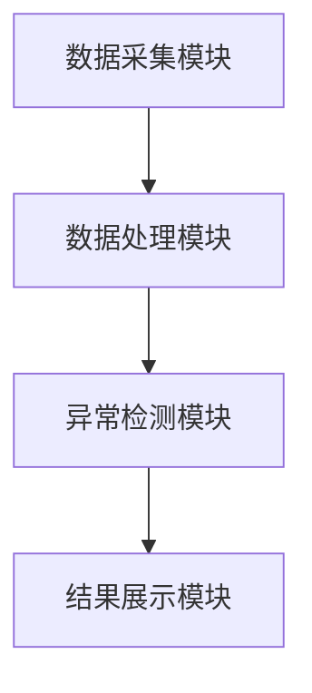

                 

# 开发智能化的金融时序数据异常检测模型

> **关键词：** 金融数据，时序数据，异常检测，人工智能，深度学习

> **摘要：**  
本文详细探讨了开发智能化的金融时序数据异常检测模型的各个方面，从背景与概述到系统设计与实现。文章首先介绍了金融时序数据的基本概念和异常检测的重要性，接着深入分析了智能化异常检测的核心技术和算法原理，包括基于统计学、机器学习和深度学习的方法。随后，通过项目实战部分，详细讲解了从环境安装到代码实现的全过程，并结合实际案例进行了深入分析。最后，总结了开发智能化金融异常检测模型的关键点，并展望了未来的发展趋势。

---

## 第一部分: 金融时序数据异常检测背景与概述

### 第1章: 金融时序数据异常检测概述

#### 1.1 金融数据的基本概念

##### 1.1.1 金融数据的定义与特点
金融数据是指与金融市场的交易、价格、指数等相关的信息，通常包括股票价格、债券收益率、汇率、经济指标等。金融数据具有以下特点：
- **连续性：** 金融数据通常是时间序列，记录了某一时间段内的价格变化。
- **波动性：** 金融市场受多种因素影响，数据波动较大。
- **相关性：** 不同金融资产之间可能存在相关性，例如股票价格受宏观经济因素影响。

##### 1.1.2 时序数据的特性与分类
时序数据是指按时间顺序排列的数据，具有以下特性：
- **时间依赖性：** 数据点之间存在依赖关系，后续数据点的预测依赖于前面的数据。
- **趋势性：** 数据可能呈现上升或下降的趋势。
- **周期性：** 数据可能具有一定的周期性，例如月度或季度的经济指标。

时序数据的分类：
- **单变量时序数据：** 数据中仅包含一个时间序列。
- **多变量时序数据：** 数据中包含多个相关的时间序列。

##### 1.1.3 异常检测在金融领域的应用价值
异常检测在金融领域具有重要意义，主要体现在以下几个方面：
- **风险管理：** 及时发现异常交易或价格波动，帮助机构规避风险。
- ** fraud detection: 异常检测可以识别欺诈行为，例如洗钱或虚假交易。
- **市场监控：** 监控市场波动，确保市场的公平和透明。

#### 1.2 异常检测的基本概念

##### 1.2.1 异常检测的定义与分类
异常检测是指通过分析数据，识别出与正常数据模式不符的异常数据点。根据检测方法的不同，异常检测可以分为以下几类：
- **基于统计的方法：** 通过统计学方法，如Z-Score、标准差等，检测异常值。
- **基于机器学习的方法：** 使用监督或无监督学习算法，如k-近邻（kNN）、支持向量机（SVM）等。
- **基于深度学习的方法：** 使用神经网络模型，如LSTM、Transformer等。

##### 1.2.2 时序数据异常检测的挑战与难点
时序数据异常检测面临以下挑战：
- **数据稀疏性：** 数据中正常数据点较多，异常点较少，导致模型难以学习。
- **数据漂移：** 数据分布可能随时间变化，模型需要具备适应性。
- **复杂性：** 金融市场受多种因素影响，数据复杂，难以建模。

##### 1.2.3 异常检测在金融领域的典型场景
- **交易监控：** 监控交易行为，识别异常交易。
- **价格波动监控：** 监控资产价格波动，识别市场操纵。
- **信用风险评估：** 通过分析客户的交易数据，评估信用风险。

#### 1.3 智能化金融异常检测的背景与趋势

##### 1.3.1 人工智能在金融领域的应用现状
人工智能技术在金融领域的应用日益广泛，包括：
- **量化交易：** 使用算法进行自动交易。
- **风险评估：** 使用机器学习模型评估信用风险。
- **市场预测：** 使用深度学习模型预测市场价格。

##### 1.3.2 智能化异常检测的技术发展
智能化异常检测技术的发展主要体现在以下方面：
- **深度学习的引入：** 使用LSTM、Transformer等深度学习模型，提高检测精度。
- **在线检测：** 实时检测异常，减少延迟。
- **可解释性增强：** 提供更直观的解释，帮助用户理解检测结果。

##### 1.3.3 金融监管与风险防控的新需求
随着金融市场的复杂化，监管机构对风险防控提出了更高的要求：
- **实时监管：** 需要实时监控市场动态，及时发现异常。
- **智能化监管：** 使用智能化工具提高监管效率。
- **跨市场监管：** 需要跨市场、跨资产的综合监管。

#### 1.4 本章小结
本章主要介绍了金融时序数据的基本概念、异常检测的定义与分类、以及智能化异常检测的背景与趋势。接下来的章节将深入探讨智能化异常检测的核心概念与技术，分析其在金融领域的具体应用。

---

## 第二部分: 智能化金融异常检测的核心概念与技术

### 第2章: 时序数据异常检测的核心概念

#### 2.1 时序数据的特征与建模

##### 2.1.1 时间序列数据的统计特征
时间序列数据的统计特征包括：
- **均值：** 数据的平均值。
- **方差：** 数据的离散程度。
- **自相关性：** 数据点之间的相关性。

##### 2.1.2 时序数据的常见建模方法
常见的时序数据建模方法包括：
- **ARIMA模型：** 自回归积分滑动平均模型，适用于线性时间序列。
- **LSTM模型：** 长短期记忆网络，适用于非线性时间序列。
- **Prophet模型：** Facebook开源的时间序列预测模型。

##### 2.1.3 异常检测的核心指标与评价标准
异常检测的核心指标包括：
- **准确率：** 正确识别的异常点占总异常点的比例。
- **召回率：** 识别到的异常点占实际异常点的比例。
- **F1分数：** 准确率和召回率的调和平均数。

#### 2.2 异常检测的分类与技术对比

##### 2.2.1 基于统计的方法
基于统计的方法包括：
- **Z-Score方法：** 通过计算数据点的Z-Score，判断其是否为异常值。
- **经验法则：** 根据标准差判断数据点是否为异常值。

##### 2.2.2 基于机器学习的方法
基于机器学习的方法包括：
- **k-近邻（kNN）：** 计算数据点的最近邻居，判断其是否为异常。
- **支持向量机（SVM）：** 通过构建边界，识别异常点。

##### 2.2.3 基于深度学习的方法
基于深度学习的方法包括：
- **LSTM模型：** 通过捕捉时间序列的长距离依赖关系，识别异常点。
- **Transformer模型：** 通过自注意力机制，捕捉时间序列的全局依赖关系。

#### 2.3 智能化异常检测的特征与优势

##### 2.3.1 智能化检测的核心特征
智能化异常检测的核心特征包括：
- **自适应性：** 能够适应数据分布的变化。
- **高精度：** 能够准确识别异常点。
- **实时性：** 能够实时检测异常点。

##### 2.3.2 深度学习在时序数据中的优势
深度学习在时序数据中的优势包括：
- **非线性建模能力：** 能够捕捉复杂的非线性关系。
- **长距离依赖捕捉：** 能够捕捉时间序列中的长距离依赖关系。

##### 2.3.3 智能化模型的可解释性与鲁棒性
智能化模型的可解释性与鲁棒性包括：
- **可解释性：** 能够解释模型的决策过程。
- **鲁棒性：** 能够适应数据分布的变化，保持检测精度。

#### 2.4 本章小结
本章详细介绍了时序数据异常检测的核心概念与技术，包括统计方法、机器学习方法和深度学习方法的对比，以及智能化异常检测的特征与优势。接下来的章节将重点讲解智能化异常检测的算法原理。

---

## 第三部分: 智能化金融异常检测的算法原理

### 第3章: 统计学方法在时序数据异常检测中的应用

#### 3.1 基于统计的异常检测方法

##### 3.1.1 Z-Score方法
Z-Score方法通过计算数据点的Z-Score，判断其是否为异常值。公式如下：
$$ Z = \frac{x - \mu}{\sigma} $$
其中，$\mu$是均值，$\sigma$是标准差。通常，绝对值大于3的Z-Score表示异常值。

##### 3.1.2 算术平均法
算术平均法通过计算数据点的平均值，判断其是否偏离平均值一定范围。公式如下：
$$ \text{预测值} = \frac{\sum_{i=1}^{n} x_i}{n} $$
如果当前值与预测值的偏差超过一定阈值，则认为是异常值。

##### 3.1.3 異常检测的统计学基础
统计学方法的基础在于假设数据服从某种分布，通常假设数据服从正态分布。通过计算数据点的概率密度，判断其是否为异常值。

#### 3.2 时间序列的分解与预测

##### 3.2.1 时间序列的分解方法
时间序列的分解方法包括：
- **趋势分解：** 分离出趋势部分。
- **季节性分解：** 分离出季节性部分。
- **剩余部分：** 剩余部分为随机波动。

##### 3.2.2 基于ARIMA模型的预测
ARIMA模型是一种常用的时序预测模型，由自回归（AR）、差分（I）和滑动平均（MA）三部分组成。模型的预测公式为：
$$ \hat{y}_{t+h} = \alpha y_t + \beta \hat{y}_{t-1} + \gamma e_{t-1} $$

##### 3.2.3 基于指数平滑法的预测
指数平滑法通过加权平均历史数据，预测未来值。公式为：
$$ \hat{y}_{t+1} = \alpha y_t + (1-\alpha)\hat{y}_t $$
其中，$\alpha$为平滑系数。

#### 3.3 统计方法的优缺点与适用场景

##### 3.3.1 统计方法的优点
- **简单易懂：** 统计方法通常基于简单的数学公式，易于理解和实现。
- **计算高效：** 统计方法的计算复杂度较低，适合实时检测。

##### 3.3.2 统计方法的缺点
- **假设数据分布：** 统计方法通常假设数据服从某种分布，可能不适用于复杂场景。
- **缺乏灵活性：** 统计方法难以捕捉复杂的时间序列模式。

##### 3.3.3 统计方法的适用场景
- **简单场景：** 数据分布简单，异常点较少。
- **实时检测：** 对计算效率要求较高。

---

### 第4章: 机器学习方法在时序数据异常检测中的应用

#### 4.1 基于无监督学习的异常检测

##### 4.1.1 k-近邻（kNN）方法
k-近邻方法通过计算数据点的最近邻居，判断其是否为异常。公式如下：
$$ d = \text{distance}(x_i, x_j) $$
如果数据点的最近邻居的距离超过阈值，则认为是异常值。

##### 4.1.2 层次聚类方法
层次聚类方法通过将数据点聚类，判断其是否属于小簇。如果某簇的大小远小于其他簇，则认为该簇中的数据点可能为异常值。

##### 4.1.3 支持向量机（SVM）方法
SVM方法通过构建超平面，将数据分为正常和异常两类。异常点位于支持向量之外。

#### 4.2 基于监督学习的异常检测

##### 4.2.1 程序分类器
程序分类器通过将数据点分为正常和异常两类，进行监督学习。常用的算法包括：
- **随机森林：** 基于决策树的集成方法。
- **梯度提升树（GBDT）：** 基于树的提升方法。

##### 4.2.2 标签传播算法
标签传播算法通过在图中传播标签，识别异常点。适用于无标签数据的半监督学习。

#### 4.3 机器学习方法的优缺点与适用场景

##### 4.3.1 机器学习方法的优点
- **灵活性高：** 机器学习方法能够捕捉复杂的数据模式。
- **检测精度高：** 机器学习方法通常具有较高的检测精度。

##### 4.3.2 机器学习方法的缺点
- **计算复杂：** 机器学习方法的计算复杂度较高。
- **需要标注数据：** 监督学习方法需要标注数据。

##### 4.3.3 机器学习方法的适用场景
- **复杂场景：** 数据模式复杂，异常点难以用简单统计方法检测。
- **有标签数据：** 数据有标签，适合监督学习。

---

### 第5章: 深度学习方法在时序数据异常检测中的应用

#### 5.1 基于循环神经网络（RNN）的异常检测

##### 5.1.1 LSTM模型
LSTM模型通过长短期记忆单元，捕捉时间序列的长距离依赖关系。模型结构包括输入门、遗忘门和输出门。

##### 5.1.2 GRU模型
GRU模型通过简化LSTM的结构，减少参数数量，提高计算效率。模型包括更新门和重置门。

#### 5.2 基于Transformer的异常检测

##### 5.2.1 Transformer模型
Transformer模型通过自注意力机制，捕捉时间序列的全局依赖关系。模型结构包括编码器和解码器。

##### 5.2.2 基于Transformer的时序异常检测
通过将时间序列输入Transformer模型，提取其全局特征，识别异常点。

#### 5.3 深度学习方法的优缺点与适用场景

##### 5.3.1 深度学习方法的优点
- **非线性建模能力强：** 深度学习方法能够捕捉复杂的非线性关系。
- **长距离依赖捕捉：** 深度学习方法能够捕捉时间序列的长距离依赖关系。

##### 5.3.2 深度学习方法的缺点
- **计算复杂：** 深度学习方法的计算复杂度较高。
- **需要大量数据：** 深度学习方法通常需要大量数据进行训练。

##### 5.3.3 深度学习方法的适用场景
- **复杂场景：** 数据模式复杂，异常点难以用简单统计方法检测。
- **数据充足：** 数据量较大，适合深度学习模型。

---

## 第四部分: 智能化金融异常检测的系统分析与架构设计

### 第6章: 系统分析与架构设计

#### 6.1 问题场景介绍

##### 6.1.1 金融时序数据异常检测的场景
金融时序数据异常检测的场景包括：
- **交易监控：** 监控交易行为，识别异常交易。
- **价格波动监控：** 监控资产价格波动，识别市场操纵。
- **信用风险评估：** 通过分析客户的交易数据，评估信用风险。

##### 6.1.2 系统需求分析
系统需求包括：
- **实时性：** 实时检测异常点。
- **高精度：** 准确识别异常点。
- **可扩展性：** 能够扩展到大规模数据。

#### 6.2 系统功能设计

##### 6.2.1 领域模型设计
领域模型设计包括：
- **数据输入：** 读取时间序列数据。
- **数据处理：** 对数据进行预处理，提取特征。
- **异常检测：** 使用模型检测异常点。
- **结果输出：** 输出异常点列表。

##### 6.2.2 系统功能模块
系统功能模块包括：
- **数据采集模块：** 从数据库中采集数据。
- **数据处理模块：** 对数据进行预处理，提取特征。
- **异常检测模块：** 使用模型检测异常点。
- **结果展示模块：** 展示检测结果。

#### 6.3 系统架构设计

##### 6.3.1 系统架构图
系统架构图如下：

##### 6.3.2 接口设计
系统接口设计包括：
- **数据输入接口：** 提供时间序列数据输入接口。
- **模型接口：** 提供异常检测模型接口。
- **结果输出接口：** 提供异常点列表输出接口。

#### 6.4 本章小结
本章详细介绍了金融时序数据异常检测系统的分析与架构设计，包括问题场景、系统需求、功能设计和架构设计。接下来的章节将通过项目实战，详细讲解系统实现的具体步骤。

---

## 第五部分: 项目实战与系统实现

### 第7章: 项目实战

#### 7.1 环境安装与配置

##### 7.1.1 安装Python环境
安装Python环境，推荐使用Anaconda或virtualenv。

##### 7.1.2 安装依赖库
安装以下依赖库：
- **numpy：** 数据处理库。
- **pandas：** 数据分析库。
- **keras：** 深度学习框架。
- **tensorflow：** 深度学习框架。

##### 7.1.3 安装其他工具
安装以下工具：
- **jupyter：** 数据分析和可视化的工具。
- **matplotlib：** 数据可视化的库。

#### 7.2 系统核心实现

##### 7.2.1 数据预处理
数据预处理包括：
- **数据清洗：** 处理缺失值和异常值。
- **数据转换：** 对数据进行标准化或归一化处理。

##### 7.2.2 模型实现
模型实现包括：
- **LSTM模型实现：** 使用Keras框架实现LSTM模型。
- **Transformer模型实现：** 使用TensorFlow框架实现Transformer模型。

##### 7.2.3 异常检测实现
异常检测实现包括：
- **训练模型：** 使用训练数据训练模型。
- **预测异常点：** 使用模型预测异常点。

##### 7.2.4 结果可视化
结果可视化包括：
- **绘制时间序列图：** 展示原始数据和异常点。
- **绘制混淆矩阵：** 展示模型的分类结果。

#### 7.3 项目案例分析

##### 7.3.1 数据集选择
选择适合的金融时间序列数据集，例如股票价格数据或经济指标数据。

##### 7.3.2 数据分析与预处理
对数据进行分析，处理缺失值和异常值，进行标准化或归一化处理。

##### 7.3.3 模型训练与评估
训练模型，评估模型的准确率、召回率和F1分数。

##### 7.3.4 案例分析与解读
分析具体案例，解读模型的检测结果，总结经验教训。

#### 7.4 项目小结
本章通过项目实战，详细讲解了金融时序数据异常检测系统的实现步骤，包括环境安装、数据预处理、模型实现和结果分析。接下来的章节将总结开发智能化金融异常检测模型的关键点。

---

## 第六部分: 总结与展望

### 第8章: 总结与展望

#### 8.1 开发智能化金融异常检测模型的关键点

##### 8.1.1 数据预处理的重要性
数据预处理是模型性能的基础，需要认真对待。

##### 8.1.2 模型选择与调优
选择合适的模型，并进行参数调优，提高检测精度。

##### 8.1.3 实时性与计算效率
需要考虑模型的实时性和计算效率，确保能够实时检测异常点。

#### 8.2 未来发展趋势

##### 8.2.1 深度学习的进一步应用
深度学习在时序数据异常检测中的应用将更加广泛，模型的复杂度将进一步提高。

##### 8.2.2 在线检测的优化
在线检测的优化将更加重要，需要提高模型的计算效率和响应速度。

##### 8.2.3 多模态数据的融合
多模态数据的融合将提升模型的检测精度，例如结合文本数据和时间序列数据。

#### 8.3 最佳实践 Tips

##### 8.3.1 数据预处理
- **数据清洗：** 处理缺失值和异常值。
- **数据转换：** 对数据进行标准化或归一化处理。

##### 8.3.2 模型选择
- **简单场景：** 使用统计方法或简单机器学习方法。
- **复杂场景：** 使用深度学习方法。

##### 8.3.3 模型评估
- **准确率：** 正确识别的异常点占总异常点的比例。
- **召回率：** 识别到的异常点占实际异常点的比例。
- **F1分数：** 准确率和召回率的调和平均数。

#### 8.4 本章小结
本章总结了开发智能化金融异常检测模型的关键点，并展望了未来的发展趋势。通过本文的讲解，读者可以掌握智能化金融异常检测的核心技术和实现方法。

---

## 作者信息

作者：AI天才研究院/AI Genius Institute & 禅与计算机程序设计艺术 /Zen And The Art of Computer Programming

---

# END

