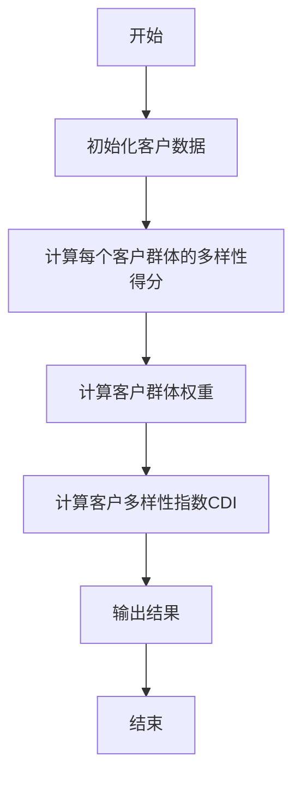
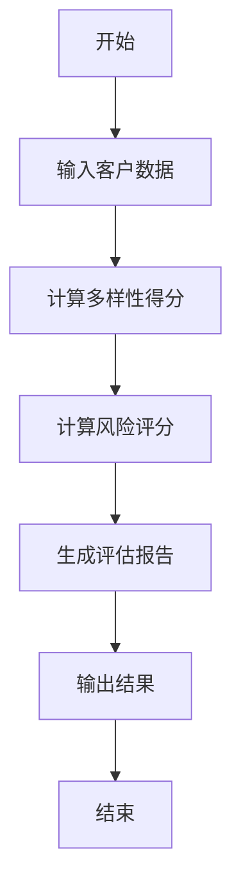
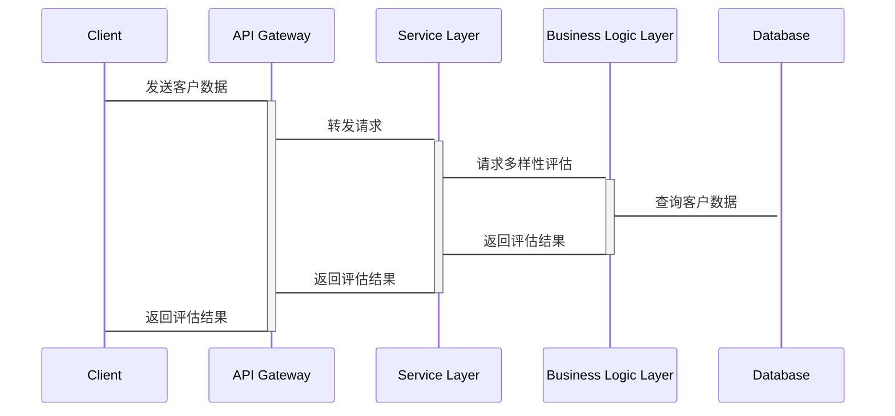

                 


# 彼得林奇如何评估公司的客户多样性

## 关键词：
- 彼得·林奇
- 客户多样性
- 评估方法
- 投资决策
- 数学模型

## 摘要：
本文详细探讨了彼得·林奇如何评估公司客户多样性的方法，从背景与重要性、核心概念、数学模型与算法、系统分析与架构设计、项目实战、最佳实践到小结，全面解析了客户多样性评估的各个方面。通过详细的理论分析和实际案例，展示了如何利用数学模型和系统架构来实现有效的客户多样性评估，为投资决策提供科学依据。

---

# 第1章：客户多样性评估的背景与重要性

## 1.1 什么是客户多样性
### 1.1.1 客户多样性定义
客户多样性是指客户群体在不同维度上的差异性，包括地理分布、行业分布、客户规模、生命周期和忠诚度等方面。

### 1.1.2 客户多样性评估的核心概念
客户多样性评估是通过分析客户群体的构成和特征，评估其多样性和平衡性，从而为企业提供风险控制和增长潜力的参考。

### 1.1.3 客户多样性在企业价值中的作用
客户多样性直接影响企业的风险分散能力、市场适应能力和长期增长潜力。

## 1.2 彼得·林奇客户多样性评估方法的背景
### 1.2.1 彼得·林奇投资理念概述
彼得·林奇以其独特的投资理念闻名，注重基本面分析和长期投资，强调对公司客户结构的深入研究。

### 1.2.2 客户多样性评估在投资决策中的地位
客户多样性评估是彼得·林奇分析公司基本面的重要组成部分，用于评估公司的风险和增长潜力。

### 1.2.3 传统客户评估方法的局限性
传统客户评估方法往往忽视客户群体的多样性，可能导致评估结果的片面性和风险的集中性。

## 1.3 为什么客户多样性评估至关重要
### 1.3.1 客户多样性与企业风险控制
多样化的客户群体可以分散市场风险，降低单一客户或行业波动对企业的影响。

### 1.3.2 客户多样性与企业增长潜力
多样化的客户群体能够为企业提供更广泛的市场机会，增强企业的适应能力和增长潜力。

### 1.3.3 客户多样性与企业市场竞争力
客户多样性是企业市场竞争力的重要体现，能够帮助企业更好地应对市场变化和客户需求。

## 1.4 本章小结
客户多样性评估是企业风险管理、增长潜力和市场竞争力的重要工具，彼得·林奇通过深入分析客户群体的多样性，为投资决策提供了科学依据。

---

# 第2章：客户多样性评估的核心概念与联系

## 2.1 核心概念原理
### 2.1.1 客户多样性评估的关键维度
- **地理分布**：客户分布的地域广度和深度。
- **行业分布**：客户所在的行业多样性。
- **客户规模**：客户规模的大小分布。
- **生命周期**：客户处于不同的生命周期阶段。
- **忠诚度**：客户对企业的忠诚程度。

### 2.1.2 客户群体的分类与特征
客户群体可以根据地理位置、行业、规模、生命周期和忠诚度进行分类，每种分类都有其独特的特征和影响。

### 2.1.3 客户多样性与企业战略的关系
客户多样性评估为企业制定市场进入、产品开发和风险管理等战略提供了重要参考。

## 2.2 客户多样性评估的核心指标
### 2.2.1 客户地理分布
通过分析客户分布的地理范围，评估企业的市场覆盖能力和区域风险。

### 2.2.2 客户行业分布
分析客户所在行业的分布，评估企业的行业风险和市场机会。

### 2.2.3 客户规模分布
客户规模的分布反映了企业的市场定位和客户群体的多样性。

### 2.2.4 客户生命周期
客户生命周期的分析帮助企业更好地了解客户行为和需求变化。

### 2.2.5 客户忠诚度
客户忠诚度是评估客户关系质量和长期合作潜力的重要指标。

## 2.3 客户多样性评估框架
### 2.3.1 客户多样性指数（CDI）模型
CDI模型综合考虑了客户群体在多个维度上的分布情况，量化评估客户多样性的程度。

### 2.3.2 客户群体平衡度评估
通过分析客户群体在不同维度上的分布是否均衡，评估客户多样性的健康程度。

### 2.3.3 客户风险分散度分析
分析客户群体在不同维度上的分布，评估客户多样性对企业风险分散的作用。

## 2.4 本章小结
客户多样性评估的核心在于多维度分析客户群体的分布和特征，为企业提供全面的评估框架和指标体系。

---

# 第3章：客户多样性评估的数学模型与算法

## 3.1 客户多样性评估的数学模型
### 3.1.1 客户多样性指数（CDI）公式
$$ CDI = \frac{\sum_{i=1}^{n} w_i \cdot D_i}{\sum_{i=1}^{n} w_i} $$
其中，$w_i$ 是第 $i$ 个客户群体的权重，$D_i$ 是第 $i$ 个客户群体的多样性得分。

### 3.1.2 客户多样性指数的计算步骤
1. 确定客户群体的分类维度和权重。
2. 计算每个客户群体在各个维度上的得分。
3. 综合计算CDI指数。

## 3.2 客户群体风险评分模型
### 3.2.1 客户群体风险评分公式
$$ R_i = \alpha \cdot D_i + \beta \cdot S_i + \gamma \cdot L_i $$
其中，$R_i$ 是第 $i$ 个客户群体的风险评分，$\alpha, \beta, \gamma$ 是权重系数，$D_i$ 是多样性得分，$S_i$ 是客户规模，$L_i$ 是客户生命周期。

### 3.2.2 风险评分模型的应用
通过风险评分模型，评估不同客户群体的风险水平，帮助企业制定风险管理策略。

## 3.3 客户多样性评估的算法实现
### 3.3.1 算法流程图


### 3.3.2 算法实现的Python代码示例
```python
def calculate_cdi(customers, weights):
    diversity_scores = []
    for customer in customers:
        # 计算每个客户的多样性得分
        diversity_scores.append(calculate_diversity_score(customer))
    # 计算加权平均
    cdi = sum(w * d for w, d in zip(weights, diversity_scores)) / sum(weights)
    return cdi

def calculate_diversity_score(customer):
    # 根据客户特征计算多样性得分
    score = 0
    # 示例：根据地理位置计算得分
    if customer['region'] == 'north':
        score += 0.3
    elif customer['region'] == 'south':
        score += 0.25
    # 其他特征计算类似
    return score
```

## 3.4 本章小结
通过数学模型和算法，客户多样性评估可以量化客户群体的多样性，为企业提供科学的决策支持。

---

# 第4章：系统分析与架构设计

## 4.1 问题场景介绍
客户多样性评估系统的应用场景包括企业客户管理、风险控制、市场分析等领域。

## 4.2 系统功能设计
### 4.2.1 系统功能模块
- **数据输入**：客户信息录入和管理。
- **多样性评估**：计算客户多样性指数和风险评分。
- **结果展示**：可视化展示评估结果和分析报告。

### 4.2.2 系统功能流程图


## 4.3 系统架构设计
### 4.3.1 系统架构图


### 4.3.2 系统架构设计说明
- **API Gateway**：负责接收客户端请求，路由到相应的服务。
- **Service Layer**：提供具体的业务逻辑，如客户数据处理和多样性评估。
- **Business Logic Layer**：实现客户多样性评估的算法和逻辑。
- **Database**：存储客户数据和评估结果。

## 4.4 系统接口设计
### 4.4.1 接口描述
- **输入接口**：接收客户数据，包括地理位置、行业、规模等。
- **输出接口**：返回客户多样性指数和风险评分。

### 4.4.2 接口交互流程图


## 4.5 系统交互设计
### 4.5.1 系统交互流程
1. 客户端发送客户数据请求。
2. API Gateway接收请求并转发到Service Layer。
3. Service Layer调用Business Logic Layer进行多样性评估。
4. Business Logic Layer查询Database获取客户数据。
5. 返回评估结果到客户端。

## 4.6 本章小结
通过系统分析与架构设计，客户多样性评估系统可以高效地处理大量客户数据，提供准确的评估结果。

---

# 第5章：项目实战

## 5.1 环境安装
### 5.1.1 安装Python
安装Python 3.8及以上版本，推荐使用Anaconda环境。

### 5.1.2 安装依赖库
安装必要的Python库，如pandas、numpy、scikit-learn等。

## 5.2 系统核心实现源代码
### 5.2.1 数据处理代码
```python
import pandas as pd

def load_customers(file_path):
    df = pd.read_csv(file_path)
    return df

def calculate_diversity_score(row):
    score = 0
    # 根据地理位置计算得分
    if row['region'] == 'north':
        score += 0.3
    elif row['region'] == 'south':
        score += 0.25
    # 其他特征计算类似
    return score

def calculate_cdi(customers, weights):
    diversity_scores = []
    for _, row in customers.iterrows():
        diversity_scores.append(calculate_diversity_score(row))
    cdi = sum(w * d for w, d in zip(weights, diversity_scores)) / sum(weights)
    return cdi
```

### 5.2.2 算法实现代码
```python
def calculate_risk_score(row, weights):
    diversity = calculate_diversity_score(row)
    size = row['size']
    lifecycle = row['lifecycle']
    risk_score = weights['diversity'] * diversity + weights['size'] * size + weights['lifecycle'] * lifecycle
    return risk_score
```

## 5.3 代码应用解读与分析
### 5.3.1 数据处理流程
1. 加载客户数据，进行数据清洗和预处理。
2. 计算每个客户的多样性得分。
3. 使用权重计算客户多样性指数。

### 5.3.2 算法实现流程
1. 确定客户群体的分类维度和权重。
2. 计算每个客户群体的风险评分。
3. 综合评估结果，生成评估报告。

## 5.4 实际案例分析
### 5.4.1 案例背景
某公司客户群体主要集中在单一行业和区域，存在较高的市场风险。

### 5.4.2 数据分析
通过计算CDI指数，发现客户多样性指数较低，风险评分较高。

### 5.4.3 改进建议
建议拓展市场，增加其他行业的客户和不同地区的客户，降低市场风险。

## 5.5 项目小结
通过实际案例分析，展示了客户多样性评估方法的应用价值，帮助企业识别潜在风险，制定有效的市场策略。

---

# 第6章：最佳实践、小结与注意事项

## 6.1 最佳实践
### 6.1.1 数据质量
确保客户数据的准确性和完整性，避免数据偏差。

### 6.1.2 权重设置
根据企业的实际情况，合理设置各个维度的权重，反映其重要性。

### 6.1.3 持续监测
定期更新客户数据，持续监测客户多样性指数，及时调整评估策略。

## 6.2 小结
客户多样性评估是企业风险管理的重要工具，彼得·林奇通过深入分析客户群体的多样性，为投资决策提供了科学依据。

## 6.3 注意事项
- 数据隐私和安全问题
- 模型的可解释性和透明性
- 持续监控和模型优化

---

# 第7章：拓展阅读

## 7.1 相关书籍推荐
- 《彼得·林奇的选股艺术》
- 《客户关系管理》
- 《风险管理与投资决策》

## 7.2 其他资源
- 在线课程：客户多样性评估实战
- 博客文章：如何构建客户多样性评估模型
- 工具推荐：数据分析工具、可视化工具

## 7.3 未来研究方向
- 客户多样性评估的动态模型
- 结合人工智能的客户多样性预测
- 全球化背景下的客户多样性管理

---

# 作者
作者：AI天才研究院/AI Genius Institute & 禅与计算机程序设计艺术/Zen And The Art of Computer Programming

---

通过以上目录结构，我们可以看到，这本书全面覆盖了彼得·林奇如何评估公司客户多样性的各个方面，从理论到实践，从数学模型到系统架构，为读者提供了丰富的知识和实用的工具。

