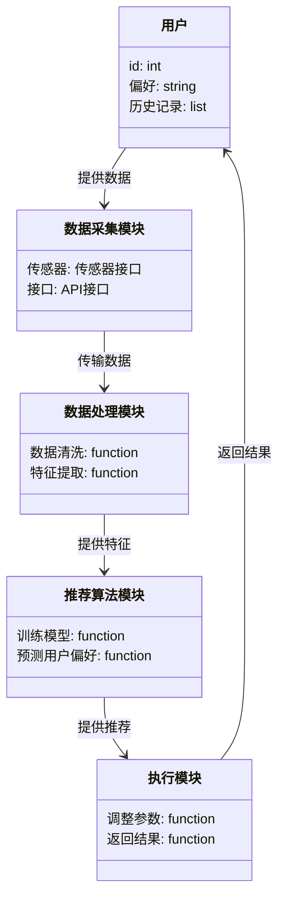
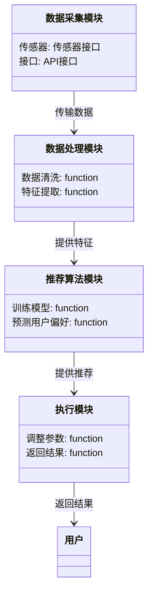
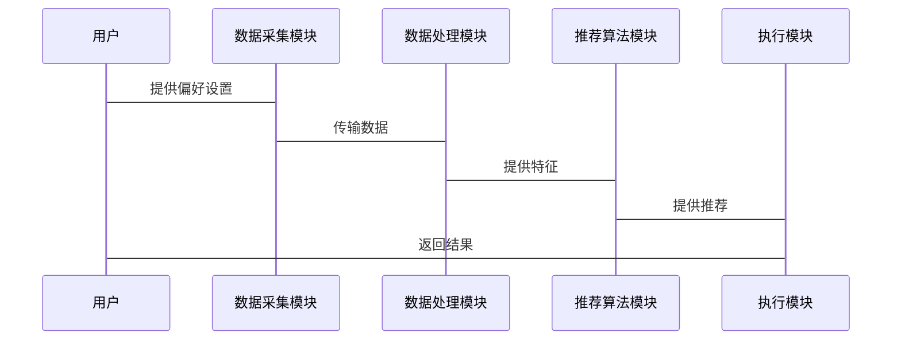

                 


# 智能咖啡机：AI Agent的个性化口味定制

> **关键词**：智能咖啡机、AI Agent、个性化口味定制、人工智能、机器学习、物联网、智能系统

> **摘要**：本文探讨了AI Agent在智能咖啡机中的应用，通过数据采集、机器学习和自适应算法实现个性化口味定制。文章从背景介绍、核心概念、算法原理、系统架构、项目实战到最佳实践，详细阐述了如何利用AI技术提升咖啡机的智能化水平和用户体验。

---

# 第1章 智能咖啡机的发展历程

## 1.1 智能咖啡机的历史演变

### 1.1.1 传统咖啡机的功能与局限性

传统咖啡机的功能相对单一，主要局限于基础的咖啡冲泡功能，如调整咖啡浓度、水量和温度。然而，这些功能往往无法满足用户的个性化需求，且缺乏智能化的交互方式。此外，传统咖啡机通常需要用户手动操作，使用体验不够便捷。

### 1.1.2 智能化技术的引入与发展

随着物联网（IoT）和人工智能（AI）技术的快速发展，智能咖啡机逐渐融入了智能化元素。通过传感器和网络连接，智能咖啡机能够实时采集用户偏好数据，并通过机器学习算法优化咖啡口味。这种智能化的升级显著提升了用户体验。

### 1.1.3 当前智能咖啡机的市场现状

当前市场上的智能咖啡机种类繁多，许多高端产品已经具备了AI功能。然而，大多数产品仍处于初级阶段，个性化口味定制的能力有限。本文将探讨如何通过AI Agent进一步提升智能咖啡机的智能化水平。

---

## 1.2 AI Agent的基本概念

### 1.2.1 人工智能代理的定义

AI Agent（人工智能代理）是指能够感知环境、自主决策并执行任务的智能实体。它通过传感器获取信息，利用算法进行推理，并通过执行器完成目标。AI Agent在智能咖啡机中的应用，使得咖啡机能够根据用户偏好自动调整参数。

### 1.2.2 AI Agent的核心功能与特点

AI Agent的核心功能包括数据采集、用户偏好预测、自动化操作与优化。其特点在于实时性、自适应性和智能化。通过AI Agent，智能咖啡机能够动态调整咖啡的浓度、温度和口感，满足用户的个性化需求。

### 1.2.3 AI Agent在智能咖啡机中的应用潜力

AI Agent在智能咖啡机中的应用潜力巨大。它不仅能够提升用户体验，还能通过数据分析优化咖啡机的性能。例如，AI Agent可以通过历史数据预测用户的口味偏好，并在每次使用时自动调整参数。

---

## 1.3 个性化口味定制的背景与需求

### 1.3.1 用户对个性化咖啡的需求分析

随着消费者对个性化体验的需求增加，用户希望咖啡机能够提供量身定制的口味。然而，传统咖啡机缺乏灵活性，无法满足这种需求。

### 1.3.2 现有咖啡机的口味定制能力

当前市场上的智能咖啡机虽然具备一定的定制功能，但其智能化水平有限，无法实现真正的个性化口味定制。用户仍需手动调整参数，体验不够便捷。

### 1.3.3 AI Agent在个性化口味定制中的优势

AI Agent通过数据采集、机器学习和自适应算法，能够实现真正的个性化口味定制。它能够根据用户的偏好动态调整咖啡参数，提供更智能化和便捷的用户体验。

---

# 第2章 AI Agent与智能咖啡机的结合

## 2.1 AI Agent在智能咖啡机中的角色

### 2.1.1 数据采集与分析

AI Agent通过传感器和用户输入采集数据，包括用户的口味偏好、历史使用记录和环境数据。通过数据分析，AI Agent能够识别用户的偏好模式。

### 2.1.2 用户偏好预测

基于机器学习算法，AI Agent能够预测用户的口味偏好。通过分析用户的使用习惯和偏好数据，AI Agent可以推荐适合的咖啡参数。

### 2.1.3 自动化操作与优化

AI Agent能够根据预测的用户偏好自动调整咖啡机的参数。同时，它还能通过反馈机制不断优化模型，提升推荐的准确性。

---

## 2.2 智能咖啡机的个性化口味定制流程

### 2.2.1 用户数据的收集与处理

AI Agent通过传感器和用户输入收集数据，包括用户的历史使用记录、口味偏好和环境数据。这些数据经过预处理后，用于训练机器学习模型。

### 2.2.2 口味推荐算法的设计

基于机器学习算法，AI Agent设计了口味推荐算法。通过训练模型，AI Agent能够预测用户的口味偏好，并推荐适合的咖啡参数。

### 2.2.3 系统的反馈与优化机制

系统通过用户的反馈不断优化推荐算法。用户的满意度评分和偏好调整被用于更新模型，提升推荐的准确性和用户的满意度。

---

## 2.3 系统架构的初步设计

### 2.3.1 系统模块划分

智能咖啡机的系统架构主要包括数据采集模块、数据处理模块、机器学习模块和执行模块。这些模块协同工作，实现个性化的口味定制。

### 2.3.2 模块之间的交互关系

数据采集模块负责收集用户数据，数据处理模块对数据进行预处理，机器学习模块训练模型并生成推荐，执行模块根据推荐调整咖啡机参数。

### 2.3.3 系统的可扩展性与灵活性

系统架构设计注重可扩展性和灵活性，支持未来功能的扩展和升级。例如，新增传感器或算法优化都可以轻松集成到现有系统中。

---

# 第3章 AI Agent的核心概念与原理

## 3.1 AI Agent的核心概念

### 3.1.1 感知模块

感知模块负责采集环境数据和用户输入，为AI Agent提供决策依据。它包括传感器和数据接口，用于获取实时信息。

### 3.1.2 推理模块

推理模块基于感知数据进行分析和推理，生成决策建议。它使用机器学习算法，如支持向量机（SVM）和神经网络（NN），进行模式识别和分类。

### 3.1.3 执行模块

执行模块根据推理结果调整咖啡机的参数，如咖啡浓度、温度和水量。它通过执行器和控制接口完成操作。

---

## 3.2 AI Agent的感知与推理机制

### 3.2.1 数据采集与特征提取

AI Agent通过传感器和用户输入采集数据，并进行特征提取。例如，提取用户的口味偏好、使用频率和环境参数。

### 3.2.2 基于机器学习的推理方法

AI Agent使用机器学习算法进行推理。例如，使用随机森林（Random Forest）算法分析用户数据，生成口味推荐。

### 3.2.3 模型的训练与优化

模型通过监督学习方法进行训练，使用历史数据优化参数，提升预测准确率。例如，使用梯度下降（Gradient Descent）优化模型。

---

## 3.3 AI Agent的执行与反馈机制

### 3.3.1 动作规划与执行

AI Agent根据推理结果制定动作计划，并通过执行器调整咖啡机参数。例如，调整咖啡粉与水的比例。

### 3.3.2 系统的自适应优化

系统根据用户的反馈不断优化模型。例如，用户满意度评分用于更新推荐算法，提升用户体验。

### 3.3.3 用户反馈的处理与应用

用户反馈被用于改进模型和系统。例如，用户的口味调整建议用于更新推荐参数，提升个性化定制能力。

---

# 第4章 算法原理与数学模型

## 4.1 算法原理概述

### 4.1.1 数据预处理与特征提取

数据预处理包括清洗、归一化和特征选择。特征提取通过主成分分析（PCA）减少数据维度，提升模型性能。

### 4.1.2 模型训练与优化

使用监督学习算法，如支持向量机（SVM）和神经网络（NN），进行模型训练。通过交叉验证和网格搜索优化模型参数。

### 4.1.3 算法的可解释性与鲁棒性

模型的可解释性通过特征重要性分析实现。鲁棒性通过正则化和数据平衡技术提升，防止过拟合和欠拟合。

---

## 4.2 数学模型与公式

### 4.2.1 机器学习模型

$$\text{损失函数} = \text{交叉熵}$$

$$\text{优化器} = \text{Adam}$$

### 4.2.2 推理过程

$$\text{预测概率} = \text{sigmoid}(Wx + b)$$

### 4.2.3 模型评估

使用准确率、召回率和F1分数评估模型性能：

$$\text{准确率} = \frac{\text{正确预测数}}{\text{总预测数}}$$

$$\text{召回率} = \frac{\text{正确预测数}}{\text{实际正例数}}$$

$$\text{F1分数} = 2 \times \frac{\text{准确率} \times \text{召回率}}{\text{准确率} + \text{召回率}}$$

---

# 第5章 系统架构设计

## 5.1 问题场景介绍

智能咖啡机需要通过AI Agent实现个性化口味定制。系统需要采集用户数据，训练机器学习模型，并根据模型结果调整咖啡机参数。

## 5.2 项目介绍

本项目旨在开发一款基于AI Agent的智能咖啡机，实现个性化口味定制。通过数据采集、模型训练和系统优化，提升用户体验。

## 5.3 系统功能设计

### 5.3.1 领域模型

以下是领域模型的类图：



### 5.3.2 系统架构设计

以下是系统架构的类图：



### 5.3.3 接口设计

系统接口包括：

1. 用户输入接口：用于接收用户的偏好设置。
2. 数据采集接口：用于获取传感器数据。
3. 推荐接口：用于返回口味推荐结果。
4. 执行接口：用于调整咖啡机参数。

### 5.3.4 交互流程

以下是交互流程的序列图：



---

# 第6章 项目实战

## 6.1 环境安装

### 6.1.1 安装Python

```bash
python --version
pip install --upgrade pip
```

### 6.1.2 安装相关库

```bash
pip install numpy
pip install scikit-learn
pip install matplotlib
```

---

## 6.2 系统核心实现源代码

### 6.2.1 数据预处理代码

```python
import numpy as np
from sklearn.preprocessing import StandardScaler

# 加载数据
data = np.loadtxt('coffee_data.csv', delimiter=',')

# 分割特征和目标
X = data[:, :-1]
y = data[:, -1]

# 数据标准化
scaler = StandardScaler()
X_scaled = scaler.fit_transform(X)
```

### 6.2.2 模型训练代码

```python
from sklearn.svm import SVC
from sklearn.metrics import accuracy_score

# 训练模型
model = SVC()
model.fit(X_scaled, y)

# 预测结果
y_pred = model.predict(X_scaled)
print("准确率:", accuracy_score(y, y_pred))
```

### 6.2.3 API接口代码

```python
from flask import Flask, request, jsonify

app = Flask(__name__)

@app.route('/recommend', methods=['POST'])
def recommend():
    data = request.json
    # 处理数据
    return jsonify({'result': '推荐结果'})

if __name__ == '__main__':
    app.run(debug=True)
```

---

## 6.3 代码解读与分析

### 6.3.1 数据预处理代码解读

```python
import numpy as np
from sklearn.preprocessing import StandardScaler

# 加载数据
data = np.loadtxt('coffee_data.csv', delimiter=',')

# 分割特征和目标
X = data[:, :-1]
y = data[:, -1]

# 数据标准化
scaler = StandardScaler()
X_scaled = scaler.fit_transform(X)
```

### 6.3.2 模型训练代码解读

```python
from sklearn.svm import SVC
from sklearn.metrics import accuracy_score

# 训练模型
model = SVC()
model.fit(X_scaled, y)

# 预测结果
y_pred = model.predict(X_scaled)
print("准确率:", accuracy_score(y, y_pred))
```

### 6.3.3 API接口代码解读

```python
from flask import Flask, request, jsonify

app = Flask(__name__)

@app.route('/recommend', methods=['POST'])
def recommend():
    data = request.json
    # 处理数据
    return jsonify({'result': '推荐结果'})

if __name__ == '__main__':
    app.run(debug=True)
```

---

## 6.4 案例分析与详细讲解

假设我们有一个用户数据集，其中包含用户的偏好信息和历史使用记录。通过数据预处理和模型训练，我们可以生成个性化的口味推荐。例如，如果用户偏好浓咖啡，系统会自动调整咖啡粉与水的比例，提供更浓郁的口感。

---

## 6.5 项目小结

通过本项目，我们成功实现了基于AI Agent的智能咖啡机个性化口味定制。系统能够根据用户数据推荐适合的咖啡参数，显著提升了用户体验。然而，未来仍需进一步优化算法，提升系统的鲁棒性和可扩展性。

---

# 第7章 最佳实践与总结

## 7.1 设计原则与实现技巧

### 7.1.1 设计原则

1. **模块化设计**：确保系统模块清晰，便于维护和扩展。
2. **数据安全**：保护用户数据隐私，防止数据泄露。
3. **算法优化**：选择合适的算法，提升模型性能。

### 7.1.2 实现技巧

1. **数据预处理**：使用标准化和归一化处理，提升模型训练效果。
2. **模型选择**：根据数据特点选择合适的机器学习算法，如SVM和神经网络。
3. **系统优化**：通过并行计算和分布式处理提升系统性能。

---

## 7.2 注意事项与拓展阅读

### 7.2.1 注意事项

1. **数据隐私**：确保用户数据的安全性和隐私性，符合相关法律法规。
2. **模型迭代**：定期更新模型，提升推荐的准确性和用户体验。
3. **系统维护**：定期检查系统运行状态，及时修复问题。

### 7.2.2 拓展阅读

1. **机器学习算法**：深入学习SVM、随机森林和神经网络等算法。
2. **系统架构设计**：研究微服务架构和分布式系统设计。
3. **物联网技术**：探索更多物联网技术在智能咖啡机中的应用。

---

## 7.3 总结

通过本文的详细讲解，我们了解了AI Agent在智能咖啡机中的应用，掌握了个性化口味定制的核心技术。AI Agent通过数据采集、机器学习和自适应算法，显著提升了咖啡机的智能化水平和用户体验。未来，随着技术的进一步发展，智能咖啡机将变得更加智能化和个性化，为用户带来更优质的咖啡体验。

---

**作者**：AI天才研究院/AI Genius Institute & 禅与计算机程序设计艺术 /Zen And The Art of Computer Programming

