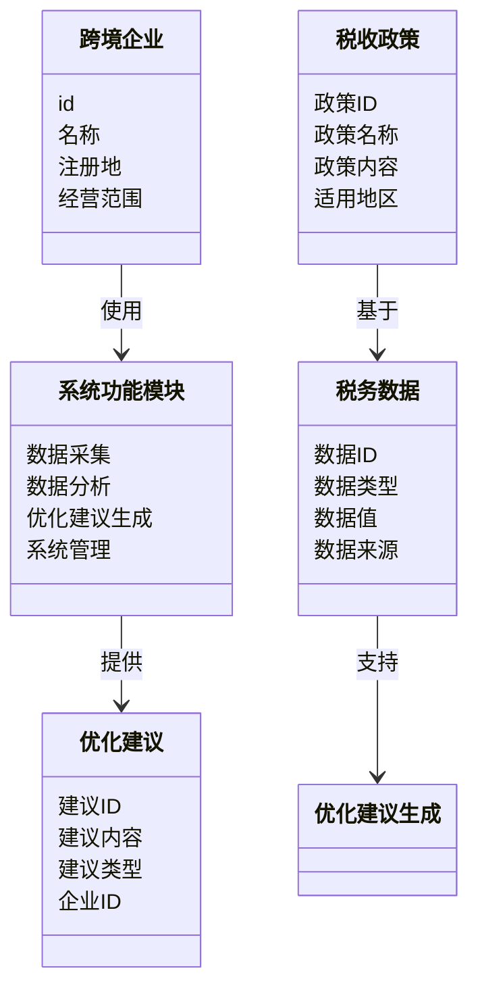
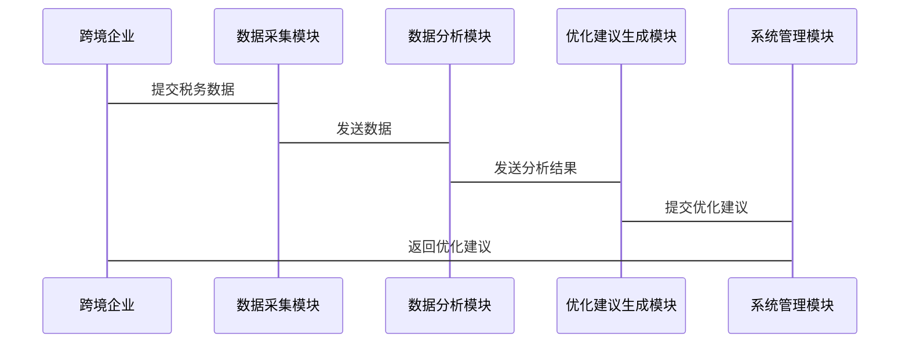

                 


# 智能跨境税收筹划建议系统

> 关键词：智能税务系统，跨境税收，人工智能，税收优化，税务筹划

> 摘要：随着全球经济的日益全球化，跨国企业的税务筹划变得越来越复杂。传统的税务筹划方法已经难以应对日益变化的税收政策和复杂的跨国税务环境。本篇文章介绍了一种基于人工智能的智能跨境税收筹划建议系统，该系统能够利用先进的机器学习算法和自然语言处理技术，帮助企业实现高效的税务优化和合规管理。本文将从系统的背景、核心概念、算法原理、系统架构、项目实战等多个方面详细探讨这一系统的实现与应用。

---

## 第一部分: 背景与核心概念

### 第1章: 背景介绍

#### 1.1 问题背景

随着全球经济一体化的深入发展，跨国企业在全球范围内的税务筹划变得日益复杂。企业需要面对不同国家和地区的税收政策、法规差异以及税务合规要求。然而，传统的税务筹划方法依赖于人工分析和经验判断，存在效率低、成本高、易出错等问题。

此外，税收政策的变化频繁，跨国企业需要实时跟踪和分析各国的税收法规，这对企业的税务团队提出了更高的要求。如何利用先进技术手段，提升税务筹划的效率和准确性，成为当前亟待解决的问题。

#### 1.2 问题描述

跨境税收筹划的核心目标是通过合法手段降低企业的税务负担，同时确保合规性。然而，传统的方法往往依赖于手动分析和经验判断，存在以下主要问题：

1. **信息分散**：跨国企业需要处理来自不同国家的税收政策，信息分散且难以整合。
2. **数据量大**：税务数据量庞大，手动分析效率低下。
3. **政策变化快**：税收政策频繁变化，人工更新和分析耗时耗力。
4. **合规风险**：税务筹划需要严格遵守各国法规，任何疏忽都可能导致合规风险。

#### 1.3 问题解决

智能跨境税收筹划建议系统通过引入人工智能技术，能够高效地解决上述问题。系统的核心优势包括：

1. **自动化数据处理**：系统能够自动采集、整理和分析跨国税务数据。
2. **智能优化建议**：基于机器学习算法，系统能够提供个性化的税务优化建议。
3. **实时更新**：系统能够实时跟踪税收政策的变化，确保建议的及时性和准确性。
4. **合规性保障**：系统内置法律法规知识库，确保所有建议符合相关法规要求。

#### 1.4 边界与外延

智能跨境税收筹划建议系统的边界主要集中在税务数据的处理和优化建议的生成上。系统不直接处理企业的财务数据，也不涉及具体的税务申报流程。然而，系统可以通过与企业的财务系统集成，提供更加全面的税务管理解决方案。

从外延来看，智能跨境税收筹划系统可以与其他企业管理系统（如ERP）集成，形成更加智能化的财务管理系统。此外，系统还可以扩展到其他领域，如税务风险评估、税务审计等。

### 第2章: 核心概念与联系

#### 2.1 智能跨境税收筹划的核心原理

智能跨境税收筹划的核心原理在于利用人工智能技术，尤其是机器学习和自然语言处理技术，对海量的税务数据进行分析和建模。系统通过以下步骤实现税务优化建议：

1. **数据采集**：系统从不同国家的税务数据库中采集相关数据，包括税率、优惠政策、法规变化等。
2. **数据预处理**：对采集的数据进行清洗、归一化和特征提取，以便后续分析。
3. **模型训练**：利用机器学习算法（如随机森林、支持向量机等）对历史税务数据进行训练，建立预测模型。
4. **优化建议生成**：系统根据企业的具体业务情况，结合模型预测结果，生成个性化的税务优化建议。

#### 2.2 核心概念对比

以下是传统税务筹划与智能税务筹划的核心对比：

| 对比维度          | 传统税务筹划                  | 智能税务筹划                  |
|-------------------|-----------------------------|-----------------------------|
| 数据处理方式      | 手动采集与分析               | 自动采集与智能分析           |
| 优化效率          | 较低，依赖人工经验             | 高效，基于数据驱动           |
| 合规性保障        | 易受人为因素影响，合规风险较高 | 系统内置法律法规库，合规性高 |
| 成本              | 高，需要大量人力资源          | 成本低，自动化程度高          |

#### 2.3 系统的ER实体关系图

以下是智能跨境税收筹划系统的ER实体关系图：

```mermaid
erd
    entity 跨境企业 {
        id
        名称
        注册地
        经营范围
    }
    entity 税收政策 {
        政策ID
        政策名称
        政策内容
        适用地区
    }
    entity 税务数据 {
        数据ID
        数据类型
        数据值
        数据来源
    }
    entity 优化建议 {
        建议ID
        建议内容
        建议类型
        企业ID
    }
    relation 跨境企业 --> 优化建议 : 提供
    relation 税收政策 --> 税务数据 : 基于
    relation 税务数据 --> 优化建议 : 支持
```

---

## 第二部分: 算法原理讲解

### 第3章: 算法原理

#### 3.1 算法选择与实现

在智能跨境税收筹划系统中，我们选择了基于机器学习的随机森林算法来进行税务优化建议的生成。以下是算法的详细实现步骤：

1. **数据预处理**：
   - 数据清洗：去除无效数据，处理缺失值。
   - 数据归一化：将不同量纲的特征进行标准化处理。
   - 特征提取：从原始数据中提取对税务优化影响较大的特征。

2. **模型训练**：
   - 数据分割：将数据集分为训练集和测试集。
   - 模型训练：使用随机森林算法对训练数据进行建模。
   - 模型验证：通过交叉验证评估模型的准确性和稳定性。

3. **优化建议生成**：
   - 系统根据企业的具体业务数据，输入模型进行预测。
   - 根据预测结果，生成个性化的税务优化建议。

#### 3.2 算法实现的数学模型

以下是随机森林算法的核心数学模型：

$$
\text{随机森林} = \{\text{决策树}_i\}_{i=1}^{n}
$$

其中，$\text{决策树}_i$ 表示第i棵决策树，$n$ 表示决策树的数量。

#### 3.3 算法实现的Python代码

以下是随机森林算法的Python实现示例：

```python
from sklearn.ensemble import RandomForestClassifier
from sklearn.model_selection import train_test_split
import pandas as pd

# 加载数据
data = pd.read_csv('tax_data.csv')

# 数据分割
X = data.drop('target', axis=1)
y = data['target']

X_train, X_test, y_train, y_test = train_test_split(X, y, test_size=0.2, random_state=42)

# 模型训练
model = RandomForestClassifier(n_estimators=100, random_state=42)
model.fit(X_train, y_train)

# 模型预测
y_pred = model.predict(X_test)

# 模型评估
print("准确率:", accuracy_score(y_test, y_pred))
```

---

## 第三部分: 系统分析与架构设计

### 第4章: 系统分析与架构设计

#### 4.1 问题场景介绍

智能跨境税收筹划系统主要面向跨国企业，帮助企业实现税务优化和合规管理。系统的核心应用场景包括：

1. **跨国投资决策**：企业在进行跨国投资时，需要评估不同国家的税收政策，选择最优的投资地点。
2. **税务合规管理**：企业需要确保其税务申报和缴纳符合各国的法律法规。
3. **税务优化建议**：企业需要根据自身业务情况，制定最优的税务优化方案。

#### 4.2 系统功能设计

以下是系统的功能模块设计：



#### 4.3 系统架构设计

以下是系统的架构设计：


#### 4.4 系统接口设计

以下是系统的接口设计：



---

## 第四部分: 项目实战

### 第5章: 项目实战

#### 5.1 环境安装

为了运行智能跨境税收筹划系统，需要安装以下环境：

- **Python**：推荐使用Python 3.7及以上版本。
- **机器学习库**：如scikit-learn、xgboost等。
- **数据处理库**：如pandas、numpy等。
- **可视化库**：如Matplotlib、Seaborn等。

#### 5.2 核心代码实现

以下是系统的核心代码实现：

```python
import pandas as pd
from sklearn.ensemble import RandomForestClassifier
from sklearn.model_selection import train_test_split
from sklearn.metrics import accuracy_score

# 加载数据
data = pd.read_csv('tax_data.csv')

# 数据预处理
X = data.drop('target', axis=1)
y = data['target']

# 数据分割
X_train, X_test, y_train, y_test = train_test_split(X, y, test_size=0.2, random_state=42)

# 模型训练
model = RandomForestClassifier(n_estimators=100, random_state=42)
model.fit(X_train, y_train)

# 模型预测
y_pred = model.predict(X_test)

# 模型评估
print(f"准确率: {accuracy_score(y_test, y_pred)}")

# 生成优化建议
def generate_recommendation(model, X_test, y_test):
    recommendations = []
    for i in range(len(X_test)):
        prob = model.predict_proba(X_test.iloc[i:i+1])[0][1]
        if prob > 0.5:
            recommendations.append("建议优化税务结构")
        else:
            recommendations.append("无需优化")
    return recommendations

recommendations = generate_recommendation(model, X_test, y_test)
print("优化建议:", recommendations)
```

#### 5.3 案例分析

假设我们有一个跨国企业的税务数据，如下所示：

| 国家   | 税率 | 是否有优惠政策 | 企业利润 | 是否需要优化 |
|--------|------|--------------|----------|-------------|
| 美国    | 21%  | 是           | 100万    | 是          |
| 德国    | 15%  | 否           | 80万     | 否          |
| 日本    | 20%  | 是           | 120万    | 是          |

通过系统分析，生成以下优化建议：

1. **美国**：由于有优惠政策，建议企业充分利用税收抵免政策，进一步降低税负。
2. **德国**：由于没有优惠政策，建议企业通过调整业务结构，降低税负。
3. **日本**：由于有优惠政策，建议企业申请研发税收抵免。

---

## 第五部分: 最佳实践与总结

### 第6章: 总结与展望

#### 6.1 小结

智能跨境税收筹划建议系统通过引入人工智能技术，显著提升了税务筹划的效率和准确性。系统能够自动采集和分析税务数据，生成个性化的优化建议，帮助企业实现合规管理。

#### 6.2 注意事项

- **数据隐私**：企业在使用系统时，需要注意数据隐私问题，确保数据的安全性和合规性。
- **模型更新**：由于税收政策的变化频繁，系统需要定期更新模型和数据，确保建议的准确性。
- **法律法规**：企业在使用系统时，需要遵守相关法律法规，确保税务筹划的合法性。

#### 6.3 拓展阅读

- **机器学习在税务领域的应用**：进一步了解机器学习在税务预测、风险评估等领域的应用。
- **跨国税务法规**：深入学习不同国家和地区的税收政策，了解税务法规的变化趋势。

---

## 作者：AI天才研究院/AI Genius Institute & 禅与计算机程序设计艺术/Zen And The Art of Computer Programming

---

以上是《智能跨境税收筹划建议系统》的完整目录和内容概览。通过本文的介绍，读者可以全面了解智能跨境税收筹划系统的核心原理、实现方法和实际应用。

