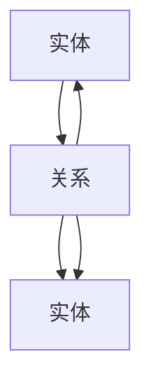
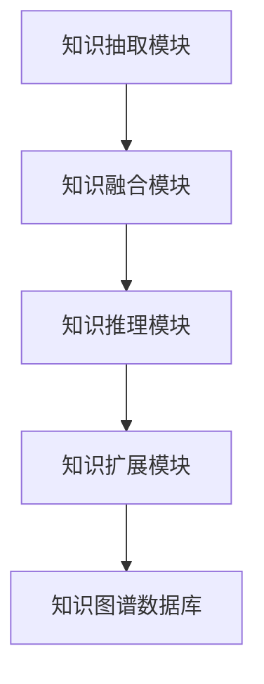
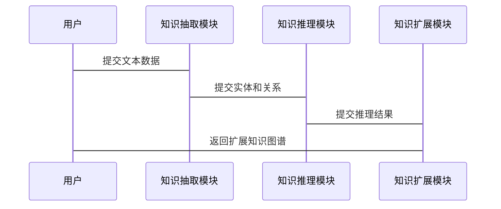

                 


# 《构建AI Agent的知识图谱自动扩展系统》

---

## 关键词：
- AI Agent
- 知识图谱
- 自动扩展系统
- 知识表示
- 智能推理
- 系统架构

---

## 摘要：
本文旨在探讨如何构建一个基于AI Agent的知识图谱自动扩展系统。通过分析知识图谱的核心概念、AI Agent的推理机制以及两者结合的必要性，提出一种利用AI Agent驱动知识图谱动态扩展的方法。文章从理论基础到系统实现，详细阐述了系统的构建过程，包括算法原理、系统架构设计和项目实战。通过本篇文章，读者可以全面理解知识图谱与AI Agent的结合方式，并掌握如何利用AI技术实现知识图谱的智能化扩展。

---

# 第一部分: 背景介绍

---

# 第1章: 知识图谱与AI Agent的结合背景

## 1.1 知识图谱的定义与特点

### 1.1.1 知识图谱的定义
知识图谱是一种以图结构形式表示知识的语义网络，由实体（节点）和关系（边）组成。实体可以是具体的事物（如“苹果”）或抽象的概念（如“水果”），关系描述了实体之间的关联（如“是”、“属于”）。知识图谱的目标是将分散的知识结构化、系统化，以便计算机能够理解和推理。

$$
\text{知识图谱} = \{\langle e, r, e' \rangle\}, \text{其中} e, e' \text{为实体，} r \text{为关系}\}
$$

### 1.1.2 知识图谱的核心特点
- **结构化**：知识以图结构组织，便于计算机处理。
- **语义化**：实体和关系具有明确的语义，支持智能推理。
- **动态性**：知识图谱可以动态更新，适应新信息的加入。

### 1.1.3 知识图谱的构建与应用
知识图谱的构建涉及数据抽取、清洗、融合和建模等步骤。其应用广泛，包括搜索引擎优化、智能问答系统、推荐系统等。

---

## 1.2 AI Agent的基本概念

### 1.2.1 AI Agent的定义
AI Agent（智能体）是一种能够感知环境、自主决策并执行任务的实体。它可以是一个软件程序，也可以是一个物理设备。AI Agent的核心能力包括感知、推理、规划和执行。

### 1.2.2 AI Agent的核心功能
- **感知**：通过传感器或数据接口获取外部信息。
- **推理**：基于知识库进行逻辑推理，得出结论。
- **规划**：制定行动方案以实现目标。
- **执行**：根据规划结果执行具体操作。

### 1.2.3 AI Agent的分类与应用场景
AI Agent可以分为简单反射型、基于模型的反射型、目标驱动型和实用驱动型。应用场景包括自动驾驶、智能助手、机器人控制等。

---

## 1.3 知识图谱与AI Agent的结合

### 1.3.1 知识图谱在AI Agent中的作用
知识图谱为AI Agent提供了丰富的知识库，支持其进行推理和决策。例如，在智能问答系统中，AI Agent可以通过知识图谱快速找到答案。

### 1.3.2 AI Agent如何利用知识图谱进行推理
AI Agent可以通过查询知识图谱，验证假设，推理出新的知识。例如，在医疗领域，AI Agent可以通过知识图谱推理出患者的诊断信息。

### 1.3.3 知识图谱自动扩展的必要性
知识图谱的静态构建无法满足动态变化的需求。通过AI Agent的实时推理和学习，知识图谱可以自动扩展，保持其新鲜性和准确性。

---

## 1.4 本章小结
本章介绍了知识图谱和AI Agent的基本概念，分析了它们的结合背景，并提出了知识图谱自动扩展的必要性。下一章将深入探讨知识图谱与AI Agent的核心概念与联系。

---

# 第二部分: 核心概念与联系

---

# 第2章: 知识图谱与AI Agent的核心概念

## 2.1 知识图谱的构建原理

### 2.1.1 知识抽取与实体识别
知识抽取是从文本中提取实体和关系的过程。实体识别是通过NLP技术从文本中提取出具体实体，例如从“张三在北京工作”中提取出“张三”、“北京”等实体。

### 2.1.2 关系抽取与属性建模
关系抽取是识别实体之间的关系，例如“张三在北京工作”中，“张三”和“北京”之间的关系是“工作于”。属性建模是对实体的属性进行建模，例如“张三的年龄是25岁”。

### 2.1.3 知识融合与冲突处理
知识融合是将多个来源的知识进行整合，例如将从不同文档中抽取的知识合并到一个知识图谱中。冲突处理是在知识融合过程中处理不一致的知识，例如不同的文档中提到“张三的年龄”分别为25岁和30岁，如何处理这种冲突。

---

## 2.2 AI Agent的知识表示与推理

### 2.2.1 知识图谱的表示方法
知识图谱通常使用三元组（头实体，关系，尾实体）来表示知识。例如，“张三工作于北京”可以表示为（张三，工作于，北京）。

### 2.2.2 AI Agent的推理机制
AI Agent可以通过逻辑推理、归纳推理和类比推理来扩展知识图谱。例如，通过已知的知识“所有人类都需要吃饭”，推理出“张三是人类，所以张三需要吃饭”。

### 2.2.3 知识图谱的动态更新
知识图谱需要动态更新以反映新信息的变化。例如，当“张三搬到上海工作”时，知识图谱需要更新“张三的工作地点”为“上海”。

---

## 2.3 知识图谱与AI Agent的关系

### 2.3.1 知识图谱作为AI Agent的知识库
知识图谱为AI Agent提供了丰富的知识，支持其进行推理和决策。

### 2.3.2 AI Agent驱动知识图谱的扩展
AI Agent通过推理和学习，可以发现新的知识，并将其添加到知识图谱中。例如，AI Agent可以通过推理发现“张三的朋友李四也工作于北京”，并将其添加到知识图谱中。

### 2.3.3 知识图谱与AI Agent的协同进化
知识图谱和AI Agent相互促进，知识图谱为AI Agent提供知识，AI Agent通过推理和学习扩展知识图谱。

---

## 2.4 核心概念对比表

| 概念 | 属性 | 描述 |
|------|------|------|
| 知识图谱 | 实体 | 表示具体事物或概念 |
|        | 关系 | 表示实体之间的联系 |
| AI Agent | 行为 | 表示智能体的动态操作 |
|        | 知识库 | 表示AI Agent的知识存储 |

---

## 2.5 ER实体关系图架构



---

## 2.6 本章小结
本章详细探讨了知识图谱和AI Agent的核心概念，并通过对比和图示展示了它们之间的关系。下一章将从算法原理的角度，进一步分析知识图谱自动扩展的实现方法。

---

# 第三部分: 算法原理

---

# 第3章: 知识图谱自动扩展的算法原理

## 3.1 算法选择与原理

### 3.1.1 算法选择
选择基于规则的自动扩展算法，因为其简单且易于实现。规则可以基于已有的知识图谱中的关系和属性。

### 3.1.2 算法原理
基于规则的自动扩展算法通过匹配已有的知识模式，发现新的关系和实体。例如，如果已知“张三工作于北京”和“北京是中国的首都”，算法可以推理出“张三工作于中国的首都”。

---

## 3.2 算法实现步骤

### 3.2.1 数据预处理
- 对知识图谱进行清洗，去除噪声数据。
- 对实体和关系进行标准化处理。

### 3.2.2 规则匹配
- 通过正则表达式或模式匹配，识别新的关系和实体。
- 例如，匹配“X工作于Y”和“Y是Z的首都”模式。

### 3.2.3 知识扩展
- 根据匹配的结果，生成新的三元组，并将其添加到知识图谱中。

---

## 3.3 算法实现代码

```python
def knowledge_extend(kg, rules):
    new_kg = kg.copy()
    for rule in rules:
        for triple in kg:
            if triple matches rule:
                generate_new_triple(triple, new_kg)
    return new_kg
```

---

## 3.4 算法数学模型与公式

### 3.4.1 知识表示
$$
\text{知识图谱} = \{ (e_i, r_j, e_k) \}, \text{其中} e_i, e_k \text{为实体，} r_j \text{为关系} \}
$$

### 3.4.2 算法流程
$$
\text{输入：知识图谱} \rightarrow \text{规则匹配} \rightarrow \text{知识扩展} \rightarrow \text{输出：扩展知识图谱}
$$

---

## 3.5 本章小结
本章从算法的角度，详细分析了知识图谱自动扩展的实现原理。下一章将从系统架构的角度，进一步探讨如何构建一个完整的知识图谱自动扩展系统。

---

# 第四部分: 系统分析与架构设计

---

# 第4章: 系统分析与架构设计

## 4.1 问题场景介绍

### 4.1.1 问题背景
知识图谱需要动态扩展以适应新信息的变化。然而，传统的静态构建方法无法满足动态扩展的需求。

### 4.1.2 问题描述
如何利用AI Agent实现知识图谱的自动扩展？

---

## 4.2 系统功能设计

### 4.2.1 知识抽取模块
功能：从文本中抽取实体和关系。
输入：文本数据
输出：实体和关系列表

### 4.2.2 知识融合模块
功能：将多个来源的知识进行整合。
输入：多个知识图谱
输出：融合后的知识图谱

### 4.2.3 知识推理模块
功能：基于知识图谱进行推理，发现新的知识。
输入：知识图谱
输出：新的知识三元组

### 4.2.4 知识扩展模块
功能：将推理结果添加到知识图谱中。
输入：推理结果
输出：扩展后的知识图谱

---

## 4.3 系统架构设计



---

## 4.4 系统接口设计

### 4.4.1 API接口
- GET /kg 数据接口：获取知识图谱数据
- POST /extend 接口：提交推理结果，扩展知识图谱

### 4.4.2 数据格式
- 输入：JSON格式
- 输出：JSON格式

---

## 4.5 系统交互序列图



---

## 4.6 本章小结
本章从系统架构的角度，详细设计了知识图谱自动扩展系统的功能模块和交互流程。下一章将通过项目实战，展示如何实现一个完整的知识图谱自动扩展系统。

---

# 第五部分: 项目实战

---

# 第5章: 项目实战

## 5.1 环境安装

### 5.1.1 安装Python
安装Python 3.x版本。

### 5.1.2 安装依赖库
安装必要的Python库，例如networkx、numpy等。

```bash
pip install networkx numpy
```

---

## 5.2 系统核心实现代码

### 5.2.1 知识抽取模块

```python
import networkx as nx

def extract_entities(text):
    # 假设text是输入文本
    # 返回实体列表
    pass
```

### 5.2.2 知识推理模块

```python
def infer_kg(kg):
    # 假设kg是知识图谱数据
    # 返回推理结果
    pass
```

### 5.2.3 知识扩展模块

```python
def extend_kg(kg, new_triples):
    kg.update(new_triples)
    return kg
```

---

## 5.3 代码应用解读与分析

### 5.3.1 知识抽取模块
知识抽取模块从输入文本中提取实体和关系。例如，输入“张三在北京工作”，输出实体“张三”、“北京”，关系“工作于”。

### 5.3.2 知识推理模块
知识推理模块基于知识图谱进行推理，发现新的知识。例如，推理“张三工作于北京，北京是中国的首都，所以张三工作于中国的首都”。

### 5.3.3 知识扩展模块
知识扩展模块将推理结果添加到知识图谱中，扩展知识图谱。

---

## 5.4 实际案例分析

### 5.4.1 案例背景
假设知识图谱已包含“张三工作于北京”和“北京是中国的首都”，但未包含“张三工作于中国的首都”。

### 5.4.2 案例分析
通过知识推理模块，发现“张三工作于中国的首都”，并将其添加到知识图谱中。

### 5.4.3 案例结果
扩展后的知识图谱包含“张三工作于北京”、“北京是中国的首都”和“张三工作于中国的首都”。

---

## 5.5 项目小结
本章通过项目实战，展示了如何实现一个完整的知识图谱自动扩展系统。从环境安装到代码实现，详细解读了每个模块的功能和实现方法。

---

# 第六部分: 总结与展望

---

# 第6章: 总结与展望

## 6.1 本章总结
本文详细探讨了如何构建一个基于AI Agent的知识图谱自动扩展系统。从理论基础到系统实现，全面分析了知识图谱与AI Agent的结合方式，并提出了具体的实现方法。

## 6.2 未来展望
未来的工作可以集中在以下几个方面：
- **算法优化**：研究更高效的推理算法，提高知识图谱扩展的效率。
- **系统扩展**：研究更大规模的知识图谱扩展方法。
- **应用拓展**：将知识图谱自动扩展系统应用于更多领域，如医疗、金融等。

---

## 6.3 最佳实践 tips

1. 在知识抽取模块中，可以使用更先进的NLP技术，如BERT，提高实体识别和关系抽取的准确率。
2. 在知识推理模块中，可以引入机器学习算法，提高推理的准确性。
3. 在知识扩展模块中，可以设计冲突处理机制，避免知识图谱中的不一致。

---

## 6.4 本章小结
本文总结了知识图谱自动扩展系统的核心内容，并展望了未来的研究方向。通过本文的学习，读者可以全面掌握知识图谱与AI Agent的结合方式，并能够实现一个完整的知识图谱自动扩展系统。

---

# 结语

知识图谱与AI Agent的结合为知识管理带来了新的可能性。通过本文的探讨，我们展示了如何利用AI Agent实现知识图谱的自动扩展。未来，随着AI技术的不断发展，知识图谱自动扩展系统将在更多领域发挥重要作用。

---

# 作者：AI天才研究院/AI Genius Institute & 禅与计算机程序设计艺术 /Zen And The Art of Computer Programming

---

