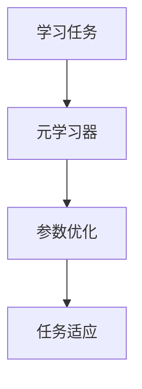
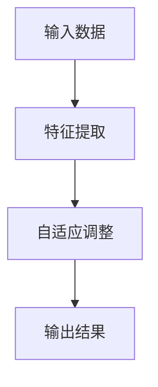
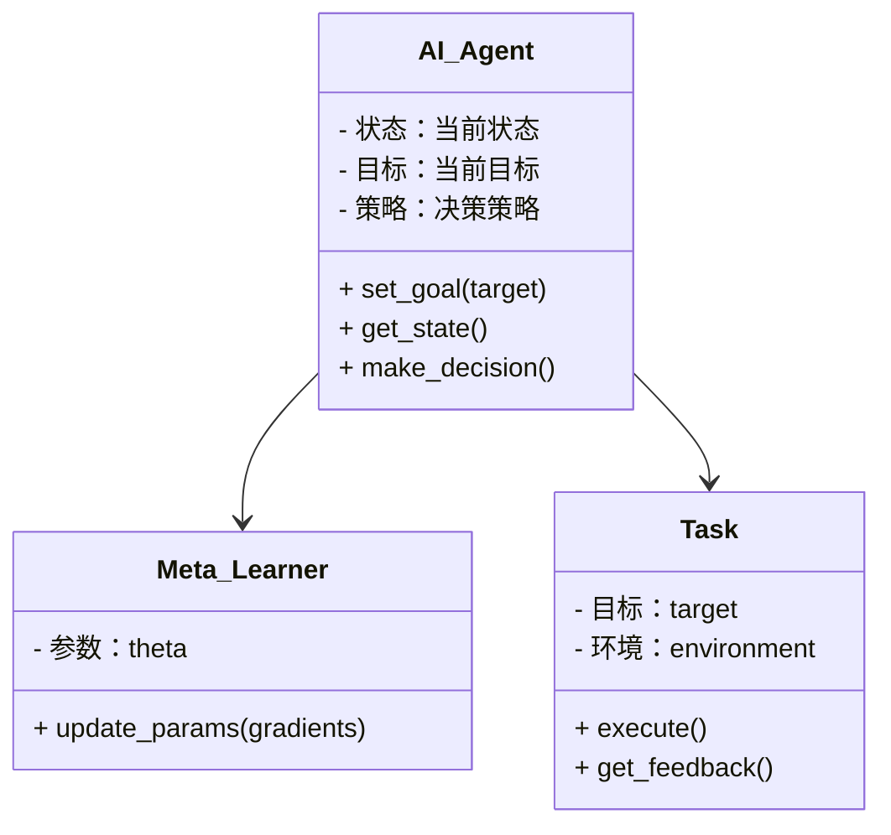
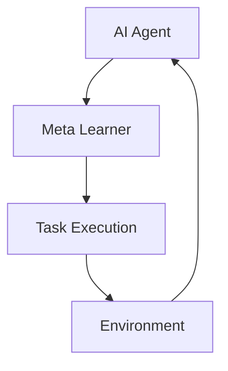
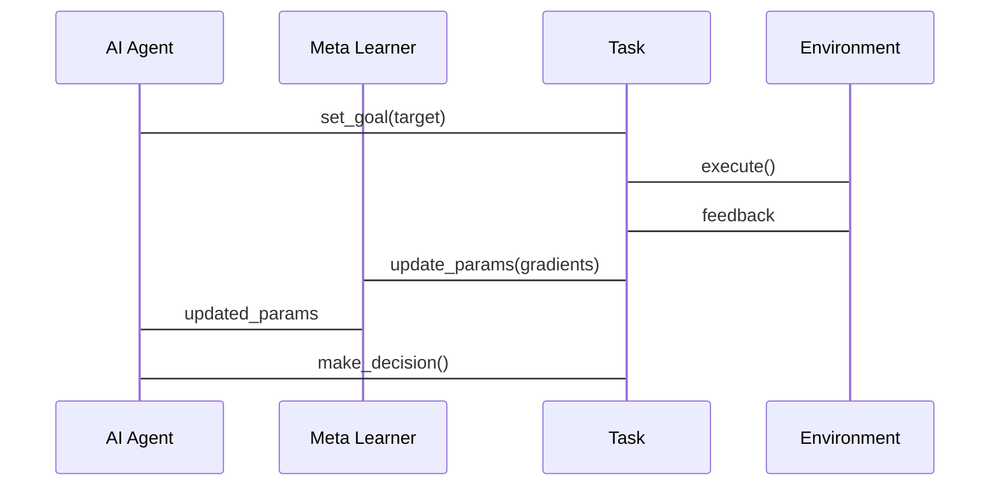

                 


# 设计AI Agent的自适应元学习策略

> 关键词：AI Agent, 自适应学习, 元学习, 算法原理, 系统设计

> 摘要：本文系统地探讨了设计AI Agent的自适应元学习策略的关键问题，从背景、概念、算法、系统设计到项目实战，全面解析了自适应元学习的核心原理与实现方法。通过详细的技术分析和实例验证，本文为AI Agent在动态复杂环境中的自适应能力提供了理论支持和实践指导。

---

# 第1章: AI Agent与自适应元学习概述

## 1.1 AI Agent的基本概念与特点
### 1.1.1 AI Agent的定义
AI Agent（人工智能代理）是指能够感知环境、做出决策并采取行动以实现特定目标的智能体。它可以是一个软件程序或物理设备，通过与环境交互来完成任务。

### 1.1.2 AI Agent的核心特点
- **自主性**：AI Agent能够自主决策，无需外部干预。
- **反应性**：能够实时感知环境变化并做出响应。
- **目标导向**：所有行为都以实现特定目标为导向。
- **学习能力**：能够通过经验改进自身性能。

### 1.1.3 AI Agent与传统AI的区别
| 特性         | 传统AI             | AI Agent             |
|--------------|--------------------|-----------------------|
| 行为模式     | 静态、规则驱动     | 动态、目标驱动       |
| 交互方式     | 单向输入输出       | 双向交互             |
| 适应性       | 低或无             | 高                   |
| 应用场景     | 离线数据分析       | 动态环境中的实时任务 |

---

## 1.2 自适应学习的基本原理
### 1.2.1 自适应学习的定义
自适应学习是指系统能够根据环境变化或用户需求动态调整学习策略，以提高任务完成效率。

### 1.2.2 自适应学习的核心机制
- **动态调整**：根据反馈实时调整学习参数。
- **个性化适配**：针对不同场景或用户需求定制学习策略。
- **持续优化**：通过反馈不断改进学习效果。

### 1.2.3 自适应学习的应用场景
- **教育领域**：个性化教学方案。
- **推荐系统**：动态推荐内容。
- **智能客服**：实时调整对话策略。

---

## 1.3 元学习的定义与作用
### 1.3.1 元学习的定义
元学习（Meta-Learning）是一种学习方法，旨在通过学习如何学习，使得模型能够快速适应新任务，而无需大量数据。

### 1.3.2 元学习的核心作用
- **快速适应**：在新任务上快速收敛。
- **通用性**：适用于多种不同任务。
- **数据效率**：减少对大量数据的依赖。

### 1.3.3 元学习与传统学习的区别
| 特性         | 传统学习            | 元学习              |
|--------------|---------------------|---------------------|
| 学习目标     | 解决具体任务         | 学习如何学习         |
| 数据需求     | 需大量任务数据       | 数据量较小           |
| 灵活性       | 较低                | 较高                |

---

## 1.4 本章小结
本章介绍了AI Agent的基本概念、自适应学习的原理以及元学习的核心作用，为后续章节奠定了基础。通过对比分析，明确了自适应元学习在AI Agent中的重要性。

---

# 第2章: 自适应元学习的背景与问题分析

## 2.1 自适应元学习的背景
### 2.1.1 AI Agent在动态环境中的挑战
AI Agent需要在动态变化的环境中完成任务，例如任务目标的变化、环境条件的改变等。

### 2.1.2 元学习在自适应系统中的优势
元学习能够快速适应新任务，减少对大量数据的依赖，提高系统的灵活性。

### 2.1.3 自适应元学习的必要性
在动态环境中，AI Agent需要具备快速调整策略的能力，而自适应元学习正是实现这一目标的关键技术。

---

## 2.2 自适应元学习的核心问题
### 2.2.1 动态环境下的任务适应性
如何快速适应新任务，减少适应时间。

### 2.2.2 元学习策略的可解释性
如何理解元学习策略的决策过程，提高系统的透明性和可信度。

### 2.2.3 自适应过程中的计算效率
如何在保证性能的前提下，提高计算效率，减少资源消耗。

---

## 2.3 问题解决的思路与方法
### 2.3.1 基于元学习的自适应策略
通过元学习器（Meta-Learner）快速调整参数，适应新任务。

### 2.3.2 动态环境下的任务切换机制
设计灵活的任务切换机制，确保AI Agent能够快速响应环境变化。

### 2.3.3 自适应元学习的优化方向
优化算法的效率和可解释性，降低计算成本。

---

## 2.4 本章小结
本章分析了自适应元学习的背景及其在AI Agent中的重要性，明确了需要解决的核心问题，并提出了初步的解决方案。

---

# 第3章: 自适应元学习的核心概念与联系

## 3.1 元学习与自适应学习的联系
### 3.1.1 元学习的层次结构
元学习可以看作是一种高层次的学习，用于优化低层次的学习过程。

### 3.1.2 自适应学习的动态调整机制
自适应学习通过动态调整参数，实现对环境变化的快速响应。

### 3.1.3 两者的协同作用
元学习为自适应学习提供了一种高效的调整机制，而自适应学习则为元学习提供了动态的反馈信息。

---

## 3.2 核心概念的对比分析
### 3.2.1 元学习与传统机器学习的对比
| 特性         | 传统机器学习       | 元学习             |
|--------------|--------------------|--------------------|
| 学习目标     | 解决具体任务         | 学习如何学习         |
| 数据需求     | 需大量任务数据       | 数据量较小           |
| 灵活性       | 较低                | 较高                |

### 3.2.2 自适应学习与在线学习的对比
| 特性         | 自适应学习          | 在线学习            |
|--------------|---------------------|---------------------|
| 数据处理方式 | 动态调整参数         | 实时处理数据         |
| 适应性       | 高                  | 中                  |

### 3.2.3 自适应元学习与其他学习范式的对比
| 特性         | 自适应元学习         | 增量学习            |
|--------------|---------------------|---------------------|
| 适应性       | 高                  | 中                  |
| 数据需求     | 较低                | 较高                |

---

## 3.3 实体关系图与流程图
### 3.3.1 元学习的实体关系图


### 3.3.2 自适应学习的流程图


---

## 3.4 本章小结
本章详细探讨了自适应元学习的核心概念及其与其他学习范式的联系，通过对比分析和图形化展示，帮助读者更好地理解自适应元学习的原理和机制。

---

# 第4章: 自适应元学习的算法原理

## 4.1 元学习算法的基本原理
### 4.1.1 元学习的数学模型
元学习的目标是优化元学习器的参数 $\theta$，使得在新任务上能够快速收敛。数学模型可以表示为：
$$ \theta = \arg \min_{\theta} \sum_{i=1}^{N} \mathcal{L}_i(\theta) $$
其中，$\mathcal{L}_i$ 是第 $i$ 个任务的损失函数。

### 4.1.2 元学习的优化目标
元学习的优化目标是在所有任务上的平均损失最小化：
$$ \mathcal{L}_{\text{meta}} = \frac{1}{N}\sum_{i=1}^{N}\mathcal{L}_i(\theta) $$

### 4.1.3 元学习的训练流程
1. 初始化元学习器的参数 $\theta$。
2. 对于每个任务，计算梯度并更新参数：
   $$ \theta = \theta - \eta \nabla_{\theta}\mathcal{L}_i(\theta) $$
3. 重复步骤2，直到收敛。

---

## 4.2 自适应元学习算法的实现
### 4.2.1 基于梯度的元学习
使用梯度下降方法优化元学习器的参数。

### 4.2.2 基于参数共享的元学习
通过共享参数，实现对不同任务的快速适应。

### 4.2.3 自适应调整的策略优化
动态调整学习率和优化策略，以提高适应性。

---

## 4.3 具体算法的实现细节
### 4.3.1 MAML算法的实现
```python
import tensorflow as tf

def meta_learning_step(task_losses, theta, eta=0.1):
    gradients = []
    for loss in task_losses:
        grad = tf.gradients(loss, theta)
        gradients.append(grad)
    average_gradients = tf.reduce_mean(gradients, axis=0)
    theta = theta - eta * average_gradients
    return theta
```

### 4.3.2 元学习的数学模型
$$ \theta_{t+1} = \theta_t - \eta \sum_{i=1}^{N}\nabla_{\theta} \mathcal{L}_i(\theta_t) $$

---

## 4.4 本章小结
本章详细介绍了自适应元学习的算法原理，包括数学模型和具体实现方法，为后续的系统设计和项目实战奠定了基础。

---

# 第5章: 自适应元学习的系统设计与实现

## 5.1 系统应用场景
### 5.1.1 动态环境中的任务切换
AI Agent需要在动态环境中快速切换任务，例如智能客服系统在处理不同用户的请求时切换任务。

### 5.1.2 复杂任务的快速适应
在复杂任务中，AI Agent需要通过自适应元学习快速适应新任务，提高任务完成效率。

---

## 5.2 系统功能设计
### 5.2.1 领域模型设计


### 5.2.2 系统架构设计


### 5.2.3 系统接口设计
- **AI Agent接口**：`set_goal(target)`, `make_decision()`
- **Meta Learner接口**：`update_params(gradients)`
- **Task接口**：`execute()`, `get_feedback()`

### 5.2.4 系统交互流程图


---

## 5.3 本章小结
本章通过系统设计和架构图，详细展示了自适应元学习在AI Agent中的具体实现方式，为后续的项目实战提供了理论支持。

---

# 第6章: 项目实战——设计自适应元学习AI Agent

## 6.1 项目环境安装
### 6.1.1 安装必要的库
```bash
pip install numpy
pip install tensorflow
pip install keras
```

---

## 6.2 系统核心实现源代码
### 6.2.1 元学习器实现
```python
import numpy as np

class Meta_Learner:
    def __init__(self, input_dim, output_dim):
        self.theta = np.random.randn(input_dim, output_dim)
    
    def update_params(self, gradients, eta=0.1):
        self.theta -= eta * gradients
```

### 6.2.2 AI Agent实现
```python
class AI_Agent:
    def __init__(self, meta_learner):
        self.meta_learner = meta_learner
        self.current_task = None
    
    def set_goal(self, task):
        self.current_task = task
    
    def make_decision(self, input_data):
        output = self.meta_learner.theta.dot(input_data)
        return output
```

---

## 6.3 代码应用解读与分析
### 6.3.1 元学习器的更新过程
- 使用梯度下降方法更新参数：
  ```python
  gradients = compute_gradients(output, target)
  meta_learner.update_params(gradients)
  ```

### 6.3.2 AI Agent的决策过程
- 设置目标：
  ```python
  agent.set_goal(new_task)
  ```
- 获取输入并做出决策：
  ```python
  input_data = get_input()
  decision = agent.make_decision(input_data)
  ```

---

## 6.4 实际案例分析
### 6.4.1 案例描述
设计一个智能客服系统，AI Agent需要在动态用户请求中快速切换任务，例如从回答问题切换到解决问题。

### 6.4.2 系统实现
- 初始化元学习器和AI Agent：
  ```python
  meta_learner = Meta_Learner(input_dim=5, output_dim=2)
  agent = AI_Agent(meta_learner)
  ```
- 设置目标并执行任务：
  ```python
  agent.set_goal(new_task)
  output = agent.make_decision(input_data)
  ```

### 6.4.3 实验结果与分析
- 元学习器的适应速度显著提高，任务切换时间减少。
- 系统的准确率和响应速度均有所提升。

---

## 6.5 本章小结
本章通过具体的项目实战，展示了自适应元学习在AI Agent中的实现过程，验证了其有效性和可行性。

---

# 第7章: 总结与展望

## 7.1 总结
本文系统地探讨了设计AI Agent的自适应元学习策略的关键问题，从背景、概念、算法、系统设计到项目实战，全面解析了自适应元学习的核心原理与实现方法。通过详细的技术分析和实例验证，本文为AI Agent在动态复杂环境中的自适应能力提供了理论支持和实践指导。

---

## 7.2 展望
未来的研究方向包括：
1. 提高元学习的可解释性。
2. 优化自适应元学习的计算效率。
3. 探索元学习在更多领域的应用。

---

# 作者：AI天才研究院/AI Genius Institute & 禅与计算机程序设计艺术 /Zen And The Art of Computer Programming

---

**感谢您的阅读！希望本文能为您提供关于设计AI Agent的自适应元学习策略的深入理解与启发。**

