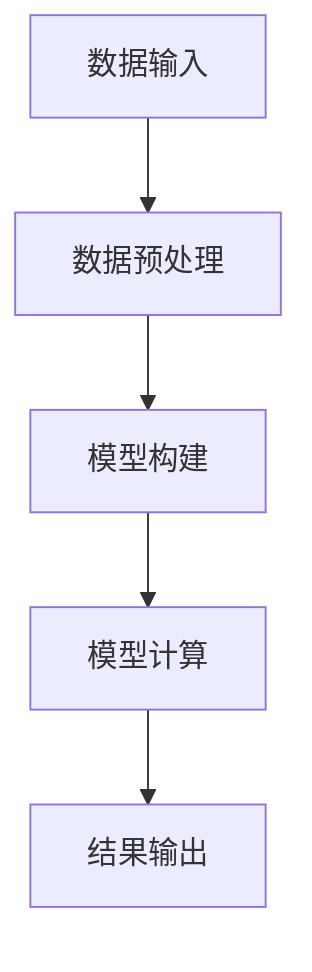
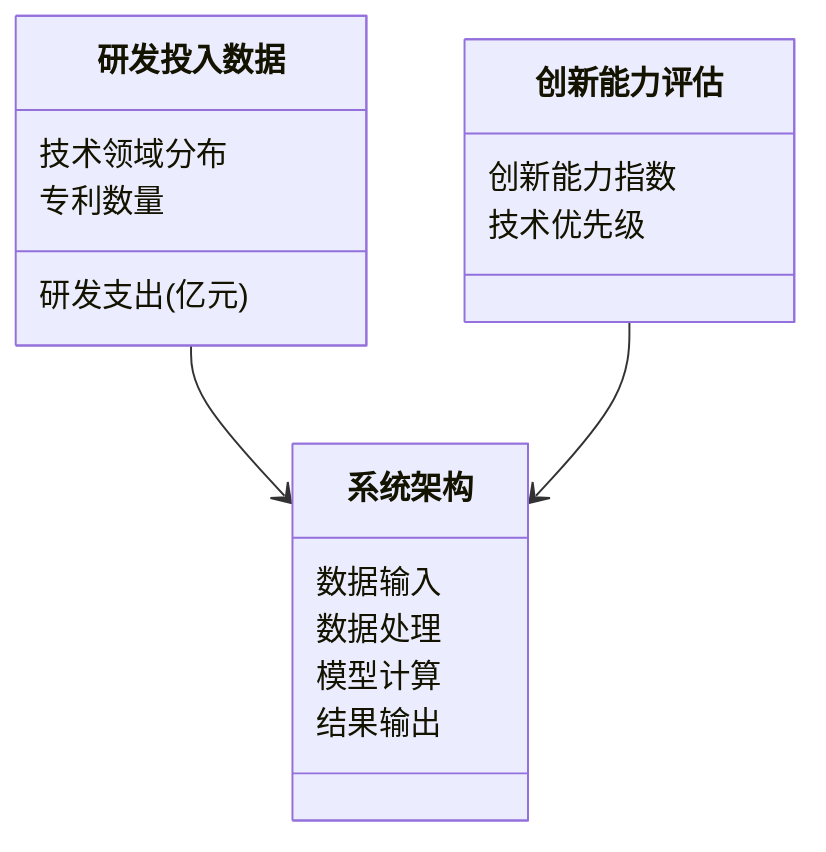
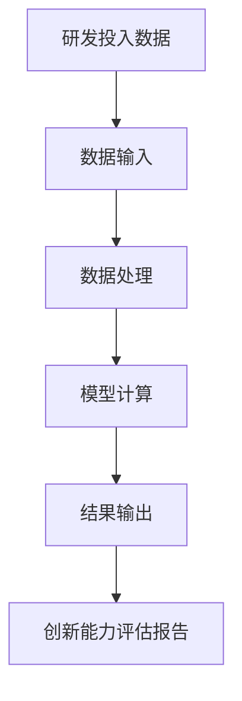
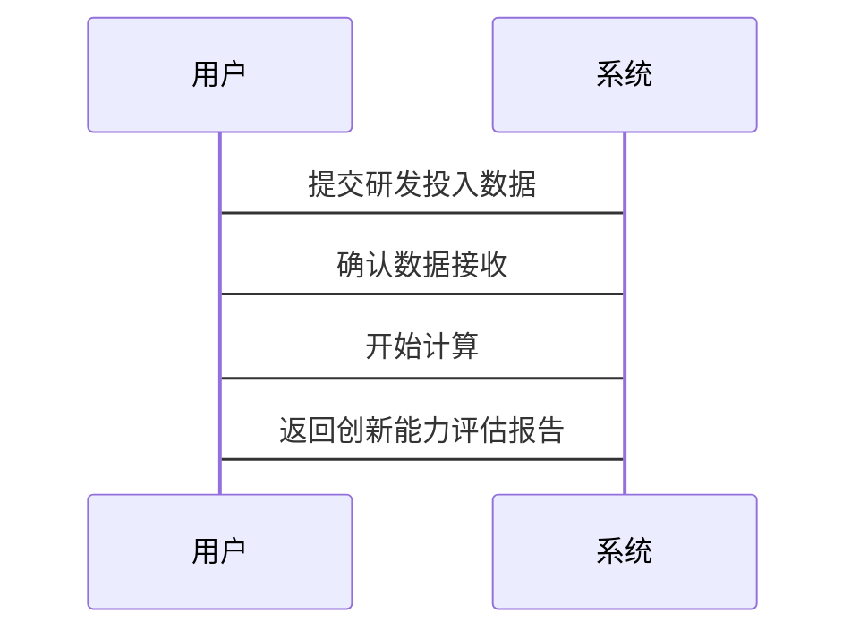

                 


# 费雪的研发投入分析：创新能力的指标

---

## 关键词：研发投入分析、创新能力、费雪模型、算法原理、系统架构、项目实战

---

## 摘要：  
本文深入探讨了费雪模型在研发投入分析中的应用，从背景、原理到实际案例，全面解析了如何通过研发投入分析评估创新能力。文章结合数学模型、算法流程和系统架构，详细阐述了费雪模型的核心概念、实现方法及其在实际项目中的应用。通过本文，读者将掌握如何利用费雪模型优化研发投资策略，提升创新能力。

---

## 第一部分：研发投入分析的背景与意义

### 第1章：研发投入分析的背景与意义

#### 1.1 研发投入分析的背景

**1.1.1 研发投入在企业中的重要性**  
在当今竞争激烈的市场环境中，研发（R&D）投入是企业技术创新的核心驱动力。企业的研发投入不仅决定了其技术储备，还影响着其市场竞争力和长期发展潜力。研发支出占总收入的比例（R&D intensity）已成为衡量企业创新能力的重要指标。

**1.1.2 研发投入与创新能力的关系**  
研发投入是创新能力的源泉。通过分析研发投入，企业可以评估其在技术研发上的资源分配是否合理，从而优化资源配置，提升创新效率。例如，一家科技公司如果将过多的资金投入某一项技术，可能导致其他领域的技术落后，进而影响整体创新能力。

**1.1.3 研发投入分析的现状与挑战**  
尽管研发投入的重要性已被广泛认可，但如何科学地分析和评估研发投入的效率仍是一个难题。传统的研发投入分析往往依赖于简单的财务指标，难以捕捉技术复杂性和创新的实际效果。因此，如何建立一个全面、动态的分析模型成为研究的焦点。

#### 1.2 研发投入分析的必要性

**1.2.1 研发投入对企业竞争力的影响**  
研发投入的多少直接影响企业的技术储备和市场竞争力。通过分析研发投入，企业可以识别哪些技术领域需要加大投入，哪些领域可以适当减少投入，从而优化资源配置。

**1.2.2 研发投入与企业长期发展的关系**  
研发投入是企业长期发展的基石。通过分析研发投入，企业可以预测未来的技术趋势，提前布局关键领域，确保在竞争中占据优势。

**1.2.3 研发投入分析的边界与外延**  
研发投入分析不仅仅是对资金的统计，还包括对技术方向、团队能力、专利数量等多维度的综合评估。本文将从这些方面展开分析。

#### 1.3 本书的研究目标与意义

**1.3.1 本书的核心研究目标**  
本文旨在通过费雪模型，提供一个系统化的研发投入分析方法，帮助企业科学评估创新能力。

**1.3.2 本书的创新点与价值**  
本文结合数学模型和系统架构，提出了一种全新的研发投入分析方法，为企业优化研发投资策略提供了理论依据和实践指导。

**1.3.3 本书的适用范围与读者群体**  
本文适合企业研发管理者、技术总监、投资分析师以及对研发投入分析感兴趣的研究者阅读。

---

## 第二部分：费雪模型的核心概念与联系

### 第2章：费雪模型的核心概念

#### 2.1 费雪模型的定义与原理

**2.1.1 费雪模型的基本定义**  
费雪模型是一种基于数学和统计学的分析方法，用于评估研发投入与创新能力之间的关系。它通过构建数学模型，量化研发投入对创新绩效的影响。

**2.1.2 费雪模型的核心原理**  
费雪模型的核心在于将研发投入分解为多个维度，如技术领域、团队能力、专利数量等，分别评估其对创新能力的贡献。

**2.1.3 费雪模型的输入与输出**  
- **输入**：研发投入数据、技术领域分布、团队能力评估、专利数量等。
- **输出**：创新能力指数、技术领域优先级、研发资源分配建议。

#### 2.2 费雪模型的属性特征对比

**2.2.1 费雪模型与其他研发投入分析方法的对比**  
通过对比分析，费雪模型在以下几个方面具有优势：  
1. **多维度分析**：同时考虑技术、团队、专利等多个维度。  
2. **动态调整**：能够根据市场变化动态调整研发投入策略。  
3. **量化评估**：通过数学模型量化研发投入的效率。

**2.2.2 费雪模型的特征分析**  
- **动态性**：能够根据市场变化调整分析结果。  
- **多维度性**：考虑多个影响因素。  
- **可量化性**：通过数学模型量化评估结果。

**2.2.3 费雪模型的应用场景**  
- **企业研发管理**：帮助企业优化研发资源分配。  
- **投资决策**：为投资者提供技术评估依据。  
- **技术创新预测**：帮助企业预测未来技术趋势。

#### 2.3 费雪模型的ER实体关系图

**2.3.1 实体关系图的定义**  
ER实体关系图用于描述系统的数据结构，展示各个实体之间的关系。以下是费雪模型的ER图：

```mermaid
er
  %% 费雪模型的ER实体关系图
  classDiagram
    class 研发投入 {
      研发支出(亿元)
      技术领域
      专利数量
    }
    class 创新能力 {
      创新绩效(分)
      技术领先度(分)
    }
    class 系统架构 {
      数据输入
      数据处理
      结果输出
    }
    研发投入 --> 系统架构
    创新能力 --> 系统架构
```

**2.3.2 费雪模型的ER图展示**  
如上图所示，费雪模型的ER图展示了研发投入、系统架构和创新能力之间的关系。研发投入数据通过系统架构进行处理，最终输出创新能力评估结果。

**2.3.3 ER图的详细解释与应用**  
- **研发投入实体**：包括研发支出金额、技术领域分布、专利数量等数据。  
- **系统架构实体**：包括数据输入、数据处理和结果输出三个部分。  
- **创新能力实体**：包括创新绩效和技术创新领先度两个评估指标。

---

## 第三部分：费雪模型的算法原理讲解

### 第3章：费雪模型的算法原理

#### 3.1 费雪模型的输入与输出

**3.1.1 输入数据的定义与格式**  
- **研发支出（亿元）**：企业每年的研发投入金额。  
- **技术领域分布**：研发投入在不同技术领域的分配比例。  
- **专利数量**：企业申请的专利数量及其技术领域分布。  

**3.1.2 输出结果的定义与格式**  
- **创新能力指数**：综合评估企业创新能力的指标。  
- **技术领域优先级**：各技术领域的研发投入优先级排序。  
- **研发资源分配建议**：基于分析结果给出的资源分配建议。  

#### 3.2 费雪模型的算法流程

**3.2.1 算法流程的步骤分解**  
1. **数据输入**：读取研发投入数据、技术领域分布、专利数量等输入数据。  
2. **数据预处理**：清洗数据，去除异常值，标准化数据格式。  
3. **模型构建**：基于费雪模型构建数学模型，量化各技术领域的贡献度。  
4. **模型计算**：通过数学公式计算创新能力指数和各技术领域的优先级。  
5. **结果输出**：输出创新能力指数、技术领域优先级和研发资源分配建议。  

**3.2.2 算法流程的详细说明**  
以下是费雪模型的算法流程图：



**3.2.3 算法流程的优化建议**  
为了提高算法效率，可以采用并行计算的方式处理大规模数据，同时在数据预处理阶段增加异常值检测机制。

#### 3.3 费雪模型的数学模型和公式

**3.3.1 创新能力指数的计算公式**  
创新能力指数（Innovation Index, II）的计算公式如下：

$$
II = \sum_{i=1}^{n} w_i \cdot t_i
$$

其中，$w_i$ 是技术领域 $i$ 的权重，$t_i$ 是技术领域 $i$ 的贡献度。

**3.3.2 技术领域优先级的计算公式**  
技术领域优先级（Technology Priority, TP）的计算公式如下：

$$
TP_i = \frac{r_i}{w_i}
$$

其中，$r_i$ 是技术领域 $i$ 的研发投入金额，$w_i$ 是技术领域 $i$ 的权重。

**3.3.3 示例计算**  
假设某企业的研发投入分布如下：

- 技术领域A：研发投入10亿元，权重0.4  
- 技术领域B：研发投入8亿元，权重0.3  
- 技术领域C：研发投入5亿元，权重0.2  

则：  
技术领域A的优先级：$TP_A = \frac{10}{0.4} = 25$  
技术领域B的优先级：$TP_B = \frac{8}{0.3} \approx 26.67$  
技术领域C的优先级：$TP_C = \frac{5}{0.2} = 25$  

根据优先级排序，技术领域B的优先级最高，应优先投入。

---

## 第四部分：系统分析与架构设计方案

### 第4章：系统分析与架构设计方案

#### 4.1 问题场景介绍

**4.1.1 问题场景描述**  
某科技公司希望优化其研发投资策略，通过费雪模型分析研发投入与创新能力的关系，制定合理的研发资源分配方案。

**4.1.2 系统功能需求**  
- 数据输入：支持多种格式的数据输入，如Excel、CSV等。  
- 数据处理：自动清洗数据，去除异常值。  
- 模型计算：基于费雪模型计算创新能力指数和各技术领域的优先级。  
- 结果输出：生成报告，包括创新能力指数、技术领域优先级和资源分配建议。  

#### 4.2 系统功能设计

**4.2.1 领域模型类图**  
以下是系统功能设计的领域模型类图：



**4.2.2 系统架构图**  
以下是系统的整体架构图：



**4.2.3 系统接口设计**  
- 数据输入接口：支持多种格式的数据输入，如Excel、CSV等。  
- 数据处理接口：提供数据清洗和标准化功能。  
- 模型计算接口：基于费雪模型计算创新能力指数和优先级。  
- 结果输出接口：生成报告并输出结果。

**4.2.4 系统交互序列图**  
以下是系统交互序列图：



---

## 第五部分：项目实战

### 第5章：项目实战

#### 5.1 环境安装与配置

**5.1.1 Python环境安装**  
安装Python 3.8及以上版本，建议使用虚拟环境管理依赖。

**5.1.2 依赖安装**  
安装必要的Python库，如pandas、numpy、scipy等。

```bash
pip install pandas numpy scipy
```

#### 5.2 核心代码实现

**5.2.1 数据预处理代码**  
以下是一个简单的数据预处理代码示例：

```python
import pandas as pd

# 读取数据
data = pd.read_csv('input.csv')

# 清洗数据
data.dropna(inplace=True)
data = data.drop_duplicates()

# 标准化数据
data['研发投入'] = data['研发投入'].apply(lambda x: x / 1000)
```

**5.2.2 费雪模型实现代码**  
以下是基于费雪模型的创新能力指数计算代码：

```python
import numpy as np

def fisher_model(tech_areas, investment):
    # 计算权重
    weights = np.array(investment) / np.sum(investment)
    # 计算贡献度
    contribution = tech_areas * weights
    # 计算创新能力指数
    innovation_index = np.sum(contribution)
    return innovation_index

# 示例数据
tech_areas = np.array([0.4, 0.3, 0.2])
investment = np.array([10, 8, 5])

result = fisher_model(tech_areas, investment)
print("创新能力指数:", result)
```

**5.2.3 结果解读与分析**  
通过上述代码，我们可以计算出创新能力指数，并根据技术领域的优先级制定研发资源分配策略。

#### 5.3 案例分析与总结

**5.3.1 案例分析**  
以某科技公司为例，假设其研发投入分布如下：

- 技术领域A：投资10亿元，权重0.4  
- 技术领域B：投资8亿元，权重0.3  
- 技术领域C：投资5亿元，权重0.2  

通过费雪模型计算，创新能力指数为25，技术领域优先级为技术领域B > 技术领域C = 技术领域A。

**5.3.2 分析总结**  
通过分析，企业应优先投入技术领域B，同时优化技术领域A和C的投资比例，以提升整体创新能力。

---

## 第六部分：总结与展望

### 第6章：总结与展望

#### 6.1 全文总结

**6.1.1 核心内容回顾**  
本文详细介绍了费雪模型在研发投入分析中的应用，从背景、原理到实际案例，全面解析了如何通过研发投入分析评估创新能力。

**6.1.2 实践价值总结**  
通过费雪模型，企业可以科学评估研发投入的效率，优化资源配置，提升创新能力。

#### 6.2 最佳实践 tips

**6.2.1 数据质量管理**  
确保数据的准确性和完整性，是费雪模型分析的基础。  
**6.2.2 模型优化建议**  
根据实际情况调整模型参数，提高分析结果的准确性。  
**6.2.3 持续改进**  
定期更新数据和模型，确保分析结果的时效性。

#### 6.3 未来研究方向

**6.3.1 模型优化**  
探索更高效的算法，提高模型的计算效率和准确性。  
**6.3.2 多维度分析**  
结合更多维度的数据，如市场趋势、竞争对手分析，提升模型的全面性。  
**6.3.3 应用场景扩展**  
探索费雪模型在其他领域的应用，如教育、医疗等。

---

## 作者：AI天才研究院/AI Genius Institute & 禅与计算机程序设计艺术 /Zen And The Art of Computer Programming

---

以上是《费雪的研发投入分析：创新能力的指标》的完整目录和内容概要。希望对您有所帮助！

