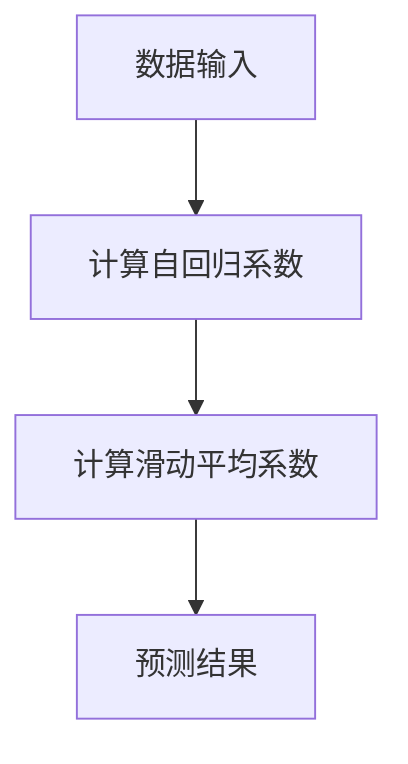
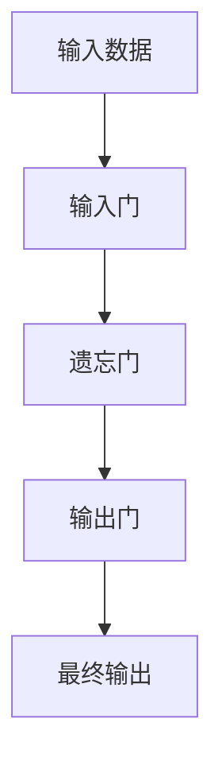
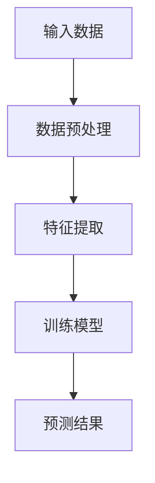
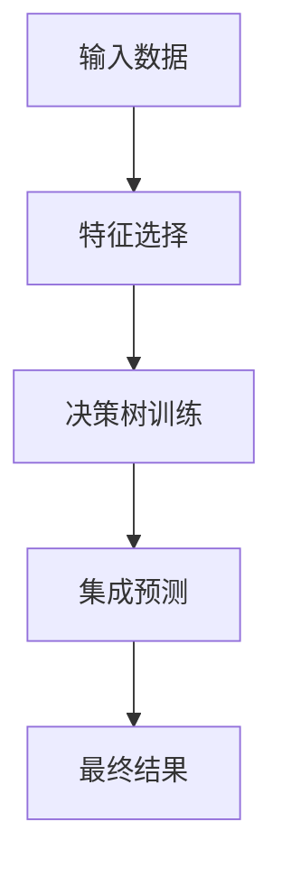
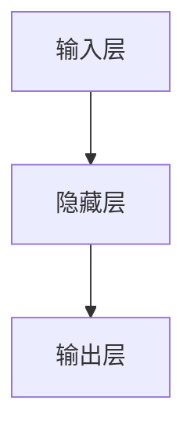
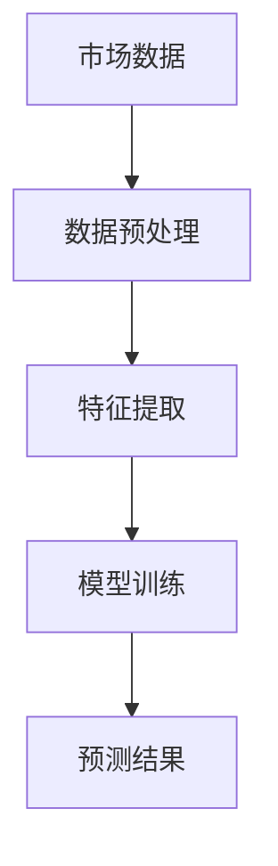
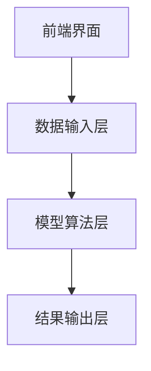
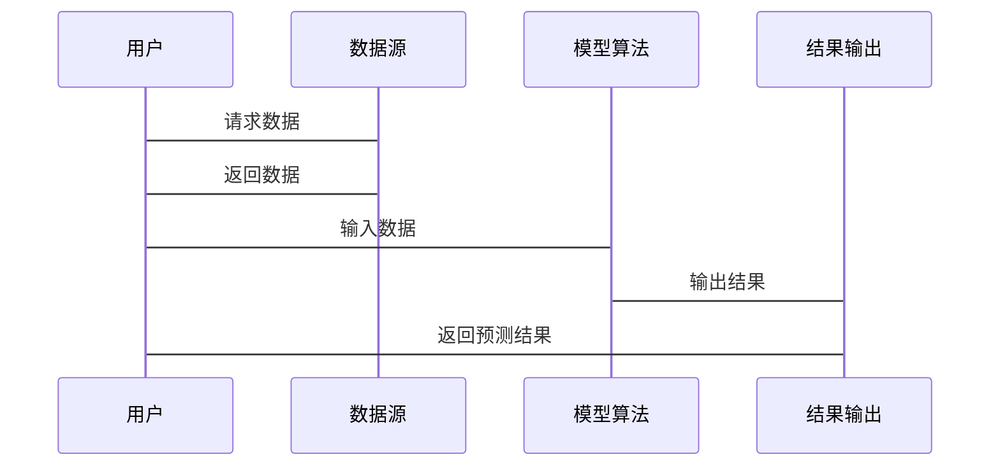

                 


# 金融市场情绪指标预测模型

> 关键词：金融市场情绪指标预测模型、时间序列分析、机器学习、深度学习、LSTM、ARIMA、GARCH

> 摘要：本文系统地介绍了金融市场情绪指标预测模型的构建与应用，从基础概念到算法原理，再到系统设计与实战案例，全面解析了如何利用技术手段预测市场情绪，为投资决策提供科学依据。

---

## 第1章: 金融市场情绪指标预测模型的背景与概念

### 1.1 问题背景与描述
金融市场是一个高度动态和不确定的环境，投资者的行为往往受到情绪的影响。情绪指标能够量化市场的乐观或悲观程度，帮助投资者做出更明智的决策。

#### 1.1.1 金融市场情绪的重要性
- 市场情绪是影响资产价格波动的重要因素。
- 投资者的情绪可以通过多种指标进行量化，例如波动率、交易量和投资者信心指数。

#### 1.1.2 情绪指标在投资决策中的作用
- 情绪指标可以帮助投资者识别市场的过度乐观或恐慌情绪。
- 通过情绪指标，投资者可以提前预判市场的潜在风险和机会。

#### 1.1.3 情绪指标预测的必要性
- 预测市场情绪可以为投资策略提供参考。
- 情绪指标预测模型可以帮助投资者在市场波动中做出更科学的决策。

### 1.2 情绪指标的核心概念
情绪指标是衡量市场参与者情绪的量化工具，通常包括以下几个方面：

#### 1.2.1 情绪指标的定义与分类
- **定义**：情绪指标是通过统计方法量化市场情绪的工具。
- **分类**：常见的市场情绪指标包括波动率、交易量、投资者信心指数等。

#### 1.2.2 情绪指标的计算方法
- 波动率：通过资产价格的波动程度计算市场情绪。
- 交易量：通过交易量的变化判断市场的活跃程度。

#### 1.2.3 情绪指标的边界与外延
- 情绪指标仅反映市场参与者的整体情绪，不能直接预测资产价格。
- 情绪指标的应用需要结合其他因素，例如宏观经济数据。

### 1.3 情绪指标预测模型的目标与意义
#### 1.3.1 模型的目标
- 预测市场情绪的变化趋势。
- 为投资决策提供科学依据。

#### 1.3.2 模型的意义
- 帮助投资者识别市场的潜在风险。
- 提供基于情绪指标的投资策略。

#### 1.3.3 模型的应用场景
- 投资组合管理。
- 风险控制。
- 量化交易策略。

### 1.4 本章小结
本章介绍了金融市场情绪指标预测模型的背景与概念，强调了情绪指标在投资决策中的重要性，并提出了模型的应用目标与意义。

---

## 第2章: 情绪指标与预测模型的核心概念

### 2.1 情绪指标的类型与特征
情绪指标可以根据不同的维度进行分类，以下是几种常见的情绪指标及其特征对比：

#### 2.1.1 市场情绪的分类
- **乐观情绪**：市场参与者普遍乐观，资产价格可能上涨。
- **悲观情绪**：市场参与者普遍悲观，资产价格可能下跌。

#### 2.1.2 情绪指标的特征对比
以下是一个对比表格：

| 情绪指标 | 特征       | 示例               |
|----------|------------|--------------------|
| 波动率    | 反映市场波动程度 | 高波动率表示市场情绪不稳定 |
| 交易量    | 反映市场活跃程度 | 高交易量表示市场情绪高涨 |

#### 2.1.3 情绪指标的数学表达
- 波动率公式：$$ \text{波动率} = \sqrt{\frac{1}{n}\sum_{i=1}^{n}(p_i - \bar{p})^2} $$
- 交易量公式：$$ \text{交易量} = \sum_{i=1}^{n} V_i $$

### 2.2 情绪指标预测模型的组成
情绪指标预测模型通常由以下几个部分组成：

#### 2.2.1 数据输入层
- 市场数据：包括资产价格、交易量等。
- 其他数据：包括宏观经济指标、新闻数据等。

#### 2.2.2 模型算法层
- 时间序列分析模型：ARIMA、LSTM等。
- 机器学习模型：支持向量机、随机森林等。

#### 2.2.3 输出结果层
- 预测结果：市场情绪的预测值。
- 可视化结果：图表形式展示预测结果。

### 2.3 情绪指标与预测模型的关系
情绪指标是预测模型的输入，模型通过分析这些指标的变化趋势来预测市场情绪。

#### 2.3.1 情绪指标对预测模型的影响
- 情绪指标的质量直接影响模型的预测精度。
- 不同的情绪指标组合可以提高模型的预测能力。

#### 2.3.2 预测模型对情绪指标的依赖
- 预测模型依赖于情绪指标的数据输入。
- 模型的预测结果是基于情绪指标的分析。

### 2.4 本章小结
本章详细探讨了情绪指标的类型与特征，并分析了情绪指标预测模型的组成及其与情绪指标的关系。

---

## 第3章: 情绪指标预测模型的算法原理

### 3.1 时间序列分析方法
时间序列分析是预测市场情绪的重要方法，以下是几种常见的算法：

#### 3.1.1 ARIMA模型
ARIMA（自回归积分滑动平均模型）是一种常用的时间序列分析方法。

##### ARIMA模型的工作流程（mermaid流程图）


##### ARIMA模型公式
$$ ARIMA(p, d, q) $$
其中，p为自回归阶数，d为差分阶数，q为滑动平均阶数。

#### 3.1.2 LSTM模型
LSTM（长短期记忆网络）是一种基于深度学习的时间序列分析模型。

##### LSTM模型结构（mermaid流程图）


#### 3.1.3 GARCH模型
GARCH（广义自回归条件异方差模型）用于预测资产价格的波动性。

##### GARCH模型公式
$$ GARCH(p, q) $$
其中，p为自回归阶数，q为滑动平均阶数。

### 3.2 机器学习算法
机器学习算法在情绪指标预测中也发挥着重要作用。

#### 3.2.1 支持向量机（SVM）
SVM是一种监督学习算法，常用于分类任务。

##### SVM算法流程（mermaid流程图）


#### 3.2.2 随机森林（Random Forest）
随机森林是一种基于决策树的集成学习算法。

##### 随机森林算法流程（mermaid流程图）


#### 3.2.3 神经网络（Neural Networks）
神经网络是一种模仿人脑结构的深度学习模型。

##### 神经网络结构（mermaid流程图）


### 3.3 算法原理的数学模型与公式
以下是一些算法的数学模型和公式：

#### 3.3.1 ARIMA模型公式
$$ ARIMA(p, d, q) $$

#### 3.3.2 LSTM模型结构
- 输入门：$$ f_t = \sigma(W_f x_t + U_f h_{t-1} + b_f) $$
- 遗忘门：$$ i_t = \sigma(W_i x_t + U_i h_{t-1} + b_i) $$
- 输出门：$$ o_t = \sigma(W_o x_t + U_o h_{t-1} + b_o) $$
- 隐层状态：$$ h_t = f_t \cdot c_t $$

#### 3.3.3 GARCH模型公式
$$ GARCH(p, q) $$

### 3.4 算法对比与选择
不同的算法有不同的优缺点，选择合适的算法需要根据具体场景和数据特点。

#### 3.4.1 不同算法的优缺点
| 算法   | 优点                     | 缺点                     |
|--------|--------------------------|--------------------------|
| ARIMA  | 简单易用                 | 无法捕捉非线性关系       |
| LSTM   | 能捕捉长序列依赖         | 训练时间较长             |
| GARCH  | 适合波动性预测           | 无法处理复杂非线性关系   |
| SVM    | 高精度分类               | 无法处理多分类问题       |
| Random Forest | 鲁棒性强               | 解释性较差               |
| Neural Networks | 高度灵活               | 需要大量数据和计算资源   |

#### 3.4.2 算法选择的依据
- 数据类型：时间序列数据适合ARIMA和LSTM，分类数据适合SVM和随机森林。
- 数据量：深度学习算法需要大量数据，传统算法适合小数据场景。
- 计算资源：深度学习算法需要较高的计算能力。

#### 3.4.3 实际应用中的算法优化
- 超参数调优：通过交叉验证选择最优参数。
- 模型集成：将多种算法的结果进行集成，提高预测精度。

### 3.5 本章小结
本章详细介绍了时间序列分析方法和机器学习算法的原理，并通过对比分析帮助读者选择合适的算法。

---

## 第4章: 情绪指标预测模型的系统分析与架构设计

### 4.1 系统分析
情绪指标预测模型的系统设计需要考虑多个方面。

#### 4.1.1 问题场景介绍
- 数据来源：市场数据、新闻数据等。
- 预测目标：市场情绪的预测。
- 使用场景：投资决策、风险控制等。

#### 4.1.2 领域模型设计（mermaid类图）


### 4.2 系统架构设计
情绪指标预测模型的系统架构可以分为以下几个部分：

#### 4.2.1 系统架构设计（mermaid架构图）


#### 4.2.2 系统接口设计
- 数据接口：与数据源对接。
- 模型接口：与算法模型对接。
- 结果接口：与用户界面对接。

#### 4.2.3 系统交互流程图（mermaid序列图）


### 4.3 本章小结
本章通过系统分析和架构设计，明确了情绪指标预测模型的构建流程和系统组成部分。

---

## 第5章: 情绪指标预测模型的项目实战

### 5.1 环境安装
情绪指标预测模型的实现需要以下环境：

#### 5.1.1 环境要求
- Python 3.6+
- NumPy、Pandas、Scikit-learn等库。
- Keras、TensorFlow等深度学习框架。

### 5.2 系统核心实现源代码
以下是一个简单的ARIMA模型实现代码：

#### 5.2.1 数据预处理
```python
import pandas as pd
import numpy as np

# 加载数据
data = pd.read_csv('market_data.csv')
# 数据清洗
data = data.dropna()
# 数据标准化
from sklearn.preprocessing import StandardScaler
scaler = StandardScaler()
data_scaled = scaler.fit_transform(data)
```

#### 5.2.2 模型训练
```python
from statsmodels.tsa.arima.model import ARIMA

# 训练ARIMA模型
model = ARIMA(data_scaled, order=(5, 1, 0))
model_fit = model.fit()
```

#### 5.2.3 模型预测
```python
# 预测未来值
forecast = model_fit.forecast(steps=5)
print(forecast)
```

### 5.3 实际案例分析
以下是一个实际案例分析：

#### 5.3.1 案例背景
假设我们有某只股票的历史价格数据，希望通过ARIMA模型预测未来的价格走势。

#### 5.3.2 数据可视化
```python
import matplotlib.pyplot as plt

data['price'].plot()
plt.title('Historical Price')
plt.xlabel('Time')
plt.ylabel('Price')
plt.show()
```

#### 5.3.3 模型预测结果
```python
forecast = model_fit.forecast(steps=5)
plt.plot(forecast, label='Forecast')
plt.plot(data['price'], label='Actual')
plt.title('Price Forecast')
plt.xlabel('Time')
plt.ylabel('Price')
plt.legend()
plt.show()
```

### 5.4 项目小结
本章通过实际案例分析，展示了情绪指标预测模型的实现过程，包括数据预处理、模型训练和预测结果的可视化。

---

## 第6章: 情绪指标预测模型的总结与展望

### 6.1 本项目的核心成果
- 成功构建了情绪指标预测模型。
- 通过实际案例验证了模型的有效性。

### 6.2 最佳实践 Tips
- 数据预处理是模型训练的关键。
- 选择合适的算法可以提高预测精度。
- 模型的实时更新可以提高预测的准确性。

### 6.3 本章小结
本章总结了情绪指标预测模型的构建过程，并展望了未来的研究方向。

---

## 作者：AI天才研究院/AI Genius Institute & 禅与计算机程序设计艺术/Zen And The Art of Computer Programming

---

**注：以上内容为《金融市场情绪指标预测模型》技术博客文章的完整目录和部分正文内容，具体内容可根据实际需求进行扩展和补充。**

