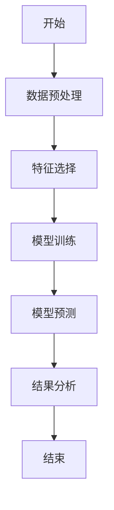
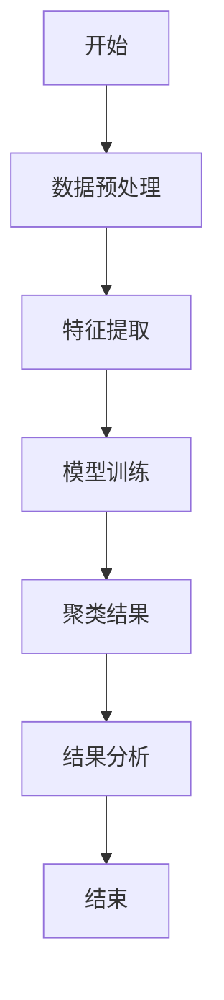
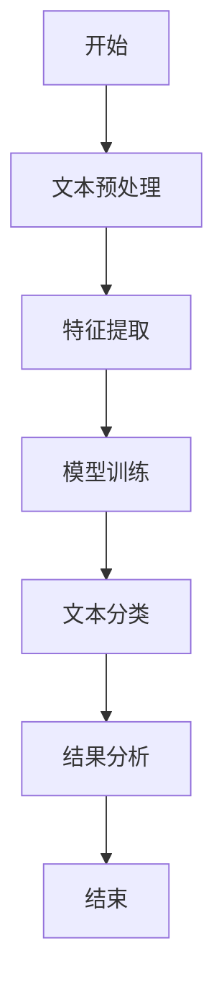
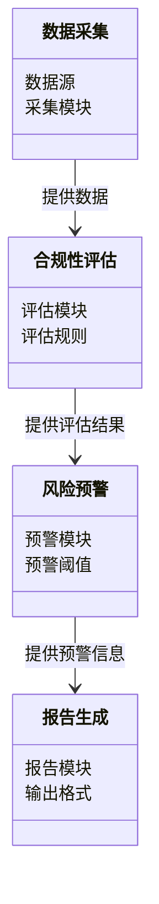
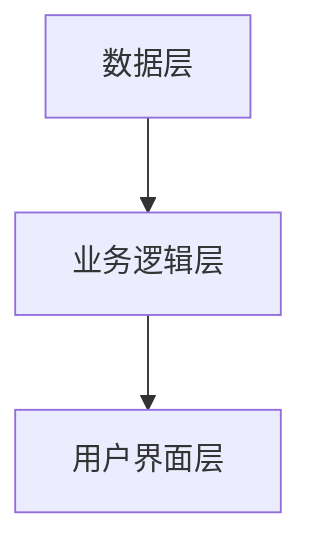
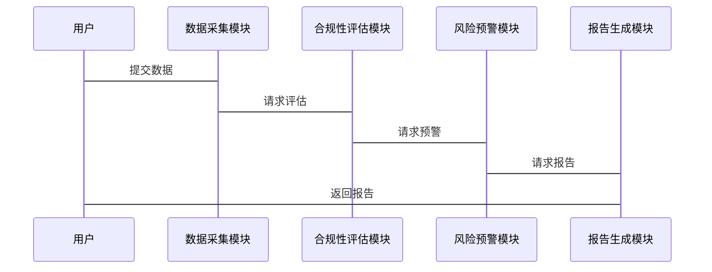

                 


# 金融监管科技合规性评估

**关键词**：金融监管科技（RegTech）、合规性评估、机器学习、自然语言处理、系统架构、金融监管

**摘要**：  
随着金融科技（FinTech）的快速发展，金融监管科技（RegTech）逐渐成为行业关注的焦点。RegTech利用先进的技术手段，如人工智能、大数据分析和区块链等，帮助金融机构和监管机构提高合规效率、降低风险，并确保符合相关法律法规。本文将从RegTech的核心概念出发，分析其在合规性评估中的应用，探讨基于机器学习和自然语言处理的算法原理，结合系统架构设计，提供实际项目案例和最佳实践建议。

---

## 第1章: 金融监管科技（RegTech）概述

### 1.1 金融监管科技的定义与内涵
RegTech（Regulatory Technology）是金融科技领域的一个重要分支，专注于利用技术手段优化金融监管流程，提高监管效率和合规性。与传统的金融监管方式不同，RegTech通过技术手段实现自动化、智能化的监管，能够更快速地响应市场变化和监管需求。

#### 1.1.1 RegTech的定义
RegTech是指利用新技术（如人工智能、大数据、区块链等）来提高金融监管效率和效果的工具和方法。它不仅包括监管机构的数字化转型，还包括金融机构内部的合规管理。

#### 1.1.2 RegTech的核心内涵
RegTech的核心内涵在于通过技术创新解决金融监管中的痛点，包括合规性评估、风险监控、数据报送等问题。它强调技术与监管目标的深度融合，能够实现监管数据的实时分析和动态监控。

#### 1.1.3 RegTech与传统金融监管的区别
| **方面** | **RegTech** | **传统金融监管** |
|----------|-------------|------------------|
| 技术手段 | 基于AI、大数据等 | 依赖人工审查和文档 | 
| 效率 | 高效、自动化 | 低效、依赖人工 | 
| 数据处理 | 实时、动态 | 周期性、静态 | 

### 1.2 金融监管科技的发展背景
RegTech的发展背景主要源于金融行业的数字化转型和监管需求的日益复杂化。

#### 1.2.1 金融科技（FinTech）的快速发展
FinTech的崛起推动了金融行业的技术变革，传统的监管方式已经难以应对新型金融产品和业务模式的监管需求。

#### 1.2.2 监管机构的数字化转型需求
监管机构意识到，传统的监管手段难以应对金融创新带来的挑战，数字化转型成为必然趋势。

#### 1.2.3 全球范围内RegTech的兴起
全球范围内，RegTech的兴起是金融机构和监管机构共同推动的结果，尤其是在 GDPR 等严格法规出台后，合规性需求进一步推动了RegTech的发展。

### 1.3 金融监管科技的重要性
RegTech的重要性体现在提高监管效率、降低合规成本以及促进金融创新三个方面。

#### 1.3.1 提高监管效率
通过自动化技术，RegTech能够快速处理大量数据，显著提高监管效率。

#### 1.3.2 降低合规成本
RegTech能够帮助金融机构自动化完成合规性检查，降低合规成本。

#### 1.3.3 促进金融创新
RegTech的技术支持为金融机构提供了更多的创新空间，能够更快速地推出新产品和新服务。

### 1.4 金融监管科技的合规性评估框架
合规性评估是RegTech的核心内容之一，主要包含以下步骤：

#### 1.4.1 合规性评估的目标
合规性评估的目标是确保RegTech工具和方法符合相关法律法规和监管要求。

#### 1.4.2 合规性评估的主要内容
合规性评估需要涵盖数据隐私、算法公正性、系统安全等多个方面。

#### 1.4.3 合规性评估的实施步骤
1. 明确评估标准
2. 数据采集与分析
3. 评估结果报告

### 1.5 本章小结
本章主要介绍了RegTech的定义、发展背景及其重要性，并提出了合规性评估的框架。

---

## 第2章: 金融监管科技的核心概念与联系

### 2.1 金融监管科技的核心概念
RegTech的核心概念包括监管目标、技术手段和合规要求。

#### 2.1.1 监管目标
监管目标是RegTech的核心，主要包括风险控制、合规性检查和市场监控。

#### 2.1.2 技术手段
RegTech的技术手段包括人工智能、大数据分析、区块链等。

#### 2.1.3 合规要求
合规要求是RegTech的出发点，确保金融机构的业务符合法律法规。

### 2.2 核心概念的属性对比
通过对比表格可以看出，RegTech的核心概念各有特点。

#### 2.2.1 监管目标与合规要求的对比
| **方面** | **监管目标** | **合规要求** |
|----------|--------------|--------------|
| 内容 | 风险控制、市场监控 | 合规性检查 |
| 实施主体 | 监管机构 | 金融机构 |

#### 2.2.2 技术手段与监管目标的关联
技术手段是实现监管目标的重要工具，两者密切相关。

#### 2.2.3 合规要求与技术手段的结合
合规要求是技术手段的应用场景，技术手段是实现合规要求的手段。

### 2.3 实体关系图（ER图）架构
通过ER图可以清晰地展示RegTech的核心概念之间的关系。

```mermaid
erd
    entity(监管目标) {
        id
        名称
        描述
    }
    entity(技术手段) {
        id
        名称
        描述
    }
    entity(合规要求) {
        id
        名称
        描述
    }
    监管目标 --> 技术手段: 使用
    技术手段 --> 合规要求: 实现
```

---

## 第3章: 金融监管科技合规性评估的算法原理

### 3.1 机器学习算法在RegTech中的应用
机器学习算法在RegTech中的应用主要体现在风险评估和异常检测方面。

#### 3.1.1 监督学习
监督学习通过训练数据，预测未来的结果。例如，使用决策树算法进行风险分类。

##### 决策树算法流程图


##### 决策树算法代码实现
```python
from sklearn.tree import DecisionTreeClassifier
import pandas as pd

# 数据加载
data = pd.read_csv('regtech_data.csv')
X = data.drop('label', axis=1)
y = data['label']

# 模型训练
model = DecisionTreeClassifier()
model.fit(X, y)

# 预测
predictions = model.predict(X)
```

#### 3.1.2 无监督学习
无监督学习主要用于异常检测，例如使用聚类算法识别异常交易。

##### 聚类算法流程图


##### 聚类算法代码实现
```python
from sklearn.cluster import KMeans
import pandas as pd

# 数据加载
data = pd.read_csv('transactions.csv')
X = data.drop('amount', axis=1)

# 模型训练
model = KMeans(n_clusters=2)
model.fit(X)

# 预测
clusters = model.predict(X)
```

### 3.2 自然语言处理在RegTech中的应用
自然语言处理（NLP）在RegTech中的应用主要体现在合规文档的自动分类和风险预警。

#### 3.2.1 文本分类
文本分类是NLP的核心任务之一，用于自动分类合规文档。

##### 文本分类流程图


##### 文本分类代码实现
```python
from sklearn.svm import SVC
import pandas as pd

# 数据加载
data = pd.read_csv('regulatory_documents.csv')
X = data['text']
y = data['label']

# 特征提取
from sklearn.feature_extraction.text import TfidfVectorizer
vectorizer = TfidfVectorizer()
X_vec = vectorizer.fit_transform(X)

# 模型训练
model = SVC()
model.fit(X_vec, y)

# 预测
predictions = model.predict(X_vec)
```

### 3.3 合规性评估的数学模型
合规性评估可以通过概率模型和逻辑回归模型来实现。

#### 3.3.1 概率模型
概率模型用于评估交易的合规概率。

##### 概率模型公式
$$ P(\text{合规} | x) = \frac{P(x|\text{合规})P(\text{合规})}{P(x)} $$

#### 3.3.2 逻辑回归模型
逻辑回归模型用于分类合规和非合规交易。

##### 逻辑回归模型公式
$$ P(y=1|x) = \frac{e^{\beta_0 + \beta_1 x}}{1 + e^{\beta_0 + \beta_1 x}} $$

---

## 第4章: 金融监管科技合规性评估的系统分析与架构设计

### 4.1 问题场景介绍
合规性评估系统需要处理大量金融数据，实现自动化监管。

### 4.2 系统功能设计
系统功能包括数据采集、合规性评估、风险预警和报告生成。

#### 4.2.1 领域模型


### 4.3 系统架构设计
系统架构采用分层设计，包括数据层、业务逻辑层和用户界面层。

#### 4.3.1 系统架构图


### 4.4 接口设计
系统需要提供API接口，方便与其他系统的集成。

### 4.5 交互流程图


---

## 第5章: 金融监管科技合规性评估的项目实战

### 5.1 环境安装
需要安装Python、机器学习库（如Scikit-learn、XGBoost）和NLP库（如NLTK、spaCy）。

### 5.2 系统核心实现源代码
以下是合规性评估系统的核心代码示例：

#### 5.2.1 数据预处理
```python
import pandas as pd

# 加载数据
data = pd.read_csv('regtech_data.csv')

# 数据清洗
data.dropna(inplace=True)
```

#### 5.2.2 模型训练
```python
from sklearn.ensemble import RandomForestClassifier

# 特征选择
features = data.drop('label', axis=1)
label = data['label']

# 模型训练
model = RandomForestClassifier()
model.fit(features, label)
```

#### 5.2.3 模型评估
```python
from sklearn.metrics import accuracy_score

# 预测
predictions = model.predict(features)

# 计算准确率
accuracy = accuracy_score(label, predictions)
print(f'准确率: {accuracy}')
```

### 5.3 代码应用解读与分析
通过上述代码，可以实现对金融数据的合规性评估。

### 5.4 实际案例分析
以某银行的交易数据为例，展示如何使用RegTech进行合规性评估。

### 5.5 项目小结
本项目展示了RegTech在实际中的应用，通过技术手段实现合规性评估。

---

## 第6章: 金融监管科技合规性评估的最佳实践

### 6.1 小结
RegTech在合规性评估中的应用前景广阔，能够显著提高监管效率。

### 6.2 注意事项
在实际应用中，需要注意数据隐私和算法的公正性。

### 6.3 拓展阅读
建议读者进一步阅读相关领域的书籍和论文。

---

## 作者

**作者：AI天才研究院/AI Genius Institute & 禅与计算机程序设计艺术 /Zen And The Art of Computer Programming**

---

以上是《金融监管科技合规性评估》的技术博客文章的详细内容。

