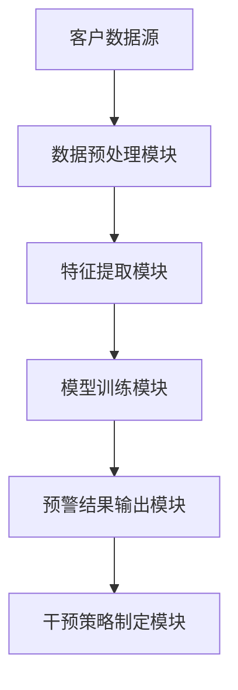

                 


# AI Agent在企业客户流失预警与干预策略制定中的应用

## 关键词
AI Agent, 客户流失预警, 机器学习, 自然语言处理, 系统架构, 项目实战

## 摘要
本文探讨AI Agent在企业客户流失预警与干预策略制定中的应用，从背景、核心概念、算法原理到系统架构、项目实战和最佳实践，全面分析AI Agent如何通过机器学习和自然语言处理技术，实现客户流失的早期预警和干预策略的智能化制定。文章详细讲解了AI Agent的工作原理、关键技术、应用场景以及实际项目中的实现过程，为企业提供了一套完整的解决方案。

---

# 第一部分: AI Agent的基本概念与技术基础

## 第1章: AI Agent的定义与技术基础

### 1.1 AI Agent的基本概念

#### 1.1.1 AI Agent的定义与特征
AI Agent（人工智能代理）是一种能够感知环境、自主决策并执行任务的智能实体。它具有以下核心特征：
- **自主性**：能够在没有人工干预的情况下自主运行。
- **反应性**：能够根据环境变化实时调整行为。
- **目标导向**：具有明确的目标，并通过行为实现目标。
- **学习能力**：能够通过数据和经验不断优化自身性能。

#### 1.1.2 AI Agent的核心技术
AI Agent的核心技术主要包括：
1. **机器学习**：用于训练模型，实现对客户行为的预测和分类。
2. **自然语言处理（NLP）**：用于理解和分析客户的文本数据，如邮件、聊天记录等。
3. **知识图谱**：用于构建客户相关信息的知识网络，帮助AI Agent更好地理解客户行为和需求。
4. **强化学习**：用于优化AI Agent的决策策略，使其能够在动态环境中做出最优选择。

#### 1.1.3 AI Agent的应用场景
AI Agent在企业中的应用场景非常广泛，包括：
- 客户服务自动化
- 客户行为分析
- 风险评估与预警
- 营销策略优化

---

### 1.2 机器学习与自然语言处理基础

#### 1.2.1 机器学习的基本概念
机器学习是一种通过数据训练模型，使其能够从数据中学习规律并做出预测的技术。常见的机器学习算法包括：
- **监督学习**：基于标记的数据进行训练，预测新数据的标签。
- **无监督学习**：基于未标记的数据进行训练，发现数据中的隐含结构。
- **强化学习**：通过与环境交互，学习最优策略。

#### 1.2.2 自然语言处理的核心技术
自然语言处理（NLP）是让计算机理解和生成人类语言的技术。其核心包括：
- **分词**：将文本分割成有意义的词语。
- **实体识别**：识别文本中的实体（如人名、地名、组织名）。
- **情感分析**：分析文本中的情感倾向。
- **意图识别**：识别用户意图，如“投诉”、“咨询”等。

#### 1.2.3 AI Agent与NLP的结合
AI Agent通过NLP技术可以实现以下功能：
- **文本分析**：分析客户邮件、聊天记录，提取关键信息。
- **情感分析**：识别客户情绪，预测客户流失的可能性。
- **意图识别**：根据客户语言，判断客户的需求和意图。

---

## 第2章: 客户流失预警的背景与挑战

### 2.1 客户流失的定义与影响

#### 2.1.1 客户流失的定义
客户流失是指客户不再与企业进行交易或终止与企业的关系。客户流失的原因可能包括：
- **服务质量差**
- **竞争对手的吸引**
- **客户满意度低**

#### 2.1.2 客户流失对企业的影响
客户流失对企业的影响主要体现在：
- **收入下降**：失去客户意味着收入减少。
- **成本增加**：获取新客户的成本通常高于保留现有客户的成本。
- **声誉受损**：客户流失可能影响企业的声誉。

#### 2.1.3 客户流失的常见原因
客户流失的常见原因包括：
- **产品或服务质量问题**
- **竞争对手的策略**
- **客户体验不佳**
- **价格敏感**

---

### 2.2 客户流失预警的必要性

#### 2.2.1 提前预警的意义
提前预警客户流失可以帮助企业采取主动措施，保留客户，降低流失率。具体意义包括：
- **减少收入损失**
- **降低获取新客户的成本**
- **提升客户满意度**

#### 2.2.2 预警系统的价值
预警系统可以帮助企业：
- **及时发现潜在流失客户**
- **制定个性化的干预策略**
- **优化客户服务流程**

#### 2.2.3 客户流失预警的难点
客户流失预警的难点包括：
- **数据获取的困难**：需要收集客户的多源数据。
- **模型的准确性**：需要高精度的模型预测客户流失。
- **实时性要求高**：需要实时监控客户行为，及时预警。

---

## 第3章: AI Agent在客户流失预警中的应用

### 3.1 AI Agent的核心功能

#### 3.1.1 数据采集与分析
AI Agent通过以下方式采集数据：
- **客户行为数据**：如浏览记录、购买记录等。
- **客户反馈数据**：如投诉记录、满意度调查等。
- **外部数据**：如竞争对手信息、市场趋势等。

#### 3.1.2 预警模型的构建
AI Agent构建预警模型的过程包括：
1. **数据预处理**：清洗数据，处理缺失值和异常值。
2. **特征提取**：从数据中提取有意义的特征。
3. **模型训练**：使用监督学习算法训练模型，如逻辑回归、随机森林等。
4. **模型评估**：评估模型的准确率、召回率等指标。

#### 3.1.3 预警结果的输出
AI Agent输出预警结果的方式包括：
- **实时报警**：当模型预测某客户即将流失时，立即通知客户服务人员。
- **个性化干预策略**：根据客户特征，制定个性化的挽回策略。

---

### 3.2 AI Agent的优势

#### 3.2.1 高效性
AI Agent能够快速处理大量数据，实时监控客户行为，显著提高预警效率。

#### 3.2.2 准确性
通过机器学习算法，AI Agent能够构建高精度的模型，准确预测客户流失的可能性。

#### 3.2.3 可扩展性
AI Agent可以根据企业需求进行扩展，支持多渠道、多平台的应用。

---

# 第二部分: AI Agent的算法原理与实现

## 第4章: 监督学习与特征工程

### 4.1 监督学习的基本原理

#### 4.1.1 监督学习的定义
监督学习是一种基于标记数据的机器学习方法，目标是通过训练数据学习到一个函数，能够对新的数据进行预测。

#### 4.1.2 常见的监督学习算法
常见的监督学习算法包括：
- **逻辑回归**：用于分类问题。
- **支持向量机（SVM）**：用于分类和回归问题。
- **随机森林**：用于分类和回归问题。

#### 4.1.3 监督学习的优缺点
- **优点**：模型易于理解和实现。
- **缺点**：对噪声数据敏感，过拟合风险较高。

---

### 4.2 特征工程的实现

#### 4.2.1 特征的选择与提取
特征选择是指从大量特征中选择对目标变量影响较大的特征。常用的方法包括：
- **过滤法**：基于统计方法选择特征。
- **包装法**：基于模型性能选择特征。
- **嵌入法**：在模型训练过程中自动选择特征。

#### 4.2.2 特征的预处理
特征预处理是确保数据质量的重要步骤，包括：
- **标准化**：将特征值标准化到相同的范围。
- **归一化**：将特征值归一化到0-1范围。

#### 4.2.3 特征的标准化与归一化
标准化和归一化的公式分别为：
$$
标准化：z = \frac{x - \mu}{\sigma}
$$
$$
归一化：x' = \frac{x - \min(x)}{\max(x) - \min(x)}
$$

---

## 第5章: 模型评估与优化

### 5.1 模型评估指标

#### 5.1.1 精准率与召回率
精准率（Precision）和召回率（Recall）是常用的分类模型评估指标：
$$
Precision = \frac{TP}{TP + FP}
$$
$$
Recall = \frac{TP}{TP + FN}
$$
其中，TP表示真正例，FP表示假正例，FN表示假反例。

---

#### 5.1.2 F1分数
F1分数是精准率和召回率的调和平均数：
$$
F1 = \frac{2 \cdot Precision \cdot Recall}{Precision + Recall}
$$

---

#### 5.1.3 ROC曲线与AUC值
ROC曲线是将分类器的输出概率排序后，绘制TPR（真正例率）和FPR（假正例率）的曲线。AUC值是ROC曲线下面积，范围在0.5到1之间，值越大表示模型性能越好。

---

### 5.2 模型优化

#### 5.2.1 超参数调优
超参数调优是通过调整模型的参数，优化模型性能的过程。常用的方法包括网格搜索（Grid Search）和随机搜索（Random Search）。

#### 5.2.2 正则化
正则化是一种防止过拟合的技术，通过在损失函数中添加正则化项，限制模型复杂度。常用的正则化方法包括L1正则化和L2正则化。

---

## 第6章: 系统架构设计

### 6.1 问题场景介绍
客户流失预警系统的应用场景包括：
- **实时监控**：实时监控客户行为，及时发现潜在流失客户。
- **个性化干预**：根据客户特征，制定个性化的挽回策略。

---

### 6.2 系统功能设计

#### 6.2.1 领域模型设计
领域模型设计包括：
- **客户信息管理**：管理客户的基本信息和行为数据。
- **预警模型管理**：管理预警模型的训练和部署。
- **干预策略管理**：管理个性化干预策略。

---

#### 6.2.2 系统架构图
以下是客户流失预警系统的系统架构图：



---

### 6.3 接口设计

#### 6.3.1 数据接口
- **输入接口**：接收客户行为数据和反馈数据。
- **输出接口**：输出预警结果和干预策略。

#### 6.3.2 API接口
- **训练接口**：用于模型训练。
- **预测接口**：用于实时预测客户流失概率。

---

### 6.4 交互流程

#### 6.4.1 客户数据采集
客户数据采集流程包括：
1. 数据采集模块从客户数据库中获取数据。
2. 数据预处理模块对数据进行清洗和标准化。
3. 特征提取模块从数据中提取有意义的特征。

---

#### 6.4.2 模型训练
模型训练流程包括：
1. 数据预处理模块将数据传递给特征提取模块。
2. 特征提取模块将特征传递给模型训练模块。
3. 模型训练模块训练模型，并保存模型参数。

---

#### 6.4.3 预警与干预
预警与干预流程包括：
1. 模型预测模块对新客户数据进行预测。
2. 预警结果输出模块输出预警结果。
3. 干预策略制定模块根据预警结果制定干预策略。

---

## 第7章: 项目实战

### 7.1 环境配置

#### 7.1.1 安装必要的库
```bash
pip install numpy
pip install pandas
pip install scikit-learn
pip install matplotlib
pip install seaborn
```

---

### 7.2 数据收集与预处理

#### 7.2.1 数据收集
数据收集包括：
- **客户基本信息**：如客户ID、性别、年龄等。
- **客户行为数据**：如购买记录、浏览记录等。
- **客户反馈数据**：如投诉记录、满意度调查等。

#### 7.2.2 数据预处理
数据预处理包括：
1. 处理缺失值：使用均值、中位数或随机填充。
2. 处理异常值：识别并处理异常值。
3. 数据标准化：对数值型特征进行标准化或归一化。

---

### 7.3 模型训练

#### 7.3.1 训练逻辑回归模型
```python
from sklearn.linear_model import LogisticRegression
from sklearn.model_selection import train_test_split
from sklearn.metrics import accuracy_score

# 数据分割
X_train, X_test, y_train, y_test = train_test_split(X, y, test_size=0.2)

# 模型训练
model = LogisticRegression()
model.fit(X_train, y_train)

# 模型预测
y_pred = model.predict(X_test)

# 模型评估
print("Accuracy:", accuracy_score(y_test, y_pred))
```

---

### 7.4 模型部署与测试

#### 7.4.1 模型部署
```python
# 保存模型
import joblib

joblib.dump(model, 'customer_churn_model.pkl')

# 加载模型
model = joblib.load('customer_churn_model.pkl')
```

#### 7.4.2 模型测试
```python
# 预测新客户流失概率
new_customer = [[...]]  # 新客户特征
predicted_prob = model.predict_proba(new_customer)[:, 1]
print("流失概率:", predicted_prob)
```

---

## 第8章: 最佳实践与未来展望

### 8.1 最佳实践

#### 8.1.1 数据质量管理
确保数据质量是模型性能的关键。建议：
- 定期清洗数据。
- 处理缺失值和异常值。

#### 8.1.2 模型优化
模型优化是提升预警准确性的关键。建议：
- 使用超参数调优。
- 尝试不同的算法。

#### 8.1.3 人机协同
AI Agent的预警结果需要与人工干预结合。建议：
- 保留人工审核环节。
- 结合业务背景进行干预。

---

### 8.2 小结
本文详细探讨了AI Agent在企业客户流失预警与干预策略制定中的应用，从背景、核心概念、算法原理到系统架构和项目实战，为企业提供了一套完整的解决方案。通过AI Agent，企业可以显著提高客户流失预警的准确性和效率，降低客户流失率，提升客户满意度和忠诚度。

---

## 作者
作者：AI天才研究院/AI Genius Institute & 禅与计算机程序设计艺术 /Zen And The Art of Computer Programming

