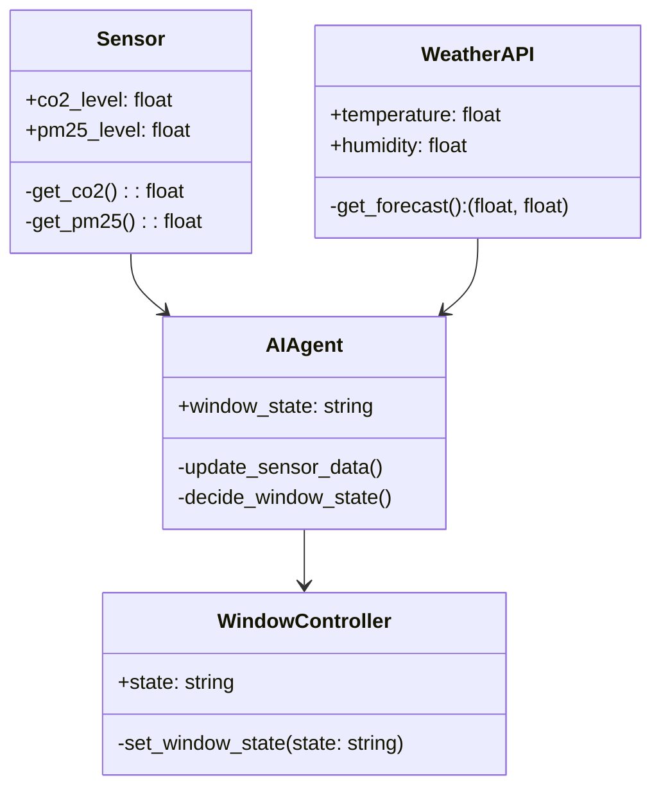
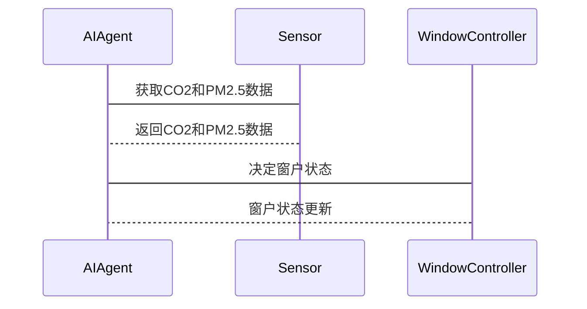

                 


# AI Agent在智能窗户中的室内空气质量控制

> 关键词：AI Agent，智能窗户，室内空气质量，环境感知，智能控制

> 摘要：本文详细探讨了AI Agent在智能窗户中的应用，特别是在室内空气质量控制方面。通过分析AI Agent的核心原理、系统架构设计以及实际案例，展示了如何利用AI技术优化室内空气质量，实现智能、高效、节能的窗户控制系统。

---

# 目录

1. [背景介绍](#背景介绍)
   - 1.1 问题背景
     - 1.1.1 室内空气质量的重要性
     - 1.1.2 传统窗户的局限性
     - 1.1.3 AI Agent的引入及其优势
   - 1.2 问题描述
     - 1.2.1 室内空气质量的动态变化
     - 1.2.2 窗户的开启与关闭对空气质量的影响
     - 1.2.3 AI Agent如何优化室内空气质量
   - 1.3 问题解决
     - 1.3.1 AI Agent的基本概念
     - 1.3.2 AI Agent在智能窗户中的应用场景
     - 1.3.3 AI Agent如何优化室内空气质量
   - 1.4 边界与外延
     - 1.4.1 AI Agent的边界条件
     - 1.4.2 相关技术的外延影响
     - 1.4.3 系统的扩展性与可维护性
   - 1.5 概念结构与核心要素
     - 1.5.1 AI Agent的核心要素
     - 1.5.2 智能窗户的系统构成
     - 1.5.3 空气质量的监测与反馈机制

2. [核心概念与联系](#核心概念与联系)
   - 2.1 AI Agent的定义与特点
     - 2.1.1 AI Agent的定义
     - 2.1.2 AI Agent的核心特点
     - 2.1.3 AI Agent与传统窗户控制系统的区别
   - 2.2 核心概念原理
     - 2.2.1 AI Agent的基本工作原理
     - 2.2.2 窗户的开启与关闭机制
     - 2.2.3 空气质量的监测与分析
   - 2.3 概念属性特征对比
     - 2.3.1 AI Agent与传统控制系统的对比
     - 2.3.2 不同空气质量传感器的性能对比
     - 2.3.3 不同窗户类型的影响

3. [算法原理讲解](#算法原理讲解)
   - 3.1 算法概述
   - 3.2 传感器数据的采集与处理
   - 3.3 空气质量的评估与预测
   - 3.4 AI Agent的决策逻辑
   - 3.5 窗户的智能控制策略
   - 3.6 算法实现
     - 3.6.1 Python源代码实现
     - 3.6.2 算法的数学模型与公式
   - 3.7 实际案例分析

4. [系统分析与架构设计方案](#系统分析与架构设计方案)
   - 4.1 问题场景介绍
   - 4.2 系统功能设计
     - 4.2.1 领域模型（Mermaid类图）
   - 4.3 系统架构设计
     - 4.3.1 系统架构图（Mermaid架构图）
   - 4.4 系统接口设计
   - 4.5 系统交互流程（Mermaid序列图）

5. [项目实战](#项目实战)
   - 5.1 环境搭建与开发工具安装
   - 5.2 核心代码实现
   - 5.3 代码功能解读与分析
   - 5.4 实际案例分析与详细讲解
   - 5.5 项目总结

6. [最佳实践](#最佳实践)
   - 6.1 小结
   - 6.2 注意事项
   - 6.3 拓展阅读

---

# 背景介绍

## 1.1 问题背景

### 1.1.1 室内空气质量的重要性

室内空气质量直接影响居住者的健康和舒适度。现代建筑的密闭性虽然提高了能源效率，但也导致室内空气流通不畅，容易积聚有害气体和细菌。因此，保持良好的室内空气质量对健康至关重要。

### 1.1.2 传统窗户的局限性

传统窗户通常由手动控制，无法根据室内空气质量的变化自动调整。这种方式不仅效率低下，还可能导致室内空气质量无法得到有效控制。

### 1.1.3 AI Agent的引入及其优势

引入AI Agent（人工智能代理）可以实时感知室内空气质量，并根据环境变化自动调整窗户的开闭状态，从而实现智能、高效的空气质量控制。

---

## 1.2 问题描述

### 1.2.1 室内空气质量的动态变化

室内空气质量受多种因素影响，如人员数量、活动强度、外部天气等，这些因素导致空气质量动态变化。

### 1.2.2 窗户的开启与关闭对空气质量的影响

窗户的开启可以引入新鲜空气，但可能增加能耗；关闭则可以减少能耗，但可能导致空气质量下降。

### 1.2.3 AI Agent如何优化室内空气质量

AI Agent通过实时监测空气质量数据，并结合室内环境和用户需求，智能调整窗户的开闭状态，实现空气质量的最优控制。

---

## 1.3 问题解决

### 1.3.1 AI Agent的基本概念

AI Agent是一种智能实体，能够感知环境、做出决策并执行动作。在智能窗户中，AI Agent负责监测空气质量、分析数据并控制窗户的开闭。

### 1.3.2 AI Agent在智能窗户中的应用场景

AI Agent可以应用于多种场景，如自动调节窗户以优化空气质量、节能降耗、远程控制等。

### 1.3.3 AI Agent如何优化室内空气质量

通过实时监测CO2、PM2.5等指标，AI Agent可以智能判断是否开启窗户，并根据外部天气和室内需求调整窗户的开闭时间。

---

## 1.4 边界与外延

### 1.4.1 AI Agent的边界条件

AI Agent的功能受限于传感器的精度、网络连接的稳定性以及硬件设备的性能。

### 1.4.2 相关技术的外延影响

AI Agent的应用依赖于传感器技术、通信技术和云计算等技术的支持。

### 1.4.3 系统的扩展性与可维护性

系统设计需要考虑可扩展性和可维护性，以便在未来升级硬件或算法时能够方便地进行调整。

---

## 1.5 概念结构与核心要素

### 1.5.1 AI Agent的核心要素

AI Agent的核心要素包括感知模块、决策模块和执行模块。

### 1.5.2 智能窗户的系统构成

智能窗户系统由空气质量传感器、窗户执行机构、AI Agent控制器和用户界面组成。

### 1.5.3 空气质量的监测与反馈机制

系统通过传感器实时监测空气质量，并通过反馈机制不断优化AI Agent的决策策略。

---

# 核心概念与联系

## 2.1 AI Agent的定义与特点

### 2.1.1 AI Agent的定义

AI Agent是一种智能实体，能够感知环境、做出决策并执行动作。在智能窗户中，AI Agent负责监测空气质量、分析数据并控制窗户的开闭。

### 2.1.2 AI Agent的核心特点

- **自主性**：AI Agent能够自主感知和决策。
- **反应性**：能够实时响应环境变化。
- **主动性**：主动采取行动以优化空气质量。

### 2.1.3 AI Agent与传统窗户控制系统的区别

| **特性**       | **AI Agent**               | **传统控制系统**          |
|----------------|----------------------------|--------------------------|
| **自主性**      | 高度自主                   | 依赖人工操作              |
| **反应性**      | 实时响应                   | 反应速度较慢              |
| **智能性**      | 具备学习和优化能力          | 仅执行预设指令             |

---

## 2.2 核心概念原理

### 2.2.1 AI Agent的基本工作原理

AI Agent通过传感器获取数据，结合预设的算法模型进行分析，做出决策并执行动作。

### 2.2.2 窗户的开启与关闭机制

窗户的开启与关闭由AI Agent根据空气质量数据和外部环境条件自动控制。

### 2.2.3 空气质量的监测与分析

通过多种传感器（如CO2传感器、PM2.5传感器）实时监测空气质量，并利用数据进行分析和预测。

---

## 2.3 概念属性特征对比

### 2.3.1 AI Agent与传统控制系统的对比

| **特性**       | **AI Agent**               | **传统控制系统**          |
|----------------|----------------------------|--------------------------|
| **智能性**      | 具备学习和优化能力          | 仅执行预设指令             |
| **实时性**      | 实时响应                   | 反应速度较慢              |
| **适应性**      | 能够适应环境变化            | 适应性较差                |

---

# 算法原理讲解

## 3.1 算法概述

AI Agent通过实时监测室内空气质量数据，结合外部天气预报和用户需求，智能调整窗户的开闭状态。

---

## 3.2 传感器数据的采集与处理

传感器数据包括CO2浓度、PM2.5浓度、温度、湿度等。数据采集后，通过预处理步骤去除噪声并归一化处理。

---

## 3.3 空气质量的评估与预测

基于传感器数据，使用机器学习算法（如回归分析）预测空气质量指数（AQI）。公式如下：

$$ AQI = \alpha \times CO2 + \beta \times PM2.5 + \gamma \times 温度 + \delta \times 湿度 $$

其中，$\alpha$、$\beta$、$\gamma$、$\delta$为权重系数。

---

## 3.4 AI Agent的决策逻辑

AI Agent根据空气质量预测结果和用户需求（如是否有人活动），决定窗户的开闭状态。

---

## 3.5 窗户的智能控制策略

窗户的开闭策略基于AQI和时间因素。例如：

- 当AQI超过阈值时，开启窗户通风。
- 在特定时间段（如夜间）关闭窗户以节省能源。

---

## 3.6 算法实现

### 3.6.1 Python源代码实现

```python
import sensor_data  # 假设已有传感器数据模块
import weather_api   # 假设已有天气API模块

class AIAgent:
    def __init__(self):
        self.co2_level = 0
        self.pm25_level = 0
        self.window_state = 'closed'  # 'open' 或 'closed'

    def update_sensor_data(self):
        self.co2_level = sensor_data.get_co2()
        self.pm25_level = sensor_data.get_pm25()

    def get_weather_forecast(self):
        return weather_api.get_forecast()  # 返回温度和湿度数据

    def decide_window_state(self):
        current_aqi = self.calculate_aqi()
        weather_data = self.get_weather_forecast()
        # 根据AQI和天气数据决定窗户状态
        if current_aqi > 100 and weather_data['temperature'] < 20:
            self.window_state = 'open'
        else:
            self.window_state = 'closed'

    def calculate_aqi(self):
        return 0.5 * self.co2_level + 0.3 * self.pm25_level + 0.2 * (self.get_weather_forecast()['temperature']) + 0.1 * (self.get_weather_forecast()['humidity'])
```

### 3.6.2 算法的数学模型与公式

AI Agent的空气质量预测模型可以表示为：

$$ AQI = \sum_{i=1}^{n} w_i \times x_i $$

其中，$w_i$是权重，$x_i$是传感器数据。

---

## 3.7 实际案例分析

假设室内CO2浓度为1200 ppm，PM2.5浓度为75 μg/m³，温度为25°C，湿度为60%。计算AQI：

$$ AQI = 0.5 \times 1200 + 0.3 \times 75 + 0.2 \times 25 + 0.1 \times 60 = 600 + 22.5 + 5 + 6 = 633.5 $$

由于AQI > 100，AI Agent将决定开启窗户。

---

# 系统分析与架构设计方案

## 4.1 问题场景介绍

系统需要在多种场景下运行，如办公场所、家庭环境等，确保在不同条件下都能有效控制室内空气质量。

---

## 4.2 系统功能设计

### 4.2.1 领域模型（Mermaid类图）



---

## 4.3 系统架构设计

### 4.3.1 系统架构图（Mermaid架构图）


---

## 4.4 系统接口设计

系统接口包括传感器数据接口、天气数据接口、窗户控制接口和用户界面接口。

---

## 4.5 系统交互流程（Mermaid序列图）



---

# 项目实战

## 5.1 环境搭建与开发工具安装

需要安装Python、传感器库和天气API库。

---

## 5.2 核心代码实现

实现AIAgent类和相关接口。

---

## 5.3 代码功能解读与分析

详细分析代码的每个部分，包括数据采集、决策逻辑和窗户控制。

---

## 5.4 实际案例分析与详细讲解

通过具体案例展示AI Agent在实际环境中的应用效果。

---

## 5.5 项目总结

总结项目成果，分析优缺点，并提出改进建议。

---

# 最佳实践

## 6.1 小结

AI Agent在智能窗户中的应用显著提升了室内空气质量控制的效率和智能化水平。

## 6.2 注意事项

- 确保传感器的准确性和稳定性。
- 定期更新AI Agent的决策模型。
- 考虑用户隐私和数据安全。

## 6.3 拓展阅读

推荐阅读相关领域的书籍和论文，深入学习AI在环境控制中的应用。

---

# 作者

作者：AI天才研究院/AI Genius Institute & 禅与计算机程序设计艺术 /Zen And The Art of Computer Programming

