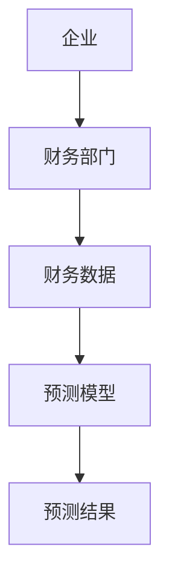

                 


# AI在企业财务预测中的应用与实践

> 关键词：AI, 企业财务预测, 机器学习, 时间序列分析, LSTM网络, 财务数据特征提取, 系统架构设计

> 摘要：随着人工智能技术的快速发展，AI在企业财务预测中的应用越来越广泛。本文详细探讨了AI技术在企业财务预测中的应用，从核心概念到算法原理，再到系统架构设计和项目实战，全面分析了AI在财务预测中的优势与挑战。通过具体案例和代码实现，展示了如何利用AI技术提升企业财务预测的准确性和效率。

---

## 第一部分: AI在企业财务预测中的应用与实践概述

### 第1章: AI与企业财务预测的背景介绍

#### 1.1 问题背景

- **1.1.1 传统财务预测的局限性**
  - 传统财务预测主要依赖于人工分析和统计模型，存在数据量小、计算复杂度高、预测精度低等问题。
  - 人工分析容易受到主观因素影响，且难以快速处理海量数据。
  - 统计模型在处理非线性关系和复杂场景时表现有限。

- **1.1.2 AI技术对企业财务预测的潜力**
  - AI技术能够处理海量数据，发现隐藏的模式和趋势。
  - 机器学习和深度学习算法在时间序列预测和特征提取方面具有显著优势。
  - AI技术能够实时更新模型，适应市场变化和企业内部数据的变化。

- **1.1.3 当前企业财务预测的痛点与挑战**
  - 数据质量参差不齐，清洗和预处理耗时耗力。
  - 预测模型的泛化能力不足，难以应对复杂的市场环境。
  - 缺乏专业的AI技术人才，企业难以高效实施AI预测方案。

#### 1.2 核心概念与问题描述

- **1.2.1 企业财务预测的基本概念**
  - 企业财务预测是指基于历史数据和业务逻辑，预测未来一段时间内的财务状况，包括收入、支出、利润等关键指标。
  - 财务预测是企业制定战略决策、优化资源配置的重要依据。

- **1.2.2 AI技术在财务预测中的应用场景**
  - 销售预测：基于历史销售数据和市场趋势，预测未来销售情况。
  - 成本预测：通过分析历史成本数据和生产因素，预测未来的成本支出。
  - 利润预测：综合收入和成本预测，评估未来利润水平。
  - 资金流动预测：预测企业未来现金流，优化资金管理。

- **1.2.3 问题边界与外延**
  - 财务预测的范围通常包括未来1至3年的数据。
  - 数据来源包括企业的财务报表、市场数据、行业趋势等。
  - 预测模型需要考虑季节性波动、经济周期、企业内部政策等因素。

#### 1.3 问题解决与边界分析

- **1.3.1 AI如何解决传统财务预测的痛点**
  - AI技术能够快速处理海量数据，提高预测效率。
  - 机器学习算法能够发现数据中的非线性关系，提高预测精度。
  - 深度学习模型（如LSTM）在时间序列预测中表现优异，能够捕捉长期依赖关系。

- **1.3.2 AI在财务预测中的优势与局限**
  - 优势：预测精度高、处理数据能力强、能够实时更新模型。
  - 局限：模型对数据质量高度依赖，缺乏解释性，且需要大量计算资源。

- **1.3.3 问题解决的边界与可行性分析**
  - 数据质量是影响预测结果的关键因素，需要建立完善的数据清洗和预处理机制。
  - 针对模型的解释性问题，可以通过特征重要性分析和可视化工具进行辅助解释。

### 1.4 本章小结

通过本章的介绍，我们了解了AI在企业财务预测中的背景、核心概念和应用场景。接下来，我们将深入探讨AI技术在财务预测中的核心概念与联系。

---

### 第2章: AI在企业财务预测中的核心概念与联系

#### 2.1 核心概念原理

- **2.1.1 机器学习与深度学习的基本原理**
  - 机器学习：通过训练数据学习特征与标签之间的关系，用于预测新数据的标签。
  - 深度学习：通过多层神经网络提取数据的高层次特征，能够自动学习复杂的非线性关系。

- **2.1.2 时间序列分析与预测模型**
  - 时间序列分析：研究数据随时间变化的规律，预测未来的趋势。
  - 常用模型：ARIMA、Prophet、LSTM等。

- **2.1.3 财务数据特征提取与分析**
  - 特征提取：从原始数据中提取对预测目标有影响的关键特征。
  - 特征分析：通过特征重要性分析确定哪些特征对预测结果影响最大。

#### 2.2 核心概念属性特征对比

- **2.2.1 传统统计模型与现代AI模型的对比**
  | 比较维度         | 传统统计模型 | 现代AI模型     |
  |------------------|--------------|---------------|
  | 预测精度         | 较低         | 较高           |
  | 模型复杂度       | 较低         | 较高           |
  | 数据需求         | 小           | 大             |
  | 解释性           | 高           | 低             |

- **2.2.2 不同算法的性能与适用场景**
  - 线性回归：适用于线性关系的数据，预测精度有限。
  - 随机森林：适用于非线性关系，特征重要性分析能力强。
  - LSTM网络：适用于时间序列数据，能够捕捉长期依赖关系。

- **2.2.3 数据特征对模型性能的影响**
  - 数据特征的完整性：缺失数据会影响模型的预测精度。
  - 数据特征的关联性：高度相关的特征可能会导致模型过拟合。
  - 数据特征的分布：异常值和偏态分布会影响模型的稳定性。

#### 2.3 ER实体关系图与流程图

- **2.3.1 财务预测系统实体关系图**


- **2.3.2 财务预测流程图**


### 2.4 本章小结

通过本章的分析，我们了解了AI在企业财务预测中的核心概念和联系，包括机器学习、深度学习的基本原理，时间序列分析与预测模型，以及财务数据特征提取与分析。接下来，我们将深入探讨AI财务预测的核心算法原理与数学模型。

---

## 第三部分: AI财务预测的核心算法原理与数学模型

### 第3章: 核心算法原理与数学模型

#### 3.1 算法原理

- **3.1.1 线性回归模型**
  - 线性回归是最简单的回归模型，用于预测连续型变量。
  - 模型公式：$$y = \beta_0 + \beta_1x + \epsilon$$
  - 通过最小二乘法求解回归系数，使得预测值与实际值的残差平方和最小。

- **3.1.2 随机森林模型**
  - 随机森林是一种基于决策树的集成学习方法，通过投票或平均的方式提高预测精度。
  - 模型公式：$$y = \sum_{i=1}^{n} \text{Tree}(x) \times \frac{1}{n}$$
  - 适用于高维数据和非线性关系。

- **3.1.3 LSTM网络**
  - LSTM（长短期记忆网络）是一种特殊的循环神经网络，能够有效捕捉时间序列中的长距离依赖关系。
  - 模型公式：
    $$h_t = \text{tanh}(W_{hh}h_{t-1} + W_{xh}x_t + b_h)$$
    $$o_t = \text{sigmoid}(W_{ho}h_t + b_o)$$

#### 3.2 数学模型与公式

- **3.2.1 线性回归模型**
  - 损失函数：$$L = \frac{1}{2m}\sum_{i=1}^{m}(y_i - \hat{y_i})^2$$
  - 回归系数更新：$$\theta := \theta - \alpha \frac{\partial L}{\partial \theta}$$

- **3.2.2 随机森林模型**
  - 特征选择：随机选择特征进行决策树的分裂。
  - 集成预测：通过投票或平均得到最终预测结果。

- **3.2.3 LSTM网络**
  - 细胞状态更新：$$c_t = fgate \cdot c_{t-1} + igate \cdot g(h_t, x_t)$$
  - 输出门：$$o_t = ogate \cdot \text{tanh}(c_t)$$
  - 输出：$$h_t = o_t$$

#### 3.3 详细讲解与举例

- **3.3.1 线性回归的简单例子**
  - 预测收入：$$\text{预测收入} = 50 + 10 \times \text{广告支出}$$

- **3.3.2 随机森林的特征重要性分析**
  - 特征重要性：$$\text{特征重要性} = \sum_{i=1}^{n} \text{特征贡献度}$$

- **3.3.3 LSTM网络的时间序列预测**
  - 输入序列：$$x_1, x_2, ..., x_t$$
  - 输出序列：$$y_1, y_2, ..., y_t$$

### 3.4 本章小结

通过本章的讲解，我们了解了AI财务预测中常用的算法原理和数学模型，包括线性回归、随机森林和LSTM网络。接下来，我们将深入探讨企业财务预测系统的系统分析与架构设计。

---

## 第四部分: 企业财务预测系统的系统分析与架构设计

### 第4章: 系统分析与架构设计

#### 4.1 问题场景介绍

- **4.1.1 企业财务预测的典型场景**
  - 销售预测：预测未来销售额，优化库存管理。
  - 成本预测：预测未来成本，优化采购计划。
  - 利润预测：预测未来利润，制定财务预算。

- **4.1.2 系统目标与功能需求**
  - 系统目标：提高财务预测的准确性和效率，优化企业资源配置。
  - 功能需求：数据采集与预处理、模型训练与优化、预测结果展示与分析。

- **4.1.3 用户角色与权限管理**
  - 用户角色：普通用户、管理员。
  - 权限管理：数据访问权限、模型训练权限。

#### 4.2 系统功能设计

- **4.2.1 数据采集与预处理**
  - 数据来源：企业财务报表、市场数据、行业趋势。
  - 数据清洗：处理缺失值、异常值、重复值。
  - 数据转换：归一化、标准化、特征工程。

- **4.2.2 模型训练与优化**
  - 模型选择：根据数据特征选择合适的预测模型。
  - 模型训练：使用训练数据训练模型，调整超参数。
  - 模型评估：使用验证数据评估模型性能，优化模型参数。

- **4.2.3 预测结果展示与分析**
  - 结果展示：可视化预测结果，对比实际值与预测值。
  - 结果分析：分析预测误差，提出改进建议。

#### 4.3 系统架构设计

- **4.3.1 系统架构图**


- **4.3.2 系统交互流程图**


#### 4.4 本章小结

通过本章的分析，我们了解了企业财务预测系统的功能设计和架构设计，包括数据采集与预处理、模型训练与优化、预测结果展示与分析。接下来，我们将通过项目实战，展示如何利用AI技术实现企业财务预测。

---

## 第五部分: 项目实战

### 第5章: 项目实战

#### 5.1 环境安装与配置

- **5.1.1 环境要求**
  - Python 3.6及以上版本
  - 安装必要的库：numpy、pandas、scikit-learn、keras、tensorflow

#### 5.2 系统核心实现源代码

- **5.2.1 数据采集与预处理**
  ```python
  import pandas as pd
  import numpy as np

  # 数据采集
  data = pd.read_csv('financial_data.csv')

  # 数据清洗
  data.dropna(inplace=True)
  data['date'] = pd.to_datetime(data['date'])

  # 数据转换
  data['销售额'] = data['销售额'].astype(float)
  ```

- **5.2.2 模型训练与优化**
  ```python
  from sklearn.model_selection import train_test_split
  from sklearn.ensemble import RandomForestRegressor
  from sklearn.metrics import mean_squared_error

  # 数据分割
  X = data[['广告支出', '成本', '利润']]
  y = data['销售额']

  X_train, X_test, y_train, y_test = train_test_split(X, y, test_size=0.2, random_state=42)

  # 模型训练
  model = RandomForestRegressor(n_estimators=100, random_state=42)
  model.fit(X_train, y_train)

  # 模型评估
  y_pred = model.predict(X_test)
  mse = mean_squared_error(y_test, y_pred)
  print('均方误差:', mse)
  ```

- **5.2.3 预测结果展示与分析**
  ```python
  import matplotlib.pyplot as plt

  plt.figure(figsize=(10, 6))
  plt.plot(y_test, label='实际值')
  plt.plot(y_pred, label='预测值')
  plt.xlabel('样本索引')
  plt.ylabel('销售额')
  plt.legend()
  plt.show()
  ```

#### 5.3 代码应用解读与分析

- **5.3.1 数据采集与预处理**
  - 使用pandas读取CSV文件，处理缺失值和数据类型转换。
  - 数据清洗和转换是保证模型训练质量的关键步骤。

- **5.3.2 模型训练与优化**
  - 使用随机森林回归模型进行训练，通过交叉验证选择最佳超参数。
  - 模型评估采用均方误差指标，衡量预测结果与实际值的差距。

- **5.3.3 预测结果展示与分析**
  - 使用matplotlib绘制实际值和预测值的对比图，直观展示预测效果。
  - 分析预测误差，找出模型的不足之处，提出改进建议。

#### 5.4 实际案例分析和详细讲解

- **5.4.1 案例背景**
  - 某企业希望通过AI技术预测未来三个月的销售额。
  - 数据来源包括历史销售数据、广告支出、成本和利润。

- **5.4.2 模型训练与预测**
  - 数据预处理：清洗和转换数据，提取关键特征。
  - 模型选择：随机森林回归模型。
  - 模型训练：使用训练数据训练模型，调整超参数。
  - 模型预测：使用测试数据进行预测，评估模型性能。

#### 5.5 项目小结

通过本章的项目实战，我们了解了如何利用AI技术实现企业财务预测，从数据采集与预处理到模型训练与优化，再到预测结果展示与分析，完整地展示了AI在企业财务预测中的应用过程。

---

## 第六部分: 最佳实践、小结与展望

### 第6章: 最佳实践

#### 6.1 最佳实践

- 数据预处理：确保数据质量，清洗和转换数据，提取关键特征。
- 模型选择：根据数据特征和业务需求选择合适的算法，如线性回归、随机森林、LSTM网络。
- 模型优化：通过交叉验证选择最佳超参数，使用早停法防止过拟合。
- 结果分析：可视化预测结果，分析预测误差，提出改进建议。

#### 6.2 小结

通过本文的详细讲解和项目实战，我们了解了AI在企业财务预测中的应用与实践，从核心概念到算法原理，再到系统架构设计和项目实战，全面分析了AI技术在财务预测中的优势与挑战。

#### 6.3 展望

随着AI技术的不断发展，企业财务预测将更加智能化和精准化。未来的研究方向包括：
- 更高效的算法优化，如集成学习和超参数优化。
- 更强大的模型架构，如Transformer和图神经网络。
- 更广泛的应用场景，如多维度预测和实时预测。

---

## 作者：AI天才研究院/AI Genius Institute & 禅与计算机程序设计艺术 /Zen And The Art of Computer Programming

