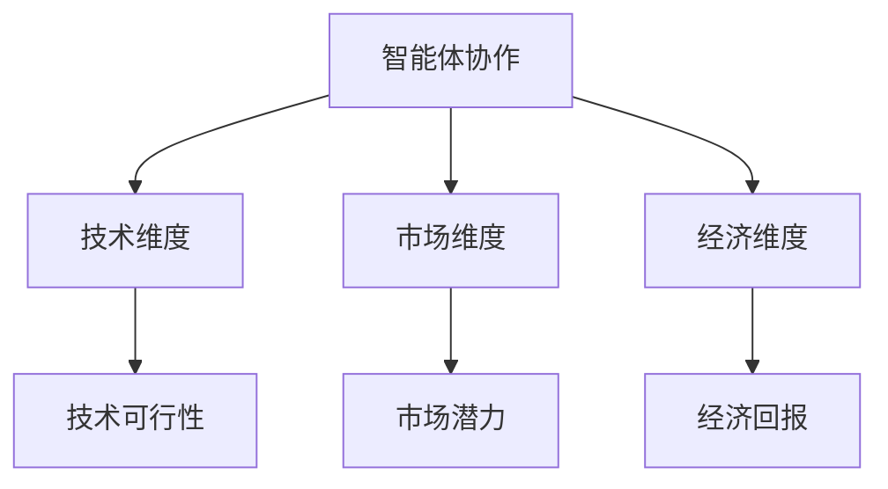
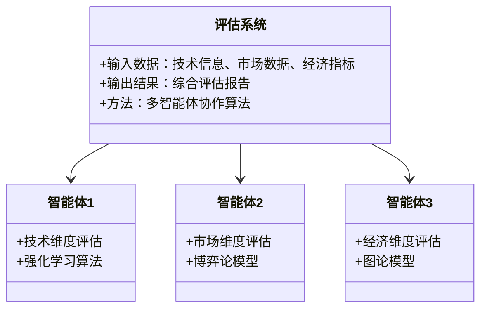

                 


# AI多智能体如何提升对新兴技术商业化潜力的评估

> **关键词**：AI多智能体、新兴技术、商业化潜力、强化学习、博弈论、图论

> **摘要**：本文探讨了AI多智能体技术在评估新兴技术商业化潜力中的应用。通过分析多智能体系统的原理、算法模型和实际案例，本文展示了如何利用AI多智能体技术克服传统评估方法的局限性，提升评估的准确性和效率。

---

## 第一章: 问题背景与核心概念

### 1.1 问题背景介绍

新兴技术的商业化潜力评估是一个复杂而关键的任务，直接影响企业的投资决策和市场战略布局。然而，传统的评估方法通常依赖于单一专家的经验判断或简单的数据统计分析，存在以下主要问题：

- **数据不足**：新兴技术往往处于早期阶段，数据有限，难以支持全面评估。
- **维度单一**：传统方法通常只考虑市场、技术或经济某一方面，缺乏多维度的综合分析。
- **动态变化**：新兴技术的发展和市场环境不断变化，静态评估难以适应动态调整的需求。

AI多智能体技术通过多个智能体的协作，能够从多个维度、多层次地分析技术潜力，克服传统方法的局限性。

### 1.2 问题描述与目标

本文的核心问题是：如何利用AI多智能体技术，构建一个动态、多维度的评估体系，准确评估新兴技术的商业化潜力。

我们的目标是：
1. 构建一个基于AI多智能体的评估系统，整合技术、市场、经济、政策等多个维度的信息。
2. 提供实时动态的评估结果，支持企业的决策制定。
3. 提升评估的准确性和效率，降低评估成本。

### 1.3 问题解决思路

AI多智能体技术的核心优势在于其协作性和分布式计算能力。通过多个智能体的协作，可以实现以下目标：
1. **分布式信息处理**：每个智能体专注于特定维度的信息处理，提高评估效率。
2. **多维度分析**：智能体之间的协作能够覆盖多个评估维度，提供更全面的分析结果。
3. **动态调整**：智能体能够根据实时数据动态调整评估策略，适应变化的市场环境。

### 1.4 边界与外延

本文的研究范围主要集中在AI多智能体技术在新兴技术商业化潜力评估中的应用，具体包括：
- **评估范围**：主要针对新兴技术的市场潜力、技术可行性和经济回报。
- **智能体协作**：基于强化学习和博弈论的多智能体协作机制。
- **边界条件**：限定在技术、市场和经济维度，不涉及法律和伦理评估。

### 1.5 核心要素与概念结构

核心要素包括：
- **智能体**：具备独立决策能力的个体。
- **协作机制**：智能体之间的信息交互和协同决策方式。
- **评估维度**：技术、市场、经济等多个评估维度。

概念结构图如下：



---

## 第二章: AI多智能体的核心概念与联系

### 2.1 多智能体系统原理

多智能体系统（Multi-Agent System, MAS）由多个智能体组成，每个智能体具备以下特点：
1. **自主性**：能够独立决策。
2. **反应性**：能够根据环境变化调整行为。
3. **协作性**：能够与其他智能体协作完成任务。

多智能体系统的分类如下：
1. **基于任务的协作**：智能体协作完成特定任务。
2. **基于信息的协作**：智能体通过信息共享提高整体决策能力。
3. **基于市场的协作**：智能体通过市场机制进行资源分配。

### 2.2 AI在多智能体中的应用

AI技术在多智能体中的应用主要体现在以下几个方面：
1. **智能体行为决策**：利用强化学习算法，优化智能体的决策策略。
2. **协作机制设计**：通过博弈论模型，设计智能体之间的协作规则。
3. **信息处理与分析**：利用自然语言处理和机器学习技术，提高信息分析能力。

### 2.3 多智能体与新兴技术评估的关系

多智能体技术在新兴技术评估中的作用：
1. **多维度分析**：通过多个智能体分别评估技术、市场、经济等维度，提供全面的分析结果。
2. **动态调整**：智能体能够实时更新评估结果，适应市场变化。
3. **协作优化**：通过智能体协作，优化评估过程和结果。

---

## 第三章: AI多智能体评估算法的数学模型与实现

### 3.1 多智能体协作算法

#### 3.1.1 基于强化学习的多智能体协作

强化学习（Reinforcement Learning, RL）是一种常用的人工智能算法，通过智能体与环境的交互，学习最优策略。在多智能体协作中，每个智能体通过强化学习优化自身的决策策略。

数学模型：
$$
Q(s, a) = r + \gamma \max_{a'} Q(s', a')
$$
其中：
- \( Q(s, a) \)：状态 \( s \) 下动作 \( a \) 的价值函数。
- \( r \)：奖励值。
- \( \gamma \)：折扣因子。

#### 3.1.2 基于博弈论的智能体决策

博弈论（Game Theory）通过分析智能体之间的策略互动，预测最优决策。在多智能体协作中，博弈论模型常用于设计智能体之间的协作规则。

纳什均衡定义：
$$
\text{纳什均衡} \: \text{定义} $$
在纳什均衡中，每个智能体的策略都是在给定其他智能体策略的情况下最优的。

#### 3.1.3 基于图论的智能体间关系建模

图论模型通过构建图结构，描述智能体之间的关系和信息交互。例如，可以使用图的邻接矩阵表示智能体之间的协作关系。

数学模型：
$$
A \times X = B $$
其中：
- \( A \)：邻接矩阵。
- \( X \)：特征向量。
- \( B \)：结果向量。

### 3.2 算法实现与代码示例

#### 3.2.1 强化学习算法实现

以下是一个基于强化学习的多智能体协作算法的Python代码示例：

```python
import numpy as np

class Agent:
    def __init__(self, state_space, action_space):
        self.state_space = state_space
        self.action_space = action_space
        self.Q = np.zeros((state_space, action_space))

    def act(self, state):
        # 选择最优动作
        return np.argmax(self.Q[state, :])

    def update(self, state, action, reward, next_state):
        # Q-learning更新规则
        self.Q[state, action] += reward + 0.9 * np.max(self.Q[next_state, :])

def main():
    # 初始化环境
    state_space = 5
    action_space = 3
    agent = Agent(state_space, action_space)
    
    # 训练过程
    for episode in range(1000):
        state = 0
        while True:
            action = agent.act(state)
            next_state = ...  # 根据动作和环境变化计算
            reward = ...  # 计算奖励值
            agent.update(state, action, reward, next_state)
            state = next_state
            if state == 4:
                break
    # 测试过程
    state = 0
    while True:
        action = agent.act(state)
        print(f"State {state}, Action {action}")
        state = ...  # 根据动作和环境变化计算
        if state == 4:
            break

if __name__ == "__main__":
    main()
```

### 3.3 算法原理的通俗易懂举例

假设我们有一个新兴技术评估任务，需要评估的技术包括人工智能、区块链和物联网。每个智能体负责评估一个技术维度，例如：

- **智能体1**：评估技术可行性。
- **智能体2**：评估市场潜力。
- **智能体3**：评估经济回报。

通过强化学习，每个智能体不断优化自身的评估策略，最终通过协作得到一个综合评估结果。

---

## 第四章: 系统分析与架构设计方案

### 4.1 系统功能设计

#### 4.1.1 领域模型（Mermaid类图）



#### 4.1.2 系统架构设计（Mermaid架构图）

```mermaid
archi
    网络层 --> 服务层
    服务层 --> 表现层
    表现层 --> 用户层
    网络层 --> 数据库
    服务层 --> 中间件
    中间件 --> 智能体1
    中间件 --> 智能体2
    中间件 --> 智能体3
```

#### 4.1.3 系统交互设计（Mermaid序列图）

```mermaid
sequenceDiagram
    用户 --> 评估系统：提交评估任务
    评估系统 --> 中间件：分解任务
    中间件 --> 智能体1：评估技术维度
    中间件 --> 智能体2：评估市场维度
    中间件 --> 智能体3：评估经济维度
    智能体1 --> 中间件：返回技术评估结果
    智能体2 --> 中间件：返回市场评估结果
    智能体3 --> 中间件：返回经济评估结果
    中间件 --> 评估系统：整合结果
    评估系统 --> 用户：输出综合报告
```

---

## 第五章: 项目实战

### 5.1 环境安装

以下是所需的Python库：
- `numpy`：用于数值计算。
- `matplotlib`：用于数据可视化。
- `networkx`：用于图论分析。

安装命令：
```bash
pip install numpy matplotlib networkx
```

### 5.2 核心代码实现

#### 5.2.1 强化学习智能体实现

```python
import numpy as np

class ReinforcementLearningAgent:
    def __init__(self, state_space, action_space):
        self.state_space = state_space
        self.action_space = action_space
        self.Q = np.zeros((state_space, action_space))

    def act(self, state):
        return np.argmax(self.Q[state, :])

    def update(self, state, action, reward, next_state):
        self.Q[state, action] += reward + 0.9 * np.max(self.Q[next_state, :])

# 初始化智能体
state_space = 5
action_space = 3
agent = ReinforcementLearningAgent(state_space, action_space)

# 训练过程
for episode in range(1000):
    state = 0
    while True:
        action = agent.act(state)
        next_state = ...  # 根据动作和环境变化计算
        reward = ...  # 计算奖励值
        agent.update(state, action, reward, next_state)
        state = next_state
        if state == 4:
            break
```

#### 5.2.2 博弈论模型实现

```python
import numpy as np

def nash_equilibrium(payoffs):
    # 寻找纳什均衡
    n = payoffs.shape[0]
    strategies = [i for i in range(n)]
    for profile in itertools.product(strategies):
        is_nash = True
        for i in range(n):
            payoff = payoffs[i][profile[i]]
            for j in range(n):
                if i == j:
                    continue
                if payoffs[i][profile[j]] > payoff:
                    is_nash = False
                    break
            if not is_nash:
                break
        if is_nash:
            return profile
    return None

# 示例支付矩阵
payoffs = np.array([
    [1, 2, 3],
    [2, 1, 0],
    [3, 0, 1]
])

# 寻找纳什均衡
import itertools
print(nash_equilibrium(payoffs))
```

---

## 第六章: 最佳实践与总结

### 6.1 最佳实践 tips

1. **数据质量**：确保输入数据的准确性和完整性，提高评估结果的可靠性。
2. **智能体设计**：合理设计智能体的分工和协作机制，提升评估效率。
3. **动态调整**：定期更新智能体模型，适应市场环境的变化。

### 6.2 小结

本文详细探讨了AI多智能体技术在新兴技术商业化潜力评估中的应用，通过理论分析、算法实现和项目实战，展示了如何利用多智能体协作优化评估过程，提升评估结果的准确性和效率。

### 6.3 注意事项

- **计算资源**：多智能体协作需要较高的计算资源，需要优化算法以降低计算复杂度。
- **模型更新**：定期更新智能体模型，确保评估结果的时效性。
- **结果解释**：评估结果需要结合实际业务场景进行解释和调整。

### 6.4 拓展阅读

- **强化学习**：深入学习强化学习的算法及其应用。
- **博弈论**：研究博弈论在多智能体协作中的应用。
- **图论**：探索图论在智能体关系建模中的潜力。

---

## 作者

**作者：AI天才研究院/AI Genius Institute & 禅与计算机程序设计艺术 /Zen And The Art of Computer Programming**

---

这篇文章详细探讨了AI多智能体技术在新兴技术商业化潜力评估中的应用，通过理论分析、算法实现和项目实战，展示了如何利用多智能体协作优化评估过程，提升评估结果的准确性和效率。希望对读者在实际应用中有所帮助。

