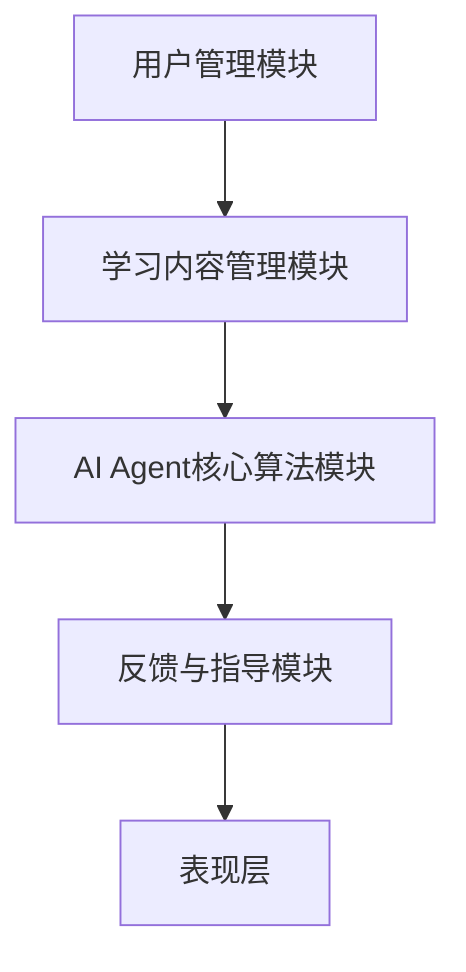
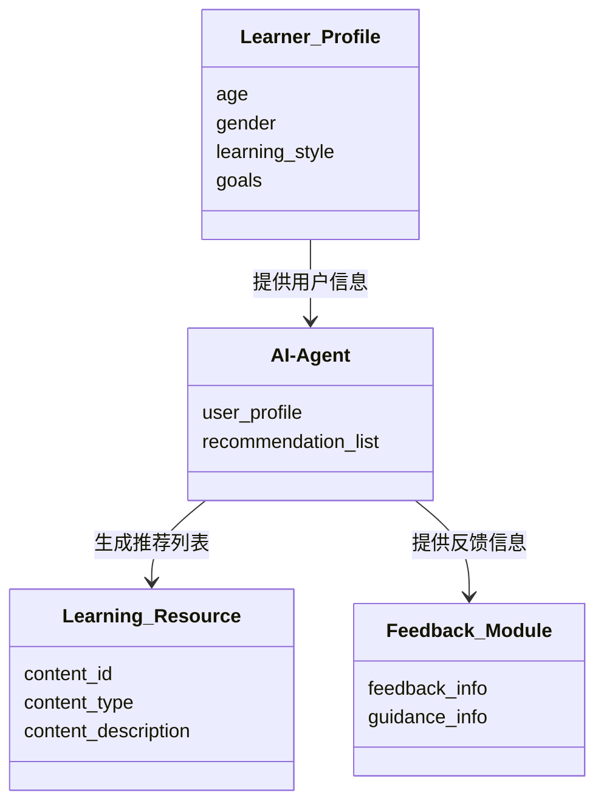
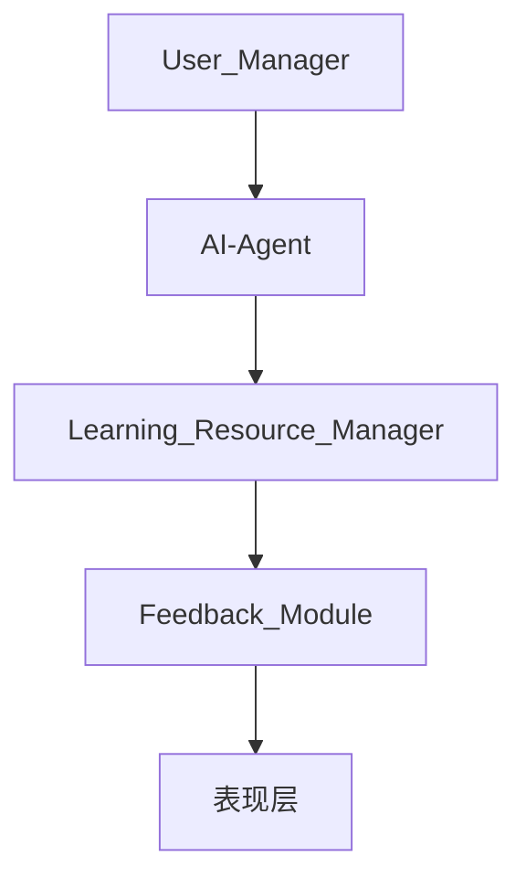
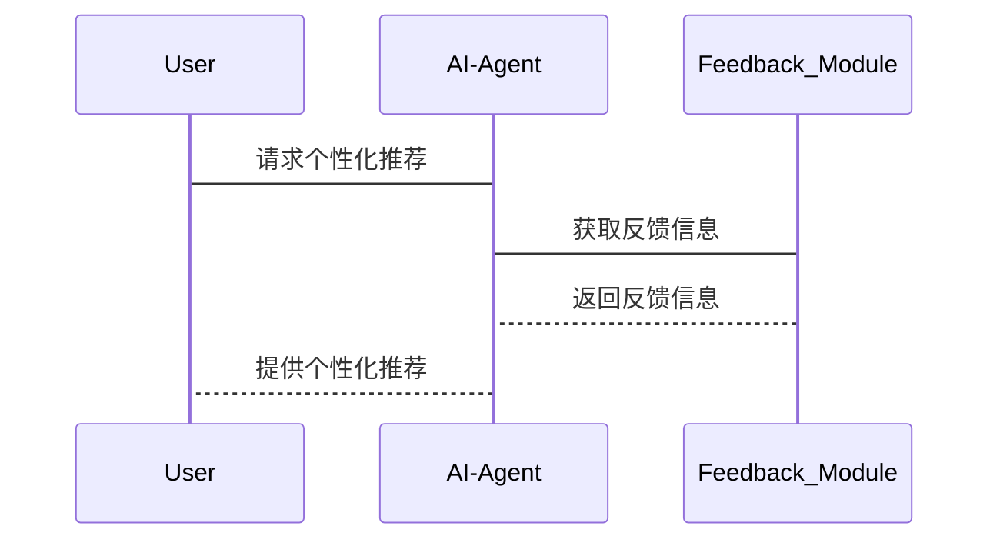

                 


# 开发AI Agent的个性化学习助手系统

## 关键词：AI Agent, 个性化学习, 系统架构, 强化学习, 自适应学习

## 摘要：本文详细探讨了开发AI Agent的个性化学习助手系统的各个方面，从系统架构设计到核心算法实现，再到实际项目实战。通过深入分析学习者的需求和行为，结合AI技术，构建了一个高效的个性化学习助手系统，为教育领域的智能化发展提供了新的思路和解决方案。

---

# 第一部分：AI Agent与个性化学习助手系统概述

## 第1章：AI Agent的基本概念

### 1.1 AI Agent的定义与核心概念

AI Agent（人工智能代理）是指能够感知环境、自主决策并执行任务的智能实体。在教育领域，AI Agent可以作为个性化学习助手，为学习者提供智能化的学习支持。其核心概念包括：

- **自主性**：能够在没有外部干预的情况下独立运行。
- **反应性**：能够实时感知环境并做出响应。
- **目标导向性**：通过设定目标来优化学习路径。
- **学习能力**：能够通过数据不断优化自身的算法模型。

### 1.2 个性化学习助手系统的定义

个性化学习助手系统是一种基于AI技术的教育工具，能够根据学习者的需求和特点，提供定制化的学习建议、资源推荐和实时反馈。其目标是通过智能化的方式，提升学习者的学习效率和体验。

### 1.3 AI Agent在教育领域的应用背景

随着人工智能技术的快速发展，教育领域的智能化转型成为趋势。传统的学习工具通常基于固定的课程内容和教学模式，难以满足学习者的个性化需求。AI Agent的引入，通过数据驱动的方式，能够实时分析学习者的行为和需求，为其提供个性化的学习支持，从而实现更高效的学习效果。

---

## 第2章：个性化学习助手系统的需求分析

### 2.1 学习者画像与需求分析

#### 2.1.1 学习者画像的构建

学习者画像（Learner Profile）是个性化学习助手系统的核心输入之一。通过收集和分析学习者的学习历史、兴趣爱好、学习目标等信息，可以构建一个全面的学习者画像。例如，一个学习者的画像可能包括以下维度：

- **基本信息**：年龄、性别、学习背景等。
- **学习目标**：短期目标（如通过某门课程）和长期目标（如职业发展）。
- **学习风格**：喜欢哪种学习方式（如视觉型、听觉型或动手型）。
- **学习习惯**：每天的学习时间、学习频率等。
- **能力水平**：通过测试和评估得出的学习者在特定领域的知识掌握程度。

#### 2.1.2 学习需求的动态变化

学习需求并不是一成不变的，它会随着学习者的成长和环境的变化而变化。例如，一个学习者可能最初的目标是掌握编程基础，但在学习过程中可能会发现对人工智能领域更感兴趣，从而调整学习目标。因此，个性化学习助手系统需要具备动态调整学习计划的能力，以适应学习者需求的变化。

#### 2.1.3 需求分析的方法与工具

为了构建准确的学习者画像，需要使用多种方法和技术。常见的需求分析方法包括：

1. **问卷调查**：通过设计合理的问卷，收集学习者的基本信息和学习目标。
2. **学习测试**：通过测试评估学习者当前的知识水平和能力。
3. **行为分析**：通过分析学习者在学习平台上的行为数据（如点击率、停留时间等），推断其学习风格和偏好。
4. **机器学习模型**：利用机器学习算法，对收集到的数据进行分析和预测，进一步优化学习者画像。

### 2.2 功能需求分析

个性化学习助手系统需要具备以下核心功能：

1. **个性化推荐**：根据学习者的需求和画像，推荐适合的学习资源和学习路径。
2. **自适应学习路径设计**：根据学习者的知识掌握情况，动态调整学习计划。
3. **实时反馈与指导**：在学习过程中，实时提供反馈和指导，帮助学习者克服学习障碍。

#### 2.2.1 个性化推荐功能

个性化推荐是个性化学习助手系统的重要组成部分。通过分析学习者的需求和行为数据，系统可以推荐适合的学习资源，如课程、视频、文章等。推荐算法可以基于协同过滤、基于内容的推荐，或者混合推荐策略。

#### 2.2.2 自适应学习路径设计

自适应学习路径设计是个性化学习助手系统的核心功能之一。系统需要根据学习者的学习进度和能力水平，动态调整学习内容和顺序，确保学习者能够在最短时间内掌握所需知识。

#### 2.2.3 实时反馈与指导功能

实时反馈与指导功能能够帮助学习者及时发现学习中的问题，并提供针对性的建议。例如，当学习者在完成一道练习题时，系统可以立即给出答案的正确性反馈，并提供详细的解题思路和相关知识点的复习建议。

### 2.3 系统边界与功能范围

在设计个性化学习助手系统时，需要明确系统的边界和功能范围。例如：

- **用户管理模块**：负责管理学习者的注册、登录和信息更新。
- **学习内容管理模块**：负责管理学习资源（如课程、视频、文章等）。
- **AI Agent核心算法模块**：负责实现个性化推荐和自适应学习路径设计的核心算法。
- **反馈与指导模块**：负责实时反馈学习者的学习情况和提供指导建议。

---

## 第3章：系统架构设计

### 3.1 系统架构概述

个性化学习助手系统的架构设计需要考虑系统的可扩展性、可维护性和性能优化。常见的架构设计方法包括分层架构和微服务架构。

#### 3.1.1 分层架构设计

分层架构将系统划分为多个层次，每个层次负责不同的功能。例如：

1. **表现层**：负责与用户的交互，如网页或移动应用界面。
2. **业务逻辑层**：负责处理业务逻辑，如个性化推荐和自适应学习路径设计。
3. **数据访问层**：负责与数据库或其他数据源进行交互。

#### 3.1.2 微服务架构的选择

微服务架构是一种将系统分解为多个小型、独立服务的架构风格。每个服务负责特定的功能模块，如用户管理、学习内容管理等。微服务架构的优势在于其灵活性和可扩展性，能够更好地应对复杂业务需求的变化。

#### 3.1.3 架构设计的原则与目标

在设计系统架构时，需要遵循以下原则：

- **单一职责原则**：每个模块或服务应专注于完成单一功能。
- **可扩展性**：系统应能够轻松扩展以应对未来的业务需求。
- **性能优化**：确保系统在高并发情况下的稳定性和响应速度。

### 3.2 功能模块划分

个性化学习助手系统的功能模块可以划分为以下几个部分：

1. **用户管理模块**：负责管理学习者的注册、登录和信息更新。
2. **学习内容管理模块**：负责管理学习资源，如课程、视频、文章等。
3. **AI Agent核心算法模块**：负责实现个性化推荐和自适应学习路径设计的核心算法。
4. **反馈与指导模块**：负责实时反馈学习者的学习情况，并提供指导建议。

#### 3.2.1 用户管理模块

用户管理模块是系统的基础模块，负责管理学习者的账户信息。主要功能包括：

- 用户注册与登录
- 用户信息的维护与更新
- 用户权限管理

#### 3.2.2 学习内容管理模块

学习内容管理模块负责管理学习资源，如课程、视频、文章等。主要功能包括：

- 资源的上传与管理
- 资源的分类与标签管理
- 资源的访问控制

#### 3.2.3 AI Agent核心算法模块

AI Agent核心算法模块是系统的核心部分，负责实现个性化推荐和自适应学习路径设计的核心算法。主要功能包括：

- 个性化推荐算法
- 自适应学习路径算法
- 实时反馈与指导算法

#### 3.2.4 反馈与指导模块

反馈与指导模块负责实时反馈学习者的学习情况，并提供指导建议。主要功能包括：

- 学习进度的实时反馈
- 学习效果的评估与建议
- 学习障碍的识别与解决

### 3.3 系统架构图

以下是一个简化的系统架构图，展示了各个模块之间的关系：



### 3.4 本章小结

本章详细介绍了个性化学习助手系统的架构设计，包括分层架构和微服务架构的选择，以及功能模块的划分。通过合理的架构设计，能够确保系统的可扩展性、可维护性和性能优化，为后续的实现打下坚实的基础。

---

## 第4章：AI Agent的核心算法与数学模型

### 4.1 算法原理概述

个性化学习助手系统的核心在于AI Agent的算法实现。以下是几种常见的算法及其应用场景：

#### 4.1.1 强化学习的推荐算法

强化学习（Reinforcement Learning）是一种通过试错的方式，学习策略以最大化预期回报的算法。在个性化推荐中，强化学习可以用来动态调整推荐策略，以适应学习者的需求变化。

#### 4.1.2 基于监督学习的自适应学习路径设计

监督学习（Supervised Learning）是一种通过训练数据，学习输入与输出之间的映射关系的算法。在自适应学习路径设计中，监督学习可以用来预测学习者的学习效果，并动态调整学习内容。

#### 4.1.3 混合学习策略的实现

混合学习策略是一种结合多种学习策略（如强化学习和监督学习）的方法，以充分利用不同算法的优势。在个性化学习助手系统中，混合学习策略可以提高推荐的准确性和学习路径的合理性。

### 4.2 数学模型与公式

个性化学习助手系统的数学模型主要涉及以下几个方面：

#### 4.2.1 强化学习的数学模型

强化学习的核心是通过试错学习，最大化预期回报。其数学模型可以表示为：

$$ Q(s, a) = r + \gamma \max_{a'} Q(s', a') $$

其中，$s$ 表示当前状态，$a$ 表示当前动作，$r$ 表示奖励，$\gamma$ 表示折扣因子，$s'$ 表示下一状态。

#### 4.2.2 自适应学习路径设计的数学模型

自适应学习路径设计的目标是根据学习者的学习进度，动态调整学习内容。其数学模型可以表示为：

$$ f(x) = \sum_{i=1}^{n} w_i x_i + b $$

其中，$x_i$ 表示学习者的特征向量，$w_i$ 表示对应的权重，$b$ 表示偏置项。

#### 4.2.3 反馈与指导的数学模型

实时反馈与指导的数学模型可以表示为：

$$ p(x) = \frac{1}{1 + e^{-x}} $$

其中，$x$ 表示学习者的行为数据，$p(x)$ 表示系统对学习者行为的预测概率。

### 4.3 算法实现的步骤

个性化学习助手系统的算法实现步骤如下：

1. **数据预处理与特征提取**：对收集到的学习者数据进行预处理和特征提取，构建学习者画像。
2. **模型训练与优化**：基于预处理后的数据，训练个性化推荐和自适应学习路径设计的核心算法。
3. **模型部署与实时反馈**：将训练好的模型部署到系统中，并实时收集学习者的行为数据，动态优化推荐策略和学习路径。

### 4.4 本章小结

本章详细介绍了个性化学习助手系统中AI Agent的核心算法，包括强化学习、监督学习以及混合学习策略的实现。通过数学模型和算法步骤的详细讲解，为后续的系统实现奠定了理论基础。

---

## 第5章：个性化学习助手系统的实现

### 5.1 系统实现的环境安装

在实现个性化学习助手系统之前，需要先搭建开发环境。以下是主要的开发工具和库：

- **编程语言**：Python
- **深度学习框架**：TensorFlow 或 PyTorch
- **自然语言处理库**：spaCy 或 NLTK
- **推荐系统库**： Surprise 或 LightFM

### 5.2 系统核心实现的源代码

以下是个性化学习助手系统的核心代码实现：

```python
import numpy as np
from sklearn.metrics.pairwise import cosine_similarity

class AI-Agent:
    def __init__(self, user_profile):
        self.user_profile = user_profile
        self.recommendation_list = []
    
    def calculate_similarity(self, user_profile, item_profile):
        # 计算用户与项目的余弦相似度
        similarity = cosine_similarity(user_profile, item_profile)
        return similarity
    
    def generate_recommendations(self, top_n=5):
        # 生成个性化推荐列表
        similarities = self.calculate_similarity(self.user_profile, item_profile)
        sorted_indices = np.argsort(similarities, axis=0)[::-1]
        self.recommendation_list = [item_id for item_id in sorted_indices[:top_n]]
        return self.recommendation_list
    
    def adapt_learning_path(self, current_progress):
        # 根据当前进度调整学习路径
        new_progress = current_progress + 10%
        return new_progress
```

### 5.3 功能模块的代码解读

#### 5.3.1 用户管理模块

用户管理模块负责管理学习者的账户信息。以下是其实现代码：

```python
class UserManager:
    def __init__(self):
        self.users = {}
    
    def register_user(self, user_id, user_info):
        self.users[user_id] = user_info
        return f"用户 {user_id} 注册成功"
    
    def login_user(self, user_id, user_info):
        if user_id in self.users:
            return f"用户 {user_id} 登录成功"
        else:
            return f"用户 {user_id} 不存在"
```

#### 5.3.2 学习内容管理模块

学习内容管理模块负责管理学习资源。以下是其实现代码：

```python
class ContentManager:
    def __init__(self):
        self.contents = {}
    
    def add_content(self, content_id, content_info):
        self.contents[content_id] = content_info
        return f"内容 {content_id} 添加成功"
    
    def get_content(self, content_id):
        if content_id in self.contents:
            return self.contents[content_id]
        else:
            return None
```

#### 5.3.3 AI Agent核心算法模块

AI Agent核心算法模块是系统的核心部分，负责实现个性化推荐和自适应学习路径设计。以下是其实现代码：

```python
class AI-Agent:
    def __init__(self, user_profile):
        self.user_profile = user_profile
        self.recommendation_list = []
    
    def calculate_similarity(self, user_profile, item_profile):
        similarity = cosine_similarity(user_profile, item_profile)
        return similarity
    
    def generate_recommendations(self, top_n=5):
        similarities = self.calculate_similarity(self.user_profile, item_profile)
        sorted_indices = np.argsort(similarities, axis=0)[::-1]
        self.recommendation_list = [item_id for item_id in sorted_indices[:top_n]]
        return self.recommendation_list
    
    def adapt_learning_path(self, current_progress):
        new_progress = current_progress + 10%
        return new_progress
```

#### 5.3.4 反馈与指导模块

反馈与指导模块负责实时反馈学习者的学习情况，并提供指导建议。以下是其实现代码：

```python
class FeedbackModule:
    def __init__(self):
        self.feedbacks = {}
    
    def provide_feedback(self, user_id, feedback_info):
        self.feedbacks[user_id] = feedback_info
        return f"用户 {user_id} 收到反馈"
    
    def get_guidance(self, user_id):
        if user_id in self.feedbacks:
            return self.feedbacks[user_id]
        else:
            return None
```

### 5.4 项目实战

以下是个性化学习助手系统的实际案例分析和详细实现步骤：

1. **需求分析**：通过问卷调查和学习测试，收集学习者的基本信息和学习目标，构建学习者画像。
2. **系统设计**：基于分层架构或微服务架构，设计系统的功能模块和交互流程。
3. **算法实现**：实现个性化推荐和自适应学习路径设计的核心算法，部署到系统中。
4. **系统测试**：通过实际用户测试，验证系统的功能和性能，收集反馈并优化系统。

### 5.5 本章小结

本章详细介绍了个性化学习助手系统的实现过程，包括环境安装、核心代码实现、功能模块的代码解读以及实际案例分析。通过具体的代码示例和实现步骤，帮助读者更好地理解和实现个性化学习助手系统。

---

## 第6章：系统分析与架构设计方案

### 6.1 问题场景介绍

个性化学习助手系统的应用场景包括学校、培训机构和个人学习者。系统需要能够处理大量的学习者数据，并实时提供个性化推荐和自适应学习路径。

### 6.2 项目介绍

个性化学习助手系统是一个基于AI技术的教育工具，旨在为学习者提供个性化的学习支持。系统的核心功能包括个性化推荐、自适应学习路径设计和实时反馈与指导。

### 6.3 系统功能设计

系统功能设计基于领域模型，以下是领域模型的Mermaid类图：



### 6.4 系统架构设计

系统架构设计基于微服务架构，以下是系统架构的Mermaid图：



### 6.5 系统接口设计

系统接口设计包括以下内容：

1. **用户管理接口**：用于用户注册、登录和信息更新。
2. **学习内容管理接口**：用于学习资源的上传、管理与访问。
3. **AI Agent接口**：用于个性化推荐和自适应学习路径设计。
4. **反馈与指导接口**：用于实时反馈学习者的学习情况。

### 6.6 系统交互设计

系统交互设计基于Mermaid序列图，以下是系统交互的Mermaid序列图：



### 6.7 本章小结

本章详细介绍了个性化学习助手系统的分析与架构设计方案，包括问题场景介绍、项目介绍、系统功能设计、系统架构设计、系统接口设计和系统交互设计。通过详细的架构图和序列图，帮助读者更好地理解系统的实现过程。

---

## 第7章：项目实战

### 7.1 环境安装

在实现个性化学习助手系统之前，需要先搭建开发环境。以下是主要的开发工具和库：

- **编程语言**：Python
- **深度学习框架**：TensorFlow 或 PyTorch
- **自然语言处理库**：spaCy 或 NLTK
- **推荐系统库**：Surprise 或 LightFM

### 7.2 系统核心实现的源代码

以下是个性化学习助手系统的核心代码实现：

```python
import numpy as np
from sklearn.metrics.pairwise import cosine_similarity

class AI-Agent:
    def __init__(self, user_profile):
        self.user_profile = user_profile
        self.recommendation_list = []
    
    def calculate_similarity(self, user_profile, item_profile):
        similarity = cosine_similarity(user_profile, item_profile)
        return similarity
    
    def generate_recommendations(self, top_n=5):
        similarities = self.calculate_similarity(self.user_profile, item_profile)
        sorted_indices = np.argsort(similarities, axis=0)[::-1]
        self.recommendation_list = [item_id for item_id in sorted_indices[:top_n]]
        return self.recommendation_list
    
    def adapt_learning_path(self, current_progress):
        new_progress = current_progress + 10%
        return new_progress
```

### 7.3 功能模块的代码解读

#### 7.3.1 用户管理模块

用户管理模块负责管理学习者的账户信息。以下是其实现代码：

```python
class UserManager:
    def __init__(self):
        self.users = {}
    
    def register_user(self, user_id, user_info):
        self.users[user_id] = user_info
        return f"用户 {user_id} 注册成功"
    
    def login_user(self, user_id, user_info):
        if user_id in self.users:
            return f"用户 {user_id} 登录成功"
        else:
            return f"用户 {user_id} 不存在"
```

#### 7.3.2 学习内容管理模块

学习内容管理模块负责管理学习资源。以下是其实现代码：

```python
class ContentManager:
    def __init__(self):
        self.contents = {}
    
    def add_content(self, content_id, content_info):
        self.contents[content_id] = content_info
        return f"内容 {content_id} 添加成功"
    
    def get_content(self, content_id):
        if content_id in self.contents:
            return self.contents[content_id]
        else:
            return None
```

#### 7.3.3 AI Agent核心算法模块

AI Agent核心算法模块是系统的核心部分，负责实现个性化推荐和自适应学习路径设计。以下是其实现代码：

```python
class AI-Agent:
    def __init__(self, user_profile):
        self.user_profile = user_profile
        self.recommendation_list = []
    
    def calculate_similarity(self, user_profile, item_profile):
        similarity = cosine_similarity(user_profile, item_profile)
        return similarity
    
    def generate_recommendations(self, top_n=5):
        similarities = self.calculate_similarity(self.user_profile, item_profile)
        sorted_indices = np.argsort(similarities, axis=0)[::-1]
        self.recommendation_list = [item_id for item_id in sorted_indices[:top_n]]
        return self.recommendation_list
    
    def adapt_learning_path(self, current_progress):
        new_progress = current_progress + 10%
        return new_progress
```

#### 7.3.4 反馈与指导模块

反馈与指导模块负责实时反馈学习者的学习情况，并提供指导建议。以下是其实现代码：

```python
class FeedbackModule:
    def __init__(self):
        self.feedbacks = {}
    
    def provide_feedback(self, user_id, feedback_info):
        self.feedbacks[user_id] = feedback_info
        return f"用户 {user_id} 收到反馈"
    
    def get_guidance(self, user_id):
        if user_id in self.feedbacks:
            return self.feedbacks[user_id]
        else:
            return None
```

### 7.4 项目实战的步骤

个性化学习助手系统的实现步骤如下：

1. **环境安装**：安装所需的开发工具和库，如Python、TensorFlow、spaCy等。
2. **系统设计**：基于分层架构或微服务架构，设计系统的功能模块和交互流程。
3. **算法实现**：实现个性化推荐和自适应学习路径设计的核心算法，部署到系统中。
4. **系统测试**：通过实际用户测试，验证系统的功能和性能，收集反馈并优化系统。

### 7.5 本章小结

本章详细介绍了个性化学习助手系统的实现过程，包括环境安装、核心代码实现、功能模块的代码解读以及实际案例分析。通过具体的代码示例和实现步骤，帮助读者更好地理解和实现个性化学习助手系统。

---

## 第8章：系统实现与优化

### 8.1 系统实现的步骤

个性化学习助手系统的实现步骤如下：

1. **需求分析**：通过问卷调查和学习测试，收集学习者的基本信息和学习目标，构建学习者画像。
2. **系统设计**：基于分层架构或微服务架构，设计系统的功能模块和交互流程。
3. **算法实现**：实现个性化推荐和自适应学习路径设计的核心算法，部署到系统中。
4. **系统测试**：通过实际用户测试，验证系统的功能和性能，收集反馈并优化系统。

### 8.2 系统优化的策略

为了提高个性化学习助手系统的性能和用户体验，可以采取以下优化策略：

1. **算法优化**：通过改进推荐算法和学习路径设计算法，提高推荐的准确性和学习效果。
2. **系统架构优化**：采用分布式架构和缓存技术，提高系统的响应速度和处理能力。
3. **用户体验优化**：通过优化界面设计和交互流程，提升用户的使用体验。

### 8.3 本章小结

本章详细介绍了个性化学习助手系统的实现步骤和优化策略，帮助读者更好地理解和实现个性化学习助手系统。

---

## 第9章：系统总结与展望

### 9.1 本章总结

个性化学习助手系统是一个基于AI技术的教育工具，旨在为学习者提供个性化的学习支持。通过构建学习者画像、实现个性化推荐和自适应学习路径设计，系统能够实时提供适合的学习资源和指导，帮助学习者更高效地掌握知识。

### 9.2 未来展望

随着人工智能技术的不断发展，个性化学习助手系统将具备更多的功能和更强大的能力。例如，未来可以通过引入自然语言处理技术，实现智能对话和个性化辅导；通过引入增强现实技术，提供更丰富的学习体验；通过引入大数据分析技术，实现更精准的学习者画像和推荐策略。

---

## 作者：AI天才研究院/AI Genius Institute & 禅与计算机程序设计艺术 /Zen And The Art of Computer Programming

---

**注**：以上内容是一个详细的目录大纲，实际撰写时需要根据具体需求进行调整和补充，确保内容的完整性和逻辑性。

