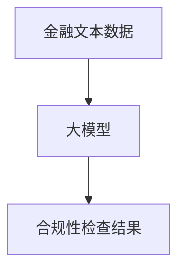
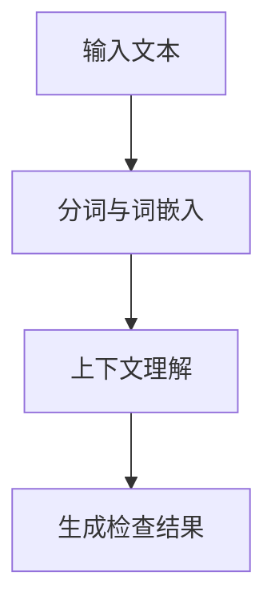
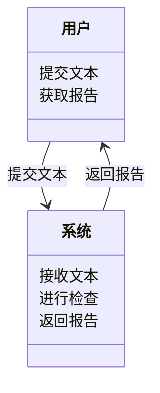
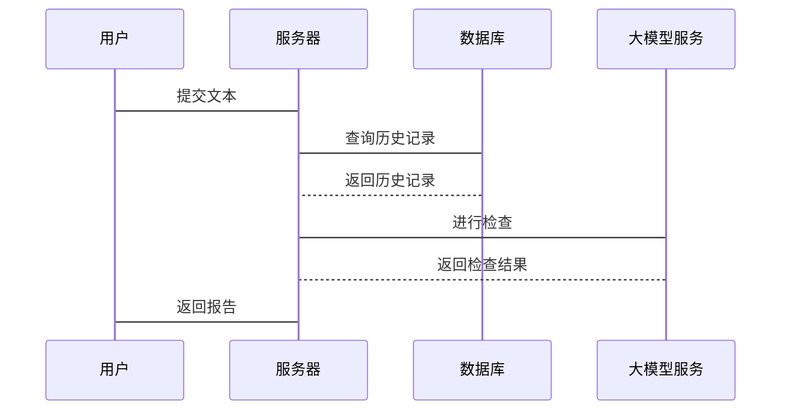

                 


# 开发基于大模型的金融法规遵从性检查系统

> 关键词：大模型，金融法规，检查系统，自然语言处理，合规性

> 摘要：随着金融行业的快速发展，合规性检查变得越来越复杂和重要。基于大模型的金融法规遵从性检查系统通过自然语言处理技术，能够高效、准确地识别和分析金融文本中的合规性问题，帮助金融机构降低风险。本文将详细探讨该系统的开发背景、核心概念、算法原理、系统架构设计以及项目实现，为读者提供全面的技术指导。

---

## 第1章: 问题背景与核心概念

### 1.1 问题背景

#### 1.1.1 金融法规遵从性的重要性
金融法规是维护市场秩序、保护投资者权益的重要保障。随着金融市场的复杂化和全球化，金融机构需要遵守的法规日益增多，合规性检查变得越来越复杂。任何违规行为都可能导致严重的法律后果和经济损失。

#### 1.1.2 传统金融法规检查的局限性
传统的合规性检查主要依赖人工审查，效率低、成本高且容易出错。面对海量的金融文本数据，人工检查不仅耗时，还难以捕捉到所有潜在的违规信息。

#### 1.1.3 大模型在金融领域的潜力
大模型（如GPT系列）具有强大的自然语言处理能力，能够理解和生成复杂的金融文本。通过结合大模型的技术，我们可以实现自动化、智能化的合规性检查，显著提高效率和准确性。

### 1.2 核心概念

#### 1.2.1 大模型的定义与特点
**大模型**指的是基于深度学习的大型神经网络模型，具有以下特点：
- **大规模训练数据**：通常使用互联网上的海量文本数据进行训练。
- **多任务学习能力**：能够处理多种任务，如文本生成、问答、分类等。
- **上下文理解能力**：能够捕捉文本中的语义关系，理解上下文。

#### 1.2.2 金融法规遵从性的定义与范围
**金融法规遵从性**指的是金融机构在经营活动中遵守相关法律法规的能力。其范围包括：
- **证券法**：如《证券法》、《公司法》等。
- **反洗钱法**：如《反洗钱法》。
- **数据隐私保护法**：如《GDPR》。

#### 1.2.3 大模型与金融法规检查的结合
将大模型应用于金融法规检查，可以通过自然语言处理技术提取文本中的关键信息，识别潜在的违规行为。

### 1.3 问题描述

#### 1.3.1 金融法规检查的主要挑战
- **数据量大**：金融文本数据庞大，人工检查效率低。
- **法规复杂**：不同法规之间可能存在冲突或重叠。
- **动态变化**：法规会随着时间和政策变化而更新。

#### 1.3.2 大模型如何解决这些问题
- **自动化处理**：大模型可以快速处理大量文本数据。
- **智能分析**：通过自然语言处理技术，识别潜在的违规行为。
- **实时更新**：模型可以不断优化，适应法规的变化。

#### 1.3.3 系统的目标与边界
- **目标**：开发一个基于大模型的金融法规检查系统，实现自动化、高效的合规性检查。
- **边界**：仅限于文本分析，不涉及实际的交易或数据操作。

### 1.4 核心要素与概念结构

#### 1.4.1 系统的核心要素分析
- **输入数据**：金融文本数据，如合同、报告等。
- **模型训练**：使用大模型进行微调，使其适应金融法规检查任务。
- **检查结果**：输出合规性报告，标记潜在的违规点。

#### 1.4.2 概念结构图


#### 1.4.3 核心要素的属性特征对比表格
| 核心要素 | 输入数据 | 模型训练 | 检查结果 |
|----------|-----------|----------|----------|
| 类型     | 文本数据  | 神经网络模型 | 文本报告 |
| 特性     | 结构化、非结构化 | 高维、复杂 | 结构化 |
| 示例     | 合同文本 | 微调后的GPT模型 | 违规点标记 |

### 1.5 本章小结
本章介绍了金融法规遵从性检查的重要性，分析了传统方法的局限性，并探讨了大模型在这一领域的潜力。我们还定义了核心概念，明确了系统的边界和目标。

---

## 第2章: 大模型的基本原理与技术特点

### 2.1 大模型的核心原理

#### 2.1.1 深度学习的基本原理
深度学习通过多层神经网络提取数据特征，学习数据的高层次表示。

#### 2.1.2 大模型的训练机制
大模型通常采用以下训练机制：
- **预训练**：在大规模通用数据上进行无监督学习。
- **微调**：在特定任务上进行有监督学习。

#### 2.1.3 模型的可解释性
尽管大模型具有强大的能力，但其可解释性较差，这是应用中的一个重要挑战。

### 2.2 大模型的技术特点

#### 2.2.1 模型的规模与复杂度
大模型通常包含 billions 量级的参数，训练需要大量的计算资源。

#### 2.2.2 多任务学习能力
大模型可以同时处理多种任务，如文本生成、分类、问答等。

#### 2.2.3 实时推理能力
大模型可以在短时间内完成推理任务，适用于实时应用场景。

### 2.3 大模型在金融领域的应用潜力

#### 2.3.1 金融文本分析
- **合同审查**：识别合同中的关键条款。
- **财务报告分析**：检测财务数据中的异常。

#### 2.3.2 风险评估
- **信用评估**：通过分析客户的文本数据，评估信用风险。
- **市场风险**：预测市场波动。

#### 2.3.3 法规遵从性检查
- **自动合规性检查**：识别文本中的违规点。
- **实时监控**：对交易进行实时合规性检查。

### 2.4 本章小结
本章介绍了大模型的基本原理和技术特点，分析了其在金融领域的应用潜力，为后续的系统开发奠定了基础。

---

## 第3章: 金融法规的核心内容与检查标准

### 3.1 金融法规的核心内容

#### 3.1.1 证券法
- **主要内容**：规范证券发行、交易、信息披露等。
- **合规要求**：确保信息披露的准确性和完整性。

#### 3.1.2 反洗钱法
- **主要内容**：防止洗钱行为。
- **合规要求**：金融机构需建立反洗钱内控制度。

#### 3.1.3 数据隐私保护法
- **主要内容**：保护个人数据隐私。
- **合规要求**：合法收集、使用和存储数据。

### 3.2 法律法规的检查标准

#### 3.2.1 合规性检查的关键指标
- **完整性**：检查是否覆盖所有相关法规。
- **准确性**：检查是否正确理解法规要求。
- **及时性**：检查是否及时更新法规。

#### 3.2.2 检查流程与方法
- **流程**：制定检查计划、收集数据、分析数据、输出报告。
- **方法**：关键词匹配、上下文分析、模式识别。

#### 3.2.3 检查结果的评估标准
- **准确性**：检查结果的正确率。
- **效率**：检查速度是否满足需求。
- **可解释性**：检查结果是否易于理解。

### 3.3 金融法规的文本特征

#### 3.3.1 法律文本的结构特征
- **层次分明**：通常采用标题、条款的形式。
- **术语专业**：使用大量法律术语。

#### 3.3.2 专业术语的使用
- **术语复杂**：如“合规义务”、“反洗钱义务”等。
- **语义明确**：通常具有明确的法律效力。

#### 3.3.3 文本的复杂性
- **长句较多**：法律文本常使用长句表达复杂关系。
- **歧义性**：部分条款可能存在歧义。

### 3.4 本章小结
本章详细介绍了金融法规的核心内容和检查标准，分析了法规文本的特征，为后续的系统设计提供了依据。

---

## 第4章: 基于大模型的金融法规检查算法原理

### 4.1 算法原理概述

#### 4.1.1 大模型的文本处理流程
1. **输入文本数据**：如金融合同、财务报告。
2. **分词与词嵌入**：将文本转换为词向量。
3. **上下文理解**：通过多层神经网络捕捉语义关系。
4. **生成检查结果**：输出合规性报告。

#### 4.1.2 大模型的训练流程
1. **预训练**：在通用数据上进行无监督学习。
2. **微调**：在金融法规相关数据上进行有监督训练。

#### 4.1.3 合规性检查的算法框架


### 4.2 算法实现细节

#### 4.2.1 分词与词嵌入
- **分词**：使用jieba等工具对中文文本进行分词。
- **词嵌入**：使用Word2Vec生成词向量。

#### 4.2.2 上下文理解
- **模型结构**：采用Transformer架构，捕捉全局上下文关系。
- **注意力机制**：通过注意力机制分配不同的权重，突出关键信息。

#### 4.2.3 合规性判断
- **分类任务**：将文本分为合规和违规两类。
- **概率预测**：输出违规的概率值，供人工审核。

### 4.3 数学公式与模型实现

#### 4.3.1 Transformer模型的注意力机制
注意力机制的公式为：
$$
\text{Attention}(Q, K, V) = \text{softmax}\left(\frac{QK^T}{\sqrt{d_k}}\right)V
$$

其中：
- \( Q \)：查询向量。
- \( K \)：键向量。
- \( V \)：值向量。
- \( d_k \)：键的维度。

#### 4.3.2 模型训练的损失函数
使用交叉熵损失函数：
$$
\mathcal{L} = -\sum_{i=1}^{N} y_i \log(p_i) + (1-y_i)\log(1-p_i)
$$

其中：
- \( y_i \)：真实标签。
- \( p_i \)：模型预测概率。

### 4.4 本章小结
本章详细讲解了基于大模型的金融法规检查算法原理，包括文本处理流程、训练流程和算法实现细节，并给出了数学公式和模型实现的示例。

---

## 第5章: 系统分析与架构设计

### 5.1 系统分析

#### 5.1.1 问题场景
- **场景描述**：金融机构需要对大量金融文本进行合规性检查。
- **用户需求**：希望系统能够快速、准确地识别违规点。
- **性能需求**：系统需要支持高并发和快速响应。

#### 5.1.2 项目介绍
- **项目目标**：开发一个基于大模型的金融法规检查系统。
- **项目范围**：涵盖合同审查、财务报告分析等场景。
- **项目约束**：模型训练成本、系统响应时间。

### 5.2 系统功能设计

#### 5.2.1 领域模型


#### 5.2.2 系统架构设计


#### 5.2.3 系统接口设计
- **输入接口**：接收金融文本数据。
- **输出接口**：返回合规性报告。
- **日志接口**：记录检查过程中的日志。

#### 5.2.4 系统交互流程


### 5.3 系统实现

#### 5.3.1 模型训练
- **数据准备**：收集金融法规相关文本数据。
- **模型微调**：在金融数据上微调大模型。
- **模型评估**：使用测试数据评估模型性能。

#### 5.3.2 系统部署
- **服务器部署**：将系统部署在云服务器上。
- **接口开发**：开发API接口供客户端调用。
- **监控与维护**：实时监控系统运行状态，及时维护。

### 5.4 本章小结
本章通过系统分析与架构设计，明确了系统的功能需求和实现方案，为后续的开发工作奠定了基础。

---

## 第6章: 项目实战

### 6.1 环境安装

#### 6.1.1 安装Python
```bash
# 安装Python 3.8+
python --version
```

#### 6.1.2 安装依赖库
```bash
pip install transformers
pip install torch
pip install mermaid
```

### 6.2 系统核心实现

#### 6.2.1 模型训练代码
```python
import torch
from transformers import GPT2LMHeadModel, GPT2Tokenizer

# 初始化模型
model = GPT2LMHeadModel.from_pretrained('gpt2')
tokenizer = GPT2Tokenizer.from_pretrained('gpt2')

# 微调模型
optimizer = torch.optim.Adam(model.parameters(), lr=1e-5)
criterion = torch.nn.CrossEntropyLoss()

# 训练循环
for epoch in range(num_epochs):
    for batch in train_loader:
        inputs = tokenizer(batch['text'], return_tensors='pt', padding=True, truncation=True)
        outputs = model(**inputs)
        loss = criterion(outputs.logits, batch['label'])
        optimizer.zero_grad()
        loss.backward()
        optimizer.step()
```

#### 6.2.2 检查接口代码
```python
def check_compliance(text):
    inputs = tokenizer(text, return_tensors='pt', padding=True, truncation=True)
    with torch.no_grad():
        outputs = model(**inputs)
    predicted_label = torch.argmax(outputs.logits, dim=-1)
    return predicted_label.item()
```

### 6.3 案例分析

#### 6.3.1 案例1：合同审查
- **输入文本**：一段复杂的金融合同。
- **检查结果**：识别出潜在的违规条款。

#### 6.3.2 案例2：财务报告分析
- **输入文本**：公司财务报告。
- **检查结果**：发现数据造假行为。

### 6.4 本章小结
本章通过实际项目案例，展示了系统的实现过程和应用效果，帮助读者更好地理解开发基于大模型的金融法规检查系统的方法。

---

## 第7章: 总结与展望

### 7.1 总结
本文详细探讨了开发基于大模型的金融法规遵从性检查系统的背景、核心概念、算法原理、系统架构设计和项目实现。我们通过理论分析和实践案例，展示了该系统的巨大潜力和应用价值。

### 7.2 未来展望
随着大模型技术的不断进步，金融法规检查系统将更加智能化和高效化。未来的研究方向包括：
- **模型优化**：提高模型的准确性和可解释性。
- **多语言支持**：支持多种语言的法规检查。
- **动态更新**：实时更新模型，适应法规的变化。

### 7.3 最佳实践 tips
- **数据质量**：确保训练数据的多样性和代表性。
- **模型调优**：通过微调和优化提高模型性能。
- **系统维护**：定期更新模型和检查规则，确保系统稳定运行。

### 7.4 作者信息
作者：AI天才研究院 & 禅与计算机程序设计艺术

---

# 作者：AI天才研究院 & 禅与计算机程序设计艺术

