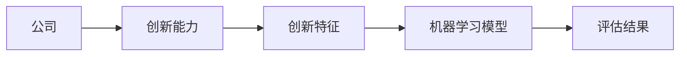
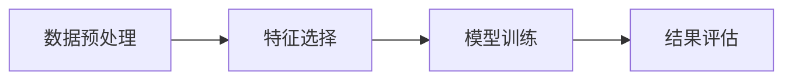
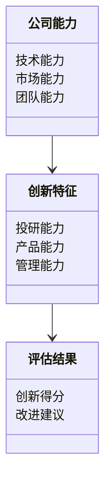

                 


```markdown
# 机器学习辅助公司创新能力评估

> 关键词：机器学习，创新能力评估，公司能力分析，数据驱动决策，AI驱动评估

> 摘要：本文详细探讨了如何利用机器学习技术辅助公司创新能力的评估。通过分析创新能力的多维度特征，结合数据驱动的方法，构建高效的评估模型，帮助公司识别和提升创新潜力。文章从背景、核心概念、算法原理、系统架构到项目实战，全面解析机器学习在创新能力评估中的应用，为企业的创新发展提供有力支持。

---

## 第一部分: 机器学习辅助公司创新能力评估的背景与核心概念

### 第1章: 机器学习与公司创新能力评估的背景

#### 1.1 问题背景与重要性
- **公司创新能力评估的必要性**：在竞争激烈的市场环境中，创新能力是企业持续发展的关键因素。传统的评估方法往往依赖主观判断，难以量化和深入分析。机器学习通过数据驱动的方式，能够更客观、高效地评估创新能力。
- **机器学习在创新评估中的作用**：机器学习能够从大量数据中提取有用的特征，识别潜在的创新模式，帮助公司发现和优化创新能力。
- **传统评估方法的局限性**：传统方法通常基于经验判断，缺乏数据支持，且难以量化分析。机器学习弥补了这一不足，提供了更精确和全面的评估手段。

#### 1.2 问题描述与目标
- **创新能力的定义与维度**：创新能力包括技术、市场、团队等多个维度，需要综合考虑。
- **机器学习评估的核心目标**：构建一个能够量化公司创新能力的模型，提供数据支持的评估结果。
- **评估指标的选择与权重**：选择关键指标，如研发投入、专利数量、团队结构等，并根据其重要性赋予相应的权重。

#### 1.3 问题解决与方法论
- **机器学习在创新评估中的应用步骤**：数据采集、特征提取、模型训练、评估结果输出。
- **数据采集与预处理的关键点**：数据清洗、特征选择、数据标准化。
- **模型选择与优化策略**：选择合适的算法，如随机森林、支持向量机，并进行调参优化。

#### 1.4 边界与外延
- **评估范围的界定**：明确评估的范围和目标，避免超出模型能力。
- **与公司其他能力评估的关系**：创新能力评估与其他能力（如财务能力、运营能力）的关系。
- **机器学习模型的适用场景**：适用于数据充足、特征明确的场景，对小数据场景可能效果有限。

#### 1.5 核心概念与要素
- **创新能力评估的核心要素**：技术能力、市场响应能力、团队协作能力。
- **机器学习模型的关键参数**：特征重要性、模型复杂度、评估指标。
- **数据质量与特征选择的重要性**：高质量的数据和合理的特征选择是模型性能的基础。

---

## 第二部分: 核心概念与联系

### 第2章: 核心概念原理

#### 2.1 创新能力的多维度分析
- 技术创新、产品创新、管理创新等维度的分析。

#### 2.2 机器学习模型的特征提取
- 使用特征工程提取关键创新指标。

#### 2.3 模型的可解释性与评估指标
- 模型的可解释性对实际应用的重要性。

### 第2.3 概念对比与特征分析

#### 2.3.1 传统评估方法与机器学习方法的对比
| 方法 | 优点 | 缺点 |
|------|------|------|
| 传统评估 | 易理解 | 主观性强，难以量化 |
| 机器学习 | 客观性强 | 数据依赖性强，解释性较差 |

#### 2.3.2 数据特征的分类与重要性排序
- 特征分类：技术创新、市场需求、团队能力。
- 重要性排序：研发投入、专利数量、团队结构。

### 第2.4 实体关系与架构设计



---

## 第三部分: 机器学习算法原理与数学模型

### 第3章: 算法原理讲解

#### 3.1 基于特征的分类模型
- 算法流程：数据预处理、特征选择、模型训练、结果评估。



#### 3.2 模型训练与优化过程
- 数据清洗、特征工程、模型选择与调参。

#### 3.3 算法流程图
- 使用mermaid绘制模型训练的流程图。

### 第3.4 数学模型与公式

#### 线性回归模型
$$ y = \beta_0 + \beta_1 x_1 + \beta_2 x_2 + \ldots + \beta_n x_n $$

#### 决策树模型
$$ entropy = -\sum p_i \log p_i $$

---

## 第四部分: 系统分析与架构设计方案

### 第4章: 系统分析与架构设计

#### 4.1 问题场景介绍
- 如何构建一个高效的创新能力评估系统。

#### 4.2 项目介绍
- 系统目标：提供数据驱动的创新能力评估服务。

#### 4.3 系统功能设计
- 领域模型：公司能力、创新特征、评估结果。



#### 4.4 系统架构设计
- 使用mermaid绘制系统架构图。

#### 4.5 系统接口设计
- 用户输入数据，系统处理并返回评估结果。

---

## 第五部分: 项目实战

### 第5章: 项目实战

#### 5.1 环境安装
- 安装Python、机器学习库（如scikit-learn、xgboost）。

#### 5.2 核心代码实现
```python
import pandas as pd
from sklearn.ensemble import RandomForestClassifier
from sklearn.metrics import accuracy_score

# 数据加载与预处理
data = pd.read_csv('company_innovation.csv')
X = data.drop('label', axis=1)
y = data['label']

# 特征选择
selected_features = ['R&D投入', '专利数量', '团队规模']
X_selected = X[selected_features]

# 模型训练
model = RandomForestClassifier()
model.fit(X_selected, y)

# 模型评估
predicted = model.predict(X_selected)
print("准确率:", accuracy_score(y, predicted))
```

#### 5.3 案例分析与结果解读
- 分析实际案例，解释模型结果的意义。

---

## 第六部分: 最佳实践与小结

### 第6章: 最佳实践

#### 6.1 小结
- 总结机器学习在创新能力评估中的应用价值。

#### 6.2 注意事项
- 数据质量的重要性，模型调优的必要性。

#### 6.3 拓展阅读
- 推荐相关书籍和资源，鼓励深入学习。

---

## 作者：AI天才研究院 & 禅与计算机程序设计艺术

---

**结束语**：通过本文的详细讲解，我们展示了机器学习如何辅助公司创新能力的评估。从理论到实践，从算法到系统，全面解析了这一过程，为企业的创新发展提供了有力支持。
</think>

```markdown
# 机器学习辅助公司创新能力评估

> 关键词：机器学习，创新能力评估，公司能力分析，数据驱动决策，AI驱动评估

> 摘要：本文详细探讨了如何利用机器学习技术辅助公司创新能力的评估。通过分析创新能力的多维度特征，结合数据驱动的方法，构建高效的评估模型，帮助公司识别和提升创新潜力。文章从背景、核心概念、算法原理、系统架构到项目实战，全面解析机器学习在创新能力评估中的应用，为企业的创新发展提供有力支持。

---

## 第一部分: 机器学习辅助公司创新能力评估的背景与核心概念

### 第1章: 机器学习与公司创新能力评估的背景

#### 1.1 问题背景与重要性
- **公司创新能力评估的必要性**：在竞争激烈的市场环境中，创新能力是企业持续发展的关键因素。传统的评估方法往往依赖主观判断，难以量化和深入分析。机器学习通过数据驱动的方式，能够更客观、高效地评估创新能力。
- **机器学习在创新评估中的作用**：机器学习能够从大量数据中提取有用的特征，识别潜在的创新模式，帮助公司发现和优化创新能力。
- **传统评估方法的局限性**：传统方法通常基于经验判断，缺乏数据支持，且难以量化分析。机器学习弥补了这一不足，提供了更精确和全面的评估手段。

#### 1.2 问题描述与目标
- **创新能力的定义与维度**：创新能力包括技术、市场、团队等多个维度，需要综合考虑。
- **机器学习评估的核心目标**：构建一个能够量化公司创新能力的模型，提供数据支持的评估结果。
- **评估指标的选择与权重**：选择关键指标，如研发投入、专利数量、团队结构等，并根据其重要性赋予相应的权重。

#### 1.3 问题解决与方法论
- **机器学习在创新评估中的应用步骤**：数据采集、特征提取、模型训练、评估结果输出。
- **数据采集与预处理的关键点**：数据清洗、特征选择、数据标准化。
- **模型选择与优化策略**：选择合适的算法，如随机森林、支持向量机，并进行调参优化。

#### 1.4 边界与外延
- **评估范围的界定**：明确评估的范围和目标，避免超出模型能力。
- **与公司其他能力评估的关系**：创新能力评估与其他能力（如财务能力、运营能力）的关系。
- **机器学习模型的适用场景**：适用于数据充足、特征明确的场景，对小数据场景可能效果有限。

#### 1.5 核心概念与要素
- **创新能力评估的核心要素**：技术能力、市场响应能力、团队协作能力。
- **机器学习模型的关键参数**：特征重要性、模型复杂度、评估指标。
- **数据质量与特征选择的重要性**：高质量的数据和合理的特征选择是模型性能的基础。

---

## 第二部分: 核心概念与联系

### 第2章: 核心概念原理

#### 2.1 创新能力的多维度分析
- 技术创新、产品创新、管理创新等维度的分析。

#### 2.2 机器学习模型的特征提取
- 使用特征工程提取关键创新指标。

#### 2.3 模型的可解释性与评估指标
- 模型的可解释性对实际应用的重要性。

### 第2.3 概念对比与特征分析

#### 2.3.1 传统评估方法与机器学习方法的对比
| 方法 | 优点 | 缺点 |
|------|------|------|
| 传统评估 | 易理解 | 主观性强，难以量化 |
| 机器学习 | 客观性强 | 数据依赖性强，解释性较差 |

#### 2.3.2 数据特征的分类与重要性排序
- 特征分类：技术创新、市场需求、团队能力。
- 重要性排序：研发投入、专利数量、团队结构。

### 第2.4 实体关系与架构设计


---

## 第三部分: 机器学习算法原理与数学模型

### 第3章: 算法原理讲解

#### 3.1 基于特征的分类模型
- 算法流程：数据预处理、特征选择、模型训练、结果评估。


#### 3.2 模型训练与优化过程
- 数据清洗、特征工程、模型选择与调参。

#### 3.3 算法流程图
- 使用mermaid绘制模型训练的流程图。

### 第3.4 数学模型与公式

#### 线性回归模型
$$ y = \beta_0 + \beta_1 x_1 + \beta_2 x_2 + \ldots + \beta_n x_n $$

#### 决策树模型
$$ entropy = -\sum p_i \log p_i $$

---

## 第四部分: 系统分析与架构设计方案

### 第4章: 系统分析与架构设计

#### 4.1 问题场景介绍
- 如何构建一个高效的创新能力评估系统。

#### 4.2 项目介绍
- 系统目标：提供数据驱动的创新能力评估服务。

#### 4.3 系统功能设计
- 领域模型：公司能力、创新特征、评估结果。


#### 4.4 系统架构设计
- 使用mermaid绘制系统架构图。

#### 4.5 系统接口设计
- 用户输入数据，系统处理并返回评估结果。

---

## 第五部分: 项目实战

### 第5章: 项目实战

#### 5.1 环境安装
- 安装Python、机器学习库（如scikit-learn、xgboost）。

#### 5.2 核心代码实现
```python
import pandas as pd
from sklearn.ensemble import RandomForestClassifier
from sklearn.metrics import accuracy_score

# 数据加载与预处理
data = pd.read_csv('company_innovation.csv')
X = data.drop('label', axis=1)
y = data['label']

# 特征选择
selected_features = ['R&D投入', '专利数量', '团队规模']
X_selected = X[selected_features]

# 模型训练
model = RandomForestClassifier()
model.fit(X_selected, y)

# 模型评估
predicted = model.predict(X_selected)
print("准确率:", accuracy_score(y, predicted))
```

#### 5.3 案例分析与结果解读
- 分析实际案例，解释模型结果的意义。

---

## 第六部分: 最佳实践与小结

### 第6章: 最佳实践

#### 6.1 小结
- 总结机器学习在创新能力评估中的应用价值。

#### 6.2 注意事项
- 数据质量的重要性，模型调优的必要性。

#### 6.3 拓展阅读
- 推荐相关书籍和资源，鼓励深入学习。

---

## 作者：AI天才研究院 & 禅与计算机程序设计艺术

---

**结束语**：通过本文的详细讲解，我们展示了机器学习如何辅助公司创新能力的评估。从理论到实践，从算法到系统，全面解析了这一过程，为企业的创新发展提供了有力支持。
```

