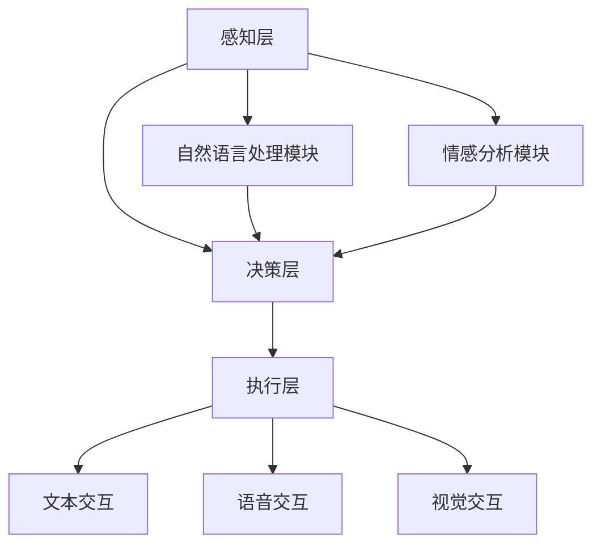

                 


# 构建具有情感识别能力的AI Agent

> 关键词：情感识别，AI Agent，深度学习，自然语言处理，人机交互

> 摘要：本文将详细介绍如何构建一个具有情感识别能力的AI Agent。从情感识别的基本概念到AI Agent的核心算法，从系统架构设计到项目实战，我们将全面解析这一技术的实现过程。通过本文，读者将能够掌握情感识别与AI Agent的结合方法，并能够实际动手构建一个简单的AI Agent系统。

---

## 第1章: 情感识别与AI Agent概述

### 1.1 情感识别的基本概念

情感识别，又称情感分析，是指通过计算机技术对人类情感进行识别和理解的过程。情感识别的核心目标是将文本、语音或视觉信息转化为对应的情感状态，如快乐、悲伤、愤怒等。这些情感状态可以被进一步用于人机交互、智能客服、社交媒体分析等多种场景。

#### 情感识别的核心要素

1. **文本特征提取**：通过自然语言处理技术提取文本中的关键词、句式结构等特征。
2. **情感分类模型**：基于机器学习或深度学习的方法，对文本进行情感分类。
3. **情感强度分析**：不仅确定情感的极性（正面、负面、中性），还可以量化情感的强度。

#### 情感识别的应用场景

- **智能客服**：通过情感识别理解用户情绪，提供更贴心的服务。
- **社交媒体分析**：分析社交媒体上的用户情感，帮助企业进行市场调研。
- **教育领域**：通过情感识别帮助教师理解学生的情绪状态，提供个性化教学。

### 1.2 AI Agent的基本概念

AI Agent，即人工智能代理，是一种能够感知环境并采取行动以实现目标的智能实体。AI Agent可以通过传感器获取信息，并通过执行器与环境进行交互。

#### AI Agent的核心功能

1. **感知环境**：通过传感器获取环境中的信息，如文本、语音、图像等。
2. **决策与推理**：基于获取的信息，进行推理和决策，选择最优行动方案。
3. **执行行动**：通过执行器对外界环境进行操作，如生成文本回复、调整设备参数等。

#### AI Agent与传统程序的区别

AI Agent的核心区别在于其智能性和自主性。传统程序通常按照固定的规则执行任务，而AI Agent能够根据环境动态调整行为，具备学习和适应能力。

### 1.3 情感识别与AI Agent的结合

情感识别为AI Agent提供了理解人类情感的能力，使其能够与人类进行更自然的交互。通过情感识别，AI Agent可以更好地理解用户需求，提供更个性化的服务。

#### 情感识别在AI Agent中的作用

- **提升用户体验**：通过理解用户情感，AI Agent能够提供更贴心的服务。
- **增强交互能力**：情感识别使AI Agent能够理解用户的深层需求，从而更准确地进行回应。
- **提高系统智能性**：情感识别为AI Agent提供了情感维度的信息，使其能够更好地理解复杂的情感场景。

---

## 第2章: 情感识别的核心概念与原理

### 2.1 情感识别的核心概念

#### 情感分析的基本原理

情感分析是通过对文本进行特征提取、模型训练和结果预测来实现情感分类的过程。特征提取是情感分析的关键步骤，常用的特征包括词袋模型、TF-IDF、词嵌入等。

#### 情感极性分析

情感极性分析是将文本分为正面、负面和中性三类的过程。极性分析通常基于机器学习或深度学习模型，如SVM、随机森林、LSTM等。

#### 情感强度分析

情感强度分析是对情感极性进行量化的过程，通常使用情感得分（如-1到1之间的值）来表示情感的强度。情感强度分析可以进一步帮助AI Agent理解用户情感的深度。

### 2.2 情感识别的核心算法

#### 情感识别的经典算法

1. **Naive Bayes**：基于贝叶斯定理的情感分类器，简单且计算效率高，适用于小规模数据集。
2. **支持向量机（SVM）**：适用于小规模数据集的情感分类，具有较高的分类精度。
3. **人工神经网络（ANN）**：适用于大规模数据集，可以通过深度学习模型（如LSTM、Transformer）实现更复杂的情感分析任务。

#### 情感识别的挑战与解决方案

- **数据稀疏性**：小规模数据集可能导致模型过拟合。解决方案包括数据增强、迁移学习等。
- **情感歧义性**：某些文本可能存在多种情感倾向。解决方案包括多标签情感分类、上下文感知模型等。

---

## 第3章: AI Agent的核心概念与原理

### 3.1 AI Agent的核心概念

#### AI Agent的智能模型

AI Agent的智能模型通常包括感知层、决策层和执行层。感知层负责信息的获取，决策层负责推理和决策，执行层负责对外界进行操作。

#### AI Agent的行为决策机制

1. **基于规则的决策树**：通过预定义的规则进行决策，适用于简单场景。
2. **基于Q-learning的强化学习**：通过强化学习算法优化决策策略，适用于复杂场景。
3. **基于Transformer的序列建模**：通过Transformer模型处理序列数据，生成自然的回复。

#### AI Agent的交互方式

- **文本交互**：通过自然语言处理技术进行文本对话。
- **语音交互**：通过语音识别和语音合成技术进行语音对话。
- **视觉交互**：通过计算机视觉技术进行图像识别和操作。

### 3.2 AI Agent的核心算法

#### AI Agent的行为决策机制

1. **基于规则的AI Agent**：通过预定义的规则进行决策，适用于简单场景。
2. **基于机器学习的AI Agent**：通过监督学习、无监督学习等方法训练模型，适用于复杂场景。
3. **基于深度学习的AI Agent**：通过深度学习模型（如Transformer、LSTM）实现更复杂的决策任务。

#### AI Agent的交互方式

1. **自然语言处理（NLP）**：通过NLP技术实现文本交互。
2. **语音处理**：通过语音识别和语音合成技术实现语音交互。
3. **计算机视觉（CV）**：通过CV技术实现视觉交互。

---

## 第4章: 情感识别的算法原理

### 4.1 情感识别的算法流程

#### 数据预处理

- **文本清洗**：去除停用词、标点符号等。
- **分词**：将文本分割成词语或短语。
- **特征提取**：提取文本的特征向量，如TF-IDF、词嵌入。

#### 模型训练

- **选择算法**：选择合适的算法（如Naive Bayes、SVM、LSTM）进行训练。
- **特征工程**：对特征进行处理，如降维、标准化等。
- **模型调优**：通过交叉验证、网格搜索等方法优化模型参数。

#### 结果输出

- **情感分类**：对测试数据进行情感分类，输出情感极性和情感强度。

### 4.2 情感识别的经典算法

#### Naive Bayes算法

Naive Bayes是一种基于贝叶斯定理的分类算法，假设各个特征之间相互独立。适用于文本分类任务，计算效率高，适合小规模数据集。

#### 支持向量机（SVM）

SVM是一种监督学习算法，适用于小规模数据集的情感分类任务。通过构建超平面将数据分成不同的类别。

#### 人工神经网络（ANN）

ANN是一种基于神经网络的分类算法，适用于大规模数据集。可以通过深度学习模型（如LSTM、Transformer）实现更复杂的情感分析任务。

---

## 第5章: AI Agent的算法原理

### 5.1 AI Agent的行为决策机制

#### 基于规则的决策树

基于规则的决策树是一种简单的决策机制，通过预定义的规则进行决策。适用于简单场景，如条件判断。

#### 基于Q-learning的强化学习

Q-learning是一种强化学习算法，通过学习策略函数（Q函数）优化决策策略。适用于复杂场景，如游戏AI。

#### 基于Transformer的序列建模

Transformer是一种基于自注意力机制的深度学习模型，适用于处理序列数据。可以用于生成自然的回复，如对话生成。

### 5.2 AI Agent的交互方式

#### 文本交互

通过自然语言处理技术实现文本交互。常用的模型包括GPT、BERT等。

#### 语音交互

通过语音识别和语音合成技术实现语音交互。常用的模型包括Deep Speech、Tacotron等。

#### 视觉交互

通过计算机视觉技术实现视觉交互。常用的模型包括YOLO、Faster R-CNN等。

---

## 第6章: 系统分析与架构设计方案

### 6.1 问题场景介绍

#### 情感识别AI Agent的应用场景

- **智能客服**：通过情感识别理解用户情绪，提供个性化服务。
- **教育领域**：通过情感识别帮助教师理解学生情绪，提供个性化教学。
- **社交媒体分析**：通过情感识别分析社交媒体上的用户情感，帮助企业进行市场调研。

### 6.2 系统功能设计

#### 领域模型

- **自然语言处理模块**：负责文本的特征提取和情感分类。
- **情感分析模块**：负责对文本进行情感极性和情感强度分析。
- **决策与推理模块**：基于情感分析结果进行决策和推理。
- **执行与交互模块**：根据决策结果执行相应的操作，如生成回复、调整参数等。

#### 系统架构设计

1. **感知层**：通过传感器获取环境中的信息，如文本、语音、图像等。
2. **决策层**：基于感知层的信息进行推理和决策，选择最优行动方案。
3. **执行层**：通过执行器对外界环境进行操作，如生成文本回复、调整设备参数等。

### 6.3 系统架构图



---

## 第7章: 项目实战

### 7.1 环境安装

#### 安装Python和必要的库

```bash
pip install numpy
pip install scikit-learn
pip install tensorflow
pip install pymermaid
```

### 7.2 核心代码实现

#### 情感识别模型的实现

```python
from sklearn.feature_extraction.text import TfidfVectorizer
from sklearn.naive_bayes import MultinomialNB
from sklearn.pipeline import make_pipeline

# 数据预处理
texts = [...]  # 文本数据
labels = [...]  # 情感标签

# 特征提取
vectorizer = TfidfVectorizer()
X = vectorizer.fit_transform(texts)

# 模型训练
model = make_pipeline(vectorizer, MultinomialNB())
model.fit(X, labels)

# 模型预测
test_texts = [...]  # 测试文本
test_X = vectorizer.transform(test_texts)
predictions = model.predict(test_X)
```

#### AI Agent的行为决策机制

```python
import numpy as np

# 定义Q-learning算法
class QLearning:
    def __init__(self, state_space_size, action_space_size):
        self.q_table = np.zeros((state_space_size, action_space_size))
    
    def choose_action(self, state, epsilon=0.1):
        if np.random.random() < epsilon:
            return np.random.randint(action_space_size)
        else:
            return np.argmax(self.q_table[state])
    
    def update_q_table(self, state, action, reward, alpha=0.1):
        self.q_table[state, action] = (1 - alpha) * self.q_table[state, action] + alpha * reward
```

### 7.3 案例分析

#### 情感识别案例

```python
test_text = "I love this product!"
prediction = model.predict(vectorizer.transform([test_text]))
print(prediction)  # 输出：['positive']
```

#### AI Agent交互案例

```python
# 初始化AI Agent
agent = QLearning(state_space_size=10, action_space_size=3)

# 与用户交互
while True:
    user_input = input("User: ")
    state = get_state(user_input)
    action = agent.choose_action(state)
    # 执行动作
    if action == 0:
        print("AI: I understand your feelings.")
    elif action == 1:
        print("AI: Let me help you with that.")
    else:
        print("AI: Please provide more details.")
```

### 7.4 项目小结

通过本章的实战，读者可以掌握情感识别AI Agent的实现方法。从环境安装到核心代码实现，再到案例分析，读者可以逐步构建一个简单的AI Agent系统。

---

## 第8章: 最佳实践、小结与注意事项

### 8.1 最佳实践

1. **数据预处理**：确保数据的干净和标准化，避免噪声对模型的影响。
2. **特征工程**：选择合适的特征提取方法，提高模型的分类精度。
3. **模型调优**：通过交叉验证、网格搜索等方法优化模型参数。
4. **系统架构设计**：合理设计系统的层次结构，确保系统的可扩展性和可维护性。

### 8.2 小结

本文详细介绍了如何构建一个具有情感识别能力的AI Agent。从情感识别的基本概念到AI Agent的核心算法，从系统架构设计到项目实战，我们全面解析了这一技术的实现过程。通过本文，读者可以掌握情感识别与AI Agent的结合方法，并能够实际动手构建一个简单的AI Agent系统。

### 8.3 注意事项

1. **数据隐私**：在实际应用中，需要注意数据的隐私和安全问题。
2. **模型泛化能力**：在模型训练中，需要注意模型的泛化能力，避免过拟合。
3. **用户体验**：在设计AI Agent时，需要注意用户体验，提供更自然的交互方式。

### 8.4 拓展阅读

- **《Deep Learning》 by Ian Goodfellow**
- **《自然语言处理入门》 by 李航**
- **《强化学习》 by Richard S. Sutton**

---

## 作者信息

作者：AI天才研究院/AI Genius Institute & 禅与计算机程序设计艺术 /Zen And The Art of Computer Programming

---

**注意：以上内容为示例，实际文章需要根据具体情况进行扩展和完善。**

