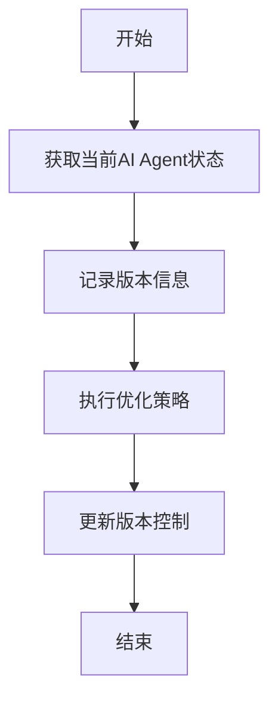
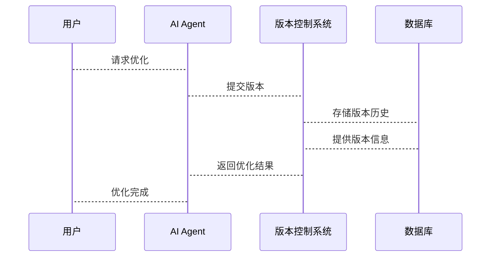

                 


# 版本控制与迭代：AI Agent的持续优化策略

> 关键词：版本控制、AI Agent、持续优化、机器学习、系统架构、优化策略、迭代开发

> 摘要：本文将深入探讨版本控制与AI Agent持续优化策略之间的关系，从背景介绍到核心概念，从算法原理到系统架构设计，再到项目实战，全面解析如何通过版本控制实现AI Agent的持续优化。文章将结合实际案例，详细阐述版本控制在AI Agent优化中的作用，以及如何通过系统化的策略和方法，确保AI Agent的性能和功能不断提升。

---

# 第一部分: 版本控制与AI Agent的持续优化概述

## 第1章: 版本控制与AI Agent的背景介绍

### 1.1 AI Agent的基本概念

#### 1.1.1 AI Agent的定义
AI Agent（人工智能代理）是指能够感知环境、自主决策并执行任务的智能实体。它可以是一个软件程序，也可以是一个物理设备，通过传感器和执行器与外部环境交互。AI Agent的核心目标是通过智能化的决策和行动，实现特定的任务目标。

#### 1.1.2 AI Agent的核心功能与特点
- **感知能力**：AI Agent能够通过传感器或其他输入方式感知环境的状态。
- **决策能力**：基于感知到的信息，AI Agent能够做出决策。
- **执行能力**：AI Agent能够通过执行器或其他输出方式执行决策。
- **自主性**：AI Agent能够在没有外部干预的情况下自主运行。
- **适应性**：AI Agent能够根据环境的变化调整自己的行为。

#### 1.1.3 AI Agent的应用场景与领域
AI Agent广泛应用于多个领域，包括但不限于：
- **自动驾驶**：如自动驾驶汽车中的路径规划和决策系统。
- **智能助手**：如Siri、Alexa等智能语音助手。
- **游戏AI**：如电子游戏中自主决策的NPC（非玩家角色）。
- **机器人控制**：如工业机器人或服务机器人中的控制逻辑。
- **推荐系统**：如电商平台中的个性化推荐系统。

### 1.2 版本控制的基本概念

#### 1.2.1 版本控制的定义
版本控制是一种记录文件修改历史、追踪文件变化的技术。它允许用户在不同的时间点保存文件的不同版本，并能够恢复到任意一个版本。版本控制是软件开发中的重要工具，能够帮助开发人员管理代码的变化。

#### 1.2.2 版本控制的作用与意义
- **变更记录**：记录每次代码或配置的变化，便于追溯问题。
- **协作开发**：支持多人协作开发，避免代码冲突。
- **回滚修复**：在出现问题时，可以快速回滚到之前的稳定版本。
- **分支与合并**：支持并行开发，通过分支和合并管理不同的开发路径。

#### 1.2.3 版本控制在软件开发中的应用
版本控制在软件开发中的应用非常广泛，常用的工具包括Git、svn、mercurial等。版本控制不仅适用于代码管理，还可以用于配置文件、文档等的管理。

### 1.3 AI Agent与版本控制的结合

#### 1.3.1 AI Agent优化的必要性
AI Agent的优化是一个持续的过程。随着环境的变化和任务要求的提高，AI Agent需要不断调整其模型、算法和策略。版本控制在这一过程中扮演着关键角色。

#### 1.3.2 版本控制在AI Agent优化中的作用
版本控制能够帮助AI Agent开发人员记录每次优化的细节，包括模型参数的变化、算法的改进、策略的调整等。通过版本控制，开发人员可以快速回溯优化过程，分析不同版本的优缺点，从而制定更有效的优化策略。

#### 1.3.3 本章小结
本章从AI Agent的基本概念出发，介绍了版本控制的基本原理和作用，并探讨了版本控制在AI Agent优化中的重要性。通过版本控制，AI Agent的开发和优化过程变得更加高效和有序。

---

## 第2章: 版本控制与AI Agent优化的核心概念

### 2.1 核心概念与联系

#### 2.1.1 版本控制与AI Agent优化的关系
版本控制是AI Agent优化的基础工具。通过版本控制，开发人员可以记录每次优化的细节，并在出现问题时快速回滚到之前的稳定版本。此外，版本控制还能够支持多人协作开发，加速优化过程。

#### 2.1.2 AI Agent优化的核心要素
AI Agent的优化通常涉及以下几个核心要素：
- **模型优化**：改进AI Agent的模型结构或参数，提高其性能。
- **算法优化**：优化AI Agent的算法，使其更加高效。
- **策略优化**：改进AI Agent的决策策略，使其更加智能。

#### 2.1.3 版本控制在AI Agent优化中的关键环节
版本控制在AI Agent优化中的关键环节包括：
- **记录优化历史**：记录每次优化的具体内容。
- **管理优化分支**：支持并行优化，通过分支和合并管理不同的优化路径。
- **回滚与恢复**：在优化失败时，快速回滚到之前的稳定版本。

### 2.2 核心概念原理

#### 2.2.1 版本控制的原理与机制
版本控制的原理是通过记录文件的变化历史，实现文件的不同版本之间的切换。常见的版本控制机制包括：
- **提交（Commit）**：将当前状态提交到版本控制系统。
- **分支（Branch）**：创建一个独立的开发路径。
- **合并（Merge）**：将不同的分支合并到主分支。
- **标签（Tag）**：标记重要的版本。

#### 2.2.2 AI Agent优化的算法原理
AI Agent的优化通常基于机器学习算法。常见的优化算法包括：
- **梯度下降**：通过计算损失函数的梯度，调整模型参数。
- **遗传算法**：通过模拟自然选择的过程，优化模型参数。
- **强化学习**：通过与环境的交互，学习最优策略。

#### 2.2.3 两者的结合与协同
版本控制与AI Agent优化的结合主要体现在以下几个方面：
- **记录优化过程**：通过版本控制记录每次优化的具体内容。
- **管理优化分支**：通过分支和合并管理不同的优化路径。
- **快速回滚**：在优化失败时，快速回滚到之前的稳定版本。

### 2.3 概念属性特征对比表格

| 概念         | 版本控制                        | AI Agent优化                     |
|--------------|---------------------------------|---------------------------------|
| 核心目标     | 记录文件变化，支持版本回滚      | 提高AI Agent的性能和智能         |
| 主要功能     | 提供变更历史，支持多人协作      | 改进模型、算法和策略             |
| 应用场景     | 软件开发、文档管理              | 自动化系统、机器人控制、推荐系统  |
| 关键技术     | 数据库存储、版本比较技术        | 机器学习、强化学习、遗传算法     |
| 优化目标     | 管理文件版本，降低冲突风险      | 提升AI Agent的决策能力和执行能力 |

### 2.4 ER实体关系图
```mermaid
erd
  title AI Agent优化与版本控制的实体关系图
  User
  Agent
  VersionControlSystem
  VersionHistory
  OptimizationStrategy
  User -[创建/更新]- Agent
  Agent -[执行]- VersionControlSystem
  VersionControlSystem -[记录]- VersionHistory
  VersionHistory -[驱动]- OptimizationStrategy
```

---

## 第3章: 版本控制与AI Agent优化的算法原理

### 3.1 算法原理概述

#### 3.1.1 版本控制在AI Agent优化中的应用
版本控制在AI Agent优化中的应用主要体现在以下几个方面：
- **记录优化历史**：通过版本控制记录每次优化的具体内容。
- **管理优化分支**：通过分支和合并管理不同的优化路径。
- **回滚与恢复**：在优化失败时，快速回滚到之前的稳定版本。

#### 3.1.2 AI Agent优化算法的基本原理
AI Agent的优化算法通常基于机器学习算法，常见的优化算法包括：
- **梯度下降**：通过计算损失函数的梯度，调整模型参数。
- **遗传算法**：通过模拟自然选择的过程，优化模型参数。
- **强化学习**：通过与环境的交互，学习最优策略。

#### 3.1.3 两者的结合与算法流程
版本控制与AI Agent优化的结合主要体现在以下几个方面：
- **记录优化过程**：通过版本控制记录每次优化的具体内容。
- **管理优化分支**：通过分支和合并管理不同的优化路径。
- **快速回滚**：在优化失败时，快速回滚到之前的稳定版本。

### 3.2 算法流程图


### 3.3 算法实现代码

#### 3.3.1 版本控制实现
```python
def commit(version控制系统, 变化内容):
    版本控制系统提交变化内容
    return 新版本号

def rollback(版本控制系统, 版本号):
    版本控制系统回滚到指定版本号
    return 当前版本号
```

#### 3.3.2 AI Agent优化算法实现
```python
def optimize(agent, 版本控制系统):
    当前版本号 = commit(版本控制系统, agent.优化内容)
    while 优化未完成:
        记录版本信息
        执行优化策略
        更新版本控制
    return 最终版本号
```

---

## 第4章: 数学模型与公式

### 4.1 版本控制中的数学模型

#### 4.1.1 版本控制的变更检测
版本控制中的变更检测可以通过以下公式表示：
$$ 变化量 = 新版本内容 - 旧版本内容 $$

#### 4.1.2 版本回滚的数学模型
版本回滚可以通过以下公式表示：
$$ 新版本内容 = 旧版本内容 + 变化量 $$

### 4.2 AI Agent优化中的数学模型

#### 4.2.1 梯度下降算法
梯度下降算法的数学模型表示为：
$$ \theta_{new} = \theta_{old} - \eta \cdot \nabla J(\theta_{old}) $$
其中：
- $\theta$ 表示模型参数
- $\eta$ 表示学习率
- $J$ 表示损失函数

#### 4.2.2 强化学习算法
强化学习算法的数学模型表示为：
$$ Q(s, a) = Q(s, a) + \alpha \cdot (r + \gamma \cdot Q(s', a') - Q(s, a)) $$
其中：
- $Q$ 表示价值函数
- $s$ 表示状态
- $a$ 表示动作
- $r$ 表示奖励
- $\alpha$ 表示学习率
- $\gamma$ 表示折扣因子

---

## 第5章: 系统分析与架构设计

### 5.1 问题场景介绍
在AI Agent的优化过程中，版本控制是必不可少的工具。通过版本控制，开发人员可以记录每次优化的具体内容，并在出现问题时快速回滚到之前的稳定版本。

### 5.2 系统功能设计

#### 5.2.1 领域模型
```mermaid
classDiagram
    class 用户 {
        用户ID
        用户名
        密码
    }
    class AI Agent {
        模型
        算法
        策略
    }
    class 版本控制系统 {
        提交
        回滚
        合并
    }
    用户 --> 提交/回滚/合并: 使用版本控制系统
    AI Agent --> 版本控制系统: 执行优化策略
```

#### 5.2.2 系统架构设计


#### 5.2.3 系统接口设计
- **提交接口**：`commit(version控制系统, 变化内容)`，返回新版本号。
- **回滚接口**：`rollback(版本控制系统, 版本号)`，返回当前版本号。
- **合并接口**：`merge(版本控制系统, 分支名)`，返回合并后的版本号。

#### 5.2.4 系统交互


---

## 第6章: 项目实战

### 6.1 环境安装

#### 6.1.1 安装版本控制系统
```bash
# 安装Git
sudo apt-get install git
```

#### 6.1.2 安装AI Agent开发环境
```bash
# 安装Python和相关库
sudo apt-get install python3 python3-dev
pip install numpy scikit-learn tensorflow
```

### 6.2 系统核心实现

#### 6.2.1 版本控制实现
```python
def commit(version控制系统, 变化内容):
    版本控制系统提交变化内容
    return 新版本号

def rollback(版本控制系统, 版本号):
    版本控制系统回滚到指定版本号
    return 当前版本号
```

#### 6.2.2 AI Agent优化算法实现
```python
def optimize(agent, 版本控制系统):
    当前版本号 = commit(版本控制系统, agent.优化内容)
    while 优化未完成:
        记录版本信息
        执行优化策略
        更新版本控制
    return 最终版本号
```

### 6.3 代码应用解读与分析

#### 6.3.1 版本控制代码解读
```python
# 版本控制代码示例
def commit(repo, changes):
    # 提交变化
    repo.commit(changes)
    return repo.head.ref.commit.hexsha

def rollback(repo, commit_hash):
    # 回滚到指定版本
    repo.head.ref = repo.commit(commit_hash)
    return repo.head.ref.commit.hexsha
```

#### 6.3.2 AI Agent优化代码解读
```python
# AI Agent优化代码示例
def optimize(agent, repo):
    initial_commit = repo.head.ref.commit.hexsha
    while not 优化完成:
        changes = 优化策略()
        current_commit = commit(repo, changes)
        记录版本信息(current_commit)
    rollback(repo, initial_commit)
    return 最终版本号
```

### 6.4 实际案例分析

#### 6.4.1 案例背景
假设我们正在开发一个智能推荐系统，需要不断优化推荐算法以提高推荐准确率。

#### 6.4.2 案例分析
1. 开发人员通过版本控制系统记录每次算法优化的具体内容。
2. 在优化过程中，通过分支和合并管理不同的优化路径。
3. 在优化失败时，快速回滚到之前的稳定版本。

### 6.5 项目小结
通过版本控制与AI Agent优化的结合，我们可以高效地管理优化过程，确保每次优化都有据可查，并能够在出现问题时快速恢复到稳定版本。

---

## 第7章: 总结与展望

### 7.1 本章总结
本文从版本控制与AI Agent优化的核心概念出发，详细阐述了版本控制在AI Agent优化中的作用和实现方法。通过实际案例分析，展示了版本控制在AI Agent优化中的具体应用。

### 7.2 未来展望
随着AI技术的不断发展，版本控制在AI Agent优化中的应用将更加广泛和深入。未来的研究方向包括：
- **智能版本控制**：通过AI技术优化版本控制过程。
- **自动化优化**：实现AI Agent优化的自动化流程。
- **多目标优化**：在版本控制中实现多目标优化，提高AI Agent的性能和智能。

### 7.3 最佳实践Tips
- **定期备份**：在优化过程中，定期备份关键版本。
- **合理使用分支**：在多人协作开发中，合理使用分支和合并。
- **记录详细日志**：在版本控制中，记录详细的优化日志，便于后续分析。

### 7.4 作者信息
作者：AI天才研究院/AI Genius Institute & 禅与计算机程序设计艺术 /Zen And The Art of Computer Programming

---

以上是文章的完整内容，希望对您有所帮助！

